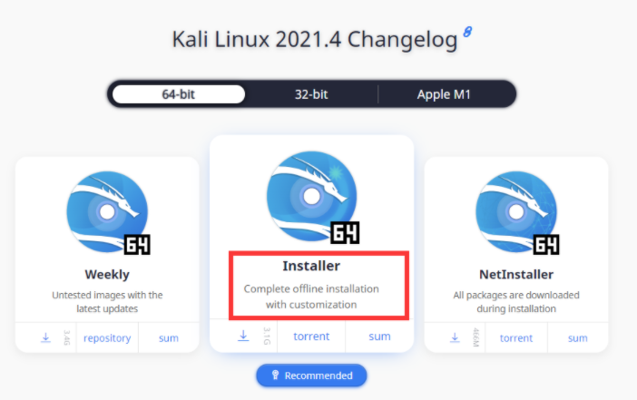

**1 乌班图安装MSF**

**环境准备：**

vm虚拟机 

Ubuntu桌面版镜像 

打开终端  输入 sudo su  获取root权限 

然后输入命令

curl https://raw.githubusercontent.com/rapid7/metasploit-omnibus/master/config/templates/metasploit-framework-wrappers/msfupdate.erb > msfinstall 

然后赋755权限 并执行安装

chmod 755 msfinstall && ./msfinstall

**2 直接安装kali系统**

第一种vm虚拟机 kali 

第二种 iso安装镜像

首先咱们进入kali官网下载kali

https://www.kali.org/get-kali/#kali-bare-metal  选择安装版镜像

