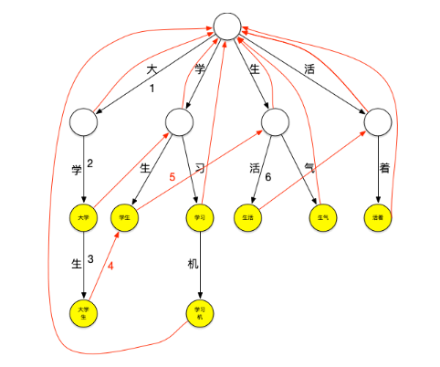

## 分布式搜索引擎的面试连环炮

业内目前来说事实上的一个标准，就是分布式搜索引擎一般大家都是用 ElasticSearch，（原来的话使用的是 Solr），但是确实，这两年大家一般都用更加易用的 es。

ElasticSearch 和 Solr 底层都是基于 Lucene，而 Lucene 的底层原理是 **倒排索引**

### 倒排索引是什么

倒排索引适用于快速的全文检索，一个倒排索引由文档中所有不重复词的列表构成，对于其中每个词，有一个包含它的文档列表

例如：

假设文档集合中包含五个文档，每个文档的内容如下所示，在图中最左端一栏是每个文档对应的编号，我们的任务就是对这个文档集合建立倒排索引


中文和英文等语言不通，单词之间没有明确分割符号，所以首先要用分词系统将文档自动切分成单词序列，这样每个文档就转换为由单词序列构成的数据流，为了系统后续处理方便，需要对每个不同的单词赋予唯一的单词编号，同时记录下哪些文档包含这个单词，在如此处理结束后，我们就可以得到最简单的倒排索引了


索引系统还可以记录除此之外的更多信息，下图是记录了单词出现的频率（TF）即这个单词在文档中出现的次数，之所以要记录这个信息，是因为词频信息在搜索结果排序时，计算查询和文档相似度是很重要的一个计算因子，所以将其记录在倒排列表中，以便后续排序时进行分值计算。


倒排列表还可以记录单词在某个文档出现的位置信息

```
(1, <11>, 1), (2, <7>, 1), (3, <3, 9>, 2)
```

有了这个索引系统，搜索引擎可以很方便地响应用户的查询，比如用户输入查询词 "Facebook"，搜索系统查找倒排索引，从中可以读出包含这个单词的文档，这些文档就是提供给用户的搜索结果，而利用单词频率信息，文档频率信息即可以对这些候选搜索结果进行排序，计算文档和查询的相似性，按照相似性得分由高到低排序输出，此即为搜索系统的部分内部流程。

### 中文分词器原理

#### 方法 1

分词器的原理本质上是词典分词。在现有内存中初始化一个词典，然后在分词过程中挨个读取字符和字典中的字符相匹配，把文档中所有词语拆分出来的过程。

#### 方法 2 字典树

Trie 树，是一种树形结构，是一种哈希树的变种。典型应用是用于统计，排序和保存大量的字符串（但不仅限于字符串），所以经常被搜索引擎系统用于文本词频统计。它的优点是：利用字符串的公共前缀来减少查询时间，最大限度地减少无谓的字符串比较，查询效率比哈希树高。

下面一个存放了 [大学、大学生、学习、学习机、学生、生气、生活、活着] 这个词典的 trie 树：  


它可以看作是用每个词第 n 个字做第 n 到第 n+1 层节点间路径哈希值的哈希树，每个节点是实际要存放的词。

现在用这个树来进行“大学生活”的匹配。依然从“大”字开始匹配，如下图所示：从根节点开始，沿最左边的路径匹配到了大字，沿着“大”节点可以匹配到“大学”,继续匹配则可以匹配到“大学生”，之后字典中再没有以“大”字开头的词，至此已经匹配到了 [大学、大学生] 第一轮匹配结束


继续匹配“学”字开头的词，方法同上步，可匹配出 [学生]


继续匹配“生”和“活”字开头的词，这样“大学生活”在词典中的词全部被查出来。

可以看到，以匹配“大”字开头的词为例，第一种匹配方式需要在词典中查询是否包含“大”、“大学”、“大学”、“大学生活”，共 4 次查询，而使用 trie 树查询时当找到“大学生”这个词之后就停止了该轮匹配，减少了匹配的次数，当要匹配的句子越长，这种性能优势就越明显。

#### 失败指针

再来看一下上面的匹配过程，在匹配“大学生”这个词之后，由于词典中不存在其它以“大”字开头的词，本轮结束，将继续匹配以“学”字开头的词，这时，需要再回到根节点继续匹配，如果这个时候“大学生”节点有个指针可以直指向“学生”节点，就可以减少一次查询，类似地，当匹配完“学生”之后如果“学生”节点有个指针可以指向“生活”节点，就又可以减少一次查询。这种当下一层节点无法匹配需要进行跳转的指针就是失败指针，创建好失败指针的树看起来如下图：  


图上红色的线就是失败指针，指向的是当下层节点无法匹配时应该跳转到哪个节点继续进行匹配

失败指针的创建过程通常为：

- 创建好 trie 树。
- BFS 每一个节点 (不能使用 DFS，因为每一层节点的失败指针在创建时要确保上一层节点的失败指针全部创建完成)。
- 根节点的子节点的失败指针指向根节点。
- 其它节点查找其父节点的失败指针指向的节点的子节点是否有和该节点字相同的节点，如果有则失败指针指向该节点，如果没有则重复刚才的过程直至找到字相同的节点或根节点。

查询过程如下：



### ES 的分布式架构原理能说一下么？


elasticsearch 设计的理念就是分布式搜索引擎，底层其实还是基于 lucene 的。

核心思想就是在多台机器上启动多个 es 进程实例，组成了一个 es 集群。

es 中存储数据的基本单位是索引，比如说你现在要在 es 中存储一些订单数据，你就应该在 es 中创建一个索引，order_idx，所有的订单数据就都写到这个索引里面去，一个索引差不多就是相当于是 mysql 里的一张表。index -> type -> mapping -> document -> field。

index：mysql 里的一张表

type：没法跟 mysql 里去对比，一个 index 里可以有多个 type，每个 type 的字段都是差不多的，但是有一些略微的差别。

好比说，有一个 index，是订单 index，里面专门是放订单数据的。就好比说你在 mysql 中建表，有些订单是实物商品的订单，就好比说一件衣服，一双鞋子；有些订单是虚拟商品的订单，就好比说游戏点卡，话费充值。就两种订单大部分字段是一样的，但是少部分字段可能有略微的一些差别。

所以就会在订单 index 里，建两个 type，一个是实物商品订单 type，一个是虚拟商品订单 type，这两个 type 大部分字段是一样的，少部分字段是不一样的。

很多情况下，一个 index 里可能就一个 type，但是确实如果说是一个 index 里有多个 type 的情况，你可以认为 index 是一个类别的表，具体的每个 type 代表了具体的一个 mysql 中的表

每个 type 有一个 mapping，如果你认为一个 type 是一个具体的一个表，index 代表了多个 type 的同属于的一个类型，mapping 就是这个 type 的表结构定义，你在 mysql 中创建一个表，肯定是要定义表结构的，里面有哪些字段，每个字段是什么类型。。。

mapping 就代表了这个 type 的表结构的定义，定义了这个 type 中每个字段名称，字段是什么类型的，然后还有这个字段的各种配置

实际上你往 index 里的一个 type 里面写的一条数据，叫做一条 document，一条 document 就代表了 mysql 中某个表里的一行给，每个 document 有多个 field，每个 field 就代表了这个 document 中的一个字段的值

接着你搞一个索引，这个索引可以拆分成多个 shard，每个 shard 存储部分数据。

接着就是这个 shard 的数据实际是有多个备份，就是说每个 shard 都有一个 primary shard，负责写入数据，但是还有几个 replica shard。primary shard 写入数据之后，会将数据同步到其他几个 replica shard 上去。

通过这个 replica 的方案，每个 shard 的数据都有多个备份，如果某个机器宕机了，没关系啊，还有别的数据副本在别的机器上呢。高可用了吧。

es 集群多个节点，会自动选举一个节点为 master 节点，这个 master 节点其实就是干一些管理的工作的，比如维护索引元数据拉，负责切换 primary shard 和 replica shard 身份拉，之类的。

要是 master 节点宕机了，那么会重新选举一个节点为 master 节点。

如果是非 master 节点宕机了，那么会由 master 节点，让那个宕机节点上的 primary shard 的身份转移到其他机器上的 replica shard。急着你要是修复了那个宕机机器，重启了之后，master 节点会控制将缺失的 replica shard 分配过去，同步后续修改的数据之类的，让集群恢复正常。

其实上述就是 elasticsearch 作为一个分布式搜索引擎最基本的一个架构设计

### ES 查询和读取数据的工作原理是什么？


（1）es 写数据过程

1）客户端选择一个 node 发送请求过去，这个 node 就是 coordinating node（协调节点）

2）coordinating node，对 document 进行路由，将请求转发给对应的 node（有 primary shard）

3）实际的 node 上的 primary shard 处理请求，然后将数据同步到 replica node

4）coordinating node，如果发现 primary node 和所有 replica node 都搞定之后，就返回响应结果给客户端

（2）es 读数据过程

查询，GET 某一条数据，写入了某个 document，这个 document 会自动给你分配一个全局唯一的 id，doc id，同时也是根据 doc id 进行 hash 路由到对应的 primary shard 上面去。也可以手动指定 doc id，比如用订单 id，用户 id。

你可以通过 doc id 来查询，会根据 doc id 进行 hash，判断出来当时把 doc id 分配到了哪个 shard 上面去，从那个 shard 去查询

1）客户端发送请求到任意一个 node，成为 coordinate node

2）coordinate node 对 document 进行路由，将请求转发到对应的 node，此时会使用 round-robin 随机轮询算法，在 primary shard 以及其所有 replica 中随机选择一个，让读请求负载均衡

3）接收请求的 node 返回 document 给 coordinate node

4）coordinate node 返回 document 给客户端

（3）es 搜索数据过程

es 最强大的是做全文检索，就是比如你有三条数据

java 真好玩儿啊

java 好难学啊

j2ee 特别牛

你根据 java 关键词来搜索，将包含 java 的 document 给搜索出来

es 就会给你返回：java 真好玩儿啊，java 好难学啊

1）客户端发送请求到一个 coordinate node

2）协调节点将搜索请求转发到所有的 shard 对应的 primary shard 或 replica shard 也可以

3）query phase：每个 shard 将自己的搜索结果（其实就是一些 doc id），返回给协调节点，由协调节点进行数据的合并、排序、分页等操作，产出最终结果

4）fetch phase：接着由协调节点，根据 doc id 去各个节点上拉取实际的 document 数据，最终返回给客户端

（4）搜索的底层原理，倒排索引，画图说明传统数据库和倒排索引的区别

（5）写数据底层原理

1）先写入 buffer，在 buffer 里的时候数据是搜索不到的；同时将数据写入 translog 日志文件

2）如果 buffer 快满了，或者到一定时间，就会将 buffer 数据 refresh 到一个新的 segment file 中，但是此时数据不是直接进入 segment file 的磁盘文件的，而是先进入 os cache 的。这个过程就是 refresh。

每隔 1 秒钟，es 将 buffer 中的数据写入一个新的 segment file，每秒钟会产生一个新的磁盘文件，segment file，这个 segment file 中就存储最近 1 秒内 buffer 中写入的数据

但是如果 buffer 里面此时没有数据，那当然不会执行 refresh 操作咯，每秒创建换一个空的 segment file，如果 buffer 里面有数据，默认 1 秒钟执行一次 refresh 操作，刷入一个新的 segment file 中

操作系统里面，磁盘文件其实都有一个东西，叫做 os cache，操作系统缓存，就是说数据写入磁盘文件之前，会先进入 os cache，先进入操作系统级别的一个内存缓存中去

只要 buffer 中的数据被 refresh 操作，刷入 os cache 中，就代表这个数据就可以被搜索到了

为什么叫 es 是准实时的？NRT，near real-time，准实时。默认是每隔 1 秒 refresh 一次的，所以 es 是准实时的，因为写入的数据 1 秒之后才能被看到。

可以通过 es 的 restful api 或者 java api，手动执行一次 refresh 操作，就是手动将 buffer 中的数据刷入 os cache 中，让数据立马就可以被搜索到。

只要数据被输入 os cache 中，buffer 就会被清空了，因为不需要保留 buffer 了，数据在 translog 里面已经持久化到磁盘去一份

3）只要数据进入 os cache，此时就可以让这个 segment file 的数据对外提供搜索了

4）重复 1~3 步骤，新的数据不断进入 buffer 和 translog，不断将 buffer 数据写入一个又一个新的 segment file 中去，每次 refresh 完 buffer 清空，translog 保留。随着这个过程推进，translog 会变得越来越大。当 translog 达到一定长度的时候，就会触发 commit 操作。

buffer 中的数据，倒是好，每隔 1 秒就被刷到 os cache 中去，然后这个 buffer 就被清空了。所以说这个 buffer 的数据始终是可以保持住不会填满 es 进程的内存的。

每次一条数据写入 buffer，同时会写入一条日志到 translog 日志文件中去，所以这个 translog 日志文件是不断变大的，当 translog 日志文件大到一定程度的时候，就会执行 commit 操作。

5）commit 操作发生第一步，就是将 buffer 中现有数据 refresh 到 os cache 中去，清空 buffer

6）将一个 commit point 写入磁盘文件，里面标识着这个 commit point 对应的所有 segment file

7）强行将 os cache 中目前所有的数据都 fsync 到磁盘文件中去

translog 日志文件的作用是什么？就是在你执行 commit 操作之前，数据要么是停留在 buffer 中，要么是停留在 os cache 中，无论是 buffer 还是 os cache 都是内存，一旦这台机器死了，内存中的数据就全丢了。

所以需要将数据对应的操作写入一个专门的日志文件，translog 日志文件中，一旦此时机器宕机，再次重启的时候，es 会自动读取 translog 日志文件中的数据，恢复到内存 buffer 和 os cache 中去。

commit 操作：1、写 commit point；2、将 os cache 数据 fsync 强刷到磁盘上去；3、清空 translog 日志文件

8）将现有的 translog 清空，然后再次重启启用一个 translog，此时 commit 操作完成。默认每隔 30 分钟会自动执行一次 commit，但是如果 translog 过大，也会触发 commit。整个 commit 的过程，叫做 flush 操作。我们可以手动执行 flush 操作就是将所有 os cache 数据刷到磁盘文件中去。

不叫做 commit 操作，flush 操作。es 中的 flush 操作，就对应着 commit 的全过程。我们也可以通过 es api，手动执行 flush 操作，手动将 os cache 中的数据 fsync 强刷到磁盘上去，记录一个 commit point，清空 translog 日志文件。

9）translog 其实也是先写入 os cache 的，默认每隔 5 秒刷一次到磁盘中去，所以默认情况下，可能有 5 秒的数据会仅仅停留在 buffer 或者 translog 文件的 os cache 中，如果此时机器挂了，会丢失 5 秒钟的数据。但是这样性能比较好，最多丢 5 秒的数据。也可以将 translog 设置成每次写操作必须是直接 fsync 到磁盘，但是性能会差很多。

实际上你在这里，如果面试官没有问你 es 丢数据的问题，你可以在这里给面试官炫一把，你说，其实 es 第一是准实时的，数据写入 1 秒后可以搜索到；可能会丢失数据的，你的数据有 5 秒的数据，停留在 buffer、translog os cache、segment file os cache 中，有 5 秒的数据不在磁盘上，此时如果宕机，会导致 5 秒的数据丢失。

如果你希望一定不能丢失数据的话，你可以设置个参数，官方文档，百度一下。每次写入一条数据，都是写入 buffer，同时写入磁盘上的 translog，但是这会导致写性能、写入吞吐量会下降一个数量级。本来一秒钟可以写 2000 条，现在你一秒钟只能写 200 条，都有可能。

10）如果是删除操作，commit 的时候会生成一个.del 文件，里面将某个 doc 标识为 deleted 状态，那么搜索的时候根据.del 文件就知道这个 doc 被删除了

11）如果是更新操作，就是将原来的 doc 标识为 deleted 状态，然后新写入一条数据

12）buffer 每次 refresh 一次，就会产生一个 segment file，所以默认情况下是 1 秒钟一个 segment file，segment file 会越来越多，此时会定期执行 merge

13）每次 merge 的时候，会将多个 segment file 合并成一个，同时这里会将标识为 deleted 的 doc 给物理删除掉，然后将新的 segment file 写入磁盘，这里会写一个 commit point，标识所有新的 segment file，然后打开 segment file 供搜索使用，同时删除旧的 segment file。

es 里的写流程，有 4 个底层的核心概念，refresh、flush、translog、merge

当 segment file 多到一定程度的时候，es 就会自动触发 merge 操作，将多个 segment file 给 merge 成一个 segment file。

### ES 在数据量很大的情况下（数十亿级别）如何提高查询性能？


说实话，es 性能优化是没有什么银弹的，啥意思呢？就是不要期待着随手调一个参数，就可以万能的应对所有的性能慢的场景。也许有的场景是你换个参数，或者调整一下语法，就可以搞定，但是绝对不是所有场景都可以这样。

一块一块来分析吧

在这个海量数据的场景下，如何提升 es 搜索的性能，也是我们之前生产环境实践经验所得

（1）性能优化的杀手锏——filesystem cache

os cache，操作系统的缓存

你往 es 里写的数据，实际上都写到磁盘文件里去了，磁盘文件里的数据操作系统会自动将里面的数据缓存到 os cache 里面去

es 的搜索引擎严重依赖于底层的 filesystem cache，你如果给 filesystem cache 更多的内存，尽量让内存可以容纳所有的 indx segment file 索引数据文件，那么你搜索的时候就基本都是走内存的，性能会非常高。

性能差距可以有大，我们之前很多的测试和压测，如果走磁盘一般肯定上秒，搜索性能绝对是秒级别的，1 秒，5 秒，10 秒。但是如果是走 filesystem cache，是走纯内存的，那么一般来说性能比走磁盘要高一个数量级，基本上就是毫秒级的，从几毫秒到几百毫秒不等。

之前有个学员，一直在问我，说他的搜索性能，聚合性能，倒排索引，正排索引，磁盘文件，十几秒。。。。

学员的真实案例

比如说，你，es 节点有 3 台机器，每台机器，看起来内存很多，64G，总内存，64 * 3 = 192g

每台机器给 es jvm heap 是 32G，那么剩下来留给 filesystem cache 的就是每台机器才 32g，总共集群里给 filesystem cache 的就是 32 * 3 = 96g 内存

我就问他，ok，那么就是你往 es 集群里写入的数据有多少数据量？

如果你此时，你整个，磁盘上索引数据文件，在 3 台机器上，一共占用了 1T 的磁盘容量，你的 es 数据量是 1t，每台机器的数据量是 300g

你觉得你的性能能好吗？filesystem cache 的内存才 100g，十分之一的数据可以放内存，其他的都在磁盘，然后你执行搜索操作，大部分操作都是走磁盘，性能肯定差

当时他们的情况就是这样子，es 在测试，弄了 3 台机器，自己觉得还不错，64G 内存的物理机。自以为可以容纳 1T 的数据量。

归根结底，你要让 es 性能要好，最佳的情况下，就是你的机器的内存，至少可以容纳你的总数据量的一半

比如说，你一共要在 es 中存储 1T 的数据，那么你的多台机器留个 filesystem cache 的内存加起来综合，至少要到 512G，至少半数的情况下，搜索是走内存的，性能一般可以到几秒钟，2 秒，3 秒，5 秒

如果最佳的情况下，我们自己的生产环境实践经验，所以说我们当时的策略，是仅仅在 es 中就存少量的数据，就是你要用来搜索的那些索引，内存留给 filesystem cache 的，就 100G，那么你就控制在 100gb 以内，相当于是，你的数据几乎全部走内存来搜索，性能非常之高，一般可以在 1 秒以内

比如说你现在有一行数据

id name age ….30 个字段

但是你现在搜索，只需要根据 id name age 三个字段来搜索

如果你傻乎乎的往 es 里写入一行数据所有的字段，就会导致说 70% 的数据是不用来搜索的，结果硬是占据了 es 机器上的 filesystem cache 的空间，单挑数据的数据量越大，就会导致 filesystem cahce 能缓存的数据就越少

仅仅只是写入 es 中要用来检索的少数几个字段就可以了，比如说，就写入 es id name age 三个字段就可以了，然后你可以把其他的字段数据存在 mysql 里面，我们一般是建议用 es + hbase 的这么一个架构。

hbase 的特点是适用于海量数据的在线存储，就是对 hbase 可以写入海量数据，不要做复杂的搜索，就是做很简单的一些根据 id 或者范围进行查询的这么一个操作就可以了

从 es 中根据 name 和 age 去搜索，拿到的结果可能就 20 个 doc id，然后根据 doc id 到 hbase 里去查询每个 doc id 对应的完整的数据，给查出来，再返回给前端。

你最好是写入 es 的数据小于等于，或者是略微大于 es 的 filesystem cache 的内存容量

然后你从 es 检索可能就花费 20ms，然后再根据 es 返回的 id 去 hbase 里查询，查 20 条数据，可能也就耗费个 30ms，可能你原来那么玩儿，1T 数据都放 es，会每次查询都是 5~10 秒，现在可能性能就会很高，每次查询就是 50ms。

elastcisearch 减少数据量仅仅放要用于搜索的几个关键字段即可，尽量写入 es 的数据量跟 es 机器的 filesystem cache 是差不多的就可以了；其他不用来检索的数据放 hbase 里，或者 mysql。

所以之前有些学员也是问，我也是跟他们说，尽量在 es 里，就存储必须用来搜索的数据，比如说你现在有一份数据，有 100 个字段，其实用来搜索的只有 10 个字段，建议是将 10 个字段的数据，存入 es，剩下 90 个字段的数据，可以放 mysql，hadoop hbase，都可以

这样的话，es 数据量很少，10 个字段的数据，都可以放内存，就用来搜索，搜索出来一些 id，通过 id 去 mysql，hbase 里面去查询明细的数据

（2）数据预热

假如说，哪怕是你就按照上述的方案去做了，es 集群中每个机器写入的数据量还是超过了 filesystem cache 一倍，比如说你写入一台机器 60g 数据，结果 filesystem cache 就 30g，还是有 30g 数据留在了磁盘上。

举个例子，就比如说，微博，你可以把一些大 v，平时看的人很多的数据给提前你自己后台搞个系统，每隔一会儿，你自己的后台系统去搜索一下热数据，刷到 filesystem cache 里去，后面用户实际上来看这个热数据的时候，他们就是直接从内存里搜索了，很快。

电商，你可以将平时查看最多的一些商品，比如说 iphone 8，热数据提前后台搞个程序，每隔 1 分钟自己主动访问一次，刷到 filesystem cache 里去。

对于那些你觉得比较热的，经常会有人访问的数据，最好做一个专门的缓存预热子系统，就是对热数据，每隔一段时间，你就提前访问一下，让数据进入 filesystem cache 里面去。这样期待下次别人访问的时候，一定性能会好一些。

（3）冷热分离

关于 es 性能优化，数据拆分，我之前说将大量不搜索的字段，拆分到别的存储中去，这个就是类似于后面我最后要讲的 mysql 分库分表的垂直拆分。

 es 可以做类似于 mysql 的水平拆分，就是说将大量的访问很少，频率很低的数据，单独写一个索引，然后将访问很频繁的热数据单独写一个索引

你最好是将冷数据写入一个索引中，然后热数据写入另外一个索引中，这样可以确保热数据在被预热之后，尽量都让他们留在 filesystem os cache 里，别让冷数据给冲刷掉。

你看，假设你有 6 台机器，2 个索引，一个放冷数据，一个放热数据，每个索引 3 个 shard

3 台机器放热数据 index；另外 3 台机器放冷数据 index

然后这样的话，你大量的时候是在访问热数据 index，热数据可能就占总数据量的 10%，此时数据量很少，几乎全都保留在 filesystem cache 里面了，就可以确保热数据的访问性能是很高的。

但是对于冷数据而言，是在别的 index 里的，跟热数据 index 都不再相同的机器上，大家互相之间都没什么联系了。如果有人访问冷数据，可能大量数据是在磁盘上的，此时性能差点，就 10% 的人去访问冷数据；90% 的人在访问热数据。

（4）document 模型设计

有不少同学问我，mysql，有两张表

订单表：id order_code total_price

1 测试订单 5000

订单条目表：id order_id goods_id purchase_count price

1 1 1 2 2000

2 1 2 5 200

我在 mysql 里，都是 select * from order join order_item on order.id=order_item.order_id where order.id=1

1 测试订单 5000 1 1 1 2 2000

1 测试订单 5000 2 1 2 5 200

 在 es 里该怎么玩儿，es 里面的复杂的关联查询，复杂的查询语法，尽量别用，一旦用了性能一般都不太好

设计 es 里的数据模型

写入 es 的时候，搞成两个索引，order 索引，orderItem 索引

order 索引，里面就包含 id order_code total_price

orderItem 索引，里面写入进去的时候，就完成 join 操作，id order_code total_price id order_id goods_id purchase_count price

写入 es 的 java 系统里，就完成关联，将关联好的数据直接写入 es 中，搜索的时候，就不需要利用 es 的搜索语法去完成 join 来搜索了

document 模型设计是非常重要的，很多操作，不要在搜索的时候才想去执行各种复杂的乱七八糟的操作。es 能支持的操作就是那么多，不要考虑用 es 做一些它不好操作的事情。如果真的有那种操作，尽量在 document 模型设计的时候，写入的时候就完成。另外对于一些太复杂的操作，比如 join，nested，parent-child 搜索都要尽量避免，性能都很差的。

很多同学在问我，很多复杂的乱七八糟的一些操作，如何执行

两个思路，在搜索/查询的时候，要执行一些业务强相关的特别复杂的操作：

1）在写入数据的时候，就设计好模型，加几个字段，把处理好的数据写入加的字段里面

2）自己用 java 程序封装，es 能做的，用 es 来做，搜索出来的数据，在 java 程序里面去做，比如说我们，基于 es，用 java 封装一些特别复杂的操作

（5）分页性能优化

es 的分页是较坑的，为啥呢？举个例子吧，假如你每页是 10 条数据，你现在要查询第 100 页，实际上是会把每个 shard 上存储的前 1000 条数据都查到一个协调节点上，如果你有个 5 个 shard，那么就有 5000 条数据，接着协调节点对这 5000 条数据进行一些合并、处理，再获取到最终第 100 页的 10 条数据。

分布式的，你要查第 100 页的 10 条数据，你是不可能说从 5 个 shard，每个 shard 就查 2 条数据？最后到协调节点合并成 10 条数据？你必须得从每个 shard 都查 1000 条数据过来，然后根据你的需求进行排序、筛选等等操作，最后再次分页，拿到里面第 100 页的数据。

你翻页的时候，翻的越深，每个 shard 返回的数据就越多，而且协调节点处理的时间越长。非常坑爹。所以用 es 做分页的时候，你会发现越翻到后面，就越是慢。

我们之前也是遇到过这个问题，用 es 作分页，前几页就几十毫秒，翻到 10 页之后，几十页的时候，基本上就要 5~10 秒才能查出来一页数据了

1）不允许深度分页/默认深度分页性能很惨

你系统不允许他翻那么深的页，pm，默认翻的越深，性能就越差

2）类似于 app 里的推荐商品不断下拉出来一页一页的

类似于微博中，下拉刷微博，刷出来一页一页的，你可以用 scroll api，自己百度

scroll 会一次性给你生成所有数据的一个快照，然后每次翻页就是通过游标移动，获取下一页下一页这样子，性能会比上面说的那种分页性能也高很多很多

针对这个问题，你可以考虑用 scroll 来进行处理，scroll 的原理实际上是保留一个数据快照，然后在一定时间内，你如果不断的滑动往后翻页的时候，类似于你现在在浏览微博，不断往下刷新翻页。那么就用 scroll 不断通过游标获取下一页数据，这个性能是很高的，比 es 实际翻页要好的多的多。

但是唯一的一点就是，这个适合于那种类似微博下拉翻页的，不能随意跳到任何一页的场景。同时这个 scroll 是要保留一段时间内的数据快照的，你需要确保用户不会持续不断翻页翻几个小时。

无论多少页，性能基本上都是毫秒级的

因为 scroll api 是只能一页一页往后翻的，是不能说，先进入第 10 页，然后去 120 页，回到 58 页，不能随意乱跳页。所以现在很多产品，都是不允许你随意翻页的，app，也有一些网站，做的就是你只能往下拉，一页一页的翻

### ES 生产集群的部署架构是什么？每个索引的数据量大概是多少？么给索引大概有多少分片？

这个问题，包括后面的 redis 什么的，谈到 es、redis、mysql 分库分表等等技术，面试必问！就是你生产环境咋部署的？说白了，这个问题没啥技术含量，就是看你有没有在真正的生产环境里干过这事儿！

有些同学可能是没在生产环境中干过的，没实际去拿线上机器部署过 es 集群，也没实际玩儿过，也没往 es 集群里面导入过几千万甚至是几亿的数据量，可能你就不太清楚这里面的一些生产项目中的细节

如果你是自己就玩儿过 demo，没碰过真实的 es 集群，那你可能此时会懵，但是别懵。。。你一定要云淡风轻的回答出来这个问题，表示你确实干过这事儿

3、面试题剖析

其实这个问题没啥，如果你确实干过 es，那你肯定了解你们生产 es 集群的实际情况，部署了几台机器？有多少个索引？每个索引有多大数据量？每个索引给了多少个分片？你肯定知道！

但是如果你确实没干过，也别虚，我给你说一个基本的版本，你到时候就简单说一下就好了

（1）es 生产集群我们部署了 5 台机器，每台机器是 6 核 64G 的，集群总内存是 320G

（2）我们 es 集群的日增量数据大概是 2000 万条，每天日增量数据大概是 500MB，每月增量数据大概是 6 亿，15G。目前系统已经运行了几个月，现在 es 集群里数据总量大概是 100G 左右。

（3）目前线上有 5 个索引（这个结合你们自己业务来，看看自己有哪些数据可以放 es 的），每个索引的数据量大概是 20G，所以这个数据量之内，我们每个索引分配的是 8 个 shard，比默认的 5 个 shard 多了 3 个 shard。
