## Redis 的面试连环炮

### 面试题

- [Redis和Memcache有什么区别](##Redis和Memcache有什么区别)
- [Redis的线程模型是什么？](##Redis的线程模型是什么？)
- Redis 的数据类型及应用场景？
- 为什么单线程的 Redis 比多线程的 Memcache 的效率要高？
- 为什么 Redis 是单线程但是还可以支撑高并发？
- Redis 如何通过读写分离来承受百万的 QPS
- Redis 的持久化策略有哪些？AOF 和 RDB 各有什么优缺点
- Redis 的过期策略以及 LRU 算法
- 如何保证 Redis 的高并发和高可用？
- redis 的主从复制原理能介绍一下么？
- redis 的哨兵原理能介绍一下么？
- Redis 主备切换的数据丢失问题：异步复制、集群脑裂
- Redis 哨兵的底层原理

### 剖析

Redis 最基本的一个内部原理和特点就是 NIO 异步的单线程工作模型。Memcache 是早些年个大互联网公司常用的缓存方案，但是现在近几年都是使用的 redis，没有什么公司使用 Memcache 了。

注意：Redis 中单个 Value 的大小最大为 512MB，redis 的 key 和 string 类型 value 限制均为 512MB

### Redis 和 Memcache 的区别

从 Redis 作者给出的几个比较

- Redis 拥有更多的数据结构
  - Redis 相比 Memcache 来说，拥有更多的数据结构和支持更丰富的数据操作，通常在 Memcache 里，你需要将数据拿到客户端来进行类似的修改，在 set 进去。这就大大增加了网络 IO 的次数和体积，在 Redis 中，这些复杂的操作通常和一般的 set/get 一样高效。所以，如果需要缓存能够支持更复杂的结构和操作，那么 Redis 是不错的选择
- Redis 内存利用率对比
  - 使用简单的 key-value 存储的话，Memcache 的内存利用率更高，而 Redis 采用 Hash 结构来做 key-value 存储，由于其组合式的压缩，其内存利用率会高于 Memcache
- 性能对比
  - 由于 Redis 只使用了单核，而 Memcache 可以使用多核，所以平均每核上 Redis 在存储小数据比 Memcache 性能更高，而在 100K 以上的数据中，Memcache 性能更高，虽然 Redis 最近也在存储大数据的性能上进行优化，但是比起 Memcache 还有略有逊色。
- 集群模式
  - Memcache 没有原生的集群模式，需要依赖客户端来实现往集群中分片写入数据，但是 Redis 目前是原生支持 cluster 模式的。

### Redis 都有哪些数据类型，及使用场景

- String
  - 最基本的类型，就和普通的 set 和 get，做简单的 key - value 存储
- Hash
  - 这个是 类似于 Map 的一种结构，就是一半可以将结构化数据，比如对象（前提是这个对象没有嵌套其它对象）给缓存在 redis 中，每次读写 redis 缓存的时候，可以操作 hash 里面的某个字段

  ```
  key=150
  value={
    "id": 150,
    "name": "张三",
    "age": 20,  
  }
  ```

  - Hash 类的数据结构，主要用来存放一些对象，把一些简单的对象给缓存起来，后续操作的时候，你可以直接仅仅修改这个对象中某个字段的值。
- List
  - 有序列表，可以通过 list 存储一些列表型的数据结构，类似粉丝列表，文章的评论列表之类的东西。
  - 可以通过 lrange 命令，从某个元素开始读取多少个元素，可以基于 list 实现分页查询，基于 Redis 实现简单的高性能分页，可以做类似微博那种下拉不断分页的东西，性能高，就是一页一页走。
  - 可以制作一个简单的消息队列，从 list 头插入，从 list 的尾巴取出
- Set
  - 无序列表，自动去重
  - 直接基于 Set 将系统中需要去重的数据丢进去，如果你需要对一些数据进行快速的全局去重，就可以使用基于 JVM 内存里的 HashSet 进行去重，但是如果你的某个系统部署在多台机器上的话，只有使用 Redis 进行全局的 Set 去重
  - 可以基于 set 玩儿交集、并集、差集的操作，比如交集吧，可以把两个人的粉丝列表整一个交集，看看俩人的共同好友是谁？把两个大 v 的粉丝都放在两个 set 中，对两个 set 做交集
- Sort Set
  - 排序的 set，去重但是可以排序，写进去的时候给一个分数，自动根据分数排序，这个可以玩儿很多的花样，最大的特点是有个分数可以自定义排序规则
  - 比如说你要是想根据时间对数据排序，那么可以写入进去的时候用某个时间作为分数，人家自动给你按照时间排序了
  - 排行榜：将每个用户以及其对应的什么分数写入进去，zadd board score username，接着 zrevrange board 0 99，就可以获取排名前 100 的用户；zrank board username，可以看到用户在排行榜里的排名

```
zadd board 85 zhangsan
zadd board 72 wangwu
zadd board 96 lisi
zadd board 62 zhaoliu

96 lisi
85 zhangsan
72 wangwu
62 zhaoliu

zrevrange board 0 3

获取排名前3的用户

96 lisi
85 zhangsan
72 wangwu

zrank board zhaoliu

```

### Redis 持久化对于生产环境的意义

故障发生时候会怎么样？

如何应对故障的发生？

#### Redis 持久化的意义

Redis 持久化的意义，在于故障恢复，也属于高可用的一个环节。例如

当存放在内存中数据，会因为 Redis 的突然挂掉，而导致数据丢失

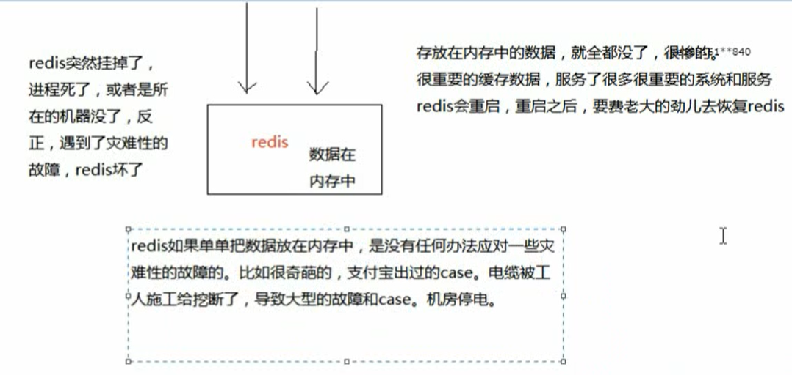

Redis 的持久化，就是将内存中的数据，持久化到磁盘上中，然后将磁盘上的数据放到阿里云 ODPS 中

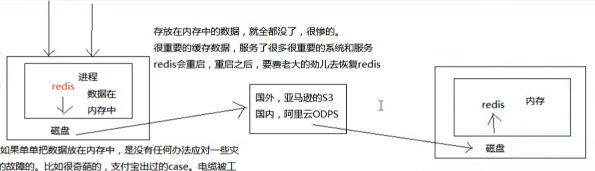

通过持久化将数据存储在磁盘中，然后定期比如说同步和备份到一些云存储服务上去。

#### Redis 中的 RDB 和 AOF 两种持久化机制

当出现 Redis 宕机时，我们需要做的是重启 redis，尽快让他对外提供服务，缓存全部无法命中，在 redis 里根本找不到数据，这时候就会出现缓存雪崩的问题。所有的请求，没有在 Redis 中命中，就会去 MySQL 数据库这种数据源头中找，一下子 MySQL 无法承受高并发，那么系统将直接宕机。这个时候 MySQL 宕机，因为没办法从 MySQL 中将缓存恢复到 Redis 中，因为 Redis 中的数据是从 MySQL 中来的。

#### RDB 持久化机制

简单来说 RDB：就是将 Redis 中的数据，每个一段时间，进行数据持久化

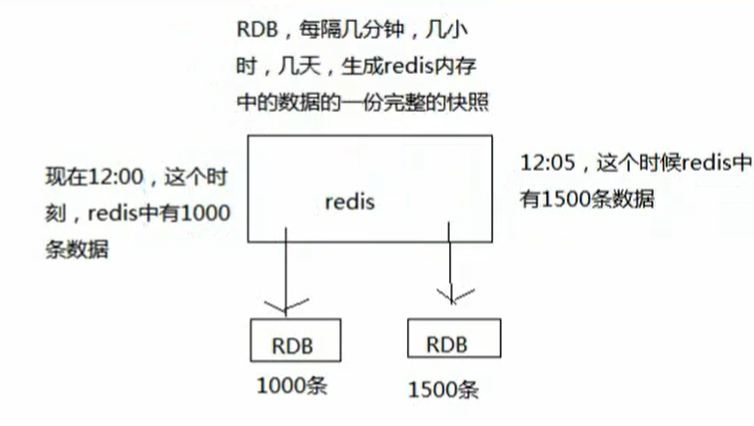

#### AOF 持久化机制

Redis 将内存中的数据，存放到一个 AOF 文件中，但是因为 Redis 只会写一个 AOF 文件，因此这个 AOF 文件会越来越大。

AOF 机制对每条写入命令作为日志，以 append-only 的模式写入一个日志文件中，在 Redis 重启的时候，可以通过回放 AOF 日志中的写入指令来重新构建整个数据集。

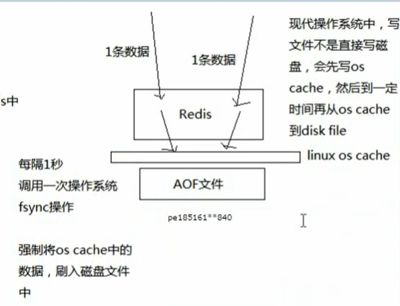

因为 Redis 中的数据是有一定限量的，不可能说 Redis 内存中的数据不限量增长，进而导致 AOF 无限量增长。

内存大小是一定的，到一定时候，Redis 就会用缓存淘汰算法，LRU，自动将一部分数据从内存中给清除。

AOF，是存放每条写命令的，所以会不断的膨胀，当大到一定的时候，AOF 做 rewrite 操作。

AOF rewrite 操作，就会基于当时 redis 内存中的数据，来重新构造一个更小的 AOF 文件，然后将旧的膨胀的很大的文件给删了。

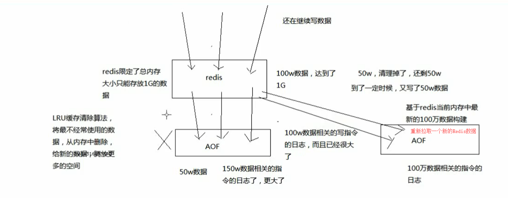

如果我们想要 Redis 仅仅作为纯内存的缓存来使用，那么可以禁止 RDB 和 AOF 所有的持久化机制

通过 AOF 和 RDB，都可以将 Redis 内存中的数据给持久化到磁盘上面来，然后可以将这些数据备份到其它地方去，例如阿里云的 OOS。

如果 Redis 挂了，服务器上的内存和磁盘上的数据都丢了，可以从云服务上拷贝回来之前的数据，放到指定的目录下，然后重新启动 Redis，Redis 就会自动根据持久化数据文件，去恢复内存中的数据，继续对外提供服务。

如果同时使用 RDB 和 AOF 两种持久化机制，那么在 Redis 重启的时候，会使用 AOF 来重新构建数据，因为 AOF 中的数据更加完整。

#### RDB 持久化机制的优点

- RDB 会生成多个数据文件，每个数据文件都代表了某个时刻中 Redis 的数据，这种多个数据文件的方式，非常适合做冷备份，可以将这种完整的数据文件发送到一些远程的安全存储上去，例如阿里云 ODPS 分布式存储上，以预定好的备份策略来定期备份 Redis 中的数据
  - RDB 也可以做冷备份，生成多个文件，每个文件代表了某个时刻的完整的数据快照
  - AOF 也可以做冷备，只有一个文件，但是你可以每隔一段时间，去 copy 一份文件出来
  - RDB 做冷备份的优势在于，可以由 Redis 去控制固定时长生成快照文件的事情，比较方便。AOF 还需要自己写一些脚本去做这个事情，各种定时。
- RDB 对 Redis 对外提供的读写服务，影响非常小，可以让 Redis 保持高性能，因为 Redis 主进程只需要 fork 一个子进程，让子进程执行磁盘 IO 操作来进行 RDB 持久化即可。
  - RDB 每次写都是些 Redis 内存的，只是在一定的时间内，才将数据写入磁盘
  - AOF 每次都要写文件，虽然可以快速写入 OS Cache 中，但是还是会有一定的时间开销，速度肯定比 RDB 略慢一点。
- 相对于 AOF 持久化机制来说，直接基于 RDB 数据文件来重启和恢复 Redis 进程，更加快速。
  - RDB 数据做冷备份，在最坏的情况下，提供数据恢复的时候，速度比 AOF 快。
  - AOF，存放的指令日志，做数据恢复的时候，其实是要回放和执行所有的指令日志，来恢复出来内存中的所有数据的，而 RDB 就是一份数据文件，恢复的时候，直接加载进内存即可。

综合上面可以知道：RDB 特别适合做冷备份

#### RDB 持久化的缺点

- 如果想要在 Redis 故障时，尽可能的少丢失数据，那么 RDB 没有 AOF 好，一般来说，RDB 数据快照文件，都是每隔 5 分钟，或者更长时间生成一次，这个时候就得接受一旦 Redis 经常宕机，那么丢失最近 5 分钟的数据。

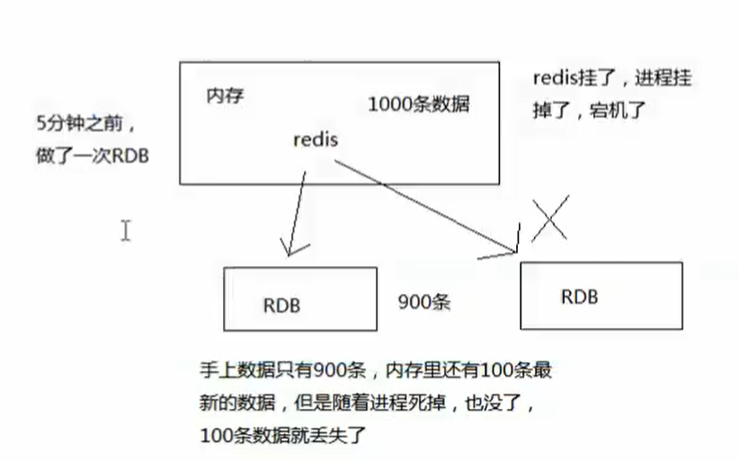

​		这个文件也是 RDB 最大的缺点，就是不适合做第一优先级的恢复方案，如果你依赖 RDB 做第一优先级方案，会导致数据丢失的比较多。

- RDB 每次在 fork 子进程来执行 RDB 快照数据生成的时候，如果数据文件特别大，可能会导致对客户端提供的服务暂停数毫秒，或者甚至数秒
  - 一般不要让 RDB 的间隔太长，否则每次生成的 RDB 文件太长，会对 Redis 本身的性能会有影响

#### AOF 持久化的优点

- AOF 可以更好的保护数据不丢失，一般 AOF 会间隔一秒，通过一个后台线程执行一次 fsync 操作，最多丢失 1 秒
- AOF 日志文件以 append-only 模式写入，所有没有任何磁盘寻址开销，写入性能非常高，而且文件不容易破损，即使文件尾部破损，也很容易快速修复。
- AOF 日志文件及时过大的时候，出现后台的重写操作，也不会影响客户端的读写，因为 rewrite log 的时候，会对其中的数据进行压缩，创建出一份需要恢复数据的最小日志出来，再创建新日志文件的时候，老的日志文件还是照常写入，当新的 merge 后的日志文件 ready 的时候，再交换新老日志文件即可。
- AOF 日志文件的命令通过非常可读的方式进行记录，这个特性非常适合做灾难性的误删除的紧急恢复，比如某人不小心用了 flushall 命令，清空了整个 Redis 数据，只要这个时候后台 rewrite 还没有发生，那么就可以立即拷贝 AOF 文件，将最后一条 flushall 命令删除了，然后再将该 AOF 文件放回去，就可以通过恢复机制，自动回复所有的数据。

#### AOF 持久化机制的缺点

- 对于同一份数据来说，AOF 日志通常比 RDB 数据快照文件更大
- AOF 开启后，支持写 QPS 会比 RDB 支持的写 QPS 低，因为 AOF 一般会配置成每秒 fsync 一次日志文件，因此这也就造成了性能不是很高。
  - 如果你要保证一条数据都不丢，也可以的，AOF 的 fsync 设置成每次写入一条数据，fsync 一次，这样 Redis 的 QPS 会大降。
- AOF 这种较为复杂的基于命令日志/merge/回放的方式，比基于 RDB 每次持久化一份完整的数据快照的方式，更加脆弱一些，容易有 BUG，不过 AOF 就是为了避免 rewrite 过程导致的 BUG，因此每次 rewrite 并不是基于旧的指令来进行 merge 的，而是基于当时内存中数据进行指令的重新构建，这与健壮性会好一些。
- 唯一的缺点：就是做数据恢复的时候，会比较慢，还有做冷备，定期的被封，不太方便，可能要自己手动写复杂的脚本去做。

#### RDB 和 AOF 的选择

- 不要仅仅使用 RDB，因为那样会导致你丢失很多的数据
- 也不要仅仅使用 AOF，因为这样有两个问题
  - AOF 做冷备，没有 RDB 冷备恢复快
  - RDB 每次简单粗暴的生成数据快照，更加健壮，可以避免 AOF 这种复杂的被封和恢复机制的 BUG
- 综合使用 AOF 和 RDB 两种持久化机制，用 AOF 来保证数据不丢失，作为数据恢复的第一选择，用 RDB 来做不同程度的冷备，在 AOF 文件都丢失或者损坏不可用的时候，可以使用 RDB 来进行快速的数据恢复。

### Redis 的线程模型

#### 文件事件处理器

Redis 基于 reactor 模式开发了网络事件处理器，这个处理器叫做文件事件处理器，file event handler，这个文件事件处理器是单线程的，因此 Redis 才叫做单线程的模型，采用 IO 多路复用机制同时监听多个 socket，根据 socket 上的事件来选择相应的事件处理器来处理这个事件。

文件事件处理器是单线程模式下运行的，但是通过 IO 多路复用机制监听了多个 socket，可以实现高性能的网络通信模型，又可以跟内部的其它单线程的模块进行对接，保证了 Redis 内部的线程模型的简单性。

文件事件处理器的结构包含 4 个部分：多个 socket，IO 多路复用程序，文件事件分派器，事件处理器等。

多个 socket 可能并发的产生不同的操作，每个操作对应不同的文件事件，但是 IO 多路复用程序会监听多个 socket，但是会把 socket 放入到一个队列中排队，每次从队列中取出一个 socket 给事件分派器，事件分派器把 socket 给对应的时间处理器。

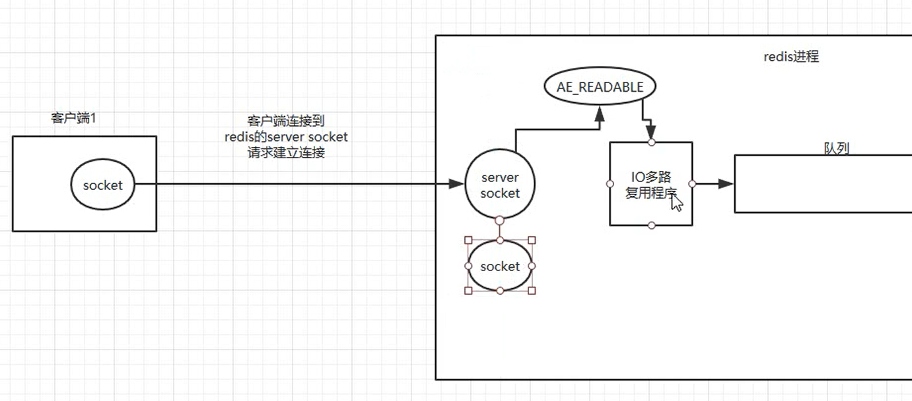

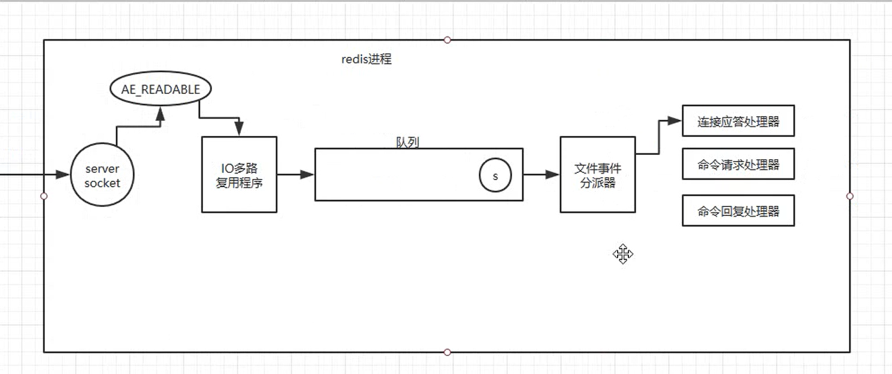

每次我们一个 socket 请求过来 和 redis 中的 server socket 建立连接后，通过 IO 多路复用程序，就会往队列中插入一个 socket，文件事件分派器就是将队列中的 socket 取出来，分派到对应的处理器，在处理器处理完成后，才会从队列中在取出一个。

这里也就是用一个线程，监听了客户端的所有请求，被称为 Redis 的单线程模型。

### 为什么 Redis 单线程模型效率这么高？

- 纯内存操作
- 核心是非阻塞的 IO 多路复用机制
- 单线程反而避免了多线程频繁上下文切换的问题

### Redis 的过期策略

#### Redis 中的数据为什么会丢失

之前有同学问过我，说我们生产环境的 redis 怎么经常会丢掉一些数据？写进去了，过一会儿可能就没了。我的天，同学，你问这个问题就说明 redis 你就没用对啊。redis 是缓存，你给当存储了是吧？

啥叫缓存？用内存当缓存。内存是无限的吗，内存是很宝贵而且是有限的，磁盘是廉价而且是大量的。可能一台机器就几十个 G 的内存，但是可以有几个 T 的硬盘空间。redis 主要是基于内存来进行高性能、高并发的读写操作的。

那既然内存是有限的，比如 redis 就只能用 10 个 G，你要是往里面写了 20 个 G 的数据，会咋办？当然会干掉 10 个 G 的数据，然后就保留 10 个 G 的数据了。那干掉哪些数据？保留哪些数据？当然是干掉不常用的数据，保留常用的数据了。所以说，这是缓存的一个最基本的概念，数据是会过期的，要么是你自己设置个过期时间，要么是 redis 自己给干掉。

```
set key value 过期时间（1小时）
set进去的key，1小时之后就没了，就失效了
```

#### 数据明明都过期了，怎么还占用着内存啊？

还有一种就是如果你设置好了一个过期时间，你知道 redis 是怎么给你弄成过期的吗？什么时候删除掉？如果你不知道，之前有个学员就问了，为啥好多数据明明应该过期了，结果发现 redis 内存占用还是很高？那是因为你不知道 redis 是怎么删除那些过期 key 的。

redis 内存一共是 10g，你现在往里面写了 5g 的数据，结果这些数据明明你都设置了过期时间，要求这些数据 1 小时之后都会过期，结果 1 小时之后，你回来一看，redis 机器，怎么内存占用还是 50% 呢？5g 数据过期了，我从 redis 里查，是查不到了，结果过期的数据还占用着 redis 的内存。

#### 定期删除和惰性删除

我们 Redis 设置了过期时间，其实内部是 定期删除 + 惰性删除两个再起作用的。

所谓定期删除，指的是 redis 默认是每隔 100ms 就随机抽取一些设置了过期时间的 key，检查其是否过期，如果过期就删除。假设 redis 里放了 10 万个 key，都设置了过期时间，你每隔几百毫秒，就检查 10 万个 key，那 redis 基本上就死了，cpu 负载会很高的，消耗在你的检查过期 key 上了。注意，这里可不是每隔 100ms 就遍历所有的设置过期时间的 key，那样就是一场性能上的灾难。实际上 redis 是每隔 100ms 随机抽取一些 key 来检查和删除的。

但是问题是，定期删除可能会导致很多过期 key 到了时间并没有被删除掉，那咋整呢？所以就是惰性删除了。这就是说，在你获取某个 key 的时候，redis 会检查一下 ，这个 key 如果设置了过期时间那么是否过期了？如果过期了此时就会删除，不会给你返回任何东西。

并不是 key 到时间就被删除掉，而是你查询这个 key 的时候，redis 再懒惰的检查一下

通过上述两种手段结合起来，保证过期的 key 一定会被干掉。

很简单，就是说，你的过期 key，靠定期删除没有被删除掉，还停留在内存里，占用着你的内存呢，除非你的系统去查一下那个 key，才会被 redis 给删除掉。

但是实际上这还是有问题的，如果定期删除漏掉了很多过期 key，然后你也没及时去查，也就没走惰性删除，此时会怎么样？如果大量过期 key 堆积在内存里，导致 redis 内存块耗尽了，咋整？

答案是：走内存淘汰机制。

#### Redis 内存淘汰机制

如果 redis 的内存占用过多的时候，此时会进行内存淘汰，有如下一些策略：

```
redis 10个key，现在已经满了，redis需要删除掉5个key

1个key，最近1分钟被查询了100次

1个key，最近10分钟被查询了50次

1个key，最近1个小时倍查询了1次
```

1）noeviction：当内存不足以容纳新写入数据时，新写入操作会报错，这个一般没人用吧，实在是太恶心了

2）allkeys-lru：当内存不足以容纳新写入数据时，在键空间中，移除最近最少使用的 key（这个是最常用的）

3）allkeys-random：当内存不足以容纳新写入数据时，在键空间中，随机移除某个 key，这个一般没人用吧，为啥要随机，肯定是把最近最少使用的 key 给干掉啊

4）volatile-lru：当内存不足以容纳新写入数据时，在设置了过期时间的键空间中，移除最近最少使用的 key（这个一般不太合适）

5）volatile-random：当内存不足以容纳新写入数据时，在设置了过期时间的键空间中，随机移除某个 key

6）volatile-ttl：当内存不足以容纳新写入数据时，在设置了过期时间的键空间中，有更早过期时间的 key 优先移除

很简单，你写的数据太多，内存满了，或者触发了什么条件，redis lru，自动给你清理掉了一些最近很少使用的数据

### Redis 中的 LRU 算法

Java 版本的 LRU

```
public class LRUCache<K, V> extends LinkedHashMap<K, V> {
    
private final int CACHE_SIZE;

    // 这里就是传递进来最多能缓存多少数据
    public LRUCache(int cacheSize) {
        super((int) Math.ceil(cacheSize / 0.75) + 1, 0.75f, true); // 这块就是设置一个hashmap的初始大小，同时最后一个true指的是让linkedhashmap按照访问顺序来进行排序，最近访问的放在头，最老访问的就在尾
        CACHE_SIZE = cacheSize;
    }

    @Override
    protected boolean removeEldestEntry(Map.Entry eldest) {
        return size() > CACHE_SIZE; // 这个意思就是说当map中的数据量大于指定的缓存个数的时候，就自动删除最老的数据
    }

```

### 如何保证 Redis 的高并发及高可用？

如何保证 Redis 的高并发和高可用？

redis 的主从复制原理能介绍一下么？

redis 的哨兵原理能介绍一下么？

#### 剖析

就是如果你用 redis 缓存技术的话，肯定要考虑如何用 redis 来加多台机器，保证 redis 是高并发的，还有就是如何让 Redis 保证自己不是挂掉以后就直接死掉了，redis 高可用

我这里会选用我之前讲解过这一块内容，redis 高并发、高可用、缓存一致性

redis 高并发：主从架构，一主多从，一般来说，很多项目其实就足够了，单主用来写入数据，单机几万 QPS，多从用来查询数据，多个从实例可以提供每秒 10 万的 QPS。

redis 高并发的同时，还需要容纳大量的数据：一主多从，每个实例都容纳了完整的数据，比如 redis 主就 10G 的内存量，其实你就最对只能容纳 10g 的数据量。如果你的缓存要容纳的数据量很大，达到了几十 g，甚至几百 g，或者是几 t，那你就需要 redis 集群，而且用 redis 集群之后，可以提供可能每秒几十万的读写并发。

redis 高可用：如果你做主从架构部署，其实就是加上哨兵就可以了，就可以实现，任何一个实例宕机，自动会进行主备切换。

### Redis 如何通过读写分离来承受百万的 QPS

#### Redis 高并发跟整个系统的高并发之间的关系

redis，你要搞高并发的话，不可避免，要把底层的缓存搞得很好

mysql，高并发，做到了，那么也是通过一系列复杂的分库分表，订单系统，事务要求的，QPS 到几万，比较高了

要做一些电商的商品详情页，真正的超高并发，QPS 上十万，甚至是百万，一秒钟百万的请求量

光是 redis 是不够的，但是 redis 是整个大型的缓存架构中，支撑高并发的架构里面，非常重要的一个环节

首先，你的底层的缓存中间件，缓存系统，必须能够支撑的起我们说的那种高并发，其次，再经过良好的整体的缓存架构的设计（多级缓存架构、热点缓存），支撑真正的上十万，甚至上百万的高并发

#### Redis 不能支撑高并发的瓶颈在哪里？

因为单机的 Redis，QPS 只能在上万左右，成为了支撑高并发的瓶颈。

#### 如果 Redis 要支撑超过 10 万 + 的并发，那应该怎么做？

单机的 redis 几乎不太可能说 QPS 超过 10 万 +，除非一些特殊情况，比如你的机器性能特别好，配置特别高，物理机，维护做的特别好，而且你的整体的操作不是太复杂，单机在几万。

读写分离，一般来说，对缓存，一般都是用来支撑读高并发的，写的请求是比较少的，可能写请求也就一秒钟几千，一两千。大量的请求都是读，一秒钟二十万次读

读写分离：主从架构 -> 读写分离 -> 支撑 10 万 + 读 QPS 的架构

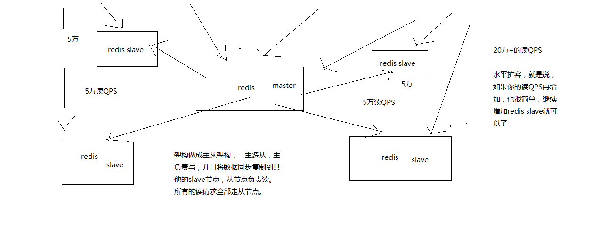

架构做成主从架构，一主多从，主服务器负责写，并且将数据同步到其它的 slave 节点，从节点负责读，所有的读请求全部走节点。

同时这样的架构，支持碎片扩容，就是说如果 QPS 在增加，也很简单，只需要增加 Redis Slave 节点即可。

#### Redis 主从架构

redis 主从架构 -> 读写分离架构 -> 可支持水平扩展的读高并发架构

##### 基本原理

- redis 采用异步方式复制数据到 slave 节点，不过 redis 2.8 开始，slave node 会周期性地确认自己每次复制的数据量
- 一个 master node 是可以配置多个 slave node 的
- slave node 也可以连接其他的 slave node
- slave node 做复制的时候，是不会 block master node 的正常工作的
- slave node 在做复制的时候，也不会 block 对自己的查询操作，它会用旧的数据集来提供服务; 但是复制完成的时候，需要删除旧数据集，加载新数据集，这个时候就会暂停对外服务了
- slave node 主要用来进行横向扩容，做读写分离，扩容的 slave node 可以提高读的吞吐量

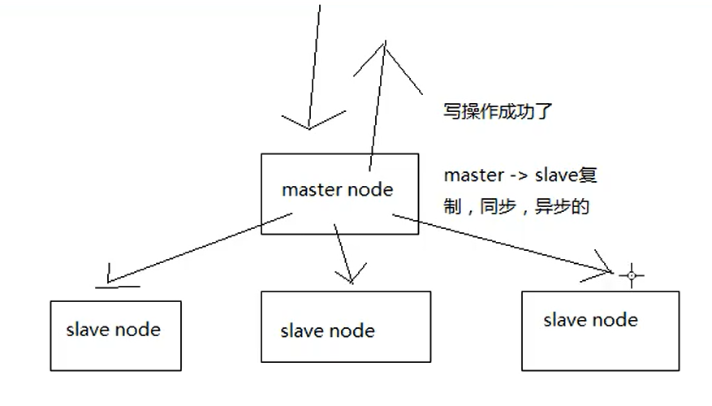

写操作存放在 master node，同时在异步把 master 上的信息，同步到每个 slave node 上。

##### Master 持久化对于主从架构的安全保障的意义

如果采用了主从架构，那么建议必须开启 master node 的持久化！不建议用 slave node 作为 master node 的数据热备，因为那样的话，如果你关掉 master 的持久化，可能在 master 宕机重启的时候数据是空的，然后可能一经过复制，salve node 数据也丢了

master -> RDB 和 AOF 都关闭了 -> 全部在内存中

master 宕机，重启，是没有本地数据可以恢复的，然后就会直接认为自己 IDE 数据是空的

master 就会将空的数据集同步到 slave 上去，所有 slave 的数据全部清空

100% 的数据丢失

master 节点，必须要使用持久化机制

第二个，master 的各种备份方案，要不要做，万一说本地的所有文件丢失了; 从备份中挑选一份 rdb 去恢复 master; 这样才能确保 master 启动的时候，是有数据的

即使采用了后续讲解的高可用机制，slave node 可以自动接管 master node，但是也可能 sentinal 还没有检测到 master failure，master node 就自动重启了，还是可能导致上面的所有 slave node 数据清空故障

##### Redis 主从复制原理

当启动一个 slave node 的时候，它会发送一个 PSYNC 命令给 master node，如果这是 slave node 重新连接 master node，那么 master node 仅仅会复制给 slave 部分缺少的数据; 否则如果是 slave node 第一次连接 master node，那么会触发一次 full resynchronization

开始 full resynchronization 的时候，master 会启动一个后台线程，开始生成一份 RDB 快照文件，同时还会将从客户端收到的所有写命令缓存在内存中。RDB 文件生成完毕之后，master 会将这个 RDB 发送给 slave，slave 会先写入本地磁盘，然后再从本地磁盘加载到内存中。然后 master 会将内存中缓存的写命令发送给 slave，slave 也会同步这些数据。

slave node 如果跟 master node 有网络故障，断开了连接，会自动重连。master 如果发现有多个 slave node 都来重新连接，仅仅会启动一个 rdb save 操作，用一份数据服务所有 slave node。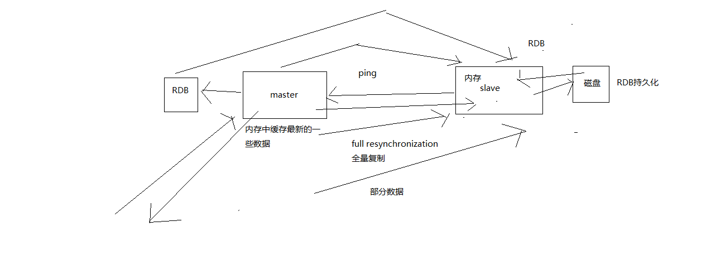

#### 主从复制的断点续传

从 redis 2.8 开始，就支持主从复制的断点续传，如果主从复制过程中，网络连接断掉了，那么可以接着上次复制的地方，继续复制下去，而不是从头开始复制一份

master node 会在内存中常见一个 backlog，master 和 slave 都会保存一个 replica offset 还有一个 master id，offset 就是保存在 backlog 中的。如果 master 和 slave 网络连接断掉了，slave 会让 master 从上次的 replica offset 开始继续复制，但是如果没有找到对应的 offset，那么就会执行一次 resynchronization

#### 无磁盘化复制

master 在内存中直接创建 rdb，然后发送给 slave，不会在自己本地落地磁盘了

```
repl-diskless-sync
# 等待一定时长再开始复制，因为要等更多slave重新连接过来
repl-diskless-sync-delay
```

#### Redis 主从复制的完整复制流程

##### 主从复制流程图

- slave node 启动，仅仅保存 master node 的信息，包括 master node 的 host 和 ip，但是复制流程没开始 master host 和 ip 是从哪儿来的，redis.conf 里面的 slaveof 配置的
- slave node 内部有个定时任务，每秒检查是否有新的 master node 要连接和复制，如果发现，就跟 master node 建立 socket 网络连接
- slave node 发送 ping 命令给 master node
- 口令认证，如果 master 设置了 requirepass，那么 salve node 必须发送 masterauth 的口令过去进行认证
- master node 第一次执行全量复制，将所有数据发给 slave node
- master node 后续持续将写命令，异步复制给 slave node


##### 数据同步相关核心机制

指的就是第一次 slave 连接 msater 的时候，执行的全量复制，那个过程里面你的一些细节的机制

- master 和 slave 都会维护一个 offset

master 会在自身不断累加 offset，slave 也会在自身不断累加 offset  
slave 每秒都会上报自己的 offset 给 master，同时 master 也会保存每个 slave 的 offset

这个倒不是说特定就用在全量复制的，主要是 master 和 slave 都要知道各自的数据的 offset，才能知道互相之间的数据不一致的情况

- backlog

master node 有一个 backlog，默认是 1MB 大小  
master node 给 slave node 复制数据时，也会将数据在 backlog 中同步写一份  
backlog 主要是用来做全量复制中断候的增量复制的

- master run id

info server，可以看到 master run id  
如果根据 host+ip 定位 master node，是不靠谱的，如果 master node 重启或者数据出现了变化，那么 slave node 应该根据不同的 run id 区分，run id 不同就做全量复制  
如果需要不更改 run id 重启 redis，可以使用 redis-cli debug reload 命令

- psync

从节点使用 psync 从 master node 进行复制，psync runid offset master node 会根据自身的情况返回响应信息，可能是 FULLRESYNC runid offset 触发全量复制，可能是 CONTINUE 触发增量复制

##### 全量复制

- master 执行 bgsave，在本地生成一份 rdb 快照文件
- master node 将 rdb 快照文件发送给 salve node，如果 rdb 复制时间超过 60 秒（repl-timeout），那么 slave node 就会认为复制失败，可以适当调节大这个参数
- 对于千兆网卡的机器，一般每秒传输 100MB，6G 文件，很可能超过 60s
- master node 在生成 rdb 时，会将所有新的写命令缓存在内存中，在 salve node 保存了 rdb 之后，再将新的写命令复制给 salve node
- client-output-buffer-limit slave 256MB 64MB 60，如果在复制期间，内存缓冲区持续消耗超过 64MB，或者一次性超过 256MB，那么停止复制，复制失败
- slave node 接收到 rdb 之后，清空自己的旧数据，然后重新加载 rdb 到自己的内存中，同时基于旧的数据版本对外提供服务

rdb 生成、rdb 通过网络拷贝、slave 旧数据的清理、slave aof rewrite，很耗费时间

如果 slave node 开启了 AOF，那么会立即执行 BGREWRITEAOF，重写 AOF

##### 增量复制

- 如果全量复制过程中，master-slave 网络连接断掉，那么 salve 重新连接 master 时，会触发增量复制
- master 直接从自己的 backlog 中获取部分丢失的数据，发送给 slave node，默认 backlog 就是 1MB
- msater 就是根据 slave 发送的 psync 中的 offset 来从 backlog 中获取数据的

##### 异步复制

master 每次接收到写命令之后，现在内部写入数据，然后异步发送给 slave node

##### 心跳机制

master 默认每隔 10 秒发送一次心跳，salve node 每隔 1 秒发送一个心跳

#### Redis 主从架构如何才能做到 99.99% 的高可用性？

架构上，高可用性，99.99% 的高可用性

99.99%，公式，系统可用的时间 / 系统故障的时间，365 天，在 365 天 * 99.99% 的时间内，你的系统都是可以哗哗对外提供服务的，那就是高可用性，99.99%

系统可用的时间 / 总的时间 = 高可用性，然后会对各种时间的概念，说一大堆解释

##### 系统可用性


##### 系统处于不可用


##### Redis 的不可用

一个 slave 宕机后，不会影响系统的可用性，还有其它 slave 在提供相同数据的情况下对外提供查询服务。


master 宕机后，相当于系统不可用了。

##### Redis 高可用的方案

当 Redis 的 master 节点宕机后，redis 的高可用架构中，有一个故障转移，叫 failover，也可以做主备切换。


##### 总结

Redis 实现高并发：一主多从，一般来说，很多项目其实就足够了，单主用来写数据，单机几万 QPS，多从用来查询数据，多个从实例可以提供每秒 10 万 QPS

Redis 高并发的同时，还需要容纳大量的数据：一主多从，每个实例都容纳了完整的数据，比如 Redis 主就 10G 内存量，其实你就可以对只能容纳 10G 的数据量。如果你的缓存要容纳的数据量很大，达到了几十 G，甚至几百 G，那就需要使用到 Redis 集群，而且用 Redis 集群之后，提供可能每秒几十万的读写并发。

Redis 高可用：如果用主从架构部署，在加上哨兵就可以实现任何一个实例宕机，就会自动进行主备切换。

### Redis 哨兵架构

#### 哨兵介绍

sentinal，中文名是哨兵

哨兵是 redis 集群架构中非常重要的一个组件，主要功能如下

- 集群监控，负责监控 redis master 和 slave 进程是否正常工作
- 消息通知，如果某个 redis 实例有故障，那么哨兵负责发送消息作为报警通知给管理员
- 故障转移，如果 master node 挂掉了，会自动转移到 slave node 上
- 配置中心，如果故障转移发生了，通知 client 客户端新的 master 地址

哨兵本身也是分布式的，作为一个哨兵集群去运行，互相协同工作

- 故障转移时，判断一个 master node 是宕机了，需要大部分的哨兵都同意才行，涉及到了分布式选举的问题
- 即使部分哨兵节点挂掉了，哨兵集群还是能正常工作的，因为如果一个作为高可用机制重要组成部分的故障转移系统本身是单点的，那就很坑爹了

目前采用的是 sentinal 2 版本，sentinal 2 相对于 sentinal 1 来说，重写了很多代码，主要是让故障转移的机制和算法变得更加健壮和简单

#### 哨兵的核心知识

- 哨兵至少需要 3 个实例，来保证自己的健壮性
- 哨兵 + redis 主从的部署架构，是不会保证数据零丢失的，只能保证 redis 集群的高可用性
- 对于哨兵 + redis 主从这种复杂的部署架构，尽量在测试环境和生产环境，都进行充足的测试和演练

#### 为什么 Redis 的哨兵集群只有 2 个节点无法正常工作？

哨兵集群必须部署 2 个以上节点

如果哨兵集群仅仅部署了个 2 个哨兵实例，s1 和 s2，quorum=1

```
+----+         +----+
| M1 |---------| R1 |
| S1 |         | S2 |
+----+         +----+
```

Configuration: quorum = 1

master 宕机，s1 和 s2 中只要有 1 个哨兵认为 master 宕机就可以还行切换，同时 s1 和 s2 中会选举出一个哨兵来执行故障转移同时这个时候，需要 majority，也就是大多数哨兵都是运行的，2 个哨兵的 majority 就是 2（2 的 majority=2，3 的 majority=2，5 的 majority=3，4 的 majority=2），2 个哨兵都运行着，就可以允许执行故障转移但是如果整个 M1 和 S1 运行的机器宕机了，那么哨兵只有 1 个了，此时就没有 majority 来允许执行故障转移，虽然另外一台机器还有一个 R1，但是故障转移不会执行

#### 经典的 3 节点哨兵集群

```

       +----+
       | M1 |
       | S1 |
       +----+
          |
+----+    |    +----+
| R2 |----+----| R3 |
| S2 |         | S3 |
+----+         +----+
```

Configuration: quorum = 2，majority

如果 M1 所在机器宕机了，那么三个哨兵还剩下 2 个，S2 和 S3 可以一致认为 master 宕机，然后选举出一个来执行故障转移，同时 3 个哨兵的 majority 是 2，所以还剩下的 2 个哨兵运行着，就可以允许执行故障转移

#### Redis 主备切换的数据丢失问题：异步复制、集群脑裂

主备切换的过程，可能会导致数据丢失

##### 异步复制导致的数据丢失

因为 master -> slave 的复制是异步的，所以可能有部分数据还没复制到 slave，master 就宕机了，此时这些部分数据就丢失了。


##### 脑裂导致的数据丢失

脑裂，也就是说，某个 master 所在机器突然脱离了正常的网络，跟其他 slave 机器不能连接，但是实际上 master 还运行着，此时哨兵可能就会认为 master 宕机了，然后开启选举，将其他 slave 切换成了 master

这个时候，集群里就会有两个 master，也就是所谓的脑裂。此时虽然某个 slave 被切换成了 master，但是可能 client 还没来得及切换到新的 master，还继续写向旧 master 的数据可能也丢失了

因此旧 master 再次恢复的时候，会被作为一个 slave 挂到新的 master 上去，自己的数据会清空，重新从新的 master 复制数据

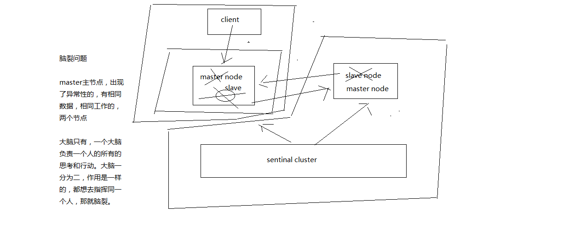

同时原来的 master 节点上的，client 像 旧的 master 中写入数据，当网络分区恢复正常后，client 写的数据就会因为复制，导致数据的丢失。

##### 解决异步复制和脑裂导致数据丢失

```
min-slaves-to-write 1
min-slaves-max-lag 10
```

要求至少有 1 个 slave，数据复制和同步的延迟不能超过 10 秒

如果说一旦所有的 slave，数据复制和同步的延迟都超过了 10 秒钟，那么这个时候，master 就不会再接收任何请求了，上面两个配置可以减少异步复制和脑裂导致的数据丢失

- 减少异步复制的数据丢失

有了 min-slaves-max-lag 这个配置，就可以确保说，一旦 slave 复制数据和 ack 延时太长，就认为可能 master 宕机后损失的数据太多了，那么就拒绝写请求，这样可以把 master 宕机时由于部分数据未同步到 slave 导致的数据丢失降低的可控范围内


- 减少脑裂的数据丢失

如果一个 master 出现了脑裂，跟其他 slave 丢了连接，那么上面两个配置可以确保说，如果不能继续给指定数量的 slave 发送数据，而且 slave 超过 10 秒没有给自己 ack 消息，那么就直接拒绝客户端的写请求，这样脑裂后的旧 master 就不会接受 client 的新数据，也就避免了数据丢失，上面的配置就确保了，如果跟任何一个 slave 丢了连接，在 10 秒后发现没有 slave 给自己 ack，那么就拒绝新的写请求，因此在脑裂场景下，最多就丢失 10 秒的数据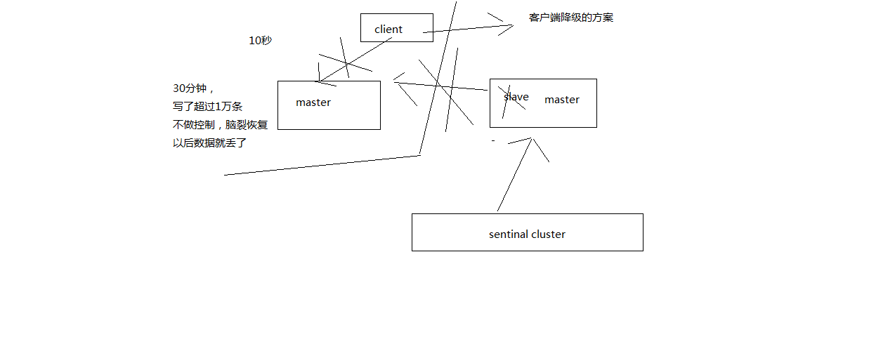

#### Redis 哨兵的底层原理

##### Sdown 和 Odown 转换机制

sdown 和 odown 两种失败状态

sdown 是主观宕机，就一个哨兵如果自己觉得一个 master 宕机了，那么就是主观宕机

odown 是客观宕机，如果 quorum 数量的哨兵都觉得一个 master 宕机了，那么就是客观宕机

sdown 达成的条件很简单，如果一个哨兵 ping 一个 master，超过了 is-master-down-after-milliseconds 指定的毫秒数之后，就主观认为 master 宕机

sdown 到 odown 转换的条件很简单，如果一个哨兵在指定时间内，收到了 quorum 指定数量的其他哨兵也认为那个 master 是 sdown 了，那么就认为是 odown 了，客观认为 master 宕机

##### 哨兵集群的自动发现机制

哨兵互相之间的发现，是通过 redis 的 pub/sub 系统实现的，每个哨兵都会往 __sentinel__:hello 这个 channel 里发送一个消息，这时候所有其他哨兵都可以消费到这个消息，并感知到其他的哨兵的存在

每隔两秒钟，每个哨兵都会往自己监控的某个 master+slaves 对应的 __sentinel__:hello channel 里发送一个消息，内容是自己的 host、ip 和 runid 还有对这个 master 的监控配置

每个哨兵也会去监听自己监控的每个 master+slaves 对应的 __sentinel__:hello channel，然后去感知到同样在监听这个 master+slaves 的其他哨兵的存在

每个哨兵还会跟其他哨兵交换对 master 的监控配置，互相进行监控配置的同步

##### Slave 配置的自动纠正

哨兵会负责自动纠正 slave 的一些配置，比如 slave 如果要成为潜在的 master 候选人，哨兵会确保 slave 在复制现有 master 的数据; 如果 slave 连接到了一个错误的 master 上，比如故障转移之后，那么哨兵会确保它们连接到正确的 master 上

##### slave->master 选举算法

如果一个 master 被认为 odown 了，而且 majority 哨兵都允许了主备切换，那么某个哨兵就会执行主备切换操作，此时首先要选举一个 slave 来，会考虑 slave 的一些信息

- 跟 master 断开连接的时长
- slave 优先级
- 复制 offset
- run id

如果一个 slave 跟 master 断开连接已经超过了 down-after-milliseconds 的 10 倍，外加 master 宕机的时长，那么 slave 就被认为不适合选举为 master

```
(down-after-milliseconds * 10) + milliseconds_since_master_is_in_SDOWN_state
```

接下来会对 slave 进行排序

- 按照 slave 优先级进行排序，slave priority 越低，优先级就越高
- 如果 slave priority 相同，那么看 replica offset，哪个 slave 复制了越多的数据，offset 越靠后，优先级就越高
- 如果上面两个条件都相同，那么选择一个 run id 比较小的那个 slave

##### Quorum 和 Majority

每次一个哨兵要做主备切换，首先需要 quorum 数量的哨兵认为 odown，然后选举出一个哨兵来做切换，这个哨兵还得得到 majority 哨兵的授权，才能正式执行切换

如果 quorum < majority，比如 5 个哨兵，majority 就是 3，quorum 设置为 2，那么就 3 个哨兵授权就可以执行切换

但是如果 quorum >= majority，那么必须 quorum 数量的哨兵都授权，比如 5 个哨兵，quorum 是 5，那么必须 5 个哨兵都同意授权，才能执行切换

##### Configuration Epoch

哨兵会对一套 redis master+slave 进行监控，有相应的监控的配置

执行切换的那个哨兵，会从要切换到的新 master（salve->master）那里得到一个 configuration epoch，这就是一个 version 号，每次切换的 version 号都必须是唯一的

如果第一个选举出的哨兵切换失败了，那么其他哨兵，会等待 failover-timeout 时间，然后接替继续执行切换，此时会重新获取一个新的 configuration epoch，作为新的 version 号

##### Configuraiton 传播

哨兵完成切换之后，会在自己本地更新生成最新的 master 配置，然后同步给其他的哨兵，就是通过之前说的 pub/sub 消息机制，这里之前的 version 号就很重要了，因为各种消息都是通过一个 channel 去发布和监听的，所以一个哨兵完成一次新的切换之后，新的 master 配置是跟着新的 version 号的，其他的哨兵都是根据版本号的大小来更新自己的 master 配置的
