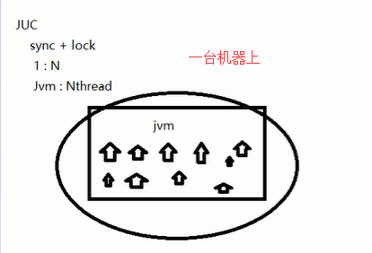
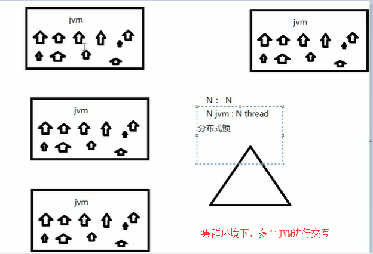

## 分布式锁

### 集群环境下保证 ID 不重复

原来的 Synchronized + Lock 只能锁单机，也就是只能在一个 JVM 环境下



而在分布式 + 集群的环境下，变成了 N 对 N 的关系，在并发的环境下，如果使用 UUID 或者自增 ID，就可能出现 ID 重复的问题，因此在集群下的环境下，对 JVM 进行加锁，这就是分布式锁。



在小厂的解决方案：也就是 QPS < 2000 的公司，有以下三种方案

- mysql 数据库的乐观锁实现
- redis：redission
- zookeeper：（服务治理 和 服务注册）

### Zookeeper 实现分布式锁

因为 Zookeeper 在创建节点的时候，需要保证节点的唯一性，也就是实现原理就是，每次一个线程获取到了锁，那就在 Zookeeper 上创建一个临时节点，但用完锁之后，在把这个节点删除掉

```
create /node v0410  # 创建一个持久节点
crate -e /node v0410 # 创建一个临时节点
```

对于单进程的并发场景，我们可以使用 synchronized 关键字和 Reentrantlock 等

对于 分布式场景，我们可以使用分布式锁。

#### 创建锁

多个 JVM 服务器之间，同时在 zookeeper 上创建相同一个临时节点，因为临时节点路径是保证唯一，只要谁能创建节点成功，谁就能获取到锁。

没有创建成功节点，只能注册个监听器监听这个锁并进行等待，当释放锁的时候，采用事件通知给其它客户端重新获取锁的资源。

这时候客户端使用事件监听，如果该临时节点被删除的话，重新进入获取锁的步骤。

#### 释放锁

Zookeeper 使用直接关闭临时节点 session 会话连接，因为临时节点生命周期与 session 会话绑定在一块，如果 session 会话连接关闭，该临时节点也会被删除，这时候客户端使用事件监听，如果该临时节点被删除的话，重新进入到获取锁的步骤。

### 单机环境下的锁

假设我们现在有一个订单 ID 生成的工具类

```
/**
 * @author: 陌溪
 * @create: 2020-04-03-22:46
 */
public class OrderNumberCreateUtil {
    private static int num = 0;

    public String getOrderNumber() {
        return "\t 生成订单号：" + (++num);
    }

}
```

然后有一个 OrderService 服务类

```
/**
 * 订单业务逻辑
 *
 * @author: 陌溪
 * @create: 2020-04-03-22:47
 */
public class OrderService {
    private OrderNumberCreateUtil orderNumberCreateUtil = new OrderNumberCreateUtil();

    public String getOrderNumber() {
        return orderNumberCreateUtil.getOrderNumber();
    }
}
```

当我们客户端有 50 个线程进行访问获取订单号的时候

```
/**
 * 客户端
 *
 * @author: 陌溪
 * @create: 2020-04-03-22:48
 */
public class Client {
    public static void main(String[] args) {
        OrderService orderService = new OrderService();

        for (int i = 0; i < 50; i++) {
            new Thread(() -> {
                String str = orderService.getOrderNumber();
                System.out.println(str);
            }, String.valueOf(i)).start();
        }
    }
}
```

我们能够发现。订单号 1 出现了两次，这就是我们在并发访问的时候，会出现问题

```
	 生成订单号：1
	 生成订单号：3
	 生成订单号：2
	 生成订单号：4
	 生成订单号：5
	 生成订单号：1
	 生成订单号：6
	 生成订单号：7
	 生成订单号：8
	 生成订单号：9
	 生成订单号：10
	 生成订单号：11
	 生成订单号：12
	 生成订单号：13
	 生成订单号：14
	 生成订单号：15
	 生成订单号：16
	 生成订单号：17
	 生成订单号：18
	 生成订单号：20
	 生成订单号：21
	 生成订单号：19
	 生成订单号：22
	 生成订单号：23
	 生成订单号：24
	 生成订单号：25
	 生成订单号：26
	 生成订单号：27
	 生成订单号：28
	 生成订单号：30
	 生成订单号：31
	 生成订单号：29
	 生成订单号：32
	 生成订单号：33
	 生成订单号：34
	 生成订单号：35
	 生成订单号：36
	 生成订单号：37
	 生成订单号：38
	 生成订单号：40
	 生成订单号：39
	 生成订单号：41
	 生成订单号：42
	 生成订单号：43
	 生成订单号：44
	 生成订单号：49
	 生成订单号：48
	 生成订单号：47
	 生成订单号：46
	 生成订单号：45
```

解决方案是，在 Service 下，加锁解决

```    
    //lock 应该申明为类的成员变量
    private Lock lock = new ReentrantLock();
    public String getOrderNumber() {
        lock.lock();
        try {
            return orderNumberCreateUtil.getOrderNumber();
        } catch (Exception e) {
            e.printStackTrace();
        } finally {
            lock.unlock();
        }
       return null;
    }
```

### 分布式环境下的锁

#### 模板模式

##### 概念

在模板模式（Template Pattern）设计模式中，用一个抽象类公开定义了执行它的方法的方式、模板。它的子类可以按需要重写方法实现，但调用将以抽象类中定义的方式进行

意图：定义一个操作中的算法的骨架，而将一些步骤延迟到子类中。模板方法使得子类可以不改变一个算法的结构，即可重定义该算法的某些特定步骤：

主要解决：一些方法通用，却在每个子类都重新写了这一方法

何时使用：在一些通用的方法

如何解决：将这些通用算法抽象出来

关键代码：在抽象父类中实现通用方法，其它步骤下放到子类中实现

##### 应用实例

- 西游记里面菩萨定义好了 81 难，不管是女儿国，或者蜘蛛精，只需要有 81 劫难，这就是一个顶层的逻辑骨架
- spring 中对 Hibernate 的支持，将一些定好的方法封装起来，比如开启事务，获取 Session，关闭 Session，程序要不需要重复写那些已经规范好的代码，直接丢一个实体就可以保存。

##### 优缺点

- 封装不变部分，扩展可变部分
- 提取公共代码，便于维护
- 行为由父类控制，子类实现
- 缺点是：每一个不同的实现，都需要一个子类来实现，导致类的个数增加，使得系统变庞大

##### 使用场景

- 有很多子类共有的方法，且逻辑相同
- 重要的、复杂的方法，可以考虑模板方法

#### 代码

例如，我们首先定义一个 zkLock 的接口

```
/**
 * ZkLock
 *
 * @author: 陌溪
 * @create: 2020-04-03-23:05
 */
public interface ZkLock {

    public void zkLock();

    public void zkUnlock();
}
```

然后在抽象类中继承该接口，同时实现 zkLock 和 zkUnLock 的方法

```
/**
 * ZkLock抽象类
 * 这就是模板设计模式
 *
 * @author: 陌溪
 * @create: 2020-04-03-23:06
 */
public abstract class ZkAbstractTemplateLock implements ZkLock{

    @Override
    public void zkLock() {
        // 尝试获取锁
        if(tryLock()) {
            System.out.println(Thread.currentThread().getName() + "\t 占用锁成功");
        } else {
            // 等待锁
            waitZkLock();
            // 重新调用获取锁的方法
            zkLock();
        }
    }

    /**
     * 定义两个抽象方法，一个是尝试锁，一个是等待锁
     * @return
     */
    public abstract boolean tryLock();

    public abstract void waitZkLock();

    @Override
    public void zkUnlock() {

    }
}
```

同时我们在抽象类里，又定义了两个抽象方法，zkWaitLock() 和 tryLock

最后我们是具体的实现方法

```
/**
 * 分布式锁
 *
 * @author: 陌溪
 * @create: 2020-04-03-23:21
 */
public class ZkDistributedLock extends ZkAbstractTemplateLock{
    @Override
    public boolean tryLock() {
        // 判断节点是否存在，如果存在则返回false，否者返回true
        return false;
    }

    @Override
    public void waitZkLock() throws InterruptedException {
        // 等待锁的时候，需要加监控，查询这个lock是否释放

        CountDownLatch countDownLatch = new CountDownLatch(1);

        countDownLatch.await();

        // 解除监听
    }
```

然后我们通过 ZkDistributedLock 进行加锁

```
/**
 * 订单业务逻辑
 *
 * @author: 陌溪
 * @create: 2020-04-03-22:47
 */
public class OrderService {
    private OrderNumberCreateUtil orderNumberCreateUtil = new OrderNumberCreateUtil();

    public void getOrderNumber() {
        ZkLock zkLock = new ZkDistributedLock();
        zkLock.zkLock();
        try {

        } catch (Exception e) {
            e.printStackTrace();
        } finally {
            zkLock.zkUnlock();
        }
        System.out.println(orderNumberCreateUtil.getOrderNumber());
    }
}
```

然后在使用多个线程进行操作，而且是在线程里面实例化对象，来进行创建，最终保证每个对象再获取订单的时候，都是唯一的

```

/**
 * 客户端
 *
 * @author: 陌溪
 * @create: 2020-04-03-22:48
 */
public class Client {
    public static void main(String[] args) {
        for (int i = 0; i < 50; i++) {
            new Thread(() -> {
                new OrderService().getOrderNumber();
                System.out.println(str);
            }, String.valueOf(i)).start();
        }
    }
}
```
