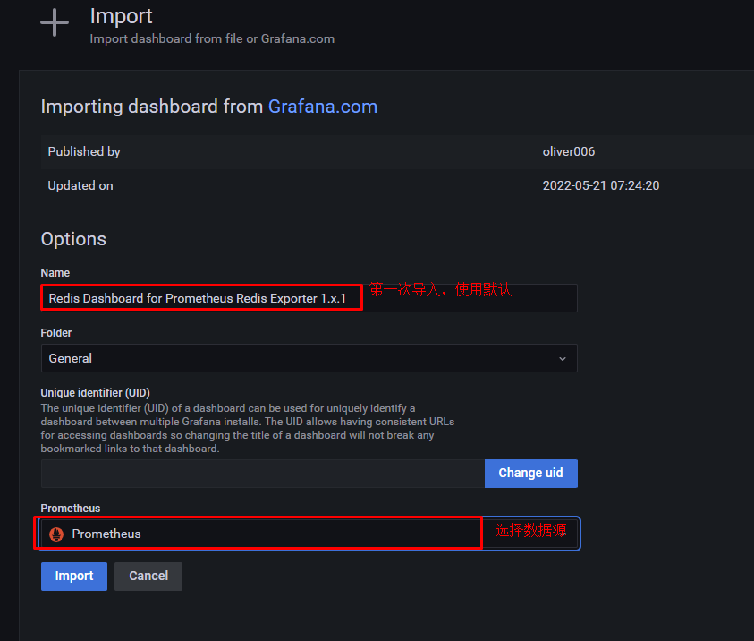

# helm部署prometheus监控系统及应用

# 一、helm安装

~~~powershell
wget https://get.helm.sh/helm-v3.8.2-linux-amd64.tar.gz
~~~

~~~powershell
tar xf helm-v3.8.2-linux-amd64.tar.gz
~~~

~~~powershell
mv linux-amd64/helm /bin/helm
~~~

~~~powershell
# helm version
version.BuildInfo{Version:"v3.8.2", GitCommit:"6e3701edea09e5d55a8ca2aae03a68917630e91b", GitTreeState:"clean", GoVersion:"go1.17.5"}
~~~

# 二、helm添加prometheus仓库

~~~powershell
helm repo add prometheus-community https://prometheus-community.github.io/helm-charts
~~~

~~~powershell
helm repo update
~~~

~~~powershell
# helm search repo prometheus
NAME                                                    CHART VERSION   APP VERSION     DESCRIPTION
prometheus-community/kube-prometheus-stack              37.2.0          0.57.0          kube-prometheus-stack collects Kubernetes manif.
~~~

# 三、使用helm安装prometheus全家桶

~~~powershell
# helm show values prometheus-community/kube-prometheus-stack > kube-prometheus-stack.yaml-default
~~~

~~~powershell
# cp kube-prometheus-stack.yaml-default kube-prometheus-stack.yaml
~~~

~~~powershell
# vim kube-prometheus-stack.yaml

2389     serviceMonitorSelectorNilUsesHelmValues: true

把true修改为false
~~~

~~~powershell
# helm install kps  prometheus-community/kube-prometheus-stack -f kube-prometheus-stack.yaml -n monitoring --create-namespace --version 37.2.0 --debug
~~~

~~~powershell
kubectl --namespace monitoring get pods -l "release=kps"
~~~

~~~powershell
# kubectl get svc -n monitoring
NAME                                     TYPE        CLUSTER-IP    EXTERNAL-IP   PORT(S)                      AGE
alertmanager-operated                    ClusterIP   None          <none>        9093/TCP,9094/TCP,9094/UDP   23m
kps-grafana                              ClusterIP   10.96.1.75    <none>        80/TCP                       24m
kps-kube-prometheus-stack-alertmanager   ClusterIP   10.96.0.115   <none>        9093/TCP                     24m
kps-kube-prometheus-stack-operator       ClusterIP   10.96.0.29    <none>        443/TCP                      24m
kps-kube-prometheus-stack-prometheus     ClusterIP   10.96.0.220   <none>        9090/TCP                     24m
kps-kube-state-metrics                   ClusterIP   10.96.1.192   <none>        8080/TCP                     24m
kps-prometheus-node-exporter             ClusterIP   10.96.3.21    <none>        9100/TCP                     24m
prometheus-operated                      ClusterIP   None          <none>        9090/TCP                     23m
~~~

~~~powershell
# kubectl get pods -n monitoring
NAME                                                    READY   STATUS    RESTARTS   AGE
alertmanager-kps-kube-prometheus-stack-alertmanager-0   2/2     Running   0          24m
kps-grafana-65f5f8f47d-zwt44                            3/3     Running   0          24m
kps-kube-prometheus-stack-operator-667b454c64-zlgq2     1/1     Running   0          24m
kps-kube-state-metrics-7d987f86f9-w5wkq                 1/1     Running   0          24m
kps-prometheus-node-exporter-7v4c8                      1/1     Running   0          24m
kps-prometheus-node-exporter-9gmjm                      1/1     Running   0          24m
kps-prometheus-node-exporter-lmdxp                      1/1     Running   0          24m
kps-prometheus-node-exporter-pf5kz                      1/1     Running   0          24m
prometheus-kps-kube-prometheus-stack-prometheus-0       2/2     Running   0          24m
~~~

# 四、配置prometheus及grafana访问

## 4.1 prometheus

~~~powershell
# cat pro.yaml
apiVersion: networking.k8s.io/v1
kind: Ingress
metadata:
  name: ingress-prometheus                    #自定义ingress名称
  namespace: monitoring
  annotations:
    ingressclass.kubernetes.io/is-default-class: "true"
    kubernetes.io/ingress.class: nginx
spec:
  rules:
  - host: prometheus.kubemsb.com                   # 自定义域名
    http:
      paths:
      - pathType: Prefix
        path: "/"
        backend:
          service:
            name: kps-kube-prometheus-stack-prometheus     # 对应上面创建的service名称
            port:
              number: 9090
~~~

~~~powershell
kubectl apply -f pro.yaml
~~~

> 把prometheus.kubemsb.com域名与ingress nginx controller svc对应的IP进行解析即可访问。

## 4.2 grafana

~~~powershell
# cat grafana.yaml
apiVersion: networking.k8s.io/v1
kind: Ingress
metadata:
  name: ingress-grafana                    #自定义ingress名称
  namespace: monitoring
  annotations:
    ingressclass.kubernetes.io/is-default-class: "true"
    kubernetes.io/ingress.class: nginx
spec:
  rules:
  - host: grafana.kubemsb.com                   # 自定义域名
    http:
      paths:
      - pathType: Prefix
        path: "/"
        backend:
          service:
            name: kps-grafana     # 对应上面创建的service名称
            port:
              number: 80
~~~

~~~powershell
kubectl apply -f grafana.yaml
~~~

~~~powershell
# kubectl get secret -n monitoring
NAME                                                               TYPE                 DATA   AGE
kps-grafana                                                        Opaque               3      28m
~~~

~~~powershell
# kubectl get  secret kps-grafana -n monitoring -o yaml
apiVersion: v1
data:
  admin-password: cHJvbS1vcGVyYXRvcg==
  admin-user: YWRtaW4=
  ldap-toml: ""
kind: Secret
metadata:
  annotations:
    meta.helm.sh/release-name: kps
    meta.helm.sh/release-namespace: monitoring
  creationTimestamp: "2022-07-14T05:52:02Z"
  labels:
    app.kubernetes.io/instance: kps
    app.kubernetes.io/managed-by: Helm
    app.kubernetes.io/name: grafana
    app.kubernetes.io/version: 9.0.2
    helm.sh/chart: grafana-6.32.2
  name: kps-grafana
  namespace: monitoring
  resourceVersion: "4929"
  uid: 98f435cf-4e27-475c-ade9-3562da262f37
type: Opaque
~~~

~~~powershell
# echo -n "YWRtaW4=" | base64 --decode
admin
~~~

~~~powershell
# echo -n "cHJvbS1vcGVyYXRvcg==" | base64 --decode
prom-operator
~~~

# 五、使用prometheus监控redis

## 5.1 redis集群部署

~~~powershell
# helm repo add bitnami https://charts.bitnami.com/bitnami
"bitnami" has been added to your repositories
~~~

~~~powershell
# helm repo update
~~~

~~~powershell
# helm search repo redis
NAME                                            CHART VERSION   APP VERSION     DESCRIPTION
bitnami/redis                                   17.0.1          7.0.3           Redis(R) is an open source, advanced key-value ...
bitnami/redis-cluster                           8.0.0           7.0.3           Redis(R) is an open source, scalable, distribut...
~~~

~~~powershell
# helm install redis bitnami/redis --set global.storageClass=managed-nfs-storage --set global.redis.password=root --set architecture=standalone --version 17.0.1 -n redisns --create-namespace --debug
~~~

~~~powershell
# kubectl get all -n redisns
NAME                 READY   STATUS    RESTARTS   AGE
pod/redis-master-0   1/1     Running   0          6m19s

NAME                     TYPE        CLUSTER-IP   EXTERNAL-IP   PORT(S)    AGE
service/redis-headless   ClusterIP   None         <none>        6379/TCP   6m19s
service/redis-master     ClusterIP   10.96.3.75   <none>        6379/TCP   6m19s

NAME                            READY   AGE
statefulset.apps/redis-master   1/1     6m19s
~~~

~~~powershell
# dig -t a redis-headless.redisns.svc.cluster.local @10.96.0.10
~~~

## 5.2 部署redis-exporter

~~~powershell
# cat d.yaml
apiVersion: apps/v1 # 版本
kind: Deployment # 资源
metadata:
  labels:
    app: redis-exporter # 标签
  name: redis-exporter # deploy的名称
  namespace: monitoring # 命名空间
spec:
  replicas: 1 # 副本
  selector:
    matchLabels:
      k8s-app: redis-exporter # po标签
  strategy: {}
  template:
    metadata:
      labels:
        k8s-app: redis-exporter # po标签
    spec:
      containers:
      - image: oliver006/redis_exporter:latest
        name: redis-exporter
        args: ["-redis.addr", "redis://redis-headless.redisns.svc.cluster.local:6379", "-redis.password", "root"]
        ports:
        - containerPort: 9121 # 默认暴露的端口号
          name: http
~~~

~~~powershell
kubectl apply -f d.yaml
~~~

~~~powershell
# kubectl get deployment -n monitoring
NAME                                 READY   UP-TO-DATE   AVAILABLE   AGE
kps-grafana                          1/1     1            1           57m
kps-kube-prometheus-stack-operator   1/1     1            1           57m
kps-kube-state-metrics               1/1     1            1           57m
redis-exporter                       1/1     1            1           22s
~~~

~~~powershell
# cat svc.yaml
apiVersion: v1 
kind: Service
metadata:
  name: redis-exporter 
  namespace: monitoring 
  labels:
    k8s-app: redis-exporter
spec:
  ports:
  - port: 9121 
    protocol: TCP
    name: http
  selector:
    k8s-app: redis-exporter
  type: ClusterIP 
~~~

~~~powershell
# kubectl apply -f svc.yaml
~~~

~~~powershell
# kubectl get svc -n monitoring
NAME                                     TYPE        CLUSTER-IP    EXTERNAL-IP   PORT(S)                      AGE
.....
redis-exporter                           ClusterIP   10.96.2.78    <none>        9121/TCP                     8s
~~~

~~~powershell
curl 10.96.2.78:9121/metrics | tail -1
...
redis_uptime_in_seconds 881
~~~

~~~powershell
# cat sm.yaml
apiVersion: monitoring.coreos.com/v1
kind: ServiceMonitor
metadata:
  name: redis-exporter 
  namespace: monitoring 
  labels:
    k8s-app: redis-exporter
spec:
  endpoints:
    - interval: 10s
      port: http # 这个是port 对应 Service.spec.ports.name
      scheme: http
  jobLabel: k8s-app
  selector:
    matchLabels:
      k8s-app: redis-exporter # 跟 svc 的 lables 保持一致
  namespaceSelector:
    matchNames:
    - monitoring # svc的命名空间
~~~

~~~powershell
# kubectl apply -f sm.yaml
~~~

~~~powershell
# kubectl get servicemonitor -n monitoring
NAME                                                AGE
......
redis-exporter                                      46s
~~~

