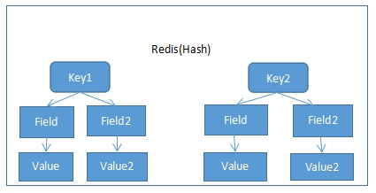
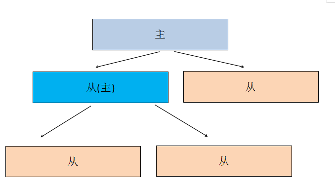
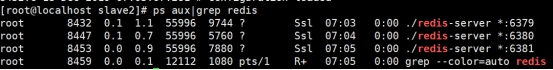
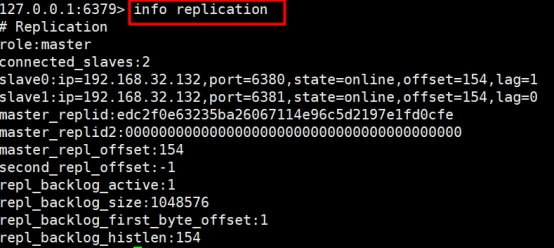
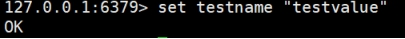
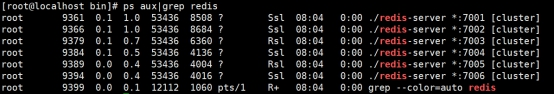

## Redis

### 一.Redis 简介

#### 1.NoSQL 简介

​	目前市场主流数据存储都是使用关系型数据库。每次操作关系型数据库时都是 I/O 操作，I/O 操作是主要影响程序执行性能原因之一，连接数据库关闭数据库都是消耗性能的过程。尽量减少对数据库的操作，能够明显的提升程序运行效率。

​	针对上面的问题，市场上就出现了各种 NoSQL(Not Only SQL,不仅仅可以使用关系型数据库) 数据库，它们的宣传口号：不是什么样的场景都必须使用关系型数据库，一些特定的场景使用 NoSQL 数据库更好。

常见 NoSQL 数据库：

​	memcached ：键值对，内存型数据库，所有数据都在内存中。

​	Redis: 和 Memcached 类似，还具备持久化能力。

​	HBase：以列作为存储。

​	MongoDB：以 Document 做存储。

#### 2.Redis 简介

​	Redis 是以 Key-Value 形式进行存储的 NoSQL 数据库。

​	Redis 是使用 C 语言进行编写的。

​	平时操作的数据都在内存中，效率特高，读的效率 110000/s，写 81000/s，所以多把 Redis 当做缓存工具使用。

​	Redis 以 solt（槽）作为数据存储单元，每个槽中可以存储 N 多个键值对。Redis 中固定具有 16384。理论上可以实现一个槽是一个 Redis。每个向 Redis 存储数据的 key 都会进行 crc16 算法得出一个值后对 16384 取余就是这个 key 存放的 solt 位置。

​	同时通过 Redis Sentinel 提供高可用，通过 Redis Cluster 提供自动分区。

​	Zookeeper

​	Redis 可以作为缓存工具和注册中心、MQ、消息队列等等。

### 二. Redis 单机版安装

​	1.安装依赖 C 语言依赖

​	redis 使用 C 语言编写，所以需要安装 C 语言库

```
# yum install -y gcc-c++ automake autoconf libtool make tcl 
```

​	2.上传并解压

​	把 redis-5.0.5.tar.gz 上传到/usr/local/tmp 中

​	解压文件

```
# cd /usr/local/tmp

# tar zxf redis-5.0.5.tar.gz
```

​	3.编译并安装

​	进入解压文件夹

```
# cd /usr/local/tmp/redis-5.0.5/
```

​	编译

```
# make
```

​	安装

```
# make install PREFIX=/usr/local/redis
```

​	4.开启守护进程

​	复制 cd /usr/local/tmp/redis-5.0.5/中 redis.conf 配置文件

```
# cp redis.conf /usr/local/redis/bin/
```

​	修改配置文件

```
# cd /usr/local/redis/bin/

# vim redis.conf
```

​	把 daemonize 的值由 no 修改为 yes


​	5.修改外部访问

​	在 redis5 中需要修改配置文件 redis.conf 允许外部访问。需要修改两处。

​	注释掉下面

​	bind 127.0.0.1

```
#bind 127.0.0.1
```

​	protected-mode yes 改成 no


​	6.启动并测试

​	启动 redis

​	\# ./redis-server redis.conf

​	重启 redis

​	\# ./redis-cli shutdown

​	\# ./redis-server redis.conf

​	启动客户端工具

​	\#./redis-cli

​	在 redis5 中客户端工具对命令会有提供功能。

### 三.Redis 常用的五大类型

​	 Redis 不仅仅支持简单的 k/v 类型的数据，同时还提供 list，set，zset，hash 等数据结构的存储，它还支持数据的备份，即 master-slave 模式的数据备份，同样 Redis 支持数据的持久化，可以将内存中的数据保持在磁盘中，重启的时候可以再次加载进行使用。

​ Redis 支持的五大数据类型包括 String（字符串 用法： 键 值），Hash（哈希 类似 Java 中的 map 用法： 键 键值对），List（列表 用法：键 集合 不可以重复），Set（集合 用法：键 集合 可以重复），Zset（sorted set 有序集合 用法： 键 值 值）

#### String（字符串）

​	string 是 redis 最基本的类型，你可以理解成与 Memcached 一模一样的类型，一个 key 对应一个 value。string 类型是二进制安全的。意思是 redis 的 string 可以包含任何数据。比如 jpg 图片或者序列化的对象。string 类型是 Redis 最基本的数据类型，string 类型的值最大能存储 512MB。

应用场景：  

​	String 是最常用的一种数据类型，普通的 key/value 存储都可以归为此类，value 其实不仅是 String，  

也可以是数字：比如想知道什么时候封锁一个 IP 地址 (访问超过几次)。

#### Hash（哈希）

​	Redis hash 是一个键值 (key=>value) 对集合。

​	Redis hash 是一个 string 类型的 field 和 value 的映射表，hash 特别适合用于存储对象。

​	使用场景：存储、读取、修改用户属性

​	我们简单举个实例来描述下 Hash 的应用场景，比如我们要存储一个用户信息对象数据，包含以下信息： 用户 ID，为查找的 key，  

​    	存储的 value 用户对象包含姓名 name，年龄 age，生日 birthday 等信息， 如果用普通的 key/value 结构来存储，主要有以下 2 种存储方式：  

​    	第一种方式将用户 ID 作为查找 key,把其他信息封装成一个对象以序列化的方式存储，  

​ 如：set u001 " 李三,18,20010101"  

​     	这种方式的缺点是，增加了序列化/反序列化的开销，并且在需要修改其中一项信息时，需要把整个对象取回，并且修改操作需要对并发进行保护，引入 CAS 等复杂问题。  

​     	第二种方法是这个用户信息对象有多少成员就存成多少个 key-value 对儿，用用户 ID+ 对应属性的名称作为唯一标识来取得对应属性的值，  

​       	如：mset user:001:name " 李三 "user:001:age18 user:001:birthday "20010101" 虽然省去了序列化开销和并发问题，但是用户 ID 为重复存储，如果存在大量这样的数据，内存浪费还是非常可观的。  

​    	那么 Redis 提供的 Hash 很好的解决了这个问题。

#### List（列表）

​	Redis 列表是简单的字符串列表，按照插入顺序排序。你可以添加一个元素到列表的头部（左边）或者尾部（右边）。

应用场景：  

   	 Redis list的应用场景非常多，也是Redis最重要的数据结构之一。  

​    	我们可以轻松地实现最新消息排行等功能。  

  	 Lists的另一个应用就是消息队列，可以利用Lists的PUSH操作，将任务存在Lists中，然后工作线程再用POP操作将任务取出进行执行。  

#### Set（集合）

​	Redis 的 Set 是 string 类型的无序集合。

​	使用场景：1.共同好友、二度好友

​			   2. 利用唯一性，可以统计访问网站的所有独立 IP

 	 Redis set对外提供的功能与list类似是一个列表的功能，特殊之处在于set是可以自动排重的，当你需要存储一个列表数据，又不希望出现重复数据时，set是一个很好的选择，并且set提供了判断某个成员是否在一个set集合内的重要接口，这个也是list所不能提供的。  
 	
 	 比如在微博应用中，每个人的好友存在一个集合（set）中，这样求两个人的共同好友的操作，可能就只需要用求交集命令即可。  

​    	Redis 还为集合提供了求交集、并集、差集等操作，可以非常方便的实  

  	实现方式：  

​    	set 的内部实现是一个 value 永远为 null 的 HashMap，实际就是通过计算 hash 的方式来快速排重的，这也是 set 能提供判断一个成员是否在集合内的原因。

#### zset(sorted set：有序集合)

 	Redis zset 和 set 一样也是string类型元素的集合,且不允许重复的成员。不同的是每个元素都会关联一个double类型的分数。redis正是通过分数来为集合中的成员进行从小到大的排序。zset的成员是唯一的,但分数(score)却可以重复。

使用场景：1.带有权重的元素，比如一个游戏的用户得分排行榜

​		   2.比较复杂的数据结构，一般用到的场景不算太多

### 四. Redis 常用命令

Redis 命令相关手册有很多，下面为其中比较好用的两个

  1.<https://www.redis.net.cn/order/>

  2.http://doc.redisfans.com/text-in

#### 1. Key 操作

##### 1.1 Exists

​	判断 key 是否存在。

​	语法：exists key 名称

​	返回值：存在返回数字，不存在返回 0

##### 1.2 Expire

​	设置 key 的过期时间，单位秒

​	语法：expire key 秒数

​	返回值：成功返回 1，失败返回 0

##### 1.3 Ttl

​	查看 key 的剩余过期时间

​	语法：ttl key

​	返回值：返回剩余时间，如果不过期返回 -1

##### 1.4 Del

​	根据 key 删除键值对。

​	语法：del key

​	返回值：被删除 key 的数量

#### 2. 字符串值 (String)

##### 2.1 Set

​	设置指定 key 的值

​	语法：set key value

​	返回值：成功 OK

##### 2.2 Get

​	获取指定 key 的值

​	语法：get key

​	返回值：key 的值。不存在返回 nil

##### 2.3 Setnx

​	当且仅当 key 不存在时才新增。

​	语法：setnx key value

​	返回值：不存在时返回 1，存在返回 0

##### 2.4 Setex

​	设置 key 的存活时间，无论是否存在指定 key 都能新增，如果存在 key 覆盖旧值。同时必须指定过期时间。

​	语法：setex key seconds value

​	返回值：OK

#### 3.哈希表 (Hash)

​	Hash 类型的值中包含多组 field value。



##### 3.1 Hset

​	给 key 中 field 设置值。

​	语法：hset key field value

​	返回值：成功 1，失败 0

##### 3.2 Hget

​	获取 key 中某个 field 的值

​	语法：hget key field

​	返回值：返回 field 的内容

##### 3.3 Hmset

​	给 key 中多个 filed 设置值

​	语法：hmset key field value field value

​	返回值：成功 OK

##### 3.4 Hmget

​	一次获取 key 中多个 field 的值

​	语法：hmget key field field

​	返回值：value 列表

##### 3.5 Hvals

​	获取 key 中所有 field 的值

​	语法：hvals key

​	返回值：value 列表

##### 3.6 Hgetall

​	获取所有 field 和 value

​	语法：hgetall key

​	返回值：field 和 value 交替显示列表

##### 3.7 Hdel

​	删除 key 中任意个 field

​	语法：hdel key field field

​	返回值：成功删除 field 的数量

#### 4. 列表（List）

##### 4.1 Rpush

​	向列表末尾中插入一个或多个值

​	语法；rpush key value value

​	返回值：列表长度

##### 4.2 Lrange

​	返回列表中指定区间内的值。可以使用 -1 代表列表末尾

​	语法：lrange list 0 -1

​	返回值：查询到的值

##### 4.3 Lpush

​	将一个或多个值插入到列表前面

​	语法：lpush key value value

​	返回值：列表长度

##### 4.4 Llen

​	获取列表长度

​	语法：llen key

​	返回值：列表长度

##### 4.5 Lrem

​	删除列表中元素。count 为正数表示从左往右删除的数量。负数从右往左删除的数量。

​	语法：lrem key count value

​	返回值：删除数量。

#### 5 集合 (Set)

​	set 和 java 中集合一样。

##### 5.1 Sadd

​	向集合中添加内容。不允许重复。

​	语法：sadd key value value value

​	返回值：集合长度

##### 5.2 Scard

​	返回集合元素数量

​	语法：scard key

​	返回值：集合长度

##### 5.3 Smembers

​	查看集合中元素内容

​	语法：smembers key

​	返回值：集合中元素

#### 6 .有序集合（Sorted Set）

​	有序集合中每个 value 都有一个分数（score），根据分数进行排序。

##### 6.1 Zadd

​	向有序集合中添加数据

​	语法：zadd key score value score value

​	返回值：长度

##### 6.2 Zrange

​	返回区间内容，withscores 表示带有分数

​	语法：zrange key 区间 [withscores]

​	返回值：值列表

### 五、 Redis 持久化策略

​	Redis 不仅仅是一个内存型数据库，还具备持久化能力。

#### 1. RDB

​	rdb 模式是默认模式，可以在指定的时间间隔内生成数据快照（snapshot），默认保存到 dump.rdb 文件中。当 redis 重启后会自动加载 dump.rdb 文件中内容到内存中。

​	用户可以使用 SAVE（同步）或 BGSAVE（异步）手动保存数据。

​	可以设置服务器配置的 save 选项，让服务器每隔一段时间自动执行一次 BGSAVE 命令，可以通过 save 选项设置多个保存条件，但只要其中任意一个条件被满足，服务器就会执行 BGSAVE 命令。  
　　	例如：  
　　	save 900 1  
　　	save 300 10  
　　	save 60 10000  
　　那么只要满足以下三个条件中的任意一个，BGSAVE 命令就会被执行  
　　服务器在 900 秒之内，对数据库进行了至少 1 次修改  
　　服务器在 300 秒之内，对数据库进行了至少 10 次修改  
　　服务器在 60 秒之内，对数据库进行了至少 10000 次修改

##### 1.1 优点

​	rdb 文件是一个紧凑文件，直接使用 rdb 文件就可以还原数据。

​	数据保存会由一个子进程进行保存，不影响父进程。

​	恢复数据的效率要高于 aof

##### 1.2 缺点

​	每次保存点之间导致 redis 不可意料的关闭，可能会丢失数据。

​	由于每次保存数据都需要 fork() 子进程，在数据量比较大时可能会比较耗费性能。

#### 2 AOF

​	AOF 默认是关闭的，需要在配置文件中开启 AOF。Redis 支持 AOF 和 RDB 同时生效，如果同时存在，AOF 优先级高于 RDB（Redis 重新启动时会使用 AOF 进行数据恢复）

​	监听执行的命令，如果发现执行了修改数据的操作，同时直接同步到数据库文件中。

##### 2.1 优点

​	相对 RDB 数据更加安全。

##### 2.2 缺点

​	相同数据集 AOF 要大于 RDB。

​	相对 RDB 可能会慢一些。

##### 2.3 开启办法

​	修改 redis.conf 中

```
# 默认no
appendonly yes
# aof文件名
appendfilename "appendonly.aof"
```

### 六. Redis 主从复制

​	Redis 支持集群功能。为了保证单一节点可用性，redis 支持主从复制功能。每个节点有 N 个复制品（replica），其中一个复制品是主（master），另外 N-1 个复制品是从（Slave），也就是说 Redis 支持一主多从。

​	一个主可有多个从，而一个从又可以看成主，它还可以有多个从。



#### 1. 主从优点

​	增加单一节点的健壮性，从而提升整个集群的稳定性。（Redis 中当超过 1/2 节点不可用时，整个集群不可用）

​	从节点可以对主节点数据备份，提升容灾能力。

​	读写分离。在 redis 主从中，主节点一般用作写（具备读的能力），从节点只能读，利用这个特性实现读写分离，写用主，读用从。

##### 1.1 一主多从搭建

​	在已经搭建的单机版 redis 基础上进行操作。

​	并且关闭 redis 单机版

```
./redis-cli shutdown
```

##### 1.2 新建目录

```
# mkdir /usr/local/replica
```

##### 1.3 复制目录

​	把之前安装的 redis 单机版中 bin 目录复制三份，分别叫做：master、slave1、slave2

```
# cp -r /usr/local/redis/bin /usr/local/replica/master
# cp -r /usr/local/redis/bin /usr/local/replica/slave1
# cp -r /usr/local/redis/bin /usr/local/replica/slave2
```

##### 1.4 修改从的配置文件

​	修改 2 个从的 redis.conf，指定主节点 ip 和端口。并修改自身端口号防止和其他 redis 冲突。

```
# vim /usr/local/replica/slave1/redis.conf
```

​	指定主节点 ip 和端口

```
replicaof 192.168.93.10 6379
```

​	修改自己端口

```
port 6380
```

```
# vim /usr/local/replica/slave2/redis.conf
```

​	指定主节点 ip 和端口

```
replicaof 192.168.93.10 6379
```

​	修改自己端口

```
port 6381
```

##### 1.5 启动三个 Redis 实例

​	注意：一定要关闭单机的 redis，否则端口冲突。

```
# cd /usr/local/replica
# vim startup.sh
```

​	在文件中添加下面内容

```
cd /usr/local/replica/master/
./redis-server redis.conf
  cd /usr/local/replica/slave1
./redis-server redis.conf
  cd /usr/local/replica/slave2
./redis-server redis.conf
```

 	赋予权限

```
# chmod a+x startup.sh
```

​	开启

```
# ./startup.sh
```

##### 1.6 查看启动状态

```
# ps aux|grep redis
```



##### 1.7 测试 *

```
# cd /usr/local/replica/master/
# ./redis-cli 
```



​	在客户端命令行模式下，添加一条数据：



​	进去 slave 查看数据是否同步。

```
# cd /usr/local/replica/slave1
# ./redis-cli -p 6380
```


### 七. 哨兵（Sentinel）

​	在 redis 主从默认是只有主具备写的能力，而从只能读。如果主宕机，整个节点不具备写能力。但是如果这是让一个从变成主，整个节点就可以继续工作。即使之前的主恢复过来也当做这个节点的从即可。

​	Redis 的哨兵就是帮助监控整个节点的，当节点主宕机等情况下，帮助重新选取主。

​	Redis 中哨兵支持单哨兵和多哨兵。单哨兵是只要这个哨兵发现 master 宕机了，就直接选取另一个 master。而多哨兵是根据我们设定，达到一定数量哨兵认为 master 宕机后才会进行重新选取主。我们以多哨兵演示。

#### 1. 没有哨兵下主从效果

​	只要杀掉主，整个节点无法在写数据，从身份不会变化，主的信息还是以前的信息。


#### 2.搭建多哨兵

​	前提：安装了单机的 redis

##### 2.1 新建目录

```
# mkdir /usr/local/sentinel
```

##### 2.2 复制 Redis

```
# cp -r /usr/local/redis/bin/* /usr/local/sentinel
```

##### 2.3 复制配置文件

​	从 redis 解压目录中复制 sentinel 配置文件

```
# cd /usr/local/tmp/redis-5.0.5/
# cp sentinel.conf /usr/local/sentinel/
```

##### 2.4 修改配置文件

```
# cd /usr/local/sentinel
# vim sentinel.conf

port 26379
daemonize yes
logfile “/usr/local/sentinel/26379.log”
sentinel monitor mymaster 192.168.93.10 6379 2
```

​	复制 sentinel.conf，命名为 sentinel-26380.conf

```
# cp sentinel.conf sentinel-26380.conf
# vim sentinel-26380.conf

port 26380
daemonize yes
logfile “/usr/local/sentinel/26380.log”
sentinel monitor mymaster 192.168.93.10 6379 2
```

复制 sentinel.conf，命名为 sentinel-26381.conf

```
# cp sentinel.conf sentinel-26381.conf
# vim sentinel-26381.conf

port 26381
daemonize yes
logfile “/usr/local/sentinel/26381.log”
sentinel monitor mymaster 192.168.93.10 6379 2
```

##### 2.5 启动主从

​	如果已经启动状态，忽略下面命令。如果启动部分，全部 kill 后重新启动。

​	使用 kill 杀死全部 redis

```
# ps aux|grep redis
# kill -9 进程号
```

​	启动 redis 主从

```
# cd /usr/local/replica
# ./startup.sh
```

##### 2.6 启动三个哨兵

```
# cd /usr/local/sentinel
# ./redis-sentinel sentinel.conf
# ./redis-sentinel sentinel-26380.conf
# ./redis-sentinel sentinel-26381.conf
```

##### 2.7 查看日志

```
# cat 26379.log
```

##### 2.8 测试宕机

​	查看 redis 进程号

```
# ps aux|grep redis
```

​	杀死主进程号

```
# kill -9 进程号
```

​	查看日志，短暂延迟后会发现，出现新的主。

```
# cat 26379.log
```

### 八. 集群（Cluster）

​	前提：已经安装好 redis 单机版。

​	当集群中超过或等于 1/2 节点不可用时，整个集群不可用。为了搭建稳定集群，都采用奇数节点。

#### 1. 复制 Redis 配置文件

​	从/usr/local/redis/bin 下把 redis.conf 复制到当前目录中，命名为 redis-7001.conf

```
# cp /usr/local/redis/bin/redis.conf /usr/local/redis/bin/redis-7001.conf
```

#### 2. 修改 redis-7001.conf

```
# cd /usr/local/redis/bin
# vim redis-7001.conf
```

​	需要修改如下

```
port 7001
cluster-enabled yes
cluster-config-file nodes-7001.conf
cluster-node-timeout 15000
# appendonly yes 如果开启aof默认，需要修改为yes。如果使用rdb，此处不需要修改
daemonize yes
protected-mode no
pidfile /var/run/redis_7001.pid
```

#### 3. 复制配置文件，并修改内容

​	把 redis-7001.conf 复制 5 份，分别叫做 redis-7002.conf、redis-7003.conf、redis-7004.conf、redis-7005.conf、redis-7006.conf

```
# cp redis-7001.conf redis-7002.conf
# cp redis-7001.conf redis-7003.conf
# cp redis-7001.conf redis-7004.conf
# cp redis-7001.conf redis-7005.conf
# cp redis-7001.conf redis-7006.conf
```

 	新复制的5个配置文件都需要需改三处。

​	例如 nodes-7002.conf 中需要把所有 7001 都换成 7002。

​	可以使用 :%s/7001/7002/g 进行全局修改。

```
port 7002
cluster-config-file nodes-7002.conf
pidfile /var/run/redis_7002.pid
```

#### 4 .启动 6 个 Redis

​	可以使用 redis-server 结合 6 个配置文件进行启动 6 个实例。

​	执行之前一定要先删除 dump.rdb

```
# rm -f dump.rdb
# vim startup.sh

./redis-server redis-7001.conf
./redis-server redis-7002.conf
./redis-server redis-7003.conf
./redis-server redis-7004.conf
./redis-server redis-7005.conf
./redis-server redis-7006.conf


# chmod a+x startup.sh
# ./startup.sh
```

#### 5. 查看启动状态



#### 6. 建立集群

​	在 redis3 的时候需要借助 ruby 脚本实现集群。在 redis5 中可以使用自带的 redis-cli 实现集群功能，比 redis3 的时候更加方便了。

​	建议配置静态 ip，ip 改变集群失效

```
./redis-cli --cluster create 192.168.93.10:7001 192.168.93.10:7002 192.168.93.10:7003 192.168.93.10:7004 192.168.93.10:7005 192.168.93.10:7006 --cluster-replicas 1
```

#### 7. 测试

​	集群测试时，千万不要忘记最后一个 -c 参数。

```
# ./redis-cli -p 7001 -c
# set age 18
```

#### 8 .编写关闭脚本

```
# vim stop.sh
# chmod a+x stop.sh

./redis-cli -p 7001 shutdown
./redis-cli -p 7002 shutdown
./redis-cli -p 7003 shutdown
./redis-cli -p 7004 shutdown
./redis-cli -p 7005 shutdown
./redis-cli -p 7006 shutdown
```

### 九. Jedis

​	Redis 给 Java 语言提供了客户端 API，称之为 Jedis。

​	Jedis API 和 Redis 命令几乎是一样的。

​	例如：Redis 对 String 值新增时 set 命令，Jedis 中也是 set 方法。所以本课程中没有重点把所有方法进行演示，重要演示 Jedis 如何使用。

​	Jedis API 特别简单，基本上都是创建对象调用方法即可。

#### 1. 单机版

```
public void testStandalone(){
    Jedis jedis = new Jedis("192.168.93.10",6379);
    jedis.set("name","msb-standalone");
    String value = jedis.get("name");
    System.out.println(value);
}
```

#### 2. 带有连接池

```
public void testPool(){
    JedisPoolConfig jedisPoolConfig = new JedisPoolConfig();
    jedisPoolConfig.setMaxTotal(20);
    jedisPoolConfig.setMaxIdle(5);
    jedisPoolConfig.setMinIdle(3);
    JedisPool jedisPool = new JedisPool(jedisPoolConfig,"192.168.93.10",6379);
    Jedis jedis = jedisPool.getResource();
    jedis.set("name","msb-pool");
    String value = jedis.get("name");
    System.out.println(value);
}
```

#### 3. 集群

```
public void testCluster(){
    Set<HostAndPort> set = new HashSet<>();
    set.add(new HostAndPort("192.168.93.10",7001));
    set.add(new HostAndPort("192.168.93.10",7002));
    set.add(new HostAndPort("192.168.93.10",7003));
    set.add(new HostAndPort("192.168.93.10",7004));
    set.add(new HostAndPort("192.168.93.10",7005));
    set.add(new HostAndPort("192.168.93.10",7006));
    JedisCluster jedisCluster = new JedisCluster(set);
    jedisCluster.set("name","bjmsb");
    String value = jedisCluster.get("name");
    System.out.println(value);
}
```

### 十. 使用 SpringBoot 整合 SpringDataRedis 操作 Redis

​	Spring Data 是 Spring 公司的顶级项目，里面包含了 N 多个二级子项目，这些子项目都是相对独立的项目。每个子项目是对不同 API 的封装。

​	所有 Spring Boot 整合 Spring Data xxxx 的启动器都叫做 spring-boot-starter-data-xxxx

​	Spring Data 好处很方便操作对象类型。

​	把 Redis 不同值得类型放到一个 opsForXXX 方法中。

​		opsForValue : String 值

​		opsForList : 列表 List

​		opsForHash: 哈希表 Hash

​		opsForZSet: 有序集合 Sorted Set

​		opsForSet : 集合

#### 1. 添加依赖

```
<parent>
    <groupId>org.springframework.boot</groupId>
    <artifactId>spring-boot-starter-parent</artifactId>
    <version>2.2.2.RELEASE</version>
</parent>

<dependencies>
    <dependency>
        <groupId>org.springframework.boot</groupId>
        <artifactId>spring-boot-starter-web</artifactId>
    </dependency>
    <dependency>
        <groupId>org.springframework.boot</groupId>
        <artifactId>spring-boot-starter-test</artifactId>
    </dependency>
    <dependency>
        <groupId>org.springframework.boot</groupId>
        <artifactId>spring-boot-starter-data-redis</artifactId>
    </dependency>
</dependencies>
```

#### 2. 配置配置文件

​	spring.redis.host=localhost 默认值

​	spring.redis.port=6379 端口号默认值

```
spring:
  redis:
    host: 192.168.52.133
# cluster:
# nodes: 192.168.93.10:7001,192.168.93.10:7002,192.168.93.10:7003,192.168.93.10:7004,192.168.93.10:7005,192.168.93.10:7006
```

#### 3.编写配置类

```
@Configuration
public class RedisConfig {
    @Bean
    public RedisTemplate<String,Object> redisTemplate(RedisConnectionFactory 		  factory){
        RedisTemplate<String,Object> redisTemplate = new RedisTemplate<>();
        redisTemplate.setConnectionFactory(factory);
        redisTemplate.setKeySerializer(new StringRedisSerializer());
        redisTemplate.setValueSerializer(new Jackson2JsonRedisSerializer<Object>(Object.class));
        return redisTemplate;
    }
}
```

#### 4. 编写代码

##### 4.1 编写对象新增

```
@Autowired
private RedisTemplate<String, Object> redisTemplate;

@Test
public void testString() {
    People peo = new People(1, "张三");
    redisTemplate.opsForValue().set("peo1", peo);
}
```

##### 4.2 编写对象获取

此处必须编写值序列化器。不指定时返回类型为 LinkedHashMap

```
@Test
public void testGetString() {
    redisTemplate.setValueSerializer(new Jackson2JsonRedisSerializer<People>(People.class));
    People peo = (People) redisTemplate.opsForValue().get("peo1");
    System.out.println(peo);
}
```

##### 4.3 编写 List

```
@Test
public void testList() {
    List<People> list = new ArrayList<>();
    list.add(new People(1, "张三"));
    list.add(new People(2, "李四"));
    redisTemplate.opsForValue().set("list2", list);
}
```

##### 4.4 编写 List 取值

```
@Test
public void testGetList(){
    redisTemplate.setValueSerializer(new Jackson2JsonRedisSerializer<List>(List.class));
    List<People> list2 = (List<People>) redisTemplate.opsForValue().get("list2");
    System.out.println(list2);
}
```

### 十一. 使用 Redis 效果

​	使用缓存流程

​	1. 先判断缓存中是否存在。如果存在直接从缓存中取出数据。不执行 2，3 步骤

​	2. 如果不存在，从 mysql 中获取数据

​	3. 获取数据后，把数据缓存到 redis 中


