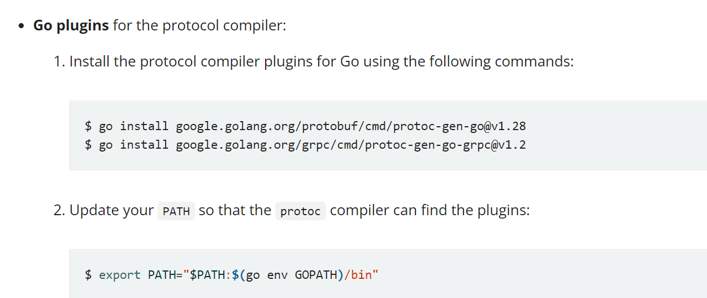

# 新版本

前面的课程中，我们使用的proto的go生成器，使用的命令是

go get github.com/golang/protobuf/protoc-gen-go，在https://www.grpc.io/docs/languages/go/quickstart/ 中，我们发现

官方使用的和我们使用的并不一致。

github的方式，需要使用`--go_out=plugins=grpc` 来去进行生成，而在golang.org方式中，弃用了这种方式，使用`protoc-gen-go`将不在支持gRPC service的定义，需要使用新的插件`protoc-gen-go-grpc`。

> 所以，这里，我们以新的方式，重新实现一下服务端和客户端

## 1. 使用google.golang.org/protobuf

1. 安装插件

   ~~~shell
   $ go install google.golang.org/protobuf/cmd/protoc-gen-go@v1.28
   $ go install google.golang.org/grpc/cmd/protoc-gen-go-grpc@v1.2
   ~~~

   安装完成后会在gopath下的bin目录下生成

   

2. 利用proto文件重新生成go文件

   ~~~shell
   protoc  --go_out=./service --go-grpc_out=./service  pbfile\product.proto
   ~~~

3. 修改之前的service实现

   ~~~go
   package service
   
   import (
   	"context"
   )
   
   var ProductService = &productService{}
   
   type productService struct {
   }
   
   func (p *productService) GetProductStock(ctx context.Context, request *ProductRequest) (*ProductResponse, error) {
   	return &ProductResponse{ProdStock: request.ProdId}, nil
   }
   func (p *productService) mustEmbedUnimplementedProdServiceServer() {}
   
   ~~~

4. 测试

## 2. import使用

> 用于导入其他proto文件

~~~go
// 这个就是protobuf的中间文件

// 指定的当前proto语法的版本，有2和3
syntax = "proto3";
//从执行 protoc这个命令的当前目录开始算起，
import "pbfile/user.proto";

option go_package="../service";

// 指定等会文件生成出来的package
package service;

// 定义request model
message ProductRequest{
  int32 prod_id = 1; // 1代表顺序
}

// 定义response model
message ProductResponse{
  int32 prod_stock = 1; // 1代表顺序
  User user = 2;
}

// 定义服务主体
service ProdService{
  // 定义方法
  rpc GetProductStock(ProductRequest) returns(ProductResponse);
}
~~~

### 2.1 Any

> 任意类型

~~~protobuf
// 使用any类型，需要导入这个
import "google/protobuf/any.proto";

// 定义入参消息
message HelloParam{
  // any，代表可以是任何类型
  google.protobuf.Any data = 1;
}

~~~

~~~go
// 这个就是protobuf的中间文件

// 指定的当前proto语法的版本，有2和3
syntax = "proto3";
//从执行 protoc这个命令的当前目录开始算起，
import "user.proto";
// 使用any类型，需要导入这个
import "google/protobuf/any.proto";

option go_package="../service";

// 指定等会文件生成出来的package
package service;

// 定义request model
message ProductRequest{
  int32 prod_id = 1; // 1代表顺序
}

message Content {
  string msg = 1;
}
// 定义response model
message ProductResponse{
  int32 prod_stock = 1; // 1代表顺序
  User user = 2;
  google.protobuf.Any data = 3;
}

// 定义服务主体
service ProdService{
  // 定义方法
  rpc GetProductStock(ProductRequest) returns(ProductResponse);
}
~~~

~~~go
func (p *productService) GetProductStock(context context.Context, request *ProductRequest) (*ProductResponse, error) {
	//实现具体的业务逻辑
	stock := p.GetStockById(request.ProdId)
	user := User{Username: "mszlu"}
	content := Content{Msg: "mszlu msg..."}
	//转换成any类型
	any, _ := anypb.New(&content)
	return &ProductResponse{ProdStock: stock, User: &user, Data: any}, nil
}

~~~

## 3. stream

在 HTTP/1.1 的时代，同一个时刻只能对一个请求进行处理或者响应，换句话说，下一个请求必须要等当前请求处理完才能继续进行。

>  HTTP/1.1需要注意的是，在服务端没有response的时候，客户端是可以发起多个request的，但服务端依旧是顺序对请求进行处理, 并按照收到请求的次序予以返回。

HTTP/2 的时代，多路复用的特性让一次同时处理多个请求成为了现实，并且同一个 TCP 通道中的请求不分先后、不会阻塞，HTTP/2 中引入了流(Stream) 和 帧(Frame) 的概念，当 TCP 通道建立以后，后续的所有操作都是以流的方式发送的，而二进制帧则是组成流的最小单位，属于协议层上的流式传输。

> HTTP/2 在一个 TCP 连接的基础上虚拟出多个 Stream, Stream 之间可以并发的请求和处理, 并且 HTTP/2 以二进制帧 (frame) 的方式进行数据传送, 并引入了头部压缩 (HPACK), 大大提升了交互效率

### 3.1 定义

~~~protobuf
 1  // 普通 RPC
 2  rpc SimplePing(PingRequest) returns (PingReply);
 3
 4  // 客户端流式 RPC
 5  rpc ClientStreamPing(stream PingRequest) returns (PingReply);
 6
 7  // 服务器端流式 RPC
 8  rpc ServerStreamPing(PingRequest) returns (stream PingReply);
 9
10  // 双向流式 RPC
11  rpc BothStreamPing(stream PingRequest) returns (stream PingReply);

~~~

`stream`关键字，当该关键字修饰参数时，表示这是一个客户端流式的 gRPC 接口；当该参数修饰返回值时，表示这是一个服务器端流式的 gRPC 接口；当该关键字同时修饰参数和返回值时，表示这是一个双向流式的 gRPC 接口。

### 3.2 客户端流

定义：

~~~protobuf
rpc UpdateStockClientStream(stream ProductRequest) returns(ProductResponse);
~~~

~~~go
//....	
stream, err := prodClient.UpdateProductStockClientStream(context.Background())
	if err != nil {
		log.Fatal("获取流出错", err)
	}
	rsp := make(chan struct{}, 1)
	go prodRequest(stream, rsp)
	select {
	case <-rsp:
		recv, err := stream.CloseAndRecv()
		if err != nil {
			log.Fatal(err)
		}
		stock := recv.ProdStock
		fmt.Println("客户端收到响应：", stock)

~~~

~~~go

func prodRequest(stream service.ProdService_UpdateProductStockClientStreamClient, rsp chan struct{}) {
	count := 0
	for {
		request := &service.ProductRequest{
			ProdId: 123,
		}
		err := stream.Send(request)
		if err != nil {
			log.Fatal(err)
		}
		time.Sleep(time.Second)
		count++
		if count > 10 {
			rsp <- struct{}{}
			break
		}
	}
}

~~~

~~~go

func (p *productService) UpdateProductStockClientStream(stream ProdService_UpdateProductStockClientStreamServer) error {
	count := 0
	for {
		//源源不断的去接收客户端发来的信息
		recv, err := stream.Recv()
		if err != nil {
			if err == io.EOF {
				return nil
			}
			return err
		}
		fmt.Println("服务端接收到的流", recv.ProdId, count)
		count++
		if count > 10 {
			rsp := &ProductResponse{ProdStock: recv.ProdId}
			err := stream.SendAndClose(rsp)
			if err != nil {
				return err
			}
			return nil
		}
	}
}

~~~

### 3.3 服务端流

定义：

~~~protobuf
rpc GetProductStockServerStream(ProductRequest) returns(stream ProductResponse);
~~~

~~~go

func (p *productService) GetProductStockServerStream(request *ProductRequest, stream ProdService_GetProductStockServerStreamServer) error {
	count := 0
	for {
		rsp := &ProductResponse{ProdStock: request.ProdId}
		err := stream.Send(rsp)
		if err != nil {
			return err
		}
		time.Sleep(time.Second)
		count++
		if count > 10 {
			return nil
		}
	}
}

~~~

~~~go
request := &service.ProductRequest{
		ProdId: 123,
	}

	stream, err := prodClient.GetProductStockServerStream(context.Background(), request)
	if err != nil {
		log.Fatal("获取流出错", err)
	}

	for {
		recv, err := stream.Recv()
		if err != nil {
			if err == io.EOF {
				fmt.Println("客户端数据接收完成")
				err := stream.CloseSend()
				if err != nil {
					log.Fatal(err)
				}
				break
			}
			log.Fatal(err)
		}
		fmt.Println("客户端收到的流", recv.ProdStock)
	}
~~~

### 3.4 双向流

~~~go
stream, err := prodClient.SayHelloStream(context.Background())

	for {
		request := &service.ProductRequest{
			ProdId: 123,
		}
		err = stream.Send(request)
		if err != nil {
			log.Fatal(err)
		}
		time.Sleep(time.Second)
		recv, err := stream.Recv()
		if err != nil {
			log.Fatal(err)
		}
		//websocket
		fmt.Println("客户端收到的流信息", recv.ProdStock)
	}
~~~

~~~go

func (p *productService) SayHelloStream(stream ProdService_SayHelloStreamServer) error {
	for {
		recv, err := stream.Recv()
		if err != nil {
			return nil
		}
		fmt.Println("服务端收到客户端的消息", recv.ProdId)
		time.Sleep(time.Second)
		rsp := &ProductResponse{ProdStock: recv.ProdId}
		err = stream.Send(rsp)
		if err != nil {
			return nil
		}
	}
}
~~~

