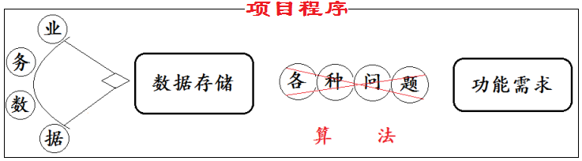
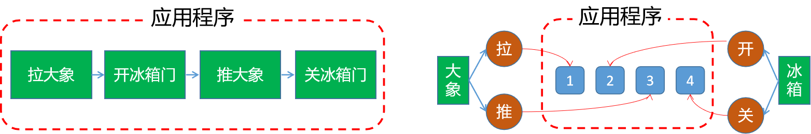
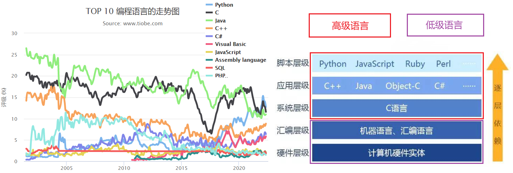
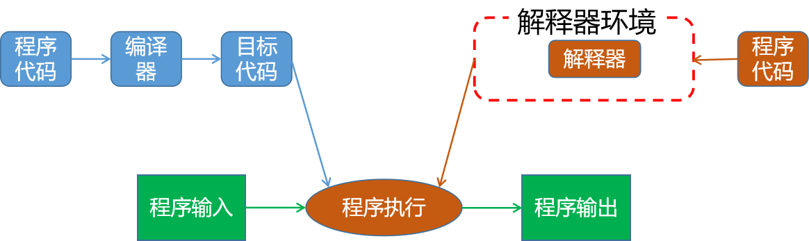
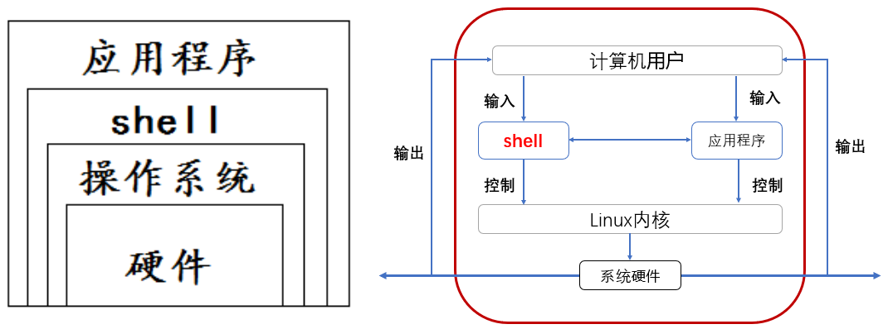
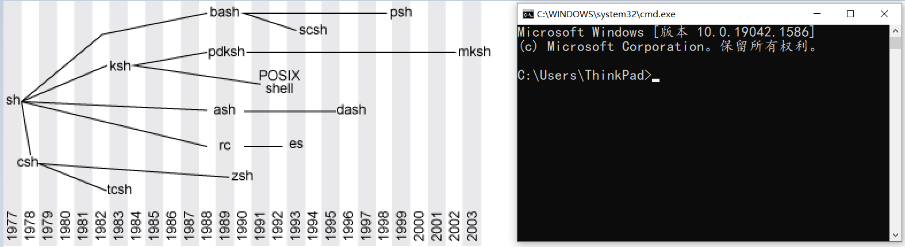
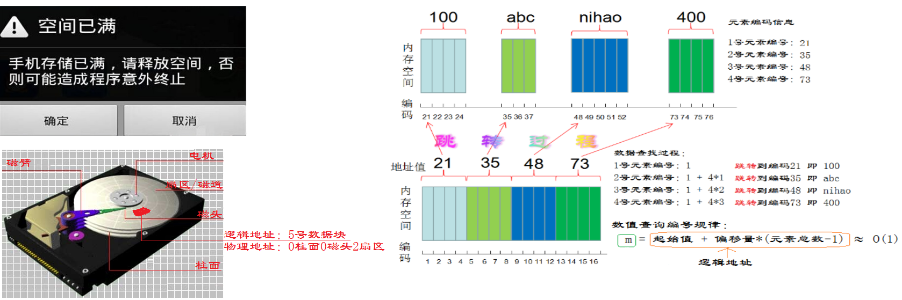
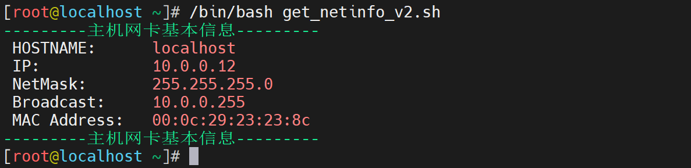
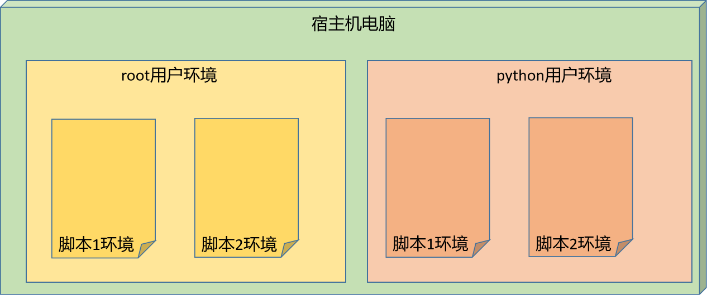
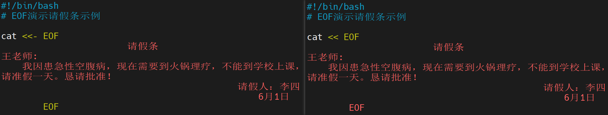

## 1 Shell 简介

### 1.1 核心命令回顾

#### 1.1.1 筛选信息

学习目标

这一节，我们从 shell 快捷键、grep、sort、小结、四个方面来学习。

**shell 快捷键**

快捷键符号

```powershell
命令执行：	
    !! 					执行上一条命令
    !num 				执行历史命令中的第num行命令
    Ctrl 关键字 		  执行内容匹配的命令
```

```powershell
命令行切换
	Ctrl + A 			光标迅速回到行首
	Ctrl + E			光标迅速回到行尾
	Ctrl + k			删除光标到行尾内容
	Ctrl + u			删除光标到行首内容
	Ctrl + y			粘贴删除的内容
	Ctrl + c			临时终止命令行命令
	Esc + b				移动到当前单词的开头
	Esc + f				移动到当前单词的结尾
```

**grep 命令**

负责从数据源中检索对应的字符串，行过滤

```powershell
grep options 'keys' filename
OPTIONS:
    -i: 不区分大小写
    -v: 查找不包含指定内容的行,反向选择
    -w: 按单词搜索
    -o: 打印匹配关键字
    -c: 统计匹配到的次数
    -n: 显示行号
    -r: 逐层遍历目录查找
    -A: 显示匹配行及后面多少行	
    -B: 显示匹配行及前面多少行
    -C: 显示匹配行前后多少行
    -l：只列出匹配的文件名
    -L：列出不匹配的文件名
    -e: 使用正则匹配
    -E:使用扩展正则匹配
    ^key:以关键字开头
    key$:以关键字结尾
    ^$:匹配空行
    --color=auto ：可以将找到的关键词部分加上颜色的显示
```

```powershell
grep 高亮显示
centos7中已经为大家设置了，存放在/etc/profile.d/colorgrep.sh文件中，如若大家使用的系统中没有设置颜色输出，可以使用以下方法来自行设置

临时设置：
# alias grep='grep --color=auto'			//只针对当前终端和当前用户生效

永久设置：
1）全局（针对所有用户生效）
vim /etc/bashrc
alias grep='grep --color=auto'
source /etc/bashrc

2）局部（针对具体的某个用户）
vim ~/.bashrc
alias grep='grep --color=auto'
source ~/.bashrc
```

```powershell
常用命令选项必知必会  示例：
# grep -i root passwd					忽略大小写匹配包含root的行
# grep -w ftp passwd 					精确匹配ftp单词
# grep -wo ftp passwd 					打印匹配到的关键字ftp
# grep -n root passwd 					打印匹配到root关键字的行好
# grep -ni root passwd 					忽略大小写匹配统计包含关键字root的行
# grep -nic root passwd					忽略大小写匹配统计包含关键字root的行数
# grep -i ^root passwd 					忽略大小写匹配以root开头的行
# grep bash$ passwd 					匹配以bash结尾的行
# grep -n ^$ passwd 					匹配空行并打印行号
# grep ^# /etc/vsftpd/vsftpd.conf		匹配以#号开头的行
# grep -v ^# /etc/vsftpd/vsftpd.conf	匹配不以#号开头的行
# grep -A 5 mail passwd 				匹配包含mail关键字及其后5行
# grep -B 5 mail passwd 				匹配包含mail关键字及其前5行
# grep -C 5 mail passwd 				匹配包含mail关键字及其前后5行
```

**sort 命令**

信息排序

```powershell
语法：
sort [options] file
将文件的每一行作为一个单位，从首字符向后，依次按ASCII码值进行比较，最后将他们按升序输出。

options:
-u ：去除重复行
-r ：降序排列，默认是升序
-o : 将排序结果输出到文件中  类似 重定向符号>
-n ：以数字排序，默认是按字符排序
-t ：分隔符
-k ：第N列
-b ：忽略前导空格。
-R ：随机排序，每次运行的结果均不同。
```

```powershell
文件内容
[root@localhost ~]# cat num.txt
9
8
6
8
4
7
2
1

内容升序
[root@localhost ~]# sort -n num.txt
1
2
4
6
7
8
8
9

内容降序
[root@localhost ~]# sort -r num.txt
9
9
8
7
6
4
2
1

其他实践
sort -nu num.txt				升序去重
sort -ru num.txt				降序去重
sort -nru num.txt				先升序后降序再去重
sort -R num.txt					随机排序
sort -nu num.txt -o /tmp/a.txt	升序去重后输出到一个文件
```

**小结**

```

```

#### 1.1.2 处理信息

学习目标

这一节，我们从 cut、tr、uniq 、小结 四个方面来学习。

**cut 命令**

数据截取

```powershell
Mandatory arguments to long options are mandatory for short options too.
  -b, --bytes=列表              只选中指定的这些字节
  -c, --characters=列表         只选中指定的这些字符
  -d, --delimiter=分界符        使用指定分界符代替制表符作为区域分界
  -f, --fields=LIST       select only these fields;  also print any line
                            that contains no delimiter character, unless
                            the -s option is specified
  -n                      with -b: don't split multibyte characters
      --complement              补全选中的字节、字符或域
  -s, --only-delimited          不打印没有包含分界符的行
      --output-delimiter=字符串 使用指定的字符串作为输出分界符，默认采用输入
                                的分界符
      --help            显示此帮助信息并退出
      --version         显示版本信息并退出
```

```powershell
# cut -d: -f1 1.txt 			以:冒号分割，截取第1列内容
# cut -d: -f1,6,7 1.txt 		以:冒号分割，截取第1,6,7列内容
# cut -c4 1.txt 				截取文件中每行第4个字符
# cut -c1-4 1.txt 				截取文件中每行的1-4个字符
# cut -c5- 1.txt 				从第5个字符开始截取后面所有字符
```

**tr 命令**

字符转换、替换、删除

```powershell
用法：tr [选项]... SET1 [SET2]
从标准输入中替换、缩减和/或删除字符，并将结果写到标准输出。

  -c, -C, --complement          首先补足SET1
  -d, --delete                  删除匹配SET1 的内容，并不作替换
  -s, --squeeze-repeats 		如果匹配于SET1 的字符在输入序列中存在连续的
                                重复，在替换时会被统一缩为一个字符的长度
  -t, --truncate-set1           先将SET1 的长度截为和SET2 相等
      --help            		显示此帮助信息并退出
      --version         		显示版本信息并退出
      
用法1：把commands命令输出做为tr输入进行处理
commands | tr  'string1'  'string2'

用法2：把文件中的内容输入给tr进行处理
tr  'string1'  'string2' < filename

用法3：把文件中的内容输入给tr进行处理，需要使用到选项
tr options 'string1' < filename
```

```powershell
示例1：通过tr把反复出现的内容进行压缩，压缩后再处理。
[root@localhost ~]# ifconfig eth0 | grep -w inet
        inet 10.0.0.12  netmask 255.255.255.0  broadcast 10.0.0.255
[root@localhost ~]# ifconfig eth0 | grep -w inet | tr -s " "
 inet 10.0.0.12 netmask 255.255.255.0 broadcast 10.0.0.255
[root@localhost ~]# ifconfig eth0 | grep -w inet | tr -s " " | cut -d " " -f 3  10.0.0.12
```

```powershell
示例2： 文件的演示
[root@localhost ~]# head -n 5 /etc/passwd > test1.txt
[root@localhost ~]# tr '[0-9]' '@' < test1.txt
root:x:@:@:root:/root:/bin/bash
bin:x:@:@:bin:/bin:/sbin/nologin
daemon:x:@:@:daemon:/sbin:/sbin/nologin
adm:x:@:@:adm:/var/adm:/sbin/nologin
lp:x:@:@:lp:/var/spool/lpd:/sbin/nologin

[root@localhost ~]# tr '[a-z]' '[A-Z]' < test1.txt
ROOT:X:0:0:ROOT:/ROOT:/BIN/BASH
BIN:X:1:1:BIN:/BIN:/SBIN/NOLOGIN
DAEMON:X:2:2:DAEMON:/SBIN:/SBIN/NOLOGIN
ADM:X:3:4:ADM:/VAR/ADM:/SBIN/NOLOGIN
LP:X:4:7:LP:/VAR/SPOOL/LPD:/SBIN/NOLOGIN
```

**uniq 命令**

连续信息去重

```
Mandatory arguments to long options are mandatory for short options too.
  -c, --count           统计重复行次数
  -d, --repeated        只显示重复行
  -i, --ignore-case     忽略大小写
  -s, --skip-chars=N    avoid comparing the first N characters
  -u, --unique          only print unique lines
```

```powershell
文件内容
[root@localhost ~]# cat uniq.txt
AA
aa
aa
bb
cc
cc
dd

去重演示
[root@localhost ~]# uniq uniq.txt
AA
aa
bb
cc
dd

其他演示
uniq -i uniq.txt			大小写不敏感去重
uniq -ic uniq.txt			大小写不敏感去重后计数
uniq -d uniq.txt			仅显示重复的内容
sort -n num.txt  | uniq		结合sort排序后去重
```

**小结**

```

```

#### 1.1.3 组合信息

学习目标

这一节，我们从 paste、xargs、小结、两个方面来学习。

**paste 命令**

合并文件行内容输出到屏幕，不会改动源文件

```powershell
Mandatory arguments to long options are mandatory for short options too.
  -d, --delimiters=列表 改用指定列表里的字符替代制表分隔符
  -s, --serial          不使用平行的行目输出模式，而是每个文件占用一行
      --help            显示此帮助信息并退出
      --version         显示版本信息并退出
```

```powershell
文件内容
[root@localhost ~]# cat a.txt
hello
[root@localhost ~]# cat b.txt
world
888
999

内容合并
[root@localhost ~]# paste a.txt b.txt
hello   world
        888
        999
[root@localhost ~]# paste b.txt a.txt
world   hello
888
999

自定义分隔符后合并内容
[root@localhost ~]# paste -d'@' b.txt a.txt
world@hello
888@
999@

将一个文件所有内容一行输出
[root@localhost ~]# paste -s b.txt
world   888     999
[root@localhost ~]# paste -d'@' -s b.txt
world@888@999
```

**xargs 命令**

命令结果传递

```powershell
作用：
    xargs 可以将管道或标准输入（stdin）数据转换成命令行参数，也能够从文件的输出中读取数据。
    xargs 一般是和管道一起使用。

命令格式：
	somecommand |xargs -item  command

OPTIONS:
    -a file 从文件中读入作为sdtin
    -E flag flag必须是一个以空格分隔的标志，当xargs分析到含有flag这个标志的时候就停止。
    -p 当每次执行一个argument的时候询问一次用户。
    -n num 后面加次数，表示命令在执行的时候一次用的argument的个数，默认是用所有的。
    -t 表示先打印命令，然后再执行。
    -i 或者是-I，将xargs接收的每项名称，逐行赋值给 {}，可以用 {} 代替。
    -r no-run-if-empty 当xargs的输入为空的时候则停止xargs，不用再去执行了。
    -d delim 分隔符，默认的xargs分隔符是回车，argument的分隔符是空格，这里修改的是xargs的分隔符。


注意：linux命令格式一般为
    命令    命令选项     参数
    上一个命令的输出就是下一个命令的参数  这句话结合命令语法  应该知道输出的内容在下一个命令的位置了吧。
```

```powershell
从文件中读取内容
[root@localhost ~]# xargs -a num.txt
9 8 6 8 4 7 2 1

从文件中读取内容时，指定内容结束符号
[root@localhost ~]# xargs -a num.txt -E 4
9 8 6 8

从文件中读取内容时，询问用户是否显示，y显示，其他不显示
[root@localhost ~]# xargs -a num.txt -p
echo 9 8 6 8 4 7 2 1 ?...y
9 8 6 8 4 7 2 1
[root@localhost ~]# xargs -a num.txt -p
echo 9 8 6 8 4 7 2 1 ?...n

从文件中读取内容时，指定每行显示几个内容
[root@localhost ~]# xargs -a num.txt -n4
9 8 6 8
4 7 2 1

从文件中读取内容时，指定每行显示几个内容，没显示一行询问一下用户
[root@localhost ~]# xargs -a num.txt -n4 -p
echo 9 8 6 8 ?...y
9 8 6 8
echo 4 7 2 1 ?...y
4 7 2 1

默认xargs以空格为分隔符，可以通过-d来自定义分隔符
[root@localhost ~]# echo "ab cd ef g" | xargs
ab cd ef g
[root@localhost ~]# echo "nameXnameXnameXname" | xargs -dX
name name name name
[root@localhost ~]# echo "nameXnameXnameXname" | xargs
nameXnameXnameXname
```

```powershell
-I 临时存储内容给一个对象，然后进行后续处理
[root@localhost ~]# xargs -a num.txt -n1 -I {} echo {}--bak
9--bak
8--bak
6--bak
8--bak
4--bak
7--bak
2--bak
1--bak

-I的综合运用，转移文件并改名
[root@localhost ~]# ls *.txt
a.txt  b.txt  num.txt  test1.txt  uniq.txt
[root@localhost ~]# ls *.txt | xargs -n1 -I {} cp {} /tmp/{}-bak
[root@localhost ~]# ls /tmp/*-bak
/tmp/a.txt-bak  /tmp/num.txt-bak    /tmp/uniq.txt-bak
/tmp/b.txt-bak  /tmp/test1.txt-bak
```

**小结**

```

```

### 1.2 编程简介

#### 1.2.1 编程语言解读

学习目标

这一节，我们从 基础知识、编程语言、小结 三个方面来学习。

**基础知识**

程序



```powershell
外在关系：
    业务数据：用户访问业务时候，产生的信息内容
    数据结构：静态的描述了数据元素之间的关系
    算法：解决各种实际问题的方法和思路
    数据结构 + 算法 = 程序
```

```powershell
内在关系：
	算法其实就是数据的表示和处理，而数据的处理受到数据的各种存储形式的约束，所以算法的效率和样式受到数据结构的严重约束。

	数据结构存储下来的数据为为算法服务的，而算法存在的意义就是为了数据结构中的内容而存在的。
	所以说：数据结构和算法，是你中有我，我中有你的合二为一的关系

理解：
	我们一般说的数据不是干巴巴的字母数字，而是在某种场景下来对这些数据的含义进行分析等操作，数据一旦有了场景意义: 
	"一" 在不同场景的声音和含义。
	纯粹的数据加上场景，他们就有了新的名称：ADT
```

ADT


```
举例一：
    数据类型-人						 多个人，陈浩南、山鸡、大天二、大飞...
    数据运算-关系						彼此间的团队联系
    抽象数据类型=类型+运算=人+关系		洪兴
```

```
举例二：
	游戏按钮“空格”：人物A(数据类型) + 打子弹(动作)
```

**编程语言**

编程

```
所谓的编程，就是将我们的功能思路用代码的方式实现出来。一般情况下，这些实现的思路主要有两种方式：

面向过程编程
	将任务功能拆分成多个子部分，然后按照顺序依次执行下去。
	- 问题规模小，可以步骤化，按部就班处理
	比较符合我们自己做一件事情的思路。
面向对象编程
	将任务功能拆分成多个子部分，然后按照顺序依次找不同的人执行下去。
	- 问题规模大，复杂系统
	比较符合我们的领导指挥一个部门的人做事情的思路。
```



编程语言

```
所谓编程语言，指的是以哪种风格代码方式把程序编写出来。每一种编程风格就是一系列的编程语言。

参考资料：
	https://www.tiobe.com/tiobe-index/
	https://hellogithub.com/report/tiobe/
```



**小结**

#### 1.2.2 编程语言逻辑

学习目标

这一节，我们从 语言分类、编程逻辑、小结 三个方面来学习。

**语言分类**

语言分类

```powershell
低级编程语言：
    机器：
    	- 二进制的0和1的序列，称为机器指令。
    	- 一般人看不懂
    汇编：
    	- 用一些助记符号替代机器指令，称为汇编语言。
     	- 一般人看不懂，但是能够有感觉
高级编程语言：
    编译：
    	- 借助于专属编译器将一些高级语言编译成机器代码文件，然后再交给程序去执行。
    	- 如：C，C++等
    解释：
    	- 将高级语言的代码逐行加载到解释器环境，逐行解释为机器代码，然后再交给程序去执行。
    	- 如：shell，python，php，JavaScript等
```



**编程逻辑**

```powershell
编程语言的目的是通过风格化的编程思路将代码写出来后，实现项目功能的。为了实现功能，我们通过在代码层面通过一些代码逻辑来实现：
    顺序执行 - 程序按从上到下顺序执行
    选择执行 - 程序执行过程中，根据条件选择不同的顺序执行
    循环执行 - 程序执行过程中，根据条件重复执行代码
```


**小结**

```

```

### 1.3 Shell 基础

#### 1.3.1 Shell 简介

学习目标

这一节，我们从 运维、shell 语言、小结 三个方面来学习。

**运维**

简介

```powershell
运维是什么？
	所谓的运维，其实就是公司的内部项目当中的一个技术岗位而已，它主要做的是项目的维护性工作。它所涉及的内容范围非常多。
```


```powershell
以xx项目为例：
    规划：我们需要多少资源来支持项目的运行			
    管理：项目运行过程中的所有内容都管理起来
    流程规范：所有操作都形成制度，提高工作效率
    平台：大幅度提高工作效率
    监控：实时查看项目运行状态指标
    告警：状态指标异常，告知工作人员处理
    安全：网站运营安全措施
    优化：保证用户访问网站体验很好
    考核：权责分配，保证利益
```

```powershell
自动化运维：就是将图里面所有的工作都使用自动化的方式来实现。
    实现自动化的方式很多，常见的方式：工具和脚本。
    工作中常见的脚本有哪些呢？
    shell脚本 和 其他开发语言脚本
```

**shell 语言**

shell 定义

```
在计算机科学中，Shell就是一个命令解释器。
shell是位于操作系统和应用程序之间，是他们二者最主要的接口，shell负责把应用程序的输入命令信息解释给操作系统，将操作系统指令处理后的结果解释给应用程序。
```



```powershell
一句话，shell就是在操作系统和应用程序之间的一个命令翻译工具。
```

**小结**

```

```

#### 1.3.2 Shell 实践

学习目标

这一节，我们从 shell 分类、shell 实践、小结 三个方面来学习。

**shell 分类**

简介

```powershell
在不同的操作系统上，shell的表现样式是不一样的，按照我的角度，它主要分为两类
图形界面shell
	图形界面shell就是我们常说的桌面　　
命令行式shell
    windows系统:
    	cmd.exe	 命令提示字符
    linux系统:
    	sh / csh / ksh / bash(默认) / ...
```



查看系统的 shell

```powershell
查看当前系统的shell类型
[root@localhost ~]# echo $SHELL
/bin/bash

查看当前系统环境支持的shell
[root@localhost ~]# cat /etc/shells
/bin/sh
/bin/bash
/usr/bin/sh
/usr/bin/bash
```

```powershell
更改默认的shell
chsh <用户名> -s <新shell>

[root@localhost ~]# su - python
[python@localhost ~]$ exit
登出
[root@localhost ~]# chsh python -s /bin/sh
Changing shell for python.
Shell changed.
[root@localhost ~]# su - python
上一次登录：二 6月  7 20:11:13 CST 2022pts/0 上
-sh-4.2$ exit
登出
[root@localhost ~]# chsh python -s /bin/bash
Changing shell for python.
Shell changed.
[root@localhost ~]# su - python
上一次登录：二 6月  7 20:11:35 CST 2022pts/0 上
[python@localhost ~]$ echo $SHELL
/bin/bash
```

```powershell
安装shell
yum list | grep zsh
yum install -y zsh

查看效果
[root@localhost ~]# cat /etc/shells
/bin/sh
/bin/bash
/usr/bin/sh
/usr/bin/bash
/bin/zsh
```

**shell 实践**

命令行实践方式

```powershell
描述：
	手工敲击键盘,在shell的命令行输入命令,按Enter后,执行通过键盘输入的命令,然后shell返回并显示命令执行的结果.
	
重点：
	逐行输入命令、逐行进行确认执行
```

```powershell
直接找一个终端界面执行一些可执行的命令即可
[root@localhost ~]# whoami
root
[root@localhost ~]# pwd
/root
[root@localhost ~]# date +"%F %T"
2022-06-07 20:14:46
```

文件实现方式

```powershell
描述：
	就是说我们把手工执行的命令a，写到一个脚本文件b中，然后通过执行脚本b，达到执行命令a的效果.
	
重点：
	按照文件内容的顺序执行。
```

```powershell
找一个文件，将我们刚才执行成功的命令放到里面。

[root@localhost ~]# cat test
whoami
pwd
date +"%F %T"
[root@localhost ~]# /bin/bash test
root
/root
2022-06-07 20:16:20
```

**小结**

```

```

#### 1.3.3 Shell 脚本实践

学习目标

这一节，我们从 脚本基础、脚本实践、小结 三个方面来学习

**脚本基础**

shell 脚本

```powershell
当可执行的Linux命令或语句不在命令行状态下执行，而是通过一个文件执行时，我们称文件为shell脚本。
```

应用场景

```powershell
重复化、复杂化的工作，通过把工作的命令写成脚本，以后仅仅需要执行脚本就能完成这些工作。
 	自动化分析处理
 	自动化备份
 	自动化批量部署安装
 	等等... 
```

脚本创建

```powershell
脚本创建工具：
	创建脚本的常见编辑器是	vi/vim.

脚本命名
	shell脚本的命名简单来说就是要有意义，方便我们通过脚本名，来知道这个文件是干什么用的。

脚本内容：
	各种可以执行的命令
```

脚本注释

```powershell
单行注释：
	除了首行的#不是注释外，其他所有行内容，只要首个字符是#,那么就表示该行是注释
多行注释：
	多行注释有两种方法：:<<! ... !  和 :<<字符 ... 字符
```

**脚本实践**

脚本示例 1

```powershell
脚本内容
[root@localhost ~]# cat get_netinfo.sh
#!/bin/bash
# 功能：获取当前主机的网卡设备信息
# 作者：wangshuji
# 版本：V0.1
# 联系：www.superopsmsb.com

# 获取ip地址信息
ifconfig eth0 | grep -w inet | awk '{print $2}' | xargs echo "IP: "

# 获取掩码地址信息
ifconfig eth0 | grep -w inet | awk '{print $4}' | xargs echo "NetMask: "

# 获取广播地址信息
ifconfig eth0 | grep -w inet | awk '{print $6}' | xargs echo "Broadcast: "

# 获取MAC地址信息
ifconfig eth0 | grep ether | awk '{print $2}' |xargs echo "MAC Address: "
```

```powershell
执行脚本
[root@localhost ~]# /bin/bash get_netinfo.sh
IP:  10.0.0.12
NetMask:  255.255.255.0
Broadcast:  10.0.0.255
MAC Address:  00:0c:29:23:23:8c
```

脚本注释

```powershell
更改脚本内容
[root@localhost ~]# cat get_netinfo.sh
#!/bin/bash
:<<!
功能：获取当前主机的网卡设备信息
作者：wangshuji
版本：V0.1
联系：www.superopsmsb.com
!
... ...
```

**小结**

```

```

#### 1.3.4 脚本执行

这一节，我们从 脚本执行、脚本调试、小结 三个方面来学习。

**脚本执行**

脚本执行方法

```powershell
方法1：
	bash /path/to/script-name	或	/bin/bash /path/to/script-name	（强烈推荐使用）
	
方法2：
	/path/to/script-name		或	./script-name	（当前路径下执行脚本）
	
方法3：
	source script-name			或	. script-name	（注意“.“点号）
	
方法1变种：
	cat /path/to/script-name | bash
	bash /path/to/script-name
```

```powershell
脚本执行说明
1、脚本文件本身没有可执行权限或者脚本首行没有命令解释器时使用的方法，我们推荐用bash执行。
	使用频率：☆☆☆☆☆
2、脚本文件具有可执行权限时使用。
	使用频率：☆☆☆☆
3、使用source或者.点号，加载shell脚本文件内容，使shell脚本内容环境和当前用户环境一致。
    使用频率：☆☆☆
    使用场景：环境一致性
```

执行示例

```powershell
方法1：
[root@localhost ~]# /bin/bash get_netinfo.sh
IP:  10.0.0.12
NetMask:  255.255.255.0
Broadcast:  10.0.0.255
MAC Address:  00:0c:29:23:23:8c
```

```powershell
方法2：
[root@localhost ~]# ./get_netinfo.sh
bash: ./get_netinfo.sh: 权限不够
[root@localhost ~]# ll get_netinfo.sh
-rw-r--r-- 1 root root 521 6月   7 20:41 get_netinfo.sh
[root@localhost ~]# chmod +x get_netinfo.sh
[root@localhost ~]# ./get_netinfo.sh
IP:  10.0.0.12
NetMask:  255.255.255.0
Broadcast:  10.0.0.255
MAC Address:  00:0c:29:23:23:8c
```

```powershell
方法3：
[root@localhost ~]# source get_netinfo.sh
IP:  10.0.0.12
NetMask:  255.255.255.0
Broadcast:  10.0.0.255
MAC Address:  00:0c:29:23:23:8c
[root@localhost ~]# chmod -x get_netinfo.sh
[root@localhost ~]# ll get_netinfo.sh
-rw-r--r-- 1 root root 521 6月   7 20:41 get_netinfo.sh
[root@localhost ~]# source get_netinfo.sh
IP:  10.0.0.12
NetMask:  255.255.255.0
Broadcast:  10.0.0.255
MAC Address:  00:0c:29:23:23:8c
```

```powershell
方法1变种：
[root@localhost ~]# cat get_netinfo.sh | bash
IP:  10.0.0.12
NetMask:  255.255.255.0
Broadcast:  10.0.0.255
MAC Address:  00:0c:29:23:23:8c
[root@localhost ~]# bash < get_netinfo.sh
IP:  10.0.0.12
NetMask:  255.255.255.0
Broadcast:  10.0.0.255
MAC Address:  00:0c:29:23:23:8c
```

**小结**

```

```

#### 1.3.5 脚本调试

学习目标

这一节，我们从 脚本调试、简单实践、小结 三个方面来学习。

**脚本调试**

需求

```powershell
	我们在编写脚本的时候，往往会受到各种因素的限制，导致脚本功能非常大或者内容有误，如果直接执行脚本的时候，因为脚本内容有误，导致脚本执行失败。
	所以我们需要在脚本执行的时候，保证脚本没问题，我们可以借助于多种脚本调试方式来验证脚本。
```

调试方式

```powershell
-n		检查脚本中的语法错误
-v		先显示脚本所有内容，然后执行脚本，结果输出，如果执行遇到错误，将错误输出。
-x		将执行的每一条命令和执行结果都打印出来
```

**简单实践**

准备工作

```powershell
准备备份文件
cp get_netinfo.sh get_netinfo-error.sh

设置错误文件
[root@localhost ~]# cat get_netinfo-error.sh
...
# 将最后一行末尾的"取消
ifconfig eth0 | grep ether | awk '{print $2}' |xargs echo "MAC Address: "
```

```powershell
错误脚本执行效果
[root@localhost ~]# /bin/bash get_netinfo-error.sh
IP:  10.0.0.12
NetMask:  255.255.255.0
Broadcast:  10.0.0.255
get_netinfo-error.sh:行19: 寻找匹配的 `"' 是遇到了未预期的文件结束符
get_netinfo-error.sh:行20: 语法错误: 未预期的文件结尾
```

检查语法实践

检查语法实践

```
[root@localhost ~]# /bin/bash -n get_netinfo-error.sh
get_netinfo-error.sh:行19: 寻找匹配的 `"' 是遇到了未预期的文件结束符
get_netinfo-error.sh:行20: 语法错误: 未预期的文件结尾
```

检查语法调试

```powershell
[root@localhost ~]# /bin/bash -v get_netinfo-error.sh
#!/bin/bash
:<<!
功能：获取当前主机的网卡设备信息
作者：wangshuji
版本：V0.1
联系：www.superopsmsb.com
!

# 获取ip地址信息
ifconfig eth0 | grep -w inet | awk '{print $2}' | xargs echo "IP: "
IP:  10.0.0.12

# 获取掩码地址信息
ifconfig eth0 | grep -w inet | awk '{print $4}' | xargs echo "NetMask: "
NetMask:  255.255.255.0

# 获取广播地址信息
ifconfig eth0 | grep -w inet | awk '{print $6}' | xargs echo "Broadcast: "
Broadcast:  10.0.0.255

# 获取MAC地址信息
ifconfig eth0 | grep ether | awk '{print $2}' |xargs echo "MAC Address:
get_netinfo-error.sh:行19: 寻找匹配的 `"' 是遇到了未预期的文件结束符
get_netinfo-error.sh:行20: 语法错误: 未预期的文件结尾
```

脚本跟踪实践

```powershell
失败演示
[root@localhost ~]# /bin/bash -x get_netinfo-error.sh
+ :
+ ifconfig eth0
+ awk '{print $2}'
+ grep -w inet
+ xargs echo 'IP: '
IP:  10.0.0.12
+ ifconfig eth0
+ grep -w inet
+ awk '{print $4}'
+ xargs echo 'NetMask: '
NetMask:  255.255.255.0
+ ifconfig eth0
+ grep -w inet
+ xargs echo 'Broadcast: '
+ awk '{print $6}'
Broadcast:  10.0.0.255
get_netinfo-error.sh:行19: 寻找匹配的 `"' 是遇到了未预期的文件结束符
get_netinfo-error.sh:行20: 语法错误: 未预期的文件结尾
```

```powershell
成功演示
[root@localhost ~]# /bin/bash -x get_netinfo.sh
+ :
+ ifconfig eth0
+ awk '{print $2}'
+ grep -w inet
+ xargs echo 'IP: '
IP:  10.0.0.12
+ ifconfig eth0
+ grep -w inet
+ awk '{print $4}'
+ xargs echo 'NetMask: '
NetMask:  255.255.255.0
+ ifconfig eth0
+ grep -w inet
+ awk '{print $6}'
+ xargs echo 'Broadcast: '
Broadcast:  10.0.0.255
+ ifconfig eth0
+ grep ether
+ awk '{print $2}'
+ xargs echo 'MAC Address: '
MAC Address:  00:0c:29:23:23:8c
```

**小结**

```

```

#### 1.3.6 脚本开发规范

学习目标

这一节，我们从 开发规范、规范解析、小结 三个方面来学习。

**开发规范**

脚本规范

```powershell
1、脚本命名要有意义，文件后缀是.sh
2、脚本文件首行是而且必须是脚本解释器
	#!/bin/bash
3、脚本文件解释器后面要有脚本的基本信息等内容
	脚本文件中尽量不用中文注释;
	尽量用英文注释，防止本机或切换系统环境后中文乱码的困扰
	常见的注释信息：脚本名称、脚本功能描述、脚本版本、脚本作者、联系方式等
4、脚本文件常见执行方式：bash 脚本名
5、脚本内容执行：从上到下，依次执行
6、代码书写优秀习惯;
    1）成对内容的一次性写出来,防止遗漏。
如：()、{}、[]、''、``、""
    2）[]中括号两端要有空格,书写时即可留出空格[    ],然后再退格书写内容。
    3）流程控制语句一次性书写完，再添加内容
7、通过缩进让代码易读;(即该有空格的地方就要有空格)
```

**规范解析**

编写梳理

```powershell
shell脚本开发规范重点：2-4-5
shell脚本开发小技巧：3-6-7
```

其他技巧

```powershell
1 尽可能记忆更多的命令
2 掌握脚本的标准的格式
3 多看、多模仿、多思考
```

**小结**

```

```

## 2 Shell 变量

### 2.1 变量基础

#### 2.1.1 变量场景

学习目标

这一节， 我们从 数据存储、变量场景、小结 三个方面来学习。

**数据存储**

数据存储

```powershell
所谓的数据存储，我们从三方面来理解这句话：
    1、数据保存到哪里	--	各种媒介，CPU、内存、磁盘、磁带、网盘...
    2、数据保存的效果	--	完整、安全、有效
    3、数据保存的单元	--	存储空间
```

```powershell
	数据的存储空间默认不是一个整体，而是由一个个的存储单元组成，每一个存储单元都有一个唯一的整数编号，我们称这个编号为：地址
    存储单元的作用：存储数据+读写数据
    存储空间大小：1字节(B) = 8bit == 00000000
    地址特点：十六进制，例如：0x20000000
```



```powershell
对于数据的存储来说，主要有两种样式：物理地址和逻辑地址。
    物理地址：内存或硬盘中真正存储数据的位置，也就是说通过磁盘设备查找的位置
    逻辑地址：用于查找物理地址的存储块地址叫逻辑地址。程序中用的地址一般都是逻辑地址
    逻辑地址包括两部分：起始值(十六进制)+偏移量(十六进制)
    数据表的描述主要是逻辑地址，因为程序一般存储的是逻辑地址。
```

```powershell
数据一旦存储下来就不再发生变化了，而程序中可能会在很多场景中用到同一个数据，就会出现两个问题：
	1 物理地址人听得懂，机器看不懂 
		- 所以用逻辑地址找物理地址
	2 软件可以通过逻辑地址找到数据地址，但是软件不懂场景
		- 所以人用逻辑地址的别名来代指向同一个xx地址
		
应用程序中为了 多场景应用这个逻辑地址的别名，本质上就是“变量”。
```

**变量场景**

变量的本质

```powershell
变量的本质其实就是 通过一个名称帮助程序快速找到内存中具体数据的地址。
	- 变量说白了就是指向xx值。
```

编程语言

```powershell
编程语言在数据调用层面分类的话，可以分为两类：
	静态编译语言：
		使用变量前，先声明变量类型，之后类型不能改变，在编译时检查。
		如：java，c
	动态编译语言：
		不用事先声明，可随时改变类型。
		如：bash，Python
```

```powershell
根据编程语言在使用变量的程度上，可以划分为强类型、弱类型语言：
    强类型语言：
    	不同类型数据操作，必须经过强制转换才同一类型才能运算。
    		如java ， c# ，python
        示例：
            print('shuji' + 10) 提示出错，不会自动转换类型
            print('shuji' + str(10)) 结果为magedu10，需要显示转换类型
    弱类型语言：
    	语言的运行时会隐式做数据类型转换。无须指定类型，默认均为字符型；
    	参与运算会自动进行隐式类型转换；变量无须事先定义可直接调用。
    	如：bash ，php，javascript
    	示例：
    		echo 'aaa'+222
```

**小结**

```

```

#### 2.1.2 变量定义

学习目标

这一节，我们从 变量定义、变量分类、小结 三个方面来学习。

**变量定义**

变量定义

```powershell
变量包括三部分：
	变量名 - 不变的
	变量值 - 变化的
	赋值动作 - 变量名指向变量值
表现样式：
	变量名=变量值
```

```powershell
	变量的全称应该成为变量赋值，简称变量，在工作中，我们一般只xx是变量，其实是是将这两者作为一个整体来描述了。准确来说，我们一般所说的变量其实指的是：变量名。
```

命名规范

```powershell
1 名称有意义
2 名称细节
	命名只能使用英文字母，数字和下划线，首个字符不能以数字开头。
    中间不能有空格，可以使用下划线（_）。
    不能使用标点符号。
    不能使用bash里的关键字（可用help命令查看保留关键字）。
3 命名样式
	大驼峰HelloWorld,每个单词的首字母是大写
	小驼峰helloWorld,第一个单词的首字母小写，后续每个单词的首字母是大写
	下划线: Hello_World
	大小写字母： helloworld, HELLOWORLD
```

```powershell
注意：
	对于开发人员来说，他们对于变量名的规范比较多，什么类、函数、对象、属性、命名空间等都有要求
	对于运维人员来说，记住一个词 -- 有意义。
```

**变量分类**

```powershell
shell 中的变量分为三大类：
    本地变量		变量名仅仅在当前终端有效	
    全局变量		变量名在当前操作系统的所有终端都有效
    shell内置变量	shell解析器内部的一些功能参数变量
```

```
注意：
	这里的变量分类的特点仅仅是从字面上来理解的，因为在实际的操作的时候，还会涉及到环境优先级的问题
	所以生产中对于这三者的划分没有特别大的强制。
```

**小结**

```

```

#### 2.1.3 基本操作

学习目标

这一节，我们从 变量查看、变量定义、变量移除、小结四个方面来学习。

**变量查看**

语法解析

```powershell
基本格式
	$变量名
```

示例

```powershell
查看默认的shell类型
[root@localhost ~]# echo $SHELL
/bin/bash
```

**变量定义**

普通语法解析

```powershell
基本格式
	变量名=变量值
	
注意：
	= 两侧不允许有空格
```

示例

```powershell
查看一个空值变量名
[root@localhost ~]#  echo $myname

定制变量实践
[root@localhost ~]# myname=shuji
[root@localhost ~]#  echo $myname
shuji
```

```powershell
错误的定制变量命令
[root@localhost ~]#  echo $myage

[root@localhost ~]# myage = 18
bash: myage: 未找到命令
[root@localhost ~]#  echo $myage

```

类型变量定义

```powershell
命令语法
	declare 参数 变量名=变量值
参数解析：
    -i 将变量看成整数 
    -r 使变量只读  readonly,==**该变量的值无法改变，并且不能为unset**==
    -x 标记变量为全局变量，类似于export
    -a	指定为索引数组（普通数组）；查看普通数组
    -A 指定为关联数组；查看关联数组
注意：
	在生产场景中，这种方法比较鸡肋，使用频率 0-20次/3年
```

```powershell
设定制定类型的变量值
[root@localhost ~]# declare -i mynum='shuzi'
[root@localhost ~]# echo $mynum
0
[root@localhost ~]# declare -i mynum='123456'
[root@localhost ~]# echo $mynum
123456
```

```powershell
设定只读类型变量
[root@localhost ~]# declare -r myread1="aaa"
[root@localhost ~]# myread2=myread
[root@localhost ~]# readonly myread2

查看只读变量
[root@localhost ~]# declare -r | grep myread
declare -r myread1="aaa"
declare -r myread2="myread"
[root@localhost ~]# readonly -p | grep myread
declare -r myread1="aaa"
declare -r myread2="myread"

无法使用unset删除只读变量
[root@localhost ~]# unset myread1 myread2
bash: unset: myread1: 无法反设定: 只读 variable
bash: unset: myread2: 无法反设定: 只读 variable

借助于exit方式删除只读变量
[root@localhost ~]# exit
...... 重新登录后再次查看
[root@localhost ~]# declare -r | grep myread
[root@localhost ~]#
```

**变量移除**

语法解析

```powershell
基本格式
	unset 变量名
```

示例

```powershell
查看刚才定制的变量名
[root@localhost ~]#  echo $myname
shuji

移除变量名
[root@localhost ~]# unset myname
[root@localhost ~]#  echo $myname

[root@localhost ~]#
```

**小结**

```

```

### 2.2 本地变量

#### 2.2.1 本地变量分类

学习目标

这一节，我们从 基础知识、简单实践、小结 三个方面来学习。

**基础知识**

本地变量

```powershell
所谓的本地变量就是：在当前系统的某个环境下才能生效的变量，作用范围小。
```

变量分类

```powershell
本地变量按照变量值的生成方式包含两种：
	普通变量：
		自定义变量名和变量值
	命令变量：
		自定义变量名，而变量值是通过一条命令获取的
```

```

```

#### 2.2.2 普通变量

学习目标

这一节，我们从 基础知识、简单实践、小结 三个方面来学习。

**基础知识**

变量分类

```powershell
所谓的本地变量就是：在当前系统的某个环境下才能生效的变量，作用范围小。本地变量按照变量值的生成方式包含两种：
	普通变量：
		自定义变量名和变量值
	命令变量：
		自定义变量名，而变量值是通过一条命令获取的
```

基本格式

| 序号   | 样式            | 要点                                                         |
| ------ | --------------- | ------------------------------------------------------------ |
| 方式一 | 变量名=变量值   | 变量值必须是一个整体，中间没有特殊字符<br />"=" 前后不能有空格 |
| 方式二 | 变量名=' 变量值 ' | 原字符输出，我看到的内容，我就输出什么内容，                 |
| 方式三 | 变量名=" 变量值 " | 如果变量值范围内，有可以解析的变量 A，那么首先解析变量 A，<br />将 A 的结果和其他内容组合成一个整体，重新赋值给变量 B |

```powershell
习惯：
	数字不加引号，其他默认加双引号
	因为bash属于弱类型语言，默认会将所有内容当成字符串
```

变量定义

```powershell
查看默认的空值变量
[root@localhost ~]# echo $name

方法1设定变量
[root@localhost ~]# name=shuji
[root@localhost ~]# echo $name
shuji

方法2设定变量
[root@localhost ~]# name='shuji1'
[root@localhost ~]# echo $name
shuji1

方法3设定变量
[root@localhost ~]# name="shuji2"
[root@localhost ~]# echo $name
shuji2

清理变量
[root@localhost ~]# unset name
```

作用区别演示

```powershell
查看默认的空值变量
[root@localhost ~]# echo $name2

方法1设定变量的要点，变量值必须是一个整体
[root@localhost ~]# name2=shuji haoshuai
bash: haoshuai: 未找到命令
[root@localhost ~]# echo $name2
原因解析：
	空格是一个特殊符号，表示两条命令的隔开
	它将shuji 和 haoshuai当成两条命令了，所以报错信息是命令找不到
	
方法2设定变量
[root@localhost ~]# name2='shuji haoshuai'
[root@localhost ~]# echo $name2
shuji haoshuai

方法3设定变量
[root@localhost ~]# name2="shuji haoweiwu"
[root@localhost ~]# echo $name2
haoweiwu	

清理变量
[root@localhost ~]# unset name2
```

```powershell
定制基础变量
[root@localhost ~]# name=shuji
[root@localhost ~]# echo $name
shuji

方法2设定变量
[root@localhost ~]# name2='dan-$name'
[root@localhost ~]# echo $name2
dan-$name

方法3设定变量
[root@localhost ~]# name2="shuang-$name"
[root@localhost ~]# echo $name2
shuang-shuji
```

**小结**

```

```

#### 2.2.3 命令变量

学习目标

这一节，我们从 基础知识、简单实践、小结 三个方面来学习。

**基础知识**

基本格式

```powershell
定义方式一：
	变量名=`命令`
    注意：
    ` 是反引号

定义方式二：
	变量名=$(命令)
```

```powershell
执行流程：
	1、执行 ` 或者 $() 范围内的命令
	2、将命令执行后的结果，赋值给新的变量名A
```

**简单实践**

命令变量实践

```powershell
查看默认的空值变量
[root@localhost ~]# echo $myuser

方法1设定变量名
[root@localhost ~]# myuser=`whoami`
[root@localhost ~]# echo $myuser
root
```

```powershell
查看默认的空值变量
[root@localhost ~]# echo $mydir

方法2设定变量名
[root@localhost ~]# mydir=$(pwd)
[root@localhost ~]# echo $mydir
/root

清理变量
[root@localhost ~]# unset mydir myuser
```

其他常见的实践

```powershell
自动生成一系列数字
[root@localhost ~]# NUM=`seq 10`
[root@localhost ~]# echo $NUM
1 2 3 4 5 6 7 8 9 10

文件备份添加时间戳
[root@localhost ~]# touch file-a
[root@localhost ~]# cp file-a file-a-$(date +%F)
[root@localhost ~]# ls file-a*
file-a  file-a-2022-06-08
```

简单小综合实践

```powershell
[root@localhost ~]# cat get_netinfo_v2.sh
#!/bin/bash
# 功能：获取当前主机的网卡设备信息
# 作者：wangshuji
# 版本：V0.2
# 联系：www.superopsmsb.com

# 定制基础变量
RED="\E[1;31m"
GREEN="echo -e \E[1;32m"
END="\E[0m"

# 获取ip地址信息
IPDDR=$(ifconfig eth0 | grep -w inet | awk '{print $2}')
# 获取掩码地址信息
NETMAST=$(ifconfig eth0 | grep -w inet | awk '{print $4}')
# 获取广播地址信息
BROADCAST=$(ifconfig eth0 | grep -w inet | awk '{print $6}')
# 获取MAC地址信息
MACADDR=$(ifconfig eth0 | grep ether | awk '{print $2}')

# 打印网络基本信息
$GREEN---------主机网卡基本信息---------$END
echo -e  "HOSTNAME:     $RED `hostname` $END"
echo -e  "IP:           $RED $IPDDR $END"
echo -e  "NetMask:      $RED $NETMAST $END"
echo -e  "Broadcast:    $RED $BROADCAST $END"
echo -e  "MAC Address:  $RED $MACADDR $END"
$GREEN---------主机网卡基本信息---------$END
```

```
文件执行后效果
```



**小结**

```

```

### 2.3 全局变量

#### 2.3.1 基本操作

学习目标

这一节，我们从 基础知识、简单实践、小结 三个方面来学习。

**基础知识**

基本定义

```powershell
全局变量是什么
	全局变量就是：在当前系统的所有环境下都能生效的变量。
```

基本语法

```powershell
查看全局环境变量
	env			只显示全局变量,一般结合 grep 和管道符来使用
	printenv	效果与env等同
	
	export		查看所有的环境变量，包括声明的过程等信息，一般不用
	declare -x	效果与export类似
```

```powershell
定义全局变量方法一：
	变量=值
	export 变量
定义全局变量方法二：（最常用）
	export 变量=值
```

查看全局变量

```powershell
查看所有的全局变量
[root@localhost ~]# env
XDG_SESSION_ID=4
HOSTNAME=localhost
SHELL=/bin/bash
TERM=xterm
HISTSIZE=1000
...

查看制定的全局变量
[root@localhost ~]# env | grep SHELL
SHELL=/bin/bash
```

```powershell
定制本地变量
[root@localhost ~]# envtype=local
[root@localhost ~]# echo $envtype
local

从全局变量中查看
[root@localhost ~]# env | grep envtype
[root@localhost ~]#
结果显示：
	无法从全局变量中查看本地变量的名称
```

```powershell
方法1定制全局变量
[root@localhost ~]# echo $envtype
local
[root@localhost ~]# env | grep envtype
[root@localhost ~]# export envtype
[root@localhost ~]# env | grep envtype
envtype=local

方法2定制全局变量
[root@localhost ~]# export myuser=root
[root@localhost ~]# env | grep myuser
myuser=root

鸡肋方法定制全局变量
[root@localhost ~]# declare -x mydir=/root
[root@localhost ~]# env | grep mydir
mydir=/root

清理全局变量
[root@localhost ~]# unset envtype myuser mydir
```

**小结**

```

```

#### 2.3.2 文件体系

学习目标

这一节，我们从 变量文件、简单实践、小结 三个方面来学习。

**变量文件**

变量文件

```powershell
在linux环境中，有很多目录下的文件都可以定制一些作用范围更广的变量，这些文件或文件所在的目录有：
	作用范围在制定的用户范围：
        ~/.bashrc
        ~/.bash_profile
    作用的范围在系统范围：
        /etc/profile
        /etc/profile.d/env_file_name
```

**简单实践**

bashrc 或 bash_profile 实践

```powershell
查看未知的变量名
[root@localhost ~]# echo $NAME

定制变量名到文件中
[root@localhost ~]# echo NAME=shuji >> ~/.bashrc
[root@localhost ~]# source ~/.bashrc
[root@localhost ~]# echo $NAME
shuji

新开一个终端查看效果
[root@localhost ~]# echo $NAME
shuji

新开一个普通用户的终端查看效果
[root@localhost ~]# su - python
[python@localhost ~]$ echo $NAME

[python@localhost ~]$
```

```powershell
清理.bashrc 文件里的变量，然后清除当前环境下的变量名
unset NAME
```

profile 实践

```powershell
查看未知的变量名
[root@localhost ~]# echo $PROFILE

定制变量名到文件中
[root@localhost ~]# echo PROFILE=shuji >> /etc/profile
[root@localhost ~]# source /etc/profile
[root@localhost ~]# echo $PROFILE
shuji

新开一个终端查看效果
[root@localhost ~]# echo $PROFILE
shuji

新开一个普通用户的终端查看效果
[root@localhost ~]# su - python
[python@localhost ~]$ echo $PROFILE
shuji
[python@localhost ~]$
```

**小结**

```

```

#### 2.3.3 嵌套 Shell

学习目标

这一节，我们从 export 原理、嵌套实践、小结 三个方面来学习。

**export 原理**

原理解析

```powershell
用户登录时:
	用户登录到Linux系统后，系统将启动一个用户shell。
	在这个shell中，可以使用shell命令或声明变量，也可以创建并运行 shell脚本程序。

运行脚本时:
	运行shell脚本程序时，系统将创建一个子shell。	此时，系统中将有两个shell
		- 一个是登录时系统启动的shell，另一个是系统为运行脚本程序创建的shell。
		当一个脚本程序运行完毕，它的脚本shell将终止，可以返回到执行该脚本之前的shell。
```



```powershell
意义解读
	从这种意义上来说，用户可以有许多 shell，每个shell都是由某个shell（称为父shell）派生的。
在子shell中定义的变量只在该子shell内有效。如果在一个shell脚本程序中定义了一个变量，当该脚本程序运行时，这个定义的变量只是该脚本程序内的一个局部变量，其他的shell不能引用它，要使某个变量的值可以在其他shell中被改变，可以使用export命令对已定义的变量进行输出。 

	export命令将使系统在创建每一个新的shell时定义这个变量的一个拷贝。这个过程称之为变量输出。
```

实践解读

```powershell
	当前父shell中定义变量中,分为局部变量和全局变量，不同点是：
		- 局部变量只能作用于本父shell，子shell无法继续使用
		- 如果使用了export将局部变量定义为全局变量，那么子shell创建的时候会继承父shell的全局变量
```

**嵌套实践**

简单实践

```powershell
查看父shell的脚本
[root@localhost ~]# cat father.sh
#!/bin/bash
# 定制全局变量
export _xing='王'
_name="书记"
_age="42"
echo "父shell信息: $_xing$_name,$_age"
sleep 3

# 调用child.sh进行验证,最好放在同一目录下
/bin/bash child.sh
echo "父shell信息: $_xing$_name,$_age"
```

```powershell
查看子shell的脚本
#!/bin/bash
# 显示父shell的全局变量
echo "子shell信息: $_xing$_name,$_age"

# 同名变量 子shell 的优先级高于父shell,但是不会传递给父shell
_xing="王胖胖"
echo "子shell修改后的信息: $_xing"
```

```powershell
执行测试效果
[root@localhost ~]# /bin/bash father.sh
父shell信息: 王书记,42
子shell信息: 王,
子shell修改后的信息: 王胖胖
父shell信息: 王书记,42
```

### 2.4 内置变量

#### 2.4.1 脚本相关

学习目标

这一节，我们从 基础知识、简单实践、小结 三个方面来学习

**基础知识**

脚本相关的变量解析

| 序号 | 变量名 | 解析                                                         |
| ---- | ------ | ------------------------------------------------------------ |
| 1    | $0     | 获取当前执行的shell脚本文件名                                |
| 2    | $n     | 获取当前执行的 shell 脚本的第 n 个参数值，n=1..9，<br />当 n 为 0 时表示脚本的文件名，如果 n 大于 9 就要用大括号括起来 ${10} |
| 3    | $#     | 获取当前 shell 命令行中参数的总个数                            |
| 4    | $?     | 获取执行上一个指令的返回值（0 为成功，非 0 为失败）             |

**简单实践**

实践 1 - $0 获取脚本的名称

```powershell
[root@localhost ~]# cat get_name.sh
#!/bin/bash
# 获取脚本的名称
echo "我脚本的名称是： file.sh"
echo "我脚本的名称是：$0"
```

实践 2 - $n 获取当前脚本传入的第 n 个位置的参数

```powershell
[root@localhost ~]# cat get_args.sh
#!/bin/bash
# 获取指定位置的参数
echo "第一个位置的参数是： $1"
echo "第二个位置的参数是： $2"
echo "第三个位置的参数是： $3"
echo "第四个位置的参数是： $4"
```

实践 3 - $# 获取当前脚本传入参数的数量

```powershell
[root@localhost ~]# cat get_number.sh
#!/bin/bash
# 获取当前脚本传入的参数数量
echo "当前脚本传入的参数数量是： $#"
```

实践 4 - $? 获取文件执行或者命令执行的返回状态值

```powershell
[root@localhost ~]#  bash nihao
bash: nihao: No such file or directory
[root@localhost ~]#  echo $?
127

[root@localhost ~]#  ls
get_name.sh get_args.sh get_number.sh
[root@localhost ~]#  echo $?
0
```

**小结**

```

```

#### 2.4.2 字符串相关

学习目标

这一节，我们从 基础知识、简单实践、小结 三个方面来学习

**基础知识**

字符串相关的变量解析

```powershell
字符串计数
	${#file}			获取字符串的长度

字符串截取	
	- 语法为${var:pos:length}   表示对变量var从pos开始截取length个字符，pos为空标示0
    ${file:0:5}			从0开始，截取5个字符
    ${file:5:5}			从5开始，截取5个字符
    ${file::5}			从0开始，截取5个字符
    ${file:0-6:3}		从倒数第6个字符开始，截取之后的3个字符
    ${file: -4}			返回字符串最后四个字节，-前面是"空格"
```

**简单实践**

字符串实践

```powershell
定制字符串内容
[root@localhost ~]# string_context="dsjfdsafjkldjsklfajkdsa"
[root@localhost ~]# echo $string_context
dsjfdsafjkldjsklfajkdsa
```

```powershell
获取字符串长度
[root@localhost ~]# echo ${#string_context}
23
```

```powershell
从0开始，截取5个字符
[root@localhost ~]# echo ${string_context:0:5}
dsjfd

从5开始，截取5个字符
[root@localhost ~]# echo ${string_context:5:5}
safjk	

从0开始，截取5个字符
[root@localhost ~]# echo ${string_context::5}
dsjfd

从倒数第6个字符开始，截取之后的3个字符
[root@localhost ~]# echo ${string_context:0-6:3}
ajk

返回字符串最后四个字节，-前面是"空格"
[root@localhost ~]# echo ${string_context: -4}
kdsa	
```

```

```

#### 2.4.3 默认值相关

学习目标

这一节，我们从 基础知识、简单实践、小结 三个方面来学习

**基础知识**

语法解读

```powershell
格式一：${变量名:-默认值}	
	变量a如果有内容，那么就输出a的变量值
	变量a如果没有内容，那么就输出默认的内容

格式二：${变量名+默认值}	
	无论变量a是否有内容，都输出默认值
```

实践 1 - 有条件的默认值

```powershell
购买手机的时候选择套餐：
	如果我输入的参数为空，那么输出内容是 "您选择的套餐是： 套餐 1"
	如果我输入的参数为n，那么输出内容是 "您选择的套餐是： 套餐 n"	
```

```powershell
[root@localhost ~]# select_default_value.sh
#!/bin/bash
# 套餐选择演示
a="$1"
echo "您选择的手机套餐是： 套餐 ${a:-1}"
```

实践 2 - 强制默认值

```powershell
国家法律强制规定：
	不管我说国家法定结婚年龄是 多少岁，都输出 国家法定结婚年龄(男性)是 22 岁	
```

```powershell
[root@localhost ~]# froce_default_value.sh
#!/bin/bash
# 默认值演示示例二
a="$1"
echo "国家法定结婚年龄(男性)是 ${a+22} 岁"
```

**小结**

```

```

#### 2.4.4 其他相关

学习目标

这一节，我们从 基础知识、简单实践、小结 三个方面来学习

**基础知识**

脚本相关的变量解析

| 序号 | 变量名 | 解析                                                         |
| ---- | ------ | ------------------------------------------------------------ |
| 1    | $_     | 在此之前执行的命令或脚本的第一个内容                         |
| 2    | $@     | 传给脚本的所有参数                                           |
| 3    | $*     | 是以一个单字符串显示里所有向脚本传递的参数，与位置参数不同，参数可超过9个 |
| 4    | $$     | 是脚本运行的当前进程的ID号，作用是方便以后管理它杀掉他       |
| 5    | $!     | 前一条命令进程的 ID 号，作用是方便以后管理它杀掉他             |

**简单实践**

实践 1 - 其他变量的作用

```powershell
[root@localhost ~]# cat get_other.sh
#!/bin/sh
echo "脚本执行命令的第一个内容: $_"
echo "传递给当前脚本的所有参数是: $@"
echo "单字符串显示所有参数: $*"
echo "当前脚本执行时候的进程号是: $$"
sleep 5 &
echo "上一条命令执行时候的进程号是: $!"
```

实践 2 - $$ 获取当前的进程号

```powershell
查看当前的进程号
[root@localhost ~]# echo $$
4759
[root@localhost ~]# ps aux | grep 4759
root       4759  0.0  0.0 116712  3356 pts/1    Ss   00:11   0:00 -bash
root       5547  0.0  0.0 112828   984 pts/1    S+   02:00   0:00 grep --color=auto 4759
杀死当前的进程
[root@localhost ~]# kill -9 4759
───────────────────────────────────────────
Session stopped
    - Press <return> to exit tab
    - Press R to restart session
    - Press S to save terminal output to file
```

实践 3 - $@ 和 $* 的区别

```powershell
定制father脚本
[root@localhost ~]# cat father.sh
#!/bin/bash
echo "$0: 所有的参数 $@"
echo "$0: 所有的参数 $*"
echo '将 $* 值传递给 child-1.sh 文件'
/bin/bash child-1.sh "$*"

echo '将 $@ 值传递给 child-2.sh 文件'
/bin/bash child-2.sh "$@"
```

```powershell
定制两个child脚本
[root@localhost ~]# cat child-1.sh
#!/bin/bash
echo "$0: 获取所有的参数 $1"

[root@localhost ~]# cat child-2.sh
#!/bin/bash
echo "$0: 获取所有的参数 $1"
```

```powershell
执行 father.sh 脚本
[root@localhost ~]# /bin/bash father.sh 1 2 3
father.sh: 所有的参数 1 2 3
father.sh: 所有的参数 1 2 3
将 $* 值传递给 child-1.sh 文件
child-1.sh: 获取所有的参数 1 2 3
将 $@ 值传递给 child-2.sh 文件
child-2.sh: 获取所有的参数 1
```

**小结**

```

```

## 3 内容格式化

### 3.1 常用符号解读

#### 3.1.1 信息传递

学习目标

这一节，我们从 重定向、管道符、小结 三个方面来学习。

**重定向**

重定向符号

```powershell
在shell脚本中有两类常见的重定向符号：
覆盖式重定向：
	> 表示将符号左侧的内容，以覆盖的方式输入到右侧文件中
	< 表示将符号右侧的内容，以覆盖的方式输入到左侧文件中
追加式重定向：
	>> 表示将符号左侧的内容，以追加的方式输入到右侧文件的末尾行中
	<< 表示将符号右侧的内容，以追加的方式输入到左侧文件的末尾行中
```

实践 1 - 覆盖式重定向

```powershell
查看文件内容
[root@localhost ~]# cat file.txt
nihao

使用重定向符号给文件中增加内容
[root@localhost ~]# echo "file1.txt" > file.txt

再次查看文件内容
[root@localhost ~]# cat file.txt
file1.txt
```

实践 2 - 追加式重定向

```powershell
查看文件内容
[root@localhost ~]# cat file.txt 
file1.txt

使用重定向符号给文件中增加内容
[root@localhost ~]# echo "file2.txt" >> file.txt 

再次查看文件内容
[root@localhost ~]# cat file.txt 
file1.txt
file2.txt
```

**管道符**

符号简介

```powershell
| 这个就是管道符，常用于将两个命令隔开，然后命令间(从左向右)传递信息使用的。
```

使用格式

```powershell
命令1 | 命令2
	管道符左侧命令1 执行后的结果，传递给管道符右侧的命令2使用
```

实践 1 - 信息的传递

```powershell
查看当前系统中的全局变量SHELL
[root@localhost ~]# env | grep SHELL
SHELL=/bin/bash
```

**小结**

```

```

#### 3.1.2 终端输出

学习目标

这一节，我们从 后台执行、信息符号、小结 三个方面来学习。

**后台执行**

简介

```powershell
& 就是将一个命令从前台转到后台执行,使用格式如下：
	命令 &
```

简单演示

```powershell
前台执行休眠命令
[root@localhost ~]# sleep 4
界面卡住4秒后消失

后台执行休眠命令
[root@localhost ~]# sleep 10 &
[1] 4198
[root@localhost ~]# ps aux | grep sleep
root       4198  0.0  0.0   9032   808 pts/17   S    21:58   0:00 sleep 10
root       4200  0.0  0.0  15964   944 pts/17   S+   21:58   0:00 grep --color=auto sleep
```

**信息符号**

信息简介

```powershell
1 表示正确输出的信息
2 表示错误输出的信息
2>&1 代表所有输出的信息,也可以简写为 "&>"
```

示例 1 - 符号演示

```powershell
标准正确输出重定向到zhengque文件
[root@localhost ~]# cat nihao.txt 1>> zhengque 

标准错误输出重定向到errfile文件
[root@localhost ~]# dsfadsfadsfa 2>> errfile
```

实例 2 - 综合演练

```powershell
脚本文件内容
[root@localhost ~]# cat ceshi.sh
#!/bin/bash
# 输出正确信息
echo '下一条错误命令'
# 执行错误命令，输出错误信息
dsfsafsafdsa

脚本执行效果
[root@localhost ~]# /bin/bash ceshi.sh
下一条错误命令
ceshi.sh:行5: dsfsafsafdsa: 未找到命令
```

```powershell
1 和 2 综合演练
[root@localhost ~]# /bin/bash ceshi.sh 1>> ceshi-ok 2>> ceshi-err
[root@localhost ~]# cat ceshi-ok
下一条错误命令
[root@localhost ~]# cat ceshi-err
ceshi.sh:行5: dsfsafsafdsa: 未找到命令
```

```powershell
全部信息演练
[root@localhost ~]# /bin/bash ceshi.sh >> ceshi-all 2>&1
[root@localhost ~]# cat ceshi-all
下一条错误命令
ceshi.sh:行5: dsfsafsafdsa: 未找到命令
```

**小结**

```

```

### 3.2 输入格式化

#### 3.2.1 EOF 原理

学习目标

这一节，我们从 基础知识、简单实践、小结 三个方面来学习。

**基础知识**

场景需求

```powershell
	在运维岗位中，有非常多的场景需要我们在脚本中编写应用软件的配置文件。在这些应用软件的配置文件中，经常携带大量的格式，尤其是携带空格的层级格式，如果我们一个一个的编写好标准的配置文件，但是一旦涉及到场景信息的动态化调整，固定好的配置文件就不太适合了，所以我们需要一种方法能够实现整个动态的格式化需求。
```

解决方法

```powershell
	在shell编程中，"EOF”通常与"<<”结合使用，"<<EOF”表示后续的输入作为子命令或子shell的输入，直到遇到"EOF”，再次返回到主调用shell，可将其理解为分界符（delimiter）。
	所谓的 EOF，就是End of file的缩写，它是一种自定义的文件内容终止符。
```

```powershell
	既然是分界符，那么形式自然不是固定的，这里可以将”EOF"可以进行自定义，但是前后的”EOF"必须成对出现且不能和shell命令冲突。其使用形式如下：
```

语法格式

```powershell
交互式程序 << EOF
command1
command2
...
EOF
注意：
	最后的"EOF"必须单独占一行，而且必须顶格写，如果不想受到如此限制的话，使用<<-符号
		<<- 的作用是自动去除最后一个EOF前面的制表符\t【注意，对于空格无效】
	前后两个EOF可以是任意一个字符，比如aaa，只要前后两个边界内容一致即可。
```

```powershell
	"EOF"中间的内容将以标准输入的形式输入到”交互式程序"，当shell看到”<<"知道其后面输入的分界符，当shell再次看到分界符时，两个分界符中间的部分将作为标准输入。
```

**简单实践**

实践 1 - EOF 信息格式化输出

```powershell
终端方式接收多行信息，然后交个一个命令
[root@localhost ~]# cat << EOF
> Dear Wang:
>   jian dao ni hen gaoxing.
> danshi wo bu xihuan ni.
> zaijian.
>                zhaoliu
>                2100-11-11
> EOF
Dear Wang:
  jian dao ni hen gaoxing.
danshi wo bu xihuan ni.
zaijian.
               zhaoliu
               2100-11-11
```

实践 2 - 脚本中实践 EOF

```powershell
编写请假条
[root@localhost ~]# cat qingjiatiao.sh
#!/bin/bash
# EOF演示请假条示例

cat << EOF
                        请假条
王老师:
    我因患急性空腹病，现在需要到火锅理疗，不能到学校上课，
请准假一天。恳请批准！
                                             请假人：李四
                                                 6月1日
EOF

执行脚本示例
[root@localhost ~]# /bin/bash qingjiatiao.sh
                        请假条
王老师:
    我因患急性空腹病，现在需要到火锅理疗，不能到学校上课，
请准假一天。恳请批准！
                                             请假人：李四
                                                 6月1日
```

实践 3 - 末尾 EOF 前面有制表符

```powershell
修改脚本
[root@localhost ~]# cat qingjiatiao.sh
...
# EOF前面有一个制表符，也就是 Tab键效果
	EOF
	
执行脚本后效果
[root@localhost ~]# /bin/bash qingjiatiao.sh
qingjiatiao.sh:行11: 警告:立即文档在第 4 行被文件结束符分隔 (需要 `EOF')
...
```

```powershell
修改脚本效果
[root@localhost ~]# cat qingjiatiao.sh
#!/bin/bash
# EOF演示请假条示例，将<< 替换为 <<-

cat <<- EOF
                        请假条
王老师:
    我因患急性空腹病，现在需要到火锅理疗，不能到学校上课，
请准假一天。恳请批准！
                                             请假人：李四
                                                 6月1日
        EOF
```



```powershell
脚本执行后的效果
[root@localhost ~]# /bin/bash qingjiatiao.sh
                        请假条
王老师:
    我因患急性空腹病，现在需要到火锅理疗，不能到学校上课，
请准假一天。恳请批准！
                                             请假人：李四
                                                 6月1日
```

**小结**

```

```

#### 3.2.2 文本输入

学习目标

这一节，我们从 cat 实践、tee 实践、小结 三个方面来学习。

**cat 实践**

实现多行文件的输出

```powershell
语法格式
    cat > file  << EOF
    ...
    EOF
注意：
	> 代表覆盖式增加内容到 file 文件
	>> 代表追加式增加内容到 file 文件
```

简单示例

```powershell
定制主机解析名信息
[root@localhost ~]# cat >> hosts << EOF
10.0.0.13 k8s-master
10.0.0.14 k8s-node1
10.0.0.15 k8s-node2
EOF

演示效果
[root@localhost ~]# cat hosts
10.0.0.13 k8s-master
10.0.0.14 k8s-node1
10.0.0.15 k8s-node2
```

实践 1- 定制 nginx 配置文件

```powershell
定制nginx配置文件的脚本
[root@localhost ~]# cat define-nginx-conf.sh
#!/bin/bash
# 定制nginx的配置文件

# 定制配置文件目录
NGINX_DIR='/data/server/conf'
NGINX_CONF='nginx.conf'

# 创建基本目录
mkdir -p $NGINX_DIR

# 定制nginx配置文件
cat > $NGINX_DIR/$NGINX_CONF << EOF
server {
  listen 80;
  server_name www.example.com
  listen / {
     proxy_pass http://10.0.0.12:10086;
  }
}
EOF
```

```powershell
执行文件后的效果
[root@localhost ~]# /bin/bash define-nginx-conf.sh
[root@localhost ~]# cat /data/server/conf/nginx.conf
server {
  listen 80;
  server_name www.example.com
  listen / {
     proxy_pass http://10.0.0.12:10086;
  }
}
```

**tee 实践**

功能简介

```powershell
	tee命令读取标准输入，把这些内容同时输出到标准输出和（多个）文件中，tee命令可以重定向标准输出到多个文件。要注意的是：在使用管道线时，前一个命令的标准错误输出不会被tee读取。
```

命令格式

```powershell
样式1：只输出到标准输出
	tee
样式2：输出到标准输出的同时，保存到文件file中
	tee file
样式3：输出到标准输出的同时，追加到文件file中。如果文件不存在则创建；如果文件存在则追加。
	tee -a file
	tee host2 <<- EOF ... EOF
样式4: 输出到标准输出两次。
	tee -
样式5：输出到标准输出两次，同时保存到file1和file2中。
	tee file1 file2 -
```

简单演示

```powershell
实践1 - 仅输出到当前屏幕
[root@localhost ~]# echo tee-test | tee
tee-test

实践2 - 同时输出到屏幕和文件
[root@localhost ~]# echo tee-test | tee tee-file
tee-test
[root@localhost ~]# cat tee-file
tee-test
```

```powershell
实践3 - 追加到对应的文件中
[root@localhost ~]# cat tee-file
tee-test
[root@localhost ~]# echo tee-test1 | tee tee-file
tee-test1
[root@localhost ~]# cat tee-file
tee-test1
[root@localhost ~]# echo tee-test2 | tee -a tee-file
tee-test2
[root@localhost ~]# cat tee-file
tee-test1
tee-test2
```

```powershell
实践4 - 输出多次信息
[root@localhost ~]# echo tee-test | tee
tee-test
[root@localhost ~]# echo tee-test | tee -
tee-test
tee-test
[root@localhost ~]# echo tee-test | tee - -
tee-test
tee-test
tee-test
[root@localhost ~]# echo tee-test | tee - - -
tee-test
tee-test
tee-test
tee-test
```

```powershell
实践5 - 保存到多个文件
[root@localhost ~]# echo tee-test | tee file-1 file-2 file-3
tee-test
[root@localhost ~]# cat file-1
tee-test
[root@localhost ~]# cat file-2
tee-test
[root@localhost ~]# cat file-3
tee-test
```

```powershell
实践6 - 接收命令行多行信息，同时在文件和当前终端显示
[root@localhost ~]# tee host2 <<- EOF
> 10.0.0.13 k8s-master
> 10.0.0.14 k8s-node1
> 10.0.0.15 k8s-node2
> EOF
10.0.0.13 k8s-master
10.0.0.14 k8s-node1
10.0.0.15 k8s-node2

查看文件内容
[root@localhost ~]# cat host2
10.0.0.13 k8s-master
10.0.0.14 k8s-node1
10.0.0.15 k8s-node2
```

案例实践 - kubernetes 参数配置

```powershell
定制kubernetes的网络模块加载
cat <<EOF | sudo tee /etc/modules-load.d/k8s.conf
br_netfilter
EOF

定制kubernetes的数据包内核参数
cat <<EOF | sudo tee /etc/sysctl.d/k8s.conf
net.bridge.bridge-nf-call-ip6tables = 1
net.bridge.bridge-nf-call-iptables = 1
EOF
sudo sysctl --system
```

**小结**

```

```
