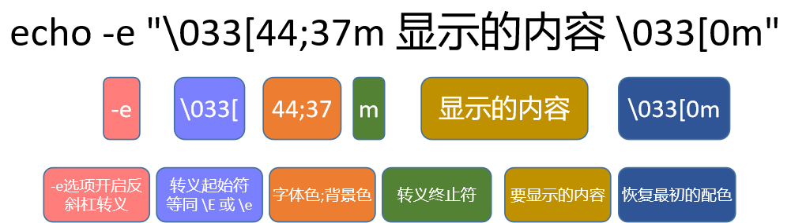
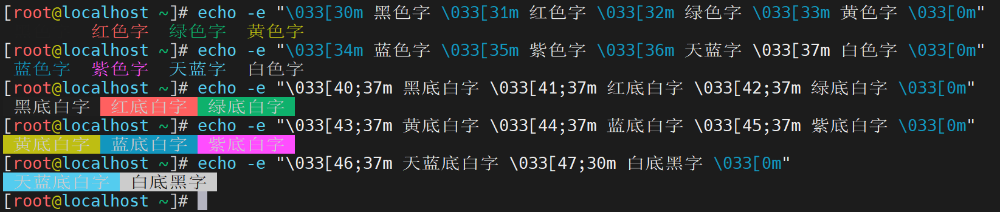
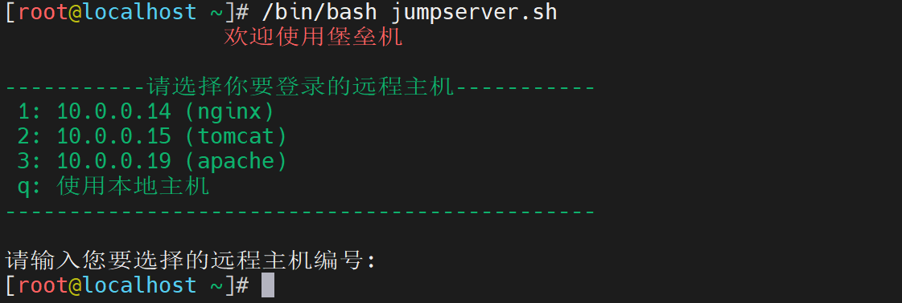

# 1 内容格式化

## 1.1 输出格式化

### 1.1.1 echo解读

学习目标

这一节，我们从 基础知识、简单实践、小结、三个方面来学习。

**基础知识**

命令简介

```powershell
echo命令的功能是将内容输出到默认显示设备，一般起到一个提示的作用。
```

```powershell
OPTIONS：
-n	不要在最后自动换行
-e	若字符串中出现以下字符，则特别加以处理，而不会将它当成一般文字输出:

转义字符
\a		发出警告声;
\b		删除前一个字符;
\c		最后不加上换行符号;
\f		换行但光标仍旧停留在原来的位置;
\n		换行且光标移至行首;
\r		光标移至行首，但不换行;
\t		插入tab;
\v		与\f相同;
\		插入\字符;
\0nnn	打印nnn(八进制)所代表的ASCII字符;  备注：数字0  不要理解成字母o
\xNN  	打印NN(十六进制)所代表的ASCII字符;

-–help	显示帮助
-–version显示版本信息
```


**简单实践**

实践1 - 信息的输出

```powershell
echo后边用单引号包围要添加的内容
[root@localhost ~]# echo 'hello world' >> /tmp/hello.txt
[root@localhost ~]# cat /tmp/hello.txt
hello world
```

实践2 - 引号信息输出

```powershell
通过引号的错开实现引号的输出
[root@localhost ~]# echo "I'm a king of the world."
I'm a king of the world.
```

实践3 - 特殊符号的输出

```powershell
使用 -e 选项启用转义字符的解析
[root@localhost ~]# echo -e "The 2021 State of DevOps Report\n\t- is here"
The 2021 State of DevOps Report
        - is here
```

实践4 - 内容的拼接

```powershell
使用 -n 选项启用信息输出不换行
[root@localhost ~]# echo -n hello;echo world
helloworld
```

**小结**

```

```

### 1.1.2 字体颜色

学习目标

这一节，我们从 基础知识、简单实践、小结 三个方面来学习。

**基础知识**

场景需求

```powershell
echo本质上是将信息内容输出到当前的屏幕终端，如果只是一种颜色的话，可能导致视觉疲劳。所以，一般情况下，我们在显示信息的时候，往往会通过颜色的方式实现特定内容的颜色高亮显示。

echo命令可以修改字体类型，字体背景色以及字体颜色，转义序列\033可以用于改变字体属性。
```

格式解读

```powershell
格式如下：
	echo -e "\033[字背景颜色;文字颜色m字符串\033[0m"
	echo -e "\033[41;36m 显示的内容 \033[0m"
```



颜色分类

|  色彩  |  黑  |  红  |  绿  |  黄  |  蓝  |  紫  |  青  |  灰  |
| :----: | :--: | :--: | :--: | :--: | :--: | :--: | :--: | :--: |
| 字体色 |  30  |  31  |  32  |  33  |  34  |  35  |  36  |  37  |
| 背景色 |  40  |  41  |  42  |  43  |  44  |  45  |  46  |  47  |

结束控制符

```powershell
最后面控制选项说明
　　\033[0m 关闭所有属性		　　\033[1m 设置高亮度		　　\033[4m 下划线
　　\033[5m 闪烁				　\033[7m 反显				 \033[8m 消隐
注意：
	\033 是八进制的ESCAPE字符，我们可以用 \e 来代替
```


**简单实践**

实践1 - 字体颜色和背景颜色

```powershell
字体颜色示例
echo -e "\033[30m 黑色字 \033[31m 红色字 \033[32m 绿色字 \033[33m 黄色字 \033[0m"
echo -e "\033[34m 蓝色字 \033[35m 紫色字 \033[36m 天蓝字 \033[37m 白色字 \033[0m"
　
背景颜色示例
echo -e "\033[40;37m 黑底白字 \033[41;37m 红底白字 \033[42;37m 绿底白字 \033[0m"
echo -e "\033[43;37m 黄底白字 \033[44;37m 蓝底白字 \033[45;37m 紫底白字 \033[0m"
echo -e "\033[46;37m 天蓝底白字 \033[47;30m 白底黑字 \033[0m"
```



实践2 - 信息颜色显示

```powershell
定制堡垒机的测试页面脚本
[root@localhost ~]# cat simple_jumpserver.sh
#!/bin/bash
# 功能：定制堡垒机的展示页面
# 作者：wangshuji
# 版本：V0.1
# 联系：superopsmsb.com

echo -e "\e[31m \t\t 欢迎使用堡垒机"

echo -e "\e[32m
-----------请选择你要登录的远程主机-----------
 1: 10.0.0.14 (nginx)
 2: 10.0.0.15 (tomcat)
 3: 10.0.0.19 (apache)
 q: 使用本地主机
----------------------------------------------
"'\033[0m'
echo -e "请输入您要选择的远程主机编号: "
```



**小结** 

```

```

### 1.1.3 printf格式化

学习目标

这一节，我们从 基础知识、简单实践、小结 三个方面来学习。

**基础知识**

场景需求

```powershell
	虽然我们能够通过 echo的方式实现信息某种程度的格式化输出，但是很多信息的输出偏重于手工的干预，效率太慢。我们需要一种功能更强大、效率更高的格式化手段。
	-- printf
```

printf简介

```powershell
	printf 命令模仿 C 程序库（library）里的 printf() 程序。由于 printf 由 POSIX 标准所定义，因此使用 printf 的脚本比使用 echo 移植性好。
	printf 使用引用文本或空格分隔的参数，外面可以在 printf 中使用格式化字符串，还可以制定字符串的宽度、左右对齐方式等。默认 printf 不会像 echo 自动添加换行符，我们可以手动添加 \n。
```

基本语法

```powershell
查看帮助
[root@localhost ~]# help printf
printf: printf [-v var] 格式 [参数]
```


```powershell
格式化替换符
    %s 		字符串
    %d,%i 	十进制整数
    %f 		浮点格式
    %c 		ASCII字符，即显示对应参数的第一个字符
    %b 		相对应的参数中包含转义字符时，可以使用此替换符进行替换，对应的转义字符会被转义
    %o 		八进制值
    %u 		不带正负号的十进制值
    %x 		十六进制值（a-f）
    %X 		十六进制值（A-F）
    %% 		表示%本身
```

```powershell
格式化转义符号
    \a		警告字符，通常为ASCII的BEL字符
    \b		后退
    \c		抑制（不显示）输出结果中任何结尾的换行字符
    \f		换页（formfeed）
    \n		换行
    \r		回车（Carriage return）
    \t		水平制表符
    \v		垂直制表符
    \\		一个字面上的反斜杠字符
    \ddd	表示1到3位数八进制值的字符。仅在格式字符串中有效
    \0ddd	表示1到3位的八进制值字符
```

```powershell
格式化字符解释
–		将字段里已格式化的值向左对齐
空格	   在正值前置一个空格,在负值前置一个负号
+		总是在数值之前放置一个正号或负号,即便是正值也是
#		下列形式选择其一:
			%o有一个前置的o;					%x与%X分别前置的0x与0X；
			%e,%E与%f总是在结果中有一个小数点;  %g与%G为没有结尾的零。
0		以零填补输出,而非空白.这仅发生在字段宽度大于转换后的情况
```


**简单实践**

实践1 - 命令演示

```powershell
普通echo命令演示换行信息和非换行信息
[root@localhost ~]# echo "Hello, Shell Base"
Hello, Shell Base
[root@localhost ~]# echo -n "Hello, Shell Base"
Hello, Shell Base[root@localhost ~]#

printf命令演示换行信息和非换行信息
[root@localhost ~]# printf "Hello, Shell Base\n"
Hello, Shell Base
[root@localhost ~]# printf "Hello, Shell Base"
Hello, Shell Base[root@localhost ~]#
```

实践2 - 替换符号演示

```powershell
基本信息演示 - 单引号和双引号效果一样
[root@localhost ~]# printf "姓名:%s, 语文:%d, 数学:%d\n" "张三" 89 98
姓名:张三, 语文:89, 数学:98
[root@localhost ~]# printf '姓名:%s, 语文:%d, 数学:%d\n' "张三" 89 98
姓名:张三, 语文:89, 数学:98
注意：
	相关信息会按照顺序依次替换到格式化的替换符位置
```

```powershell
数字格式展示
[root@localhost ~]# printf '姓名:%s, 身高:%f米, 体重:%f公斤\n' "张三" 1.7 66
姓名:张三, 身高:1.700000米, 体重:66.000000公斤
[root@localhost ~]# printf '姓名:%s, 身高:%.2f米, 体重:%.1f公斤\n' "张三" 1.7 66
姓名:张三, 身高:1.70米, 体重:66.0公斤
注意：
	通过 %.nf，n代表小数点后面的可显示的位数。
```

实践3 - 简单格式化

```powershell
() 用于信息的批量化显示
[root@localhost ~]# printf "(%d %s)\n" 1 张三 2 李四 3 王五
(1 张三)
(2 李四)
(3 王五)

printf默认不携带最后的换行
[root@localhost ~]# printf "(%d %s)  " 1 张三 2 李四 3 王五
(1 张三)  (2 李四)  (3 王五)  [root@localhost ~]#

借助于echo的功能实现换行的效果
[root@localhost ~]# printf "(%d %s)  " 1 张三 2 李四 3 王五; echo
(1 张三)  (2 李四)  (3 王五)
```

实践4 - 格式化补充

```powershell
%s字符串格式化
[root@localhost ~]# printf '姓名:%-10s语文:%d, 数学:%d\n' "张三" 89 98 "李四" 87 97
姓名:张三    语文:89, 数学:98
姓名:李四    语文:87, 数学:97
注意：
	%-10s，代表信息后面携带10个空格，便于格式化
```

```powershell
%d数字格式补全
[root@localhost ~]# printf "%5d %s\n" 1 张三
    1 张三
[root@localhost ~]# printf "%05d %s\n" 1 张三
00001 张三
[root@localhost ~]# printf "%05d %s\n" 100 张四
00100 张四
注意：
	0的作用就是不用空格补全，而是用0填充，实现格式化
```

实践5 - 环境变量的使用

```powershell
定制环境变量
[root@localhost ~]# VAR1=hello; VAR2=shell

颜色显示
[root@localhost ~]# printf "\033[32m%s \033[31m%s\033[0m\n" $VAR1 $VAR2
hello shell
```


**小结**

```

```

### 1.1.4 综合案例

学习目标

这一节，我们从 java部署、脚本定制、小结 三个方面来学习。

**java部署**

准备工作

```powershell
创建目录
mkdir /data/{softs,server} -p
cd /data/softs

下载java或者上传java
ls /data/softs
安装java
tar xf jdk-8u121-linux-x64.tar.gz -C /data/server
cd /data/server/
ln -s jdk1.8.0_121 java
```

```powershell
配置java环境变量
echo 'export JAVA_HOME=/data/server/java' >> /etc/profile.d/java.sh
echo 'export PATH=$JAVA_HOME/bin:$PATH' >> /etc/profile.d/java.sh
source /etc/profile.d/java.sh

检查效果
java -version
```

```powershell
手工清理环境
rm -f /etc/profile.d/java.sh
rm -rf /data/server/java /data/server/jdk1.8.0_121
```

**信息显示**

定制java环境部署脚本

```powershell
[root@localhost ~]# cat /data/scripts/java_install.sh
#!/bin/bash
# 功能: java环境的定制
# 版本：v0.1
# 作者：书记
# 联系：www.superopsmsb.com

# 定制基本信息
JAVA_SOFT='jdk-8u121-linux-x64.tar.gz'
JAVA_DIR='jdk1.8.0_121'
JAVA_NAME='java'
SERVER_HOME='/data/server'
SOFTS_HOME='/data/softs'
RED="echo -e \E[1;31m"
END="\E[0m"

# 安装软件
tar xf $SOFTS_HOME/$JAVA_SOFT -C $SERVER_HOME
ln -s $SERVER_HOME/$JAVA_DIR $SERVER_HOME/$JAVA_NAME

# 定制环境变量
cat > /etc/profile.d/java.sh << EOF
export JAVA_HOME=$SERVER_HOME/$JAVA_NAME
export PATH=\$JAVA_HOME/bin:\$PATH
EOF

# 加载java环境变量文件
source /etc/profile.d/java.sh

# 检查效果
java -version > /tmp/txt 2>&1
java_version=$(grep version /tmp/txt  | cut -d '"' -f2)
runtime_version=$(grep Runtime /tmp/txt  | cut -d ' ' -f6 | cut -d ")" -f1)
jvm_type=$(grep VM /tmp/txt | cut -d " " -f8)

# 信息显示
$RED---------$JAVA_NAME软件运行情况---------$END
printf "\033[32m%s:\033[33m%s\033[0m\n" "java软件版本" $java_version
printf "\033[32m%s:\033[33m%s\033[0m\n" "java运行时环境版本" $runtime_version
printf "\033[32m%s:\033[33m%s\033[0m\n" "jvm运行模式" $jvm_type
$RED----------------------------------$END
```


**小结** 

```

```


# 2 脚本交互

## 2.1 基础知识

### 2.1.1 shell登录解读

学习目标

这一节，我们从 基础知识、简单实践、小结 三个方面来学习。

**基础知识**

shell配置文件

```powershell
系统级别生效配置文件
	/etc/profile
		系统的每个用户设置环境信息,当用户第一次登录时,该文件被执行
    /etc/profile.d/*.sh
    	被/etc/profile文件调用，执行当前目录下所有的文件中关于shell的设置
    /etc/bashrc
    	为每一个运行bash shell的用户执行此文件.当bash shell被打开时,该文件被读取。
用户级别生效配置文件
	~/.bash_profile
		设定用户专用的shell信息,当用户登录时,该文件仅仅执行一次
	~/.bashrc
		该文件包含用户专用的bash信息,当登录时以及每次打开新的shell时,该文件被读取
```

```powershell
用户退出生效配置文件
	~/.bash_logout: 当每次退出系统(退出bash shell)时,执行该文件.
    ~/.bash_history: 
    	用户登录时自动读取其中的内容并加载到内存hiatory记录中
    	logout时将内存中的history记录写入该文件中
```

shell的登录方式

```powershell
交互式登录
    方法1：密码登录
        直接通过终端输入账号密码登录
        复制终端
    方法2：su 变更shell操作用户的身份
        su - 用户名
        超级用户除外，需要键入该使用者的密码。
非交互式登录
	方法1：脚本执行
	方法2：su 用户名
```

```powershell
登录shell的文件生效流程
	/etc/profile.d/*.sh
		-> /etc/profile
			-> /etc/bashrc
				-> ~/.bashrc
					-> ~/.bash_profile
非登录shell的文件生效流程
	/etc/profile.d/*.sh
		-> /etc/bashrc
			-> ~/.bashrc 
注意：
	若多配置文件中设置相同的变量，则后面配置文件中变量的值会覆盖前面配置文件中同一变量的值。
```

```powershell
su的相关参数
	-：当前用户不仅切换为指定用户的身份，同时所用的工作环境也切换为此用户的环境。
    -l：同 - 的使用类似，完整切换工作环境，后面需要添加欲切换的使用者账号。
    -p：表示切换为指定用户的身份，但不改变当前的工作环境（不使用切换用户的配置文件）。
    -m：和 -p 一样；
    -c 命令：仅切换用户执行一次命令，执行后自动切换回来，该选项后通常会带有要执行的命令。
```

配置文件修改后生效的方法

```powershell
修改profile和bashrc文件后需生效两种方法
    1. 重新启动shell进程
    2. source|. 配置文件

注意:
	source 会在当前shell中执行脚本,所有一般只用于执行置文件,或在脚本中调用另一个脚本的场景
```


**简单实践**

准备工作

```powershell
为所有的shell相关的配置文件添加关键信息
echo "echo '1 - /etc/profile'" >> /etc/profile
echo "echo '2 - /etc/profile.d/2.sh'" >> /etc/profile.d/2.sh
echo "echo '3 - /etc/bashrc'" >> /etc/bashrc
echo "echo '4 - ~/.bash_profile'" >> ~/.bash_profile
echo "echo '5 - ~/.bashrc'" >> ~/.bashrc
```

非登录效果

```powershell
[root@localhost ~]# su - python
上一次登录：五 6月 10 16:16:37 CST 2022pts/1 上
2 - /etc/profile.d/2.sh
1 - /etc/profile
3 - /etc/bashrc
[python@localhost ~]$ su root
密码：
2 - /etc/profile.d/2.sh
3 - /etc/bashrc
5 - ~/.bashrc
[root@localhost /home/python]# exit
exit
```

登录查看效果

```powershell
切换标准root用户
[python@localhost ~]$ su - root
密码：
上一次登录：日 6月 12 12:41:11 CST 2022pts/2 上
2 - /etc/profile.d/2.sh
1 - /etc/profile
3 - /etc/bashrc
5 - ~/.bashrc
4 - ~/.bash_profile

新建终端效果
Last login: Sun Jun 12 12:35:59 2022 from 10.0.0.1
2 - /etc/profile.d/2.sh
1 - /etc/profile
3 - /etc/bashrc
5 - ~/.bashrc
4 - ~/.bash_profile
[root@localhost ~]#
```

清理环境

```powershell
将刚才创建的5条命令执行反向操作
[root@localhost ~]# vim ...
	
退出当前shell环境
[root@localhost ~]# exit
登出
Session stopped
    - Press <return> to exit tab
    - Press R to restart session
    - Press S to save terminal output to file
```


**小结**

```

```

### 2.1.2 子shell基础

学习目标

这一节，我们从 基础知识、简单实践、小结 三个方面来学习。

**基础知识**

场景

```powershell
	之前我们对于环境变量在多个shell环境中的应用进行了学习，那种操作量比较大。对于一些临时性的场景，我们在临时性的环境中，做一些操作，但是不希望对外部的环境造成影响，这个时候我们就涉及到了一些临时shell环境的实践。
	关于临时shell环境的创建，我们可以借助于()方法来实现。
```

临时shell

```powershell
临时shell环境 - 启动子shell
	(命令列表)，在子shell中执行命令列表，退出子shell后,不影响后续环境操作。
临时shell环境 - 不启动子shell
	{命令列表}, 在当前shell中运行命令列表,会影响当前shell环境的后续操作。
```

**简单实践**

() 实践

```powershell
查看当前shell的pid
[root@localhost ~]#  echo $BASHPID
11413
[root@localhost ~]# ps aux | grep bash
root      11413  0.0  0.0 116724  3160 pts/0    Ss   12:54   0:00 -bash
root      11660  0.0  0.0 112824   984 pts/0    R+   14:49   0:00 grep --color=auto bash

查看子shell的pid
[root@localhost ~]# (echo $BASHPID; echo haha)
11661
haha
[root@localhost ~]# (echo $BASHPID; sleep 30)
11711

另开一个终端查看效果
[root@localhost ~]# pstree | grep sleep
        |-sshd-+-sshd---bash---bash---sleep
结果显示：
	在一个shell内部开启了另一个shell
```

```powershell
子shell的操作不影响当前shell环境
[root@localhost ~]# (export SUBSHELL=subshell)
[root@localhost ~]# echo $SUBSHELL

[root@localhost ~]#

子shell中，查看命令执行效果
[root@localhost ~]# (cd /tmp;pwd)
/tmp
[root@localhost ~]# pwd
/root
```

{} 实践

```powershell
查看当前shell的进程id号
[root@localhost ~]# echo $BASHPID
11676

在{}环境中查看当前shell的进程id号
[root@localhost ~]# { echo $BASHPID; }
11676
```

```powershell
{} 环境中，操作命令会影响当前的shell环境
[root@localhost ~]# { export SUBSHELL=subshell; }
[root@localhost ~]# echo $SUBSHELL
subshell

子shell中，查看命令执行效果
[root@localhost ~]# { cd /tmp;pwd; }
/tmp
[root@localhost /tmp]# pwd
/tmp
```


**小结**

```

```

### 2.1.3 子shell实践

学习目标

这一节，我们从 CA创建、脚本实践、小结 三个方面来学习。

**CA创建**

umask基础

```powershell
umask 解读
	umask指的是文件权限默认的掩码，默认的值是022，也就是说
		默认创建的目录是777-022=755
		默认创建的文件是666-022-544
```

```powershell
[root@localhost /data/scripts]# umask
0022
[root@localhost /data/scripts]# mkdir dir
[root@localhost /data/scripts]# touch file
[root@localhost /data/scripts]# ll
总用量 0
drwxr-xr-x 2 root root 6 6月  12 15:18 dir
-rw-r--r-- 1 root root 0 6月  12 15:18 file
```

CA手工实践

```powershell
创建临时目录
[root@localhost ~]# mkdir /tmp/CA; cd /tmp/CA

生成私钥
[root@localhost /tmp/CA]# (umask 077;openssl genrsa -out ca.key 2048)
Generating RSA private key, 2048 bit long modulus
.............................................................+++
..................+++
e is 65537 (0x10001)
[root@localhost /tmp/CA]# ll
总用量 4
-rw------- 1 root root 1679 6月  12 15:35 ca.key

生成证书
[root@localhost /tmp/CA]# openssl req -new -x509 -key ca.key -out ca.crt -days 3650
You are about to be asked to enter information that will be incorporated
into your certificate request.
What you are about to enter is what is called a Distinguished Name or a DN.
There are quite a few fields but you can leave some blank
For some fields there will be a default value,
If you enter '.', the field will be left blank.
-----
Country Name (2 letter code) [XX]:CN
State or Province Name (full name) []:BJ
Locality Name (eg, city) [Default City]:BJ
Organization Name (eg, company) [Default Company Ltd]:BJ
Organizational Unit Name (eg, section) []:BJ
Common Name (eg, your name or your server's hostname) []:www.example.com
Email Address []:bj.example.com
```

```powershell
查看生成的文件
[root@localhost /tmp/CA]# ls
ca.crt  ca.key

查看证书信息
[root@localhost /tmp/CA]# openssl x509 -in ca.crt -noout -text
Certificate:
    Data:
        Version: 3 (0x2)
        Serial Number:
            d6:25:a6:0e:be:98:ec:48
    Signature Algorithm: sha256WithRSAEncryption
        Issuer: C=CN, ST=BJ, L=BJ, O=BJ, OU=BJ, CN=www.example.com/emailAddress=bj.example.com
```

**脚本实践**

创建脚本

```powershell
查看脚本定制内容
[root@localhost /data/scripts]# cat ca_create.sh
#!/bin/bash
# 功能: 创建自建CA
# 版本：v0.1
# 作者：书记
# 联系：www.superopsmsb.com

# 定制普通环境变量
CA_DIR="tls"
CA_DOMAIN="$1"
CA_KEY='tls.key'
CA_CRT='tls.crt'

# 创建CA证书
mkdir ${CA_DIR}
(umask 077; cd ${CA_DIR}; openssl genrsa -out tls.key 2048)
openssl req -new -x509 -key ${CA_DIR}/${CA_KEY} -out ${CA_DIR}/${CA_CRT} -subj "/CN=${CA_DOMAIN}" -days 365
```

```powershell
执行脚本
[root@localhost /data/scripts]# /bin/bash ca_create.sh www.example.com
Generating RSA private key, 2048 bit long modulus
....+++
.......................................+++
e is 65537 (0x10001)
[root@localhost /data/scripts]# ls tls/
tls.crt  tls.key

确认效果
[root@localhost /data/scripts]# openssl x509 -in tls/tls.crt -noout -text
Certificate:
    Data:
        Version: 3 (0x2)
        Serial Number:
            e1:8b:55:da:65:04:fc:c7
    Signature Algorithm: sha256WithRSAEncryption
        Issuer: CN=www.example.com
```


**小结**

```

```

## 2.2 脚本外交互

### 2.2.1 read基础

学习目标

这一节，我们从 基础知识、简单实践、小结 三个方面来学习。

**基础知识**

场景需求

```powershell
	虽然我们可以通过脚本传参的方式实现脚本一定程度的灵活性，但是生产工作中，有很多更加灵活的场景，需要我们在脚本运行的过程中，传递一些用户定制的具体信息。这个时候，普通的脚本参数就无法满足需求了。
	read 命令可以实现我们脚本内外的信息自由传递功能。
```

命令简介

```powershell
	read命令是用于从终端或者文件中读取输入的内建命令，read命令读取整行输入，每行末尾的换行符不被读入。在read命令后面，如果没有指定变量名，读取的数据将被自动赋值给特定的变量REPLY。常用方式如下：
```

```powershell
    read				从标准输入读取一行并赋值给特定变量REPLY。
    read answer			从标准输入读取输入并赋值给变量answer。
    read first last		从标准输入读取内容，将第一个单词放到first中，其他内容放在last中。
    read -s passwd		从标准输入读取内容，写入passwd，不输入效果
    read -n n name		从标准输入读取内容，截取n个字符，写入name，超过n个字符，直接退出
    read -p "prompt"	打印提示，等待输入，并将输入存储在REPLY中。
    read -r line		允许输入包含反斜杠。
    read -t second		指定超时时间,默认是秒，整数
    read -d sper		指定输入信息的截止符号
```


**简单实践**

命令操作

```powershell
交互式接收用户信息
[root@localhost ~]# read
nihao-answer

接收用户输入给一个临时变量
[root@localhost ~]# read answer
nihao-answer
[root@localhost ~]# echo $answer
nihao-answer

接收多个信息，按照顺序交给不同的临时变量
[root@localhost ~]# read first last
first-1 last-2 end-3
[root@localhost ~]# echo $first
first-1
[root@localhost ~]# echo $last
last-2 end-3
```

实践2-静默显示

```powershell
显式接收用户输入信息
[root@localhost ~]# read password
123456
[root@localhost ~]# echo $password
123456

隐式接收用户输入信息
[root@localhost ~]# read -s password
[root@localhost ~]# echo $password
abcdefg
```

实践3-提示用户输入信息

```powershell
通过 -p 参数提示用户输入的信心
[root@localhost ~]# read -p "请输入登录用户名: " user
请输入登录用户名: root
[root@localhost ~]# echo $user
root
```

实践4-限制用户输入信息

```powershell
[root@localhost ~]# read -n 6 -p "sss: " aaa
sss: 123456[root@localhost ~]# read -n 6 -p "只接收6个字符，超过自动退出: " string
只接收6个字符，超过自动退出: 123456[root@localhost ~]#
[root@localhost ~]# echo $string
123456
注意：
	-p + -s 的组合会导致不会自动换行，可以结合 echo的方式实现换行
```

实践5-等待时长

```powershell
[root@localhost ~]# read -t 5 -p "等待5秒后自动退出! " second
等待5秒后自动退出! 4
[root@localhost ~]# echo $second
4
[root@localhost ~]# read -t 5 -p "等待5秒后自动退出! " second
等待5秒后自动退出! [root@localhost ~]#
```


**小结**

```

```

### 2.2.2 案例实践

学习目标

这一节，我们从 登录模拟、堡垒机实践、小结 三个方面来学习。

**登录模拟**

需求

```
模拟shell终端工具的登录，功能过程如下：
	请输入用户名: 
	请输入密码：
	您输入的用户名和密码是： xxx
```

脚本实践

```powershell
[root@localhost ~]# cat simple_login.sh
#!/bin/bash
# 功能: 模拟shell登录
# 版本：v0.1
# 作者：书记
# 联系：www.superopsmsb.com

# 定制命令变量
OS_INFO=$(cat /etc/redhat-release)
KERNEL_INFO=$(uname -r)
OS_ARCH=$(uname -m)
HOSTNAME=$(hostname)

# 清屏
clear

# 输出提示信息
echo -e "\e[32m${OS_INFO} \e[0m"
echo -e "\e[32mKernel ${KERNEL_INFO} on an ${OS_ARCH} \e[0m"
echo "---------------------------------"
# 交互输入登陆信息
read -p "请输入用户名：" account
read -s -t30 -p "请输入登录密码：" password
echo
echo "---------------------------------"
# 输出用户输入信息
printf "您输入的用户名：\e[31m%s\e[0m您输入的密码：\e[31m%s\e[0m\n" ${account} ${password}
```

```powershell
脚本执行效果
[root@10 ~]# /bin/bash simple_login.sh
CentOS Linux release 7.9.2009 (Core)
Kernel 3.10.0-1160.el7.x86_64 on an x86_64
---------------------------------
请输入用户名：root
请输入登录密码：
---------------------------------
您输入的用户名：root您输入的密码：123456
```


**堡垒机实践**

功能需求

```
模拟堡垒机的登录，功能过程如下：
	请选择要登录的主机
	请输入用户名: 
	使用指定的用户连接远程主机
```

脚本实践

```powershell
[root@localhost ~]# cat simple_jumpserver.sh
#!/bin/bash
# 功能：定制堡垒机的展示页面
# 版本：v0.2
# 作者：书记
# 联系：www.superopsmsb.com

# 堡垒机的信息提示
echo -e "\e[31m \t\t 欢迎使用堡垒机"

echo -e "\e[32m
-----------请选择你要登录的远程主机-----------
 1: 10.0.0.14 (nginx)
 2: 10.0.0.15 (tomcat)
 3: 10.0.0.19 (apache)
 q: 使用本地主机
----------------------------------------------
"'\033[0m'

# 由于暂时没有学习条件判断，所以暂时选择 q
read -p "请输入您要选择的远程主机编号: " host_index
read -p "请输入登录本地主机的用户名: " user

# 远程连接主机
ssh $user@localhost
```

```powershell
脚本执行效果
[root@10 ~]# /bin/bash simple_jumpserver.sh
                 欢迎使用堡垒机

-----------请选择你要登录的远程主机-----------
 1: 10.0.0.14 (nginx)
 2: 10.0.0.15 (tomcat)
 3: 10.0.0.19 (apache)
 q: 使用本地主机
----------------------------------------------

请输入您要选择的远程主机编号: p
请输入登录本地主机的用户名: root
The authenticity of host 'localhost (::1)' can't be established.
ECDSA key fingerprint is SHA256:XUJsgk4cTORxdcswxIKBGFgrrqFQzpHmKnRRV6ABMk4.
ECDSA key fingerprint is MD5:71:74:46:50:3f:40:4e:af:ad:d3:0c:de:2c:fc:30:c0.
Are you sure you want to continue connecting (yes/no)? yes
Warning: Permanently added 'localhost' (ECDSA) to the list of known hosts.
root@localhost's password:
Last login: Mon Jun 13 12:19:34 2022 from 10.0.0.1
[root@10 ~]# exit
登出
```


**小结** 

```

```


# 3 表达式

## 3.1 运算符

### 3.1.1 运算符基础

学习目标

这一节，我们从 基础知识、赋值运算、小结 三个方面来学习。

**基础知识**

需求

```powershell
	根据我们之前的学习，通过现有的知识内容可以完成一个简单的功能操作，即使通过所谓的脚本参数可以实现一个脚本在多个数据值的情况下实现不同的结果。但是问题是，目前脚本本身还没有实现灵活的机制。
	所谓脚本级别的灵活机制，说的是脚本内部能够实现数据的操作和判断。而数据的操作也是判断过程中必须的一个条件组成部分。所以数据的操作是脚本的一个核心内容。
```

数据操作

```powershell
	关于shell可以实施的数据操作，按照不同的业务场景主要可以分为如下两个方面：
	运算符 - 数据值之间的操作
		赋值运算
			- 结果值输出
			- 示例： =、*=、/=、%=、+=、-=、<<=、>>=、&=、^=、|=等
		二元运算 
			- 数据值操作
			- 示例： +、-、*、/、%等
		高阶运算
			- 更高一级的数学运算
			- 示例：**、^、++、--、
		其他运算 
			- 其他运算操作
			- 示例：<<、>>等
注意：
	这些所谓的运算符一般很难单独来使用，都需要结合计算表达式来实现相应的效果
```

```powershell
	表达式 - 数据值在特定场景的运算符操作
		计算表达式
			- 将多个值的运算操作执行起来
			- 示例：bc、let、expr、$(())等
		测试表达式 
			- 判断结果值是否满足需求
			- 示例：test、[]等
		逻辑表达式 
			- 多条件的多场景组合
			- 示例：&&、||、and、or、not、&、|等
		比较表达式 
			- 判断数据之间的适配关系
			- 示例：-f|d|s、-r|x|w、-e、-n、==、!=、>、<、<=、>=等
		三元表达式
			- 多逻辑的简单计算表达式
			- 示例：expr?expr:expr
		集合表达式 
			- 表达式之间的关联关系
			- 示例：expr1 , expr2、 [[ ]]、[ -a|o ]、[ ! ]等
```


**赋值运算**

基础知识

```
	所谓的赋值运算，其实指的就是将一个值赋予一个变量名，虽然我们在变量一节中对于该知识点进行了一些基础性的操作，但是赋值运算仍然还有一些其他的表现样式，尤其是关于命令计算相关的。
```

简单的赋值操作

```powershell
为变量赋值
[root@localhost ~]# echo $num $string

[root@localhost ~]# num=123 string=abc
[root@localhost ~]# echo $num $string
123 abc
```

```powershell
赋值时候定制属性
[root@localhost ~]# declare stringnum=123
[root@localhost ~]# declare string=nihao
[root@localhost ~]# echo $stringnum $string
123 nihao
[root@localhost ~]# declare -i num=654
[root@localhost ~]# declare -i num2=aaa
[root@localhost ~]# echo $num $num2
654 0
```

```powershell
获取特定数据
[root@localhost ~]# myuser=$(whoami)
[root@localhost ~]# echo $myuser
root
[root@localhost ~]# kernel_info=$(cat /etc/redhat-release)
[root@localhost ~]# echo $kernel_info
CentOS Linux release 7.9.2009 (Core)
```


**小结**

```

```


### 3.1.2 简单计算

学习目标

这一节，我们从 $[]、let、(())、$(())、小结 五个方面来学习。

**$[]**

简介

```powershell
	$[]方法，常用于整数计算场景，适合不太复杂的计算，运算结果是小数的也会自动取整。
	后面的几种也是一样
```

格式

```powershell
方法1：
	$[计算表达式]
方法2：
	a=$[变量名a+1]

注意：
	这里的表达式可以不是一个整体
```

简单示例

```powershell
简单运算
[root@localhost ~]# echo $[100/5]
20
[root@localhost ~]# echo $[ 2 + 5 ]
7

变量参与运算
[root@localhost ~]# a=6
[root@localhost ~]# a=$[a+1]
[root@localhost ~]# echo $a
7

运算结果取整
[root@localhost ~]# echo $[100/3]
33
```


**let**

简介

```powershell
	let是另外一种相对来说比较简单的数学运算符号了
```

格式

```powershell
let	变量名a=变量名a+1

注意：
	表达式必须是一个整体，中间不能出现空格等特殊字符
```

简单示例

```powershell
简单运算
[root@localhost ~]# i=1
[root@localhost ~]# let i=i+7
[root@localhost ~]# echo $i
8

let表达式必须是一个整体
[root@localhost ~]# let i = i * 2
bash: let: =: 语法错误: 期待操作数 （错误符号是 "="）
[root@localhost ~]# let i=i * 2
bash: let: anaconda-ks.cfg: 语法错误: 无效的算术运算符 （错误符号是 ".cfg"）
[root@localhost ~]# let i=i*2
[root@localhost ~]# echo $i
16
```

**(())**

简介

```powershell
(())的操作与let基本一致，相当于let替换成了 (())
```

格式

```powershell
((变量计算表达式))
注意：
	对于 $(())中间的表达式，可以不是一个整体，不受空格的限制
```

简单实践

```powershell
[root@localhost ~]# num1=34
[root@localhost ~]# ((num2=num1+34))
[root@localhost ~]# echo $num2
68
```

**$(())**

简介

```powershell
$(())的操作，相当于 (()) + echo $变量名 的组合
```

格式

```powershell
echo $((变量计算表达式))
注意：
	对于 $(())中间的表达式，可以不是一个整体，不受空格的限制
```

简单实践

```powershell
[root@localhost ~]# num1=34
[root@localhost ~]# echo $((num2=num1+34))
68
```


**小结**

```

```

### 3.1.3 赋值运算进阶

学习目标

这一节，我们从 二元运算、赋值运算、小结、三个方面来学习。

**二元运算**

简介

```powershell
	所谓的二元运算，指的是 多个数字进行+-*/%等运算
```

简单实践

```powershell
加法运算
[root@localhost ~]# echo $(( 4 + 4 ))
8
[root@localhost ~]# num1=3 num2=4
[root@localhost ~]# echo $(($num1 + $num2))
7

减法运算
[root@localhost ~]# echo $((8-2))
6
[root@localhost ~]# echo $(($num2-$num1))
1

乘法运算
[root@localhost ~]# echo $((8*2))
16
[root@localhost ~]# echo $(($num2*$num1))
12

除法运算
[root@localhost ~]# echo $((8/2))
4
[root@localhost ~]# echo $(($num2/$num1))
1

取余运算
[root@localhost ~]# echo $((8%3))
2
[root@localhost ~]# echo $(($num2%$num1))
1
```

案例实践-小学计算题

```powershell
案例需求：鸡兔同笼，共有30个头，88只脚。求笼中鸡兔各有多少只？
```

```powershell
查看脚本内容
[root@localhost ~]# cat count_head_feet.sh
#!/bin/bash
# 功能：小学计算题目
# 版本：v0.1
# 作者：书记
# 联系：www.superopsmsb.com

# 定制普通变量
head="$1"
feet="$2"

# 计算逻辑
# 每个头至少两只脚，多出的脚都是兔子的
rabbit_num=$(( ($feet - $head - $head) / 2))
chick_num=$[ $head - $rabbit_num ]

# 结果输出
echo -e "\e[31m\t鸡和兔的数量\e[0m"
echo -e "\e[32m============================"
echo "鸡的数量: ${chick_num}"
echo "兔的数量：${rabbit_num}"
echo -e "============================\e[0m"
```

```powershell
脚本执行效果
[root@localhost ~]# /bin/bash count_head_feet.sh 30 88
        鸡和兔的数量
============================
鸡的数量: 16
兔的数量：14
============================
```

**赋值运算**

简介

```powershell
	这里的赋值运算，是一种进阶版本的复制操作，常见的样式如下：
		样式1：+=、-=、*=、/=
			- 在自身的基础上进行二元运算，结果值还是自己
		样式2：++、--
			- 在自身的基础上进行递增和递减操作，结果值还是自己
```

简单实践

```powershell
+=运算
[root@localhost ~]# num1=6
[root@localhost ~]# let value+=$num1    # 相当于 let value=value+$num1
[root@localhost ~]# echo $value
6

-=运算
[root@localhost ~]# let value-=2    # 相当于 let value=value-2
[root@localhost ~]# echo $value
4

*=运算
[root@localhost ~]# let value*=2    # 相当于 let value=value*2
[root@localhost ~]# echo $value
8

/=运算
[root@localhost ~]# let value/=2    # 相当于 let value=value/2
[root@localhost ~]# echo $value
4
```

```powershell
i++运算
[root@localhost ~]# value=9
[root@localhost ~]# let value++		# 相当于 let value=value+1
[root@localhost ~]# echo $value
10
[root@localhost ~]# let value++		# 相当于 let value=value+1
[root@localhost ~]# echo $value
11

++i运算
[root@localhost ~]# let ++value		# 相当于 let value=value+1
[root@localhost ~]# echo $value
12
```

```powershell
--运算
[root@localhost ~]# value=9
[root@localhost ~]# let value--		# 相当于 let value=value-1
[root@localhost ~]# echo $value
8
[root@localhost ~]# let value--		# 相当于 let value=value-1
[root@localhost ~]# echo $value
7
[root@localhost ~]# let --value		# 相当于 let value=value-1
[root@localhost ~]# echo $value
6
```

**小结**

```

```


### 3.1.4 expr计算

学习目标

这一节，我们从 基础知识、简单实践、小结 三个方面来学习。

**基础知识**

简介

```powershell
	expr即可以做常见的整数运算，还可以做数字比较，字符串计算等操作。
```

格式

```powershell
数字场景：
	expr 运算表达式
字符串场景：
	match：用户获取匹配到字符串的长度
		expr match 字符串 匹配内容
	substr：截取字符串
		expr substr 字符串 起始位置 截取长度
		注意：起始位置值>=1
	index：查找第一次匹配字符的位置
		expr index 字符串 字符
	length：计算字符串的长度
		expr length 字符串 
```

**简单实践**

数学运算

```powershell
数学运算
[root@localhost ~]# expr 1 + 2 - 3 \* 4 / 5 + \( 6 - 7 \) \* 8
-7
[root@localhost ~]# x=1
[root@localhost ~]# expr $x + 4
5
```

字符串运算

```powershell
用户获取匹配到字符串的长度
[root@localhost ~]# file=jdslkfajkldsjafklds
[root@localhost ~]# expr match $file "k.*j"
0
[root@localhost ~]# expr match $file ".*j"
13

截取字符串
[root@localhost ~]# expr substr $file 0 4
[root@localhost ~]# expr substr $file 1 4
jdsl

查找第一次匹配字符的位置
[root@localhost ~]# expr index $file b
0
[root@localhost ~]# expr index $file j
1

计算字符串的长度
[root@localhost ~]# expr length $file
19
```

**小结**

```

```

### 3.1.5 bc计算

学习目标

这一节，我们从 基础知识、简单实践、小结 三个方面来学习。

**基础知识**

简介

```powershell
	bc是一种任意精度的计算语言，提供了语法结构，比如条件判断、循环等，功能是很强大的，还能进行进制转换。
```

```powershell
常见参数
    -i 强制交互模式；
    -l 使用bc的内置库，bc里有一些数学库，对三角计算等非常实用；
    -q 进入bc交互模式时不再输出版本等多余的信息。
特殊变量
    ibase，obase 用于进制转换，ibase是输入的进制，obase是输出的进制，默认是十进制；
    scale 小数保留位数，默认保留0位。
```


**简单实践**

实践1-交互示例

```powershell
在shell命令行直接输入bc即进入bc语言的交互模式
[root@localhost ~]# bc -l -q
4 / 3
1.33333333333333333333
3 + 4
7
5 * 8
40
exit
0
^C
(interrupt) Exiting bc.
[root@localhost ~]#
```

实践2 - 非交互示例

```powershell
格式：echo "属性设置; 计算表达式" | bc
[root@localhost ~]# echo "scale=2; 9-8*2/5^2" | bc
8.36
[root@localhost ~]# echo "scale=2; sqrt(10)" | bc
3.16
[root@localhost ~]# echo '45.36-22.33' | bc
23.03
```

实践3 - 内存使用率统计

```powershell
查看脚本效果
[root@localhost ~]# cat memory_info.sh
#!/bin/bash
# 功能：定制内存信息的使用率
# 版本：v0.1
# 作者：书记
# 联系：www.superopsmsb.com

# 定制基础信息
temp_file='/tmp/free.txt'
hostname=$(hostname)

# 获取内存信息
free -m > /tmp/free.txt
# 获得内存总量
memory_totle=$(grep -i "mem" /tmp/free.txt | tr -s " " | cut -d " " -f2)
# 获得内存使用的量
memory_use=$(grep -i "mem" /tmp/free.txt | tr -s " " | cut -d " " -f3)
# 获得内存空闲的量
memory_free=$(grep -i "mem" /tmp/free.txt | tr -s " " | cut -d " " -f4)

# 定制使用比例
# 获取内存使用率
percentage_use=$(echo "scale=2; $memory_use * 100 / $memory_totle" | bc)
# 定制内存空闲率
percentage_free=$(echo "scale=2; $memory_free * 100 / $memory_totle" | bc)

# 内容信息输出
echo -e "\e[31m\t${hostname} 内存使用信息统计\e[0m"
echo -e "\e[32m=========================================="
echo '内存总量:     ' ${memory_totle}
echo '内存使用量:   ' ${memory_use}
echo '内存空闲量:   ' ${memory_free}
echo '内存使用比率: ' ${percentage_use}
echo '内存空闲利率: ' ${percentage_free}
echo "=========================================="
echo -e "\e[0m"
```

```powershell
脚本执行后效果
[root@localhost ~]# /bin/bash memory_info.sh
        localhost 内存使用信息统计
==========================================
内存总量:      3770
内存使用量:    238
内存空闲量:    3376
内存使用比率:  6.31
内存空闲利率:  89.54
==========================================
```


**小结**

```

```

## 3.2 表达式

### 3.2.1 基础知识

学习目标

这一节，我们从 基础知识、测试表达式、小结 三个方面来学习。

**基础知识**

简介

```powershell
	所谓的表达式，就是在场景需求的前提下，判断数据和运算符的操作是否满足需求。		
```

语法格式：

```powershell
格式
	真实值 操作符 真实值 比较运算符 预期值
示例
	3 + 4 > 6
要点：
	表达式应该具有判断的功能
```

**测试表达式**

简介

```powershell
	Shell环境根据命令执行后的返回状态值($?)来判断是否执行成功,当返回值为0,表示成功,值为其他时,表示失败。使用专门的测试工具---test命令，可以对特定条件进行测试，并根据返回值来判断条件是否成立（返回值0为成立）
```

测试表达式

```powershell
样式1: test 条件表达式
样式2: [ 条件表达式 ]
注意：
    以上两种方法的作用完全一样，后者为常用。
    但后者需要注意方括号[、]与条件表达式之间至少有一个空格。
    test跟 [] 的意思一样
        条件成立，状态返回值是0
        条件不成立，状态返回值是1
```

简单示例

```powershell
test语法示例
[root@localhost ~]# test 1 == 1
[root@localhost ~]# echo $?
0
[root@localhost ~]# test 1 == 2
[root@localhost ~]# echo $?
1

test -v语法测试变量有没有被设置值，亦可理解为变量是否为空。
[root@localhost ~]# echo $empty

[root@localhost ~]# test -v empty
[root@localhost ~]# echo $?
1
[root@localhost ~]# empty=value
[root@localhost ~]# echo $?
0
```


```powershell
[] 语法示例
[root@localhost ~]# [ 1 == 1 ]
[root@localhost ~]# echo $?
0
[root@localhost ~]# [ 1 == 12 ]
[root@localhost ~]# echo $?
1
```

```powershell
[] 格式解读
[root@localhost ~]# [ 1 == 12]
bash: [: 缺少 `]'
[root@localhost ~]# [ 1 == 12] ]
[root@localhost ~]# echo $?
1
```


**小结**

```

```

### 3.2.2 逻辑表达式

学习目标

这一节，我们从  基础知识、简单实践、小结 三个方面来学习。

**基础知识**

简介

```powershell
	逻辑表达式一般用于判断多个条件之间的依赖关系。
	常见的逻辑表达式有：&&  和  ||，根据观察的角度不同含义也不同
```

语法解读

```powershell
&&		
	示例：命令1  &&  命令2
		如果命令1执行成功，那么我才执行命令2		-- 夫唱妇随
		如果命令1执行失败，那么命令2也不执行
```

```powershell
||	
	示例：命令1 || 命令2
		如果命令1执行成功，那么命令2不执行			-- 对着干
		如果命令1执行失败，那么命令2执行
```

```powershell
!
	示例：! 命令
		如果命令执行成功，则整体取反状态
```

组合使用

```powershell
使用样式：
	命令1 && 命令2 || 命令3 
    	方便理解的样式  ( 命令1 && 命令2 ) || 命令3
功能解读：
	命令1执行成功的情况下，执行命令2
	命令2执行失败的情况下，执行命令3
注意：
	&& 必须放到前面，|| 放到后面
```


**简单实践**

实践1-语法实践

```powershell
&& 语法实践
[root@localhost ~]# [ 1 = 1 ] && echo "条件成立"
条件成立
[root@localhost ~]# [ 1 = 2 ] && echo "条件成立"

|| 语法实践
[root@localhost ~]# [ 1 = 2 ] || echo "条件不成立"
条件不成立
[root@localhost ~]# [ 1 = 1 ] || echo "条件不成立"
[root@localhost ~]#
```

实践2-案例实践

```powershell
执行文件前保证具备执行权限
[root@localhost ~]# cat test_argnum.sh
#!/bin/bash
# && 和 || 演示

# 设定普通变量
arg_num=$#

[ $# == 1 ] && echo "脚本参数为1，允许执行脚本"
[ $# == 1 ] || echo "脚本参数不为1，不允许执行脚本"
```

```powershell
脚本执行后效果
[root@localhost ~]# /bin/bash test_argnum.sh
脚本参数不为1，不允许执行脚本
[root@localhost ~]# /bin/bash test_argnum.sh 1
脚本参数为1，允许执行脚本
[root@localhost ~]# /bin/bash test_argnum.sh 1 2
脚本参数不为1，不允许执行脚本
```

实践3-取反

```powershell
查看正常的字符串判断
[root@localhost ~]# [ aaa == aaa ]
[root@localhost ~]# echo $?
0

查看取反的效果判断
[root@localhost ~]# [ ! aaa == aaa ]
[root@localhost ~]# echo $?
1
[root@localhost ~]# [ ! aaa == bbb ]
[root@localhost ~]# echo $?
0
```

实践4 - 组合使用

```powershell
[root@localhost ~]# [ -d /etc ] && echo "目录存在" || echo "目录不存在"
目录存在
[root@localhost ~]# [ -d /etc1 ] && echo "目录存在" || echo "目录不存在"
目录不存在
```

实践5 - 主机网络连通性测试

```powershell
查看脚本内容
[root@localhost ~]# cat host_network_test.sh
#!/bin/bash
# 功能：测试主机网络连通性
# 版本：v0.1
# 作者：书记
# 联系：www.superopsmsb.com

# 定制普通变量
host_addr="$1"

# 脚本基本判断
[ -z ${host_addr} ] && echo "请输入待测试主机ip" && exit
[ $# -ne 1 ] && echo "请保证输入1个脚本参数" && exit

# 测试主机网络
net_status=$(ping -c1 -w1 ${host_addr} >/dev/null 2>&1 && echo "正常" || echo "异常")

# 信息输出
echo -e "\e[31m\t主机网络状态信息\e[0m"
echo -e "\e[32m================================"
echo "${host_addr} 网络状态: ${net_status}"
echo -e "================================\e[0m"
```

```powershell
脚本执行效果
[root@localhost ~]# /bin/bash host_network_test.sh
请输入待测试主机ip
[root@localhost ~]# /bin/bash host_network_test.sh aa bb
请保证输入1个脚本参数
[root@localhost ~]# /bin/bash host_network_test.sh 10.0.0.12
        主机网络状态信息
================================
10.0.0.12 网络状态: 正常
================================
[root@localhost ~]# /bin/bash host_network_test.sh 10.0.0.15
        主机网络状态信息
================================
10.0.0.15 网络状态: 异常
================================
```


**小结**

```

```

### 3.2.3 字符串表达式

学习目标

这一节，我们从  基础知识、简单实践、小结 三个方面来学习。

**基础知识**

简介

```powershell
	所谓的字符串表达式，主要是判断 比较运算符 两侧的值的内容是否一致，由于bash属于弱类型语言，所以，默认情况下，无论数字和字符，都会可以被当成字符串进行判断。
```

符号解读

```powershell
内容比较判断
    str1 == str2			str1和str2字符串内容一致
    str1 != str2			str1和str2字符串内容不一致，!表示相反的意思

内容空值判断
    -z 	str					空值判断，获取字符串长度，长度为0，返回True
    -n  "str"				非空值判断，获取字符串长度，长度不为0，返回True
    						注意：str外侧必须携带"",否则无法判断
```

**简单实践**

实践1-内容比较判断

```powershell
判断字符串内容是否一致
[root@localhost ~]# test aaa == bbb
[root@localhost ~]# echo $?
1
[root@localhost ~]# test aaa != bbb
[root@localhost ~]# echo $?
0

判断数字内容是否一致
[root@localhost ~]# num1=234 num2=456
[root@localhost ~]# test $num1 == $num2
[root@localhost ~]# echo $?
1
[root@localhost ~]# test $num1 != $num2
[root@localhost ~]# echo $?
0
```

实践2-空值判断

```powershell
判断内容是否为空
[root@localhost ~]# string=nihao
[root@localhost ~]# test -z $string
[root@localhost ~]# echo $?
1
[root@localhost ~]# test -z $string1
[root@localhost ~]# echo $?
0

判断内容是否为不空，可以理解为变量是否被设置
[root@localhost ~]# unset str
[root@localhost ~]# [ -n $str ]
[root@localhost ~]# echo $?
0
[root@localhost ~]# [ -n "$str" ]
[root@localhost ~]# echo $?
1
[root@localhost ~]# str=value
[root@localhost ~]# [ -n "$str" ]
[root@localhost ~]# echo $?
0
```

实践3-脚本实践

```powershell
查看脚本内容
[root@localhost ~]# cat simple_login_string.sh
#!/bin/bash
# 功能: 模拟shell登录
# 版本：v0.1
# 作者：书记
# 联系：www.superopsmsb.com

# 定制命令变量
OS_INFO=$(cat /etc/redhat-release)
KERNEL_INFO=$(uname -r)
OS_ARCH=$(uname -m)
HOSTNAME=$(hostname)

# 清屏
clear

# 输出提示信息
echo -e "\e[32m${OS_INFO} \e[0m"
echo -e "\e[32mKernel ${KERNEL_INFO} on an ${OS_ARCH} \e[0m"
echo "---------------------------------"
# 交互输入登陆信息
read -p "请输入用户名：" account
[ -z $account ] && read -p "请输入用户名：" account
read -s -t30 -p "请输入登录密码：" password
echo
echo "---------------------------------"
# 输出用户输入信息
[ $account == 'root' ] && [ $password == '123456' ] && echo "登录成功" || echo "登录失败"
```

```powershell
脚本执行测试
[root@localhost ~]# /bin/bash simple_login_string.sh
CentOS Linux release 7.9.2009 (Core)
Kernel 3.10.0-1160.el7.x86_64 on an x86_64
---------------------------------
请输入用户名：root
请输入登录密码：
---------------------------------
登录成功
[root@localhost ~]# /bin/bash simple_login_string.sh
CentOS Linux release 7.9.2009 (Core)
Kernel 3.10.0-1160.el7.x86_64 on an x86_64
---------------------------------
请输入用户名：
请输入用户名：root1
请输入登录密码：
---------------------------------
登录失败
[root@localhost ~]#
```

**小结**

```

```

### 3.2.4 文件表达式

学习目标

这一节，我们从  基础知识、简单实践、小结 三个方面来学习。

**基础知识**

简介

```powershell
	所谓的文件表达式，主要是判断文件相关的权限和属性信息的。
```

表达式解读

```powershell
文件属性判断
	-d  检查文件是否存在且为目录文件
    -f  检查文件是否存在且为普通文件
    -S	检查文件是否存在且为socket文件
    -L	检查文件是否存在且为链接文件
    -O  检查文件是否存在并且被当前用户拥有
    -G  检查文件是否存在并且默认组为当前用户组
    
文件权限判断   
    -r  检查文件是否存在且可读
    -w  检查文件是否存在且可写
    -x  检查文件是否存在且可执行
    
文件存在判断
    -e  检查文件是否存在
    -s  检查文件是否存在且不为空
    
文件新旧判断
    file1 -nt file2  检查file1是否比file2新
    file1 -ot file2  检查file1是否比file2旧
    file1 -ef file2  检查file1是否与file2是同一个文件，判定依据的是i节点
```

**简单实践**

实践1- 文件属性判断

```powershell
[root@localhost ~]# [ -f weizhi.sh ] && echo "是一个文件"
[root@localhost ~]# [ -f weizhi.sddh ] || echo "不是一个文件"
不是一个文件
[root@localhost ~]# [ -d weizhi.sddh ] || echo "不是一个目录"
不是一个目录
[root@localhost ~]# [ -d /tmp ] && echo "是一个目录"
是一个目录
```

实践2-文件权限判断

```powershell
[root@localhost ~]# [ -x memory_info.sh ] || echo "文件没有执行权限"
文件没有执行权限
[root@localhost ~]# [ -x memory_info.sh ] || chmod +x memory_info.sh
[root@localhost ~]# [ -x memory_info.sh ] && ./memory_info.sh
        localhost 内存使用信息统计
==========================================
内存总量:      3770
内存使用量:    242
内存空闲量:    3372
内存使用比率:  6.41
内存空闲利率:  89.44
==========================================
```

实践3-文件存在判断

```powershell
文件内容空值判断
[root@localhost ~]# touch nihao.txt
[root@localhost ~]# [ -s nihao.txt ] || echo "文件为空"
文件为空
[root@localhost ~]# echo nihao > file.txt
[root@localhost ~]# [ -s file.txt ] && echo "文件不为空"
文件不为空
```

```powershell
文件存在与否判断
[root@localhost ~]# [ -e file.txt ] && echo "文件存在"
文件存在
[root@localhost ~]# [ -e file.txt1 ] || echo "文件不存在"
文件不存在
```


**小结**

```

```


### 3.2.5 数字表达式

学习目标

这一节，我们从  基础知识、简单实践、小结 三个方面来学习。

**基础知识**

简介

```powershell
主要根据给定的两个值，判断第一个与第二个数的关系，如是否大于、小于、等于第二个数。
```

语法解读

```powershell
    n1 -eq n2   相等		n1 -ne n2   不等于		n1 -ge n2   大于等于	
    n1 -gt n2   大于		n1 -lt n2   小于		n1 -le n2   小于等于
```

**简单实践**

实践1-命令实践

```powershell
[root@localhost ~]# [ 3 -gt 2 ] && echo "3 大于 2"
3 大于 2
[root@localhost ~]# [ 3 -ne 2 ] && echo "3 不等于 2"
3 不等于 2
[root@localhost ~]# [ 3 -eq 3 ] && echo "3 等于 3"
3 等于 3
```

实践2-脚本安全

```powershell
查看脚本内容
[root@localhost ~]# cat test_argnum.sh
#!/bin/bash
# -eq 和 -ne 演示

# 设定普通变量
arg_num=$#

[ $arg_num -eq 1 ] && echo "脚本参数为1，允许执行脚本"
[ $arg_num -ne 1 ] && echo "脚本参数不为1，不允许执行脚本"
```

```powershell
脚本执行效果
root@localhost ~]# /bin/bash test_argnum.sh
脚本参数不为1，不允许执行脚本
[root@localhost ~]# /bin/bash test_argnum.sh 1
脚本参数为1，允许执行脚本
[root@localhost ~]# /bin/bash test_argnum.sh 1 2
脚本参数不为1，不允许执行脚本
```


**小结**

```

```

## 3.3 表达式进阶

### 3.3.3 [[]] 测试进阶

学习目标

这一节，我们从  基础知识、简单实践、小结 三个方面来学习。

**基础知识**

简介

```powershell
	我们之前学习过 test 和 [ ] 测试表达式，这些简单的测试表达式，仅仅支持单条件的测试。如果需要针对多条件测试场景的话，我们就需要学习[[  ]] 测试表达式了。
	我们可以将 [[  ]] 理解为增强版的 [ ]，它不仅仅支持多表达式，还支持扩展正则表达式和通配符。
```

语法解析

```powershell
基本格式：
	[[ 源内容 操作符 匹配内容 ]]
	
操作符解析：
	== 左侧源内容可以被右侧表达式精确匹配
	=~ 左侧源内容可以被右侧表达式模糊匹配
```


**简单实践**

实践1-内容的基本匹配

```powershell
定制默认的的变量
[root@localhost ~]# string=value
[root@localhost ~]# echo $string
value
[root@localhost ~]# [[ $string == value ]]
[root@localhost ~]# echo $?
0

[[]] 支持通配符
[root@localhost ~]# [[ $string == v* ]]
[root@localhost ~]# echo $?
0

使用""取消正则，则内容匹配失败
[root@localhost ~]# [[ $string == v"*" ]]
[root@localhost ~]# echo $?
1

使用\取消正则，则内容匹配失败
[root@localhost ~]# [[ $string == v\* ]]
[root@localhost ~]# echo $?
1

```

实践2-文件的匹配

```powershell
定制文件名称
[root@localhost ~]# script_name=file.sh
[root@localhost ~]# [[ $script_name == *.sh ]]
[root@localhost ~]# echo $?
0

尝试其他匹配
[root@localhost ~]# [[ $script_name == *.txt ]]
[root@localhost ~]# echo $?
1
[root@localhost ~]# [[ $script_name != *.txt ]]
[root@localhost ~]# echo $?
0
```

**小结**

```

```


### 3.3.2 集合基础

学习目标

这一节，我们从  基础知识、简单实践、小结 三个方面来学习。

**基础知识**

简介

```powershell
	所谓的集合，主要是针对多个条件表达式组合后的结果，尤其是针对于逻辑场景的组合。初中数学的相关逻辑示意图：
```


表现样式

```powershell
两个条件
	1 - 真 		0 - 假
三种情况：
	与 - &		或 - |		非 - !
	
注意：
	这里的 0 和 1 ，千万不要与条件表达式的状态值混淆
```

```powershell
与关系：
	0 与 0 = 0 		0 & 0 = 0
	0 与 1 = 0 		0 & 1 = 0
	1 与 0 = 0 		1 & 0 = 0
	1 与 1 = 1		1 & 1 = 1
```

```powershell
或关系：
    0 或 0 = 0		0 | 0 = 0
    0 或 1 = 1		0 | 1 = 1
    1 或 0 = 1		1 | 0 = 1
    1 或 1 = 1		1 | 1 = 1
```

```powershell
非关系:
    非 1 = 0   		! true = false
    非 0 = 1 		! false = true
```

**简单实践**

实践1- 简单判断

```powershell
或实践
[root@localhost ~]# echo $[ 0 | 1 ]
1
[root@localhost ~]# echo $[ 0 | 0 ]
0
[root@localhost ~]# echo $[ 1 | 0 ]
1
[root@localhost ~]# echo $[ 1 | 1 ]
1
```

```powershell
与实践
[root@localhost ~]# echo $[ 1 & 1 ]
1
[root@localhost ~]# echo $[ 1 & 0 ]
0
[root@localhost ~]# echo $[ 0 & 1 ]
0
[root@localhost ~]# echo $[ 0 & 0 ]
0
```

```powershell
非实践
[root@localhost ~]# true
[root@localhost ~]# echo $?
0
[root@localhost ~]# false
[root@localhost ~]# echo $?
1

[root@localhost ~]# echo $[ ! 0 ]
1
[root@localhost ~]# echo $[ ! 1 ]
0
```

**小结**

```

```


### 3.3.3 逻辑组合

学习目标

这一节，我们从  基础知识、简单实践、小结 三个方面来学习。

**基础知识**

简介

```powershell
所谓的条件组合，指的是在同一个场景下的多个条件的综合判断效果。
```

语法解析

```powershell
方法1：
	[ 条件1 -a 条件2 ]		- 两个条件都为真，整体为真，否则为假
	[ 条件1 -o 条件2 ]		- 两个条件都为假，整体为假，否则为真
方法2：
	[[ 条件1 && 条件2 ]]	- 两个条件都为真，整体为真，否则为假
	[[ 条件1 || 条件2 ]]	- 两个条件都为假，整体为假，否则为真
```


**简单实践**

实践1-[]组合实践

```powershell
[root@localhost ~]# user=root pass=123456
[root@localhost ~]# [ $user == "root" -a $pass == "123456" ]
[root@localhost ~]# echo $?
0
[root@localhost ~]# [ $user == "root" -a $pass == "1234567" ]
[root@localhost ~]# echo $?
1
[root@localhost ~]# [ $user == "root" -o $pass == "1234567" ]
[root@localhost ~]# echo $?
0
[root@localhost ~]# [ $user == "root1" -o $pass == "1234567" ]
[root@localhost ~]# echo $?
1
```

实践2 - [[]]组合实践

```powershell
[root@localhost ~]# [[ $user == "root" && $pass == "123456" ]]
[root@localhost ~]# echo $?
0
[root@localhost ~]# [[ $user == "root" && $pass == "1234567" ]]
[root@localhost ~]# echo $?
1
[root@localhost ~]# [[ $user == "root" || $pass == "1234567" ]]
[root@localhost ~]# echo $?
0
[root@localhost ~]# [[ $user == "root1" || $pass == "1234567" ]]
[root@localhost ~]# echo $?
1
```


**小结**

```

```

### 3.3.4 综合实践

学习目标

这一节，我们从  堡垒机登录、信息检测、小结 三个方面来学习。

**堡垒机登录**

脚本功能-扩充用户名和密码验证功能

```powershell
[root@localhost ~]# cat simple_jumpserver.sh
#!/bin/bash
# 功能：定制堡垒机的展示页面
# 版本：v0.3
# 作者：书记
# 联系：www.superopsmsb.com

# 定制普通变量
login_user='root'
login_pass='123456'

# 堡垒机的信息提示
echo -e "\e[31m \t\t 欢迎使用堡垒机"
echo -e "\e[32m
-----------请选择你要登录的远程主机-----------
 1: 10.0.0.14 (nginx)
 2: 10.0.0.15 (tomcat)
 3: 10.0.0.19 (apache)
 q: 使用本地主机
----------------------------------------------
"'\033[0m'

# 由于暂时没有学习条件判断，所以暂时选择 q
read -p "请输入您要选择的远程主机编号: " host_index
read -p "请输入登录本地主机的用户名: " user
read -s -p "请输入登录本地主机的密码: " password
echo
# 远程连接主机
[[ ${user} == ${login_user} && ${password} == ${login_pass} ]] && echo "主机登录验证成功" || echo "您输入的用户名或密码有误"
```

```powershell
脚本执行效果
[root@localhost ~]# /bin/bash simple_jumpserver.sh
                 欢迎使用堡垒机

-----------请选择你要登录的远程主机-----------
 1: 10.0.0.14 (nginx)
 2: 10.0.0.15 (tomcat)
 3: 10.0.0.19 (apache)
 q: 使用本地主机
----------------------------------------------

请输入您要选择的远程主机编号: q
请输入登录本地主机的用户名: root
请输入登录本地主机的密码:
主机登录验证成功
[root@localhost ~]# /bin/bash simple_jumpserver.sh
                 欢迎使用堡垒机

-----------请选择你要登录的远程主机-----------
 1: 10.0.0.14 (nginx)
 2: 10.0.0.15 (tomcat)
 3: 10.0.0.19 (apache)
 q: 使用本地主机
----------------------------------------------

请输入您要选择的远程主机编号: q
请输入登录本地主机的用户名: python
请输入登录本地主机的密码:
您输入的用户名或密码有误
```


**信息检测**

脚本功能-检测公司网站的存活

```powershell
判断网站的命令
[root@localhost ~]# wget --spider -T5 -q -t2 www.baidu.com
[root@localhost ~]# echo $?
0
[root@localhost ~]# wget --spider -T5 -q -t2 www.baidu.com1
[root@localhost ~]# echo $?
4
[root@localhost ~]# curl -s -o /dev/null www.baidu.com
[root@localhost ~]# echo $?
0
[root@localhost ~]# curl -s -o /dev/null www.baidu.com1
[root@localhost ~]# echo $?
6
```

```powershell
脚本的核心内容
[root@localhost ~]# cat site_healthcheck.sh
#!/bin/bash
# 功能：定制站点的检测功能
# 版本：v0.1
# 作者：书记
# 联系：www.superopsmsb.com

# 定制普通变量
site_addr="$1"
# 脚本基本判断
[ -z ${site_addr} ] && echo "请输入待测试站点域名" && exit
[ $# -ne 1 ] && echo "请保证输入1个脚本参数" && exit

# 检测平台的信息提示
echo -e "\e[32m-----------检测平台支持的检测类型-----------
 1: wget
 2: curl
----------------------------------------"'\033[0m'

# 选择检测类型
read -p "请输入网站的检测方法: " check_type
site_status=$([ ${check_type} == 1 ] && wget --spider -T5 -q -t2 ${site_addr} && echo "正常" || echo "异常") 
site_status=$([ ${check_type} == 2 ] && curl -s -o /dev/null ${site_addr} && echo "正常" || echo "异常")
# 信息输出
echo
echo -e "\e[31m\t站点状态信息\e[0m"
echo -e "\e[32m================================"
echo "${site_addr} 站点状态: ${site_status}"
echo -e "================================\e[0m"
```

```powershell
脚本执行效果
[root@localhost ~]# /bin/bash site_healthcheck.sh
请输入待测试站点域名
[root@localhost ~]# /bin/bash site_healthcheck.sh aa bb
请保证输入1个脚本参数
[root@localhost ~]# /bin/bash site_healthcheck.sh www.baidu.com
-----------检测平台支持的检测类型-----------
 1: wget
 2: curl
----------------------------------------
请输入网站的检测方法: 1

        站点状态信息
================================
www.baidu.com 站点状态: 异常
================================
[root@localhost ~]# /bin/bash site_healthcheck.sh www.baidu.com1
-----------检测平台支持的检测类型-----------
 1: wget
 2: curl
----------------------------------------
请输入网站的检测方法: 2

        站点状态信息
================================
www.baidu.com1 站点状态: 异常
================================
```


**小结**

```

```