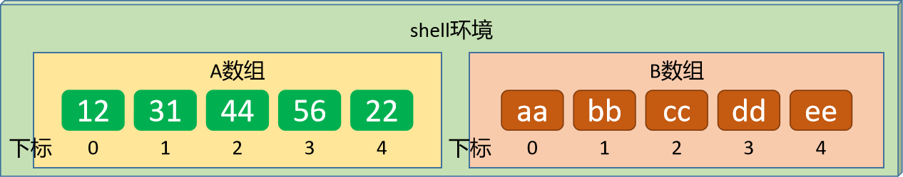
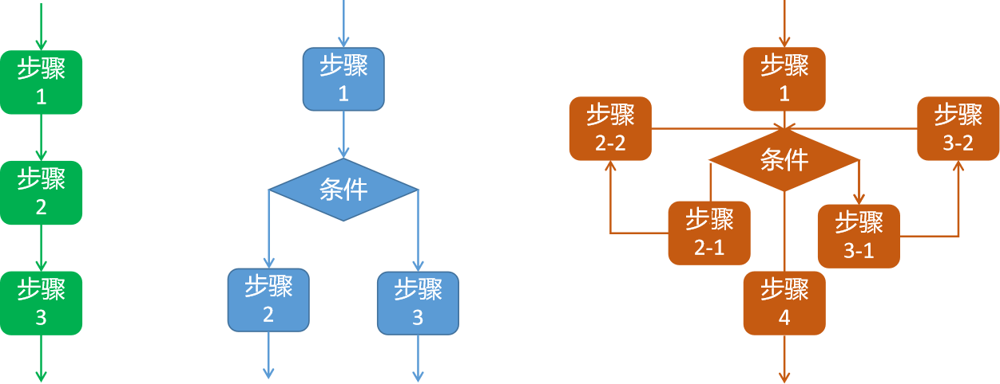
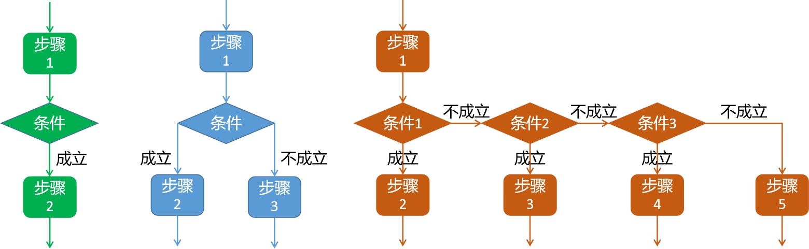
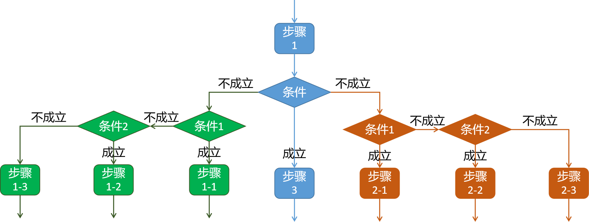
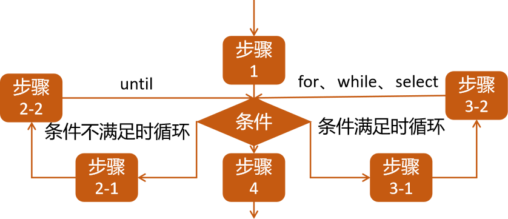
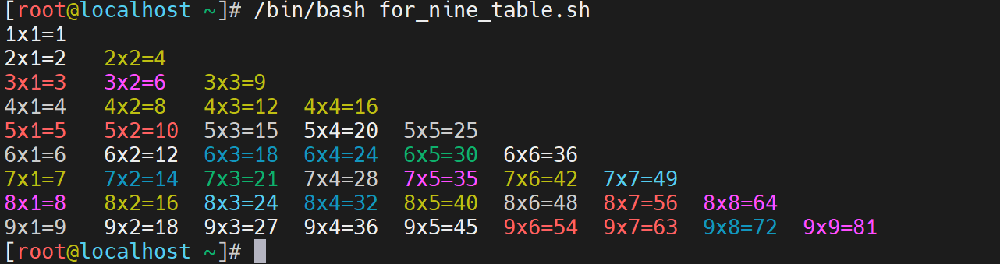

# 1 数组实践

## 1.1 基础操作

### 1.1.1 数组基础

学习目标

这一节，我们从 基础知识、数组分类、小结 三个方面来学习。

**基础知识**

简介

```powershell
	数组（Array）是有序的元素序列，它是数据结构在shell当中非常常见的一种数据存储方式，它将有限个类型相同的数据放到一个集合中，这个集合就是数组。
```

```powershell
	为了操作方便，我们为数组定制一个名称变量，数组内的每一个数据都是数组元素，这些数组元素在集合中有顺序的观念，顺序的位置值我们称为下标。
```




**数组分类**

数组样式-从数据结构的本身出发，它主要有多种数组样式

```powershell
一维数组
	一维数组是最简单的数组，按照顺序将一系列数据排列下来即可，数组本身没有场景含义。
	数据的表现样式：数组[下标]
	适用场景：编程语言中基于数据的查询、聚合等操作
二维数组
	二维数组是业务场景中常见的数组表现样式，即在一维数组的前提下，扩充了数据元素在场景中的含义。
	数据的表现样式：数组[行下标][列下标]
	适用场景：数据库场景中基于数据的查询、聚合等操作
三维数组
	三维数组是大型业务场景中通用的一种数组表现样式，它是在二维数据的前提下，扩充了数据空间的含义。
	数据的表现样式：数组[行下标][列下标][页下标]
	适用场景：数据分析场景中基于数据的查询、聚合等操作
```


```powershell
注意：
	1 bash支持一维数组(不支持多维数组)，并且没有限定数组的大小。数组元素的下标由0开始编号。
	2 获取数组中的元素要利用下标，下标可以是整数或算术表达式，其值应大于或等于0
	3 bash的数组支持稀疏格式（索引名称可以不连续）
```

**小结**

```

```


### 1.1.2 数组定义

学习目标

这一节，我们从 基础知识、简单实践、小结 三个方面来学习。

**基础知识**

数组创建

```powershell
在Shell中，用括号来表示数组，数组元素用“空格”符号分割开。定义数组的语法格式：
    array_name=(value1 ... valuen)
注意：
	基于元素的格式，主要有单行定义、多行定义、单元素定义、命令定义等多种样式
```

语法解读

```powershell
单行定义
	array_name=(value0 value1 value2 value3)
	
多行定义
    array_name=(
    value0
    value1
    value2
    value3
    )
    
单元素定义
    array_name[0]=value0
    array_name[1]=value1
    array_name[2]=value2
    
注意：
	单元素定义的时候，可以不使用连续的下标，而且下标的范围没有限制。
	
命令定义就是value的值以命令方式来获取
	file_array=($(ls /tmp/))
```


**简单实践**

实践1-单行定义

```powershell
定制数据数组
[root@localhost ~]# num_list=(123,234,345,456,567)
[root@localhost ~]# echo ${num_list[0]}
123,234,345,456,567

数据元素之间使用空格隔开
[root@localhost ~]# num_list=(123 234 345 456 567)
[root@localhost ~]# echo ${num_list[0]}
123
[root@localhost ~]# echo ${num_list[@]}
123 234 345 456 567
```

实践2-多行定义

```powershell
定制数组
[root@localhost ~]# class_one=(
> zhangsan
> lisi
> wangwu
> zhaoliu
> )

查看数组元素
[root@localhost ~]# echo ${class_one[0]}
zhangsan
[root@localhost ~]# echo ${class_one[@]}
zhangsan lisi wangwu zhaoliu
```

实践3-单元素定义

```powershell
定制数组
[root@localhost ~]# mix_list[0]=nihao
[root@localhost ~]# mix_list[2]=345
[root@localhost ~]# mix_list[4]="1.23,4.56"

查看数组元素
[root@localhost ~]# echo ${mix_list[1]}
[root@localhost ~]# echo ${mix_list[@]}
nihao 345 1.23,4.56

批量多元素定义
[root@localhost ~]# string_list=([0]="value-1" [3]="value-2")
[root@localhost ~]# echo ${string_list[@]}
value-1 value-2
[root@localhost ~]# echo ${!string_list[@]}
0 3
```

实践4-命令定义

```powershell
定制数组元素
[root@localhost ~]# file_array=$(ls *.sh)

查看数组元素
[root@localhost ~]# echo ${file_array[0]}
count_head_feet.sh host_network_test.sh memory_info.sh simple_jumpserver.sh simple_login.sh simple_login_string.sh site_healthcheck.sh test_argnum.sh
[root@localhost ~]# echo ${file_array[1]}
[root@localhost ~]# echo ${file_array[2]}
[root@localhost ~]# echo ${file_array[@]}
count_head_feet.sh host_network_test.sh memory_info.sh simple_jumpserver.sh simple_login.sh simple_login_string.sh site_healthcheck.sh test_argnum.sh

注意：
	对于命令的数组创建来说，它只有一个元素
```

**小结**

```

```


### 1.1.3 数组取值

学习目标

这一节，我们从 基础知识、简单实践、小结 三个方面来学习。

**基础知识**

简介

```powershell
	对于shell的数组数据来说，获取制定的数组元素主要有两种方法，一种是获取内容，一种是获取其他信息。
```

语法解读

```powershell
基于索引找内容
	读取数组元素值可以根据元素的下标值来获取，语法格式如下：
    	${array_name[index]}
    	${array_name[@]:起始位置:获取数量}
注意：
	获取具体的元素内容，指定其下标值，从0开始
	获取所有的元素内容，下标位置写"@"或者"*"
```

```powershell
获取数组索引
	在找内容的时候，有时候不知道数组的索引都有哪些，我们可以基于如下方式来获取，数组的所有索引：
    	${!array_name[index]}
注意：
	获取所有的元素位置，下标位置写"@"或者"*"
```

```powershell
获取数组长度的方法与获取字符串长度的方法相同，格式如下：
	${#array_name[index]}
注意：
	获取具体的元素长度，指定其下标值，从0开始
	获取所有的元素个数，下标位置写"@"或者"*"
```

```powershell
从系统中获取所有的数组
	declare -a
```


**简单实践**

实践1-基于索引找内容

```powershell
设定数组内容
[root@localhost ~]# num_list=(123 234 345 456 567)

获取指定位置元素
[root@localhost ~]# echo ${num_list[0]}
123
[root@localhost ~]# echo ${num_list[1]}
234

获取所有位置元素
[root@localhost ~]# echo ${num_list[*]}
123 234 345 456 567
[root@localhost ~]# echo ${num_list[@]}
123 234 345 456 567

获取末尾位置元素
[root@localhost ~]# echo ${num_list[-1]}
567
[root@localhost ~]# echo ${num_list[-2]}
456

获取指定范围元素
[root@localhost ~]# echo ${num_list[@]:1:1}
234
[root@localhost ~]# echo ${num_list[@]:1:3}
234 345 456
```

实践2-基于内容获取元素

```powershell
[root@localhost ~]# echo ${!num_list[@]}
0 1 2 3 4
[root@localhost ~]# echo ${!num_list[@]}
0 1 2 3 4
```

实践3-获取数组长度

```powershell
获取数组的元素数量
[root@localhost ~]# echo ${#num_list[@]}
5
[root@localhost ~]# echo ${#num_list[*]}
5

获取数据元素的长度
[root@localhost ~]# echo ${#num_list[3]}
3
```

实践4-获取系统所有数组

```powershell
设定数组
[root@localhost ~]# num_list=(123 234 345 456 567)

查看所有数组
[root@localhost ~]# declare -a
declare -a BASH_ARGC='()'
declare -a BASH_ARGV='()'
declare -a BASH_LINENO='()'
declare -a BASH_SOURCE='()'
declare -ar BASH_VERSINFO='([0]="4" [1]="2" [2]="46" [3]="2" [4]="release" [5]="x86_64-redhat-linux-gnu")'
declare -a DIRSTACK='()'
declare -a FUNCNAME='()'
declare -a GROUPS='()'
declare -a PIPESTATUS='([0]="0")'
declare -a num_list='([0]="123" [1]="234" [2]="345" [3]="456" [4]="567")'
```

**小结**

```

```


### 1.1.4 数组变动

学习目标

这一节，我们从 元素修改、元素删除、小结 三个方面来学习。

**元素修改**

简介

```powershell
数组元素的改其实就是定义数组时候的单元素定义，主要包含两种，元素替换，元素部分内容替换，格式如下
```

```powershell
元素内容替换：
	array_name[index]=值
注意：
	在修改元素的时候，index的值一定要保持准确
```

```powershell
元素部分内容替换，可以参考字符串替换格式：
	${array_name[index]/原内容/新内容}
注意：
	默认是演示效果，原数组未被修改，如果真要更改需要结合单元素内容替换
```

简单实践

```powershell
修改指定位置的值
[root@localhost ~]# num_list[2]=aaa
[root@localhost ~]# echo ${num_list[@]}
123 234 aaa 456 567

替换元素值的特定内容
[root@localhost ~]# echo ${num_list[2]/aa/lualu-}
lualu-a
[root@localhost ~]# num_list[2]=${num_list[2]/aa/lualu-}
[root@localhost ~]# echo ${num_list[@]}
123 234 lualu-a 456 567
```


**元素删除**

简介

```powershell
将shell中的数组删除，可以使用unset来实现，主要有两种情况：删除单元素，删除整个数组。格式如下：
```

```powershell
删除单元素
	unset array_name[index]
删除整个数组
	unset array_name
```

简单实践

```powershell
删除指定的元素
[root@localhost ~]# echo ${num_list[@]}
123 234 lualu-a 456 567
[root@localhost ~]# unset num_list[2]
[root@localhost ~]# echo ${num_list[@]}
123 234 456 567
[root@localhost ~]# unset num_list[2]
[root@localhost ~]# echo ${num_list[@]}
123 234 456 567
[root@localhost ~]# unset num_list[1]
[root@localhost ~]# echo ${num_list[@]}
123 456 567
[root@localhost ~]# echo ${!num_list[@]}
0 3 4
```

```powershell
替换元素值的特定内容
[root@localhost ~]# unset num_list
[root@localhost ~]# echo ${!num_list[@]}

[root@localhost ~]#
```

**小结**

```

```


## 1.2 综合实践

### 1.2.1 数组关联

学习目标

这一节，我们从 基础知识、简单实践、小结 三个方面来学习。

**基础知识**

简介

```powershell
	上一节，我们学习了shell环境下的数组定制的简写方式。数组的定制主要有如下两种：
定制索引数组 - 数组的索引是普通的数字
	declare -a array_name
	- 普通数组可以不事先声明,直接使用
	
定制关联数组 - 数组的索引是自定义的字母
	declare -A array_name
	- 关联数组必须先声明,再使用
```

**简单实践**

实践1-定制索引数组

```powershell
定制一个空内容的数组
[root@localhost ~]# declare -a course
[root@localhost ~]# declare -a | grep course
declare -a course='()'

定制一个包含元素的数组
[root@localhost ~]# course=(yuwen shuxue yingyu)
[root@localhost ~]# declare -a | grep course
declare -a course='([0]="yuwen" [1]="shuxue" [2]="yingyu")'
```

实践2-定制关联数组

```powershell
定制关联数组
[root@localhost ~]# declare -A score
[root@localhost ~]# declare -a | grep score
[root@localhost ~]# declare -A | grep score
declare -A score='()'

关联数组和数字索引数组不能通用
[root@localhost ~]# declare -a score
-bash: declare: score: 无法将关联数组转化为索引数组
```

```powershell
关联数组的操作
[root@localhost ~]# declare -A | grep score
declare -A score='([yingyu]="32" [yuwen]="67" [shuxue]="65" )'
[root@localhost ~]# echo ${!score[@]}
yingyu yuwen shuxue
[root@localhost ~]# echo ${score[@]}
32 67 65
```


**小结**

```

```


### 1.2.2 数组案例

学习目标

这一节，我们从 信息统计、服务管理、小结 三个方面来学习。

**信息统计**

需求

```powershell
分别打印CPU 1min 5min 15min load负载值
命令提示：
	uptime
	
信息显示：
    CPU 1 min平均负载为: 0.00
    CPU 5 min平均负载为: 0.01
    CPU 15 min平均负载为: 0.05
```

编写脚本

```powershell
查看脚本内容
[root@localhost ~]# cat cpu_load.sh
#!/bin/bash
# 功能：采集系统cpu负载信息
# 版本：v0.1
# 作者：书记
# 联系：www.superopsmsb.com

# 获取CPU负载情况
cpu_load=($(uptime | tr -s " " | cut -d " " -f 11-13 | tr "," " "))

# 信息输出
echo -e "\e[31m\t系统cpu负载信息\e[0m"
echo -e "\e[32m================================"
echo "CPU 1 min平均负载为: ${cpu_load[0]}"
echo "CPU 5 min平均负载为: ${cpu_load[1]}"
echo "CPU 15 min平均负载为: ${cpu_load[2]}"
echo -e "================================\e[0m"
```

```powershell
脚本执行后效果
[root@localhost ~]# /bin/bash cpu_load.sh
        系统cpu负载信息
================================
CPU 1 min平均负载为: 0.00
CPU 5 min平均负载为: 0.01
CPU 15 min平均负载为: 0.05
================================
```


**服务管理**

需求

```powershell
服务的管理动作有：
	"启动" "关闭" "重启" "重载" "状态"
服务的管理命令有：
	"start" "stop" "restart" "reload" "status"
选择不同的动作，输出不同的服务执行命令，格式如下：
	systemctl xxx service_name
```

编写脚本

```powershell
[root@localhost ~]# cat service_manager.sh
#!/bin/bash
# 功能：定制服务管理的功能
# 版本：v0.1
# 作者：书记
# 联系：www.superopsmsb.com

# 定制普通数组
oper_array=(启动 关闭 重启 重载 状态)
# 定制关联数组
declare -A cmd_array
cmd_array=([启动]=start [关闭]=stop [重启]=restart [重载]=reload [状态]=status)

# 服务的操作提示
echo -e "\e[31m---------------服务的操作动作---------------
 1: 启动  2: 关闭  3: 重启  4: 重载  5: 状态
--------------------------------------------"'\033[0m'

# 选择服务操作类型
read -p "> 请输入服务的操作动作: " oper_num
echo 
echo -e "\e[31m您选择的服务操作动作是:  ${oper_array[$oper_num-1]}\e[0m"
echo -e "\e[32m===============服务的执行动作===============
您即将对服务执行如下命令:
\tsystemctl ${cmd_array[${oper_array[$oper_num-1]}]} service_name
=========================================="'\033[0m'
```

```powershell
脚本执行效果
[root@localhost ~]# /bin/bash service_manager.sh
---------------服务的操作动作---------------
 1: 启动  2: 关闭  3: 重启  4: 重载  5: 状态
--------------------------------------------
> 请输入服务的操作动作: 3

您选择的服务操作动作是:  重启
===============服务的执行动作===============
您即将对服务执行如下命令:
        systemctl restart service_name
==========================================
```


**小结**

```

```

# 2 流程控制

## 2.1 基础知识

### 2.1.1 流程基础

学习目标

这一节，我们从 基础知识、简单实践、小结 三个方面来学习。

**基础知识**

编程逻辑

```powershell
编程语言的目的是通过风格化的编程思路将代码写出来后，实现项目功能的。为了实现功能，我们通过在代码层面通过一些代码逻辑来实现：
    顺序执行 - 程序按从上到下顺序执行
    选择执行 - 程序执行过程中，根据条件选择不同的顺序执行
    循环执行 - 程序执行过程中，根据条件重复执行代码
```




**shell逻辑**

简介

```powershell
	在shell编程中，默认情况下，处于shell脚本中的命令，它是按照从上到下的方式顺序执行每一条命令，这也导致我们在shell编程的过程中，必须保证每一条命令都能够正常的执行。当然了，真实的生产中的shell编程，不可能仅有这一种编程逻辑。
```

```powershell
	许多程序在脚本命令之间需要某种逻辑流控制，这就意味着shell脚本在具体的场景中，根据条件判断选择一条具体的代码逻辑执行特定范围的命令 -- 脚本范围内，允许出现多个场景下的命令块，而控制执行不同命令块的编程逻辑结构，在shell编程中有一个名称 -- 结构化命令。
```

结构化命令

```powershell
	结构化命令允许脚本程序根据条件或者相关命令的结果进行判断，执行一些功能命令块，在另外一些条件下，执行跳过这些命令块。
	在shell编程中，这些结构化的命令主要有：
```

```powershell
条件逻辑 - 多分支执行命令块
	- if控制语句
    - case控制语句
    - select控制语句
循环逻辑 - 多循环执行命令块
	- for控制语句
	- while控制语句
	- until控制语句
逻辑控制 - 命令块执行过程中，精细化控制
	- continue控制
	- break控制
	- exit控制
	- shift控制
```


**小结**

```

```


## 2.2 if条件控制

### 2.2.1 语法解读

学习目标

这一节，我们从 基础知识、简单实践、小结 三个方面来学习。

**基础知识**

简介

```powershell
	条件结构能够根据某个特定的条件，结合内置的测试表达式功能，结合测试的结果状态值对于条件进行判断，然后选择执行合适的任务。在bash中，if命令是条件结构最简单的形式。
	shell中的if语句支持多种条件的决策形式：
```



```powershell
单路决策 - 单分支if语句
	样式：
        if [ 条件 ]
        then
            指令
        fi
    特点：
    	单一条件，只有一个输出
```

```powershell
双路决策 - 双分支if语句
	样式：
        if [ 条件 ]
        then
            指令1
        else
            指令2
        fi
    特点：
    	单一条件，两个输出
```

```powershell
多路决策 - 多分支if语句
	样式：
		if [ 条件 ]
        then
            指令1
        elif [ 条件2 ]
        then
            指令2
        else
            指令3
        fi
	特点：
    	n个条件，n+1个输出
```

```powershell
单行命令写法
	if [ 条件1 ]; then 指令1; elif [ 条件2 ]; then 指令2; ... ; else 指令n; fi
```

```powershell
关键点解读：
	1 if 和 then 配套使用
	2 if 和末尾的 fi 顺序反写
```

内嵌测试语句

```powershell
	shell的if语句中关于条件判断这块内嵌了如下几种测试表达式语句：
		[ 表达式 ]		- 针对通用的判断场景 
		[[ 表达式 ]]	- 针对扩展的判断场景
		(( 命令 ))	 - (())代替let命令来测试数值表达式
```

**简单实践**

实践1-单if实践

```powershell
[root@localhost ~]# cat single_branch_if.sh
#!/bin/bash
# 单分支if语句的使用场景

# 定制普通变量
gender="$1"

# 条件判断逻辑
if [ "${gender}" == "nan" ]
then
   echo "您的性别是 男"
fi
```

```powershell
脚本执行效果
[root@localhost ~]# /bin/bash single_branch_if.sh nv
[root@localhost ~]# /bin/bash single_branch_if.sh nan
您的性别是 男
```

实践2-双if实践

```powershell
[root@localhost ~]# cat double_branch_if.sh
#!/bin/bash
# 双分支if语句的使用场景

# 定制普通变量
gender="$1"

# 条件判断逻辑
if [ "${gender}" == "nan" ]
then
   echo "您的性别是 男"
else
   echo "您的性别是 女"
fi
```

```powershell
脚本执行效果
[root@localhost ~]# /bin/bash double_branch_if.sh
您的性别是 女
[root@localhost ~]# /bin/bash double_branch_if.sh nan
您的性别是 男
[root@localhost ~]# /bin/bash double_branch_if.sh xxx
您的性别是 女
```

实践3-多if实践

```powershell
[root@localhost ~]# cat multi_branch_if.sh
#!/bin/bash
# 多分支if语句的使用场景

# 定制普通变量
gender="$1"

# 条件判断逻辑
if [ "${gender}" == "nan" ]
then
   echo "您的性别是 男"
elif [ "${gender}" == "nv" ]
then
   echo "您的性别是 女"
else
   echo "您的性别，我不知道"
fi
```

```powershell
脚本执行效果
[root@localhost ~]# /bin/bash multi_branch_if.sh
您的性别，我不知道
[root@localhost ~]# /bin/bash multi_branch_if.sh nan
您的性别是 男
[root@localhost ~]# /bin/bash multi_branch_if.sh nv
您的性别是 女
[root@localhost ~]# /bin/bash multi_branch_if.sh xxx
您的性别，我不知道
```

**小结**

```

```


### 2.2.2 if 案例实践

学习目标

这一节，我们从 服务管理、堡垒机登录、小结 三个方面来学习。

**服务管理**

案例需求

```powershell
要求脚本执行需要有参数，通过传入参数来实现不同的功能。

参数和功能详情如下：
	参数 			   执行效果
	start			服务启动中...
	stop			服务关闭中...
	restart			服务重启中...
	*				脚本 X.sh 使用方式 /bin/bash X.sh [ start|stop|restart ]
```

脚本内容

```powershell
[root@localhost ~]# cat service_manager_if.sh
#!/bin/bash
# 功能：定制服务管理的功能
# 版本：v0.1
# 作者：书记
# 联系：www.superopsmsb.com

# 定制普通变量
service_ops="$1"

# 脚本基本判断
if [ $# -ne 1 ] 
then 
    echo -e "\e[31m$0 脚本的使用方式： $0 [ start | stop | restart ]\e[0m"
    exit
fi

# 脚本内容的判断
if [ "${service_ops}" == "start" ]
then
   echo -e "\e[31m服务启动中...\e[0m"
elif [ "${service_ops}" == "stop" ]
then
   echo -e "\e[31m服务关闭中...\e[0m"
elif [ "${service_ops}" == "restart" ]
then
   echo -e "\e[31m服务重启中...\e[0m"
else
   echo -e "\e[31m$0 脚本的使用方式： $0 [ start | stop | restart ]\e[0m"
fi
```

```powershell
脚本执行效果
[root@localhost ~]# /bin/bash service_manager_if.sh
service_manager_if.sh 脚本的使用方式： service_manager_if.sh [ start | stop | restart ]
[root@localhost ~]# /bin/bash service_manager_if.sh start
服务启动中...
[root@localhost ~]# /bin/bash service_manager_if.sh stop
服务关闭中...
[root@localhost ~]# /bin/bash service_manager_if.sh restart
服务重启中...
[root@localhost ~]# /bin/bash service_manager_if.sh xxx
service_manager_if.sh 脚本的使用方式： service_manager_if.sh [ start | stop | restart ]
```

**堡垒机登录**

需求

```powershell
	在之前的堡垒机功能基础上，扩充条件判断效果
```

脚本内容

```powershell
[root@localhost ~]# cat simple_jumpserver_if.sh
#!/bin/bash
# 功能：定制堡垒机的展示页面
# 版本：v0.4
# 作者：书记
# 联系：www.superopsmsb.com

# 定制普通变量
login_user='root'
login_pass='123456'

# 堡垒机的信息提示
echo -e "\e[31m \t\t 欢迎使用堡垒机"
echo -e "\e[32m-----------请选择你要登录的远程主机-----------
 1: 10.0.0.14 (nginx)
 2: 10.0.0.15 (tomcat)
 3: 10.0.0.19 (apache)
 q: 使用本地主机
----------------------------------------------\033[0m"

# 由于暂时没有学习条件判断，所以暂时选择 q
read -p "请输入您要选择的远程主机编号: " host_index
read -p "请输入登录本地主机的用户名: " user
read -s -p "请输入登录本地主机的密码: " password
echo
# 远程连接主机
if [[ ${user} == ${login_user} && ${password} == ${login_pass} ]] 
then
    echo -e "\e[31m主机登录验证成功\e[0m"
else
    echo -e "\e[31m您输入的用户名或密码有误\e[0m"
fi
```

```powershell
脚本执行效果
[root@localhost ~]# /bin/bash simple_jumpserver_if.sh
                 欢迎使用堡垒机
-----------请选择你要登录的远程主机-----------
 1: 10.0.0.14 (nginx)
 2: 10.0.0.15 (tomcat)
 3: 10.0.0.19 (apache)
 q: 使用本地主机
----------------------------------------------
请输入您要选择的远程主机编号: q
请输入登录本地主机的用户名: root
请输入登录本地主机的密码:
主机登录验证成功
[root@localhost ~]# /bin/bash simple_jumpserver_if.sh
                 欢迎使用堡垒机
-----------请选择你要登录的远程主机-----------
 1: 10.0.0.14 (nginx)
 2: 10.0.0.15 (tomcat)
 3: 10.0.0.19 (apache)
 q: 使用本地主机
----------------------------------------------
请输入您要选择的远程主机编号: q
请输入登录本地主机的用户名: python
请输入登录本地主机的密码:
您输入的用户名或密码有误
```

**小结**

```

```


### 2.2.3 嵌套if实践

学习目标

这一节，我们从 基础知识、简单实践、小结 三个方面来学习。

**基础知识**

简介

```powershell
	一个if语句仅仅能够针对一个场景的多种情况。当我们面对多场景的条件判断的时候，一个if结构语句无法满足需求，这个时候，我们可以借助于嵌套if的结构语句来实现相应的效果。
```



```powershell
注意：
	如果是多个独立的、彼此没有关联的业务场景，可以使用不同的if语句即可
	嵌套的if语句只能适用于彼此关联的业务场景
```

**简单实践**

案例需求

```powershell
运维管理人员，通过监控平台获取站点的运行状态数据信息，当发现问题的时候，根据情况进行后续判断：
    状况1： 问题类型
    	研发标识 - 交给开发团队
    	测试标识 - 交给测试团队
    	运维标识 - 交给运维团队
    状况2： 问题级别
		红灯 - 紧急故障
		黄灯 - 严重故障
		绿灯 - 一般故障
		灰灯 - 未知故障，后续操作
```

脚本内容

```powershell
[root@localhost ~]# cat monitor_operator_if.sh
#!/bin/bash
# 功能：定制监控异常的处理措施
# 版本：v0.1
# 作者：书记
# 联系：www.superopsmsb.com

# 定制普通变量
monitor_type=(研发 测试 运维)
error_level=(红灯 黄灯 绿灯 灰灯)

# 监控平台的信息提示
echo -e "\e[31m \t\t 欢迎使用监控处理平台"
echo -e "\e[32m-----------请选择问题类型-----------
 1: 研发 2: 测试 3: 运维
----------------------------------\033[0m"
# 定制业务逻辑
read -p "请输入问题标识: " monitor_id
# 判断问题类型是否有效
if [ ${#monitor_type[@]} -lt ${monitor_id} ]
then
	echo -e "\e[31m无效标识，请输入正确的问题标识\e[0m"
else
	# 定制问题类型识别逻辑
    if [ ${monitor_type[$monitor_id-1]} == "研发" ]
    then
        echo -e "\e[31m转交研发团队处理\e[0m"
    elif [ ${monitor_type[$monitor_id-1]} == "测试" ]
    then
        echo -e "\e[31m转交测试团队处理\e[0m"
    elif [ ${monitor_type[$monitor_id-1]} == "运维" ]
    then
        echo -e "\e[32m-----------请选择故障级别-----------"
        echo " 1: 红灯 2: 黄灯 3: 绿灯 4: 灰灯"
        echo -e "----------------------------------\033[0m"
        read -p "请输入故障级别: " level_id
        # 判断故障级别是否有效
        if [ ${#error_level[@]} -lt ${level_id} ]
        then
            echo -e "\e[31m无效标识，请输入正确的故障级别\e[0m"
        else
        	# 定制故障级别逻辑
            if [ ${error_level[$level_id-1]} == "红灯" ]
            then
                echo -e "\e[31m请按照 紧急故障 性质进行处理\e[0m"
            elif [ ${error_level[$level_id-1]} == "黄灯" ]
            then
                echo -e "\e[31m请按照 严重故障 性质进行处理\e[0m"
            elif [ ${error_level[$level_id-1]} == "绿灯" ]
            then
                echo -e "\e[31m请按照 一般故障 性质进行处理\e[0m"
            elif [ ${error_level[$level_id-1]} == "灰灯" ]
            then
                echo -e "\e[31m请按照 未知故障 性质进行处理\e[0m"
            fi
        fi
    fi
fi
```

```powershell
脚本执行效果
[root@localhost ~]# /bin/bash monitor_operator_if.sh
                 欢迎使用监控处理平台
-----------请选择问题类型-----------
 1: 研发 2: 测试 3: 运维
----------------------------------
请输入问题标识: 4
无效标识，请输入正确的问题标识
[root@localhost ~]# /bin/bash monitor_operator_if.sh
                 欢迎使用监控处理平台
-----------请选择问题类型-----------
 1: 研发 2: 测试 3: 运维
----------------------------------
请输入问题标识: 1
转交研发团队处理
[root@localhost ~]# /bin/bash monitor_operator_if.sh
                 欢迎使用监控处理平台
-----------请选择问题类型-----------
 1: 研发 2: 测试 3: 运维
----------------------------------
请输入问题标识: 3
-----------请选择故障级别-----------
 1: 红灯 2: 黄灯 3: 绿灯 4: 灰灯
----------------------------------
请输入故障级别: 1
请按照 紧急故障 性质进行处理
[root@localhost ~]# /bin/bash monitor_operator_if.sh
                 欢迎使用监控处理平台
-----------请选择问题类型-----------
 1: 研发 2: 测试 3: 运维
----------------------------------
请输入问题标识: 3
-----------请选择故障级别-----------
 1: 红灯 2: 黄灯 3: 绿灯 4: 灰灯
----------------------------------
请输入故障级别: 6
无效标识，请输入正确的故障级别
```

**小结**

```

```


### 2.2.4 其他实践

学习目标

这一节，我们从 条件进阶、单行命令、小结 三个方面来学习。

**条件进阶**

简介

```powershell
	if条件控制语句支持(())来代替let命令测试表达式的执行效果，支持[[]]实现正则级别的内容匹配。
```

```powershell
表达式的样式如下：
if (( 表达式 ))  或 [[ 内容匹配 ]]
then
	指令
fi
```

实践1-(()) 计算条件匹配

```powershell
查看脚本内容
[root@localhost ~]# cat odd_even_if.sh
#!/bin/bash
# (()) 在if分支中的应用

# 接收一个数字
read -p "请输入一个数字: " num

# 定制数字奇数和偶数判断
if (( ${num} % 2 == 0 ))
then
	echo -e "\e[31m ${num} 是一个偶数\e[0m"
else
	echo -e "\e[31m ${num} 是一个奇数\e[0m"
fi
```

```powershell
脚本执行效果
[root@localhost ~]# /bin/bash odd_even_if.sh
请输入一个数字: 2
 2 是一个偶数
[root@localhost ~]# /bin/bash odd_even_if.sh
请输入一个数字: 1
 1 是一个奇数
```

实践2-[[]]扩展匹配条件

```powershell
查看脚本内容
[root@localhost ~]# cat condition_extend_if.sh
#!/bin/bash
# [[]] 在if分支中的应用

# 接收一个数字
read -p "请输入一个单词: " string

# 判断内容是否是我们想要的
if [[ ${string} == v* ]]
then
	echo -e "\e[31m ${num} 是满足条件的单词\e[0m"
else
	echo -e "\e[31m ${num} 不满足条件\e[0m"
fi
```

```powershell
执行脚本效果
[root@localhost ~]# /bin/bash condition_extend_if.sh
请输入一个单词: very
  是满足条件的单词
[root@localhost ~]# /bin/bash condition_extend_if.sh
请输入一个单词: hello
  不满足条件
```

实践3-[[]]扩展实践

```powershell
#!/bin/bash
# [[]] 在if分支中的应用

# 接收一个数字
read -p "请输入你的身高(m为单位): " height

# 身高判断逻辑
if [[ ! ${height} =~ ^[0-2](\.[0-9]{,2})?$ ]]
then 
	echo -e "\e[31m你确定自己的身高是 ${height} ?\e[0m"
else
	echo -e "\e[31m我说嘛，${height} 才是你的身高!\e[0m"
fi
```

```powershell
脚本执行效果
[root@localhost ~]# /bin/bash person_height_if.sh
请输入你的身高(m为单位): 3
你确定自己的身高是 3 ?
[root@localhost ~]# /bin/bash person_height_if.sh
请输入你的身高(m为单位): 1.2
我说嘛，1.2 才是你的身高!
```


**单行命令**

简介

```powershell
所谓的单行命令，其实指的是对于简单的if条件判断，我们可以直接一行显示，减少代码的行数
```

简单实践

```powershell
示例1-命令行的if语句
[root@localhost ~]# num1=3 num2=1
[root@localhost ~]# if [ $num1 -gt $num2 ]; then echo "$num1 数字大"; else echo "$num2 数字大"; fi
3 数字大
[root@localhost ~]# num1=3 num2=9
[root@localhost ~]# if [ $num1 -gt $num2 ]; then echo "$num1 数字大"; else echo "$num2 数字大"; fi
9 数字大
```

```powershell
示例2-使用逻辑表达式来满足if效果
[root@localhost ~]# num1=3 num2=1
[root@localhost ~]# [ $num1 -gt $num2 ] && echo "$num1 数字大" || echo "$num2 数字大"
3 数字大
[root@localhost ~]# num1=3 num2=9
[root@localhost ~]# [ $num1 -gt $num2 ] && echo "$num1 数字大" || echo "$num2 数字大"
9 数字大
```

**小结**

```

```


## 2.3 case条件控制

### 2.3.1 语法解读

学习目标

这一节，我们从 基础知识、简单实践、小结 三个方面来学习。

**基础知识**

简介

```powershell
case命令是一个多路分支的命令，它可以来代替 if/elif相关的命令，在case语句中，它通过引入一个变量接收用户输入的数据，然后依次与相关的值进行匹配判断，一旦找到对应的匹配值后，就执行相关的语句。
```

语法格式

```powershell
case 变量名 in
   值1)
      指令1
         ;;
   ...
   值n)
 	   指令n
         ;;
esac
```

```powershell
注意：
    首行关键字是case，末行关键字esac
    选择项后面都有 )
    每个选择的执行语句结尾都有两个分号;
    
```

**简单实践**

案例需求

```powershell
改造多分支if语句对脚本进行升级
	要求脚本执行需要有参数，通过传入参数来实现不同的功能。

参数和功能详情如下：
	参数 		   执行效果
	start		服务启动中...
	stop		服务关闭中...
	restart		服务重启中...
	*			脚本 X.sh 使用方式 X.sh [ start|stop|restart ]
```

脚本效果

```powershell
查看脚本内容
[root@localhost ~]# cat service_manager_case.sh
#!/bin/bash
# 功能：定制服务管理的功能
# 版本：v0.1
# 作者：书记
# 联系：www.superopsmsb.com

# 定制普通变量
service_ops="$1"

# 脚本内容的判断
case "${service_ops}" in
    "start")
        echo -e "\e[31m服务启动中...\e[0m";;
    "stop")
        echo -e "\e[31m服务关闭中...\e[0m";;
    "restart")
        echo -e "\e[31m服务重启中...\e[0m";;
    "start")
        echo -e "\e[31m服务启动中...\e[0m";;
    *)
        echo -e "\e[31m$0 脚本的使用方式： $0 [ start | stop | restart ]\e[0m";;
esac
```

```powershell
脚本执行效果
[root@localhost ~]# /bin/bash service_manager_case.sh
service_manager_case.sh 脚本的使用方式： service_manager_case.sh [ start | stop | restart ]
[root@localhost ~]# /bin/bash service_manager_case.sh start
服务启动中...
[root@localhost ~]# /bin/bash service_manager_case.sh stop
服务关闭中...
[root@localhost ~]# /bin/bash service_manager_case.sh restart
服务重启中...
[root@localhost ~]# /bin/bash service_manager_case.sh xxx
service_manager_case.sh 脚本的使用方式： service_manager_case.sh [ start | stop | restart ]
```

**小结**

```

```


### 2.3.2 case实践

学习目标

这一节，我们从 环境标准化、k8s部署、小结 三个方面来学习。

**环境标准化**

案例需求

```powershell
	由于项目环境复杂，虽然我们创建了大量的脚本，但是管理起来不方便，需要我们做一个简单的脚本执行管理平台，输入不同的环境关键字，罗列该环境下的相关脚本。
```

```powershell
信息提示
        欢迎使用脚本管理平台
-----------请选择功能场景-----------
 1: 系统环境下脚本
 2: web环境下脚本
 3: 数据库环境下脚本
 4: 存储环境下脚本
 5: 其他环境下脚本
----------------------------------
```

准备工作

```
mkdir os web sql storage other
touch {os/os-{1..3}.sh,web/web-{1..4}.sh,sql/sql-{1..5}.sh,storage/st-{1..2}.sh,other/other.sh}
```

脚本内容

```powershell
查看脚本内容
[root@localhost ~]# cat scripts_manager_case.sh
#!/bin/bash
# 功能：定制服务管理的功能
# 版本：v0.1
# 作者：书记
# 联系：www.superopsmsb.com

# 定制数组变量
env_array=(os web sql storage other)

# 监控平台的信息提示
echo -e "\e[31m        欢迎使用脚本管理平台"
echo -e "\e[32m-----------请选择功能场景-----------
 1: 系统环境下脚本
 2: web环境下脚本
 3: 数据库环境下脚本
 4: 存储环境下脚本
 5: 其他环境下脚本
----------------------------------\033[0m"
# 定制业务逻辑
read -p "请输入功能标识: " env_id

# 脚本内容的判断
case "${env_array[$env_id-1]}" in
    "os")
        echo -e "\e[31m系统环境下脚本文件有:\e[0m"
        ls os;;
    "web")
        echo -e "\e[31mweb环境下脚本文件有:\e[0m"
        ls web;;
    "sql")
        echo -e "\e[31m数据库环境下脚本文件有:\e[0m"
        ls sql;;
    "storage")
        echo -e "\e[31m存储环境下脚本文件有:\e[0m"
        ls storage;;
    "other")
        echo -e "\e[31m其他环境下脚本文件有:\e[0m"
        ls other;;
    *)
        echo -e "\e[31m请输入有效的功能场景标识\e[0m";;
esac
```

```powershell
脚本执行效果
[root@localhost ~]# /bin/bash scripts_manager_case.sh
        欢迎使用脚本管理平台
-----------请选择功能场景-----------
 1: 系统环境下脚本
 2: web环境下脚本
 3: 数据库环境下脚本
 4: 存储环境下脚本
 5: 其他环境下脚本
----------------------------------
请输入功能标识: 6
请输入有效的功能场景标识
[root@localhost ~]# /bin/bash scripts_manager_case.sh 3
        欢迎使用脚本管理平台
-----------请选择功能场景-----------
 1: 系统环境下脚本
 2: web环境下脚本
 3: 数据库环境下脚本
 4: 存储环境下脚本
 5: 其他环境下脚本
----------------------------------
请输入功能标识: 3
数据库环境下脚本文件有:
sql-1.sh  sql-2.sh  sql-3.sh  sql-4.sh  sql-5.sh
```


**k8s部署**

案例需求

```powershell
	由于k8s项目环境复杂，它依赖于很多功能步骤操作，我们需要按照合理的阶段部署整体环境。相关的操作步骤信息如下。
```

```powershell
基础环境部署
	跨主机免密码操作
	时间同步操作
	内核配置操作
	容器私有仓库操作
高可用环境部署
	高可用环境部署
	负载均衡环境部署
kubernetes基础环境部署
	证书管理
	etcd环境部署
	集群证书配置
主角色环境部署
	apiserver环境部署
	scheduler环境部署
	controller环境部署
	认证配置
	容器环境部署
	kubelet环境部署
	kube-proxy环境部署
从角色环境部署
	容器环境部署
	kubelet环境部署
	kube-proxy环境部署
```

脚本内容

```powershell
查看脚本内容
[root@localhost ~]# cat kubernetes_manager_case.sh
#!/bin/bash
# 功能：定制kubernetes环境部署管理的功能
# 版本：v0.1
# 作者：书记
# 联系：www.superopsmsb.com

# 定制数组变量
env_array=(base ha k8s_base master slave)

# 监控平台的信息提示
echo -e "\e[31m     欢迎使用kubernetes部署平台"
echo -e "\e[32m-----------请选择部署阶段-----------
 1: 基础环境部署
 2: 高可用环境部署
 3: kubernetes基础环境部署
 4: 主角色环境部署
 5: 从角色环境部署
----------------------------------\033[0m"
# 定制业务逻辑
read -p "请输入功能标识: " env_id

# 脚本内容的判断
case "${env_array[$env_id-1]}" in
    "base")
        echo -e "\e[31m开始基础环境部署..."
        echo "1 执行跨主机免密码操作"
        echo "2 执行时间同步操作"
        echo "3 执行内核配置操作"
        echo -e "4 执行容器私有仓库部署操作\e[0m";;
    "ha")
        echo -e "\e[31高可用环境部署..."
        echo "1 执行高可用环境部署操作"
        echo -e "2 执行负载均衡环境部署操作\e[0m";;
    "k8s_base")
        echo -e "\e[31mkubernetes基础环境部署..."
        echo "1 执行证书管理操作"
        echo "2 执行etcd环境部署操作"
        echo -e "3 执行集群证书配置操作\e[0m";;
    "master")
        echo -e "\e[31m主角色环境部署..."
        echo "1 执行apiserver环境部署操作"
        echo "2 执行scheduler环境部署操作"
        echo "3 执行controller环境部署操作"
        echo "4 执行认证配置操作"
        echo "5 执行容器环境部署操作"
        echo "6 执行kubelet环境部署操作"
        echo -e "7 执行kube-proxy环境部署\e[0m";;
    "slave")
        echo -e "\e[31m主角色环境部署..."
        echo "1 执行容器环境部署操作"
        echo "2 执行kubelet环境部署操作"
        echo -e "3 执行kube-proxy环境部署\e[0m";;
    *)
        echo -e "\e[31m请输入有效的功能场景标识\e[0m";;
esac
```

```powershell
脚本执行效果
[root@localhost ~]# /bin/bash kubernetes_manager_case.sh
     欢迎使用kubernetes部署平台
-----------请选择部署阶段-----------
 1: 基础环境部署
 2: 高可用环境部署
 3: kubernetes基础环境部署
 4: 主角色环境部署
 5: 从角色环境部署
----------------------------------
请输入功能标识: 7
请输入有效的功能场景标识
[root@localhost ~]# /bin/bash kubernetes_manager_case.sh
     欢迎使用kubernetes部署平台
-----------请选择部署阶段-----------
 1: 基础环境部署
 2: 高可用环境部署
 3: kubernetes基础环境部署
 4: 主角色环境部署
 5: 从角色环境部署
----------------------------------
请输入功能标识: 5
主角色环境部署...
1 执行容器环境部署操作
2 执行kubelet环境部署操作
3 执行kube-proxy环境部署
```

**小结**

```

```


### 2.3.3 嵌套实践

学习目标

这一节，我们从 基础知识、简单实践、小结 三个方面来学习。

**基础知识**

简介

```powershell
这里的嵌套实践，与if语句的嵌套实践，基本一致，只不过组合的方式发生了一些变化。常见的组合样式如下：
```

```powershell
case嵌套if语句
    case "变量" in
      	"值1")
        	if [ 条件判断 ]
        	...
        	;;
      	...
    esac
```

```powershell
case嵌套case语句
    case "变量" in
      	"值1")
        	case语句
      	...
    esac
```

```powershell
if嵌套case语句
	if [ 条件判断 ]
	then
        case "变量名" in
           "值1")
              指令1;;
           ...
        esac		
	else
		...
	fi
```

**简单实践**

案例需求

```powershell
场景简介：
	火车站安检
		安检失败
			- 携带违禁物品禁止进站
		安检成功后进行火车票检查
			- 允许登上上火车
			- 禁止登上火车
```

实践1-case嵌套if语句

```powershell
查看脚本内容
[root@localhost ~]# cat case_if.sh
#!/bin/bash
# 功能：case嵌套if语句实践

# 定制业务逻辑
read -p "是否携带违禁物品: " safe_check
# 业务逻辑定制
case "${safe_check}" in
    "true")
        echo -e "\e[31m不允许进入火车站\e[0m";;
    "false")
        read -p "火车票是否过期: " ticket_check
        if [ ${ticket_check} == "true" ]
        then
            echo -e "\e[31m不允许登上火车站\e[0m"
        else
            echo -e "\e[31m允许登上火车站\e[0m"
        fi;;
    *)
        echo -e "\e[31m再检查一遍\e[0m";;
esac
```

```powershell
脚本执行效果
[root@localhost ~]# /bin/bash case_if.sh
是否携带违禁物品: true
不允许进入火车站
[root@localhost ~]# /bin/bash case_if.sh
是否携带违禁物品: false
火车票是否过期: true
不允许登上火车站
[root@localhost ~]# /bin/bash case_if.sh
是否携带违禁物品: false
火车票是否过期: false
允许登上火车站
[root@localhost ~]# /bin/bash case_if.sh
是否携带违禁物品: hah
再检查一遍
```

实践2-case嵌套case语句

```powershell
查看脚本内容
[root@localhost ~]# cat case_case.sh
#!/bin/bash
# 功能：case嵌套case语句实践

# 定制业务逻辑
read -p "是否携带违禁物品: " safe_check
# 业务逻辑定制
case "${safe_check}" in
    "true")
        echo -e "\e[31m不允许进入火车站\e[0m";;
    "false")
        read -p "火车票是否过期: " ticket_check
        case ${ticket_check} in
            "true")
                echo -e "\e[31m不允许登上火车站\e[0m";;
            "false")
                echo -e "\e[31m允许登上火车站\e[0m";;
            *)
                echo -e "\e[31m再检查一遍\e[0m";;
        esac;;
    *)
        echo -e "\e[31m再检查一遍\e[0m";;
esac
```

实践3-if嵌套case语句

```powershell
查看脚本内容
[root@localhost ~]# cat if_case.sh
#!/bin/bash
# 功能：if嵌套case语句实践

# 定制业务逻辑
read -p "是否携带违禁物品: " safe_check
# 业务逻辑定制
if [ "${safe_check}" == "true" ]
then
    echo -e "\e[31m不允许进入火车站\e[0m"
elif [ "${safe_check}" == "false" ]
then 
    read -p "火车票是否过期: " ticket_check
    case ${ticket_check} in
        "true")
            echo -e "\e[31m不允许登上火车站\e[0m";;
        "false")
            echo -e "\e[31m允许登上火车站\e[0m";;
        *)
            echo -e "\e[31m再检查一遍\e[0m";;
    esac
else
    echo -e "\e[31m再检查一遍\e[0m"
fi
```

### 2.3.4 嵌套案例

学习目标

这一节，我们从 案例需求、简单实践、小结 三个方面来学习。

**案例需求**

```powershell
运维管理人员，通过监控平台获取站点的运行状态数据信息，当发现问题的时候，根据情况进行后续判断：
    状况1： 问题类型
    	研发标识 - 交给开发团队
    	测试标识 - 交给测试团队
    	运维标识 - 交给运维团队
    状况2： 问题级别
		红灯 - 紧急故障
		黄灯 - 严重故障
		绿灯 - 一般故障
		灰灯 - 未知故障，后续操作
```

**简单实践**

实践-改造嵌套if的监控管理脚本

```powershell
查看脚本内容
[root@localhost ~]# cat monitor_operator_if_case.sh
# 功能：定制监控异常的处理措施
# 版本：v0.2
# 作者：书记
# 联系：www.superopsmsb.com

# 定制普通变量
monitor_type=(研发 测试 运维)
error_level=(红灯 黄灯 绿灯 灰灯)

# 监控平台的信息提示
echo -e "\e[31m \t\t 欢迎使用监控处理平台"
echo -e "\e[32m-----------请选择问题类型-----------
 1: 研发 2: 测试 3: 运维
----------------------------------\033[0m"
# 定制业务逻辑
read -p "请输入问题标识: " monitor_id
# 判断问题类型是否有效
if [ ${#monitor_type[@]} -lt ${monitor_id} ]
then
    echo -e "\e[31m无效标识，请输入正确的问题标识\e[0m"
else
    # 定制问题类型识别逻辑
    case ${monitor_type[$monitor_id-1]} in
        "研发")
            echo -e "\e[31m转交研发团队处理\e[0m";;
        "测试")
			echo -e "\e[31m转交测试团队处理\e[0m";;
        "运维")
            echo -e "\e[32m-----------请选择故障级别-----------"
            echo " 1: 红灯 2: 黄灯 3: 绿灯 4: 灰灯"
            echo -e "----------------------------------\033[0m"
            read -p "请输入故障级别: " level_id
            # 定制故障级别逻辑
            case ${error_level[$level_id-1]} in
                "红灯")
                    echo -e "\e[31m请按照 紧急故障 性质进行处理\e[0m";;
                "黄灯")
                    echo -e "\e[31m请按照 严重故障 性质进行处理\e[0m";;
                "绿灯")
                    echo -e "\e[31m请按照 一般故障 性质进行处理\e[0m";;
                "灰灯")
                    echo -e "\e[31m请按照 未知故障 性质进行处理\e[0m";;
                *)
                    echo -e "\e[31m无效标识，请输入正确的故障级别\e[0m";;
            esac
   esac
fi
```

```powershell
脚本执行效果
[root@localhost ~]# /bin/bash monitor_operator_if_case.sh
                 欢迎使用监控处理平台
-----------请选择问题类型-----------
 1: 研发 2: 测试 3: 运维
----------------------------------
请输入问题标识: 1
转交研发团队处理
[root@localhost ~]# /bin/bash monitor_operator_if_case.sh
                 欢迎使用监控处理平台
-----------请选择问题类型-----------
 1: 研发 2: 测试 3: 运维
----------------------------------
请输入问题标识: 4
无效标识，请输入正确的问题标识

[root@localhost ~]# /bin/bash monitor_operator_if_case.sh
                 欢迎使用监控处理平台
-----------请选择问题类型-----------
 1: 研发 2: 测试 3: 运维
----------------------------------
请输入问题标识: 3
-----------请选择故障级别-----------
 1: 红灯 2: 黄灯 3: 绿灯 4: 灰灯
----------------------------------
请输入故障级别: 3
请按照 一般故障 性质进行处理
[root@localhost ~]# /bin/bash monitor_operator_if_case.sh
                 欢迎使用监控处理平台
-----------请选择问题类型-----------
 1: 研发 2: 测试 3: 运维
----------------------------------
请输入问题标识: 3
-----------请选择故障级别-----------
 1: 红灯 2: 黄灯 3: 绿灯 4: 灰灯
----------------------------------
请输入故障级别: 6
无效标识，请输入正确的故障级别
```

**小结**

```

```

## 2.4 for循环

### 2.4.1 for基础

学习目标

这一节，我们从 基础知识、简单实践、小结 三个方面来学习。

**基础知识**

简介

```powershell
	生产工作中，我们有可能会遇到一种场景，需要重复性的执行相同的动作，我们在shell编程的过程中，我们可以借助于循环逻辑的方法来进行处理。
```



```powershell
循环逻辑语法解析：
	关键字 [ 条件 ]
	do
		执行语句
	done
	
注意：
	这里的关键字主要有四种：
		for 	- 循环遍历一个元素列表
		while	- 满足条件情况下一直循环下去
		until	- 不满足条件情况下一直循环下去
		select	- 一种特殊的循环遍历，侧重于遍历用户输入，一般结合case等语句使用
```

**简单实践**

for语法解析

```powershell
场景：遍历列表
    for 值 in 列表
    do
       执行语句
    done
```

```powershell
注意：
    ”for” 循环总是接收 “in” 语句之后的某种类型的字列表
    执行次数和list列表中常数或字符串的个数相同，当循环的数量足够了，就自动退出
```

列表生成

```powershell
样式1：手工列表
	- 1 2 3 4 5 6 7
样式2：定制列表
	- {1..7}
样式3：命令生成
	- $(seq 1 7)
样式4：脚本参数
	- $@ $*
```

实践1-手工列表

```powershell
查看脚本内容
[root@localhost ~]# cat for_hand_list.sh
#!/bin/bash
# 功能：手工列表 for循环
for i in yuwen shuxue lishi
do
  echo "列表元素: ${i}"
done

脚本执行后效果
[root@localhost ~]# /bin/bash for_hand_list.sh
列表元素: yuwen
列表元素: shuxue
列表元素: lishi
```

实践2-定制列表

```powershell
查看脚本内容
[root@localhost ~]# cat for_define_list.sh
#!/bin/bash
# 功能：定制列表 for循环
for i in {1..3}
do
  echo "列表元素: ${i}"
done

脚本执行后效果
[root@localhost ~]# /bin/bash for_define_list.sh
列表元素: 1
列表元素: 2
列表元素: 3
```

实践3-命令生成

```powershell
查看脚本内容
[root@localhost ~]# cat for_cmd_list.sh
#!/bin/bash
# 功能：命令生成列表 for循环
for i in $(seq 1 3)
do
  echo "列表元素: ${i}"
done

脚本执行后效果
[root@localhost ~]# /bin/bash for_cmd_list.sh
列表元素: 1
列表元素: 2
列表元素: 3
```

实践4-脚本参数

```powershell
查看脚本内容
[root@localhost ~]# cat for_arg_list.sh
#!/bin/bash
# 功能：脚本参数列表 for循环
for i in $@
do
  echo "列表元素: ${i}"
done

脚本执行后效果
[root@localhost ~]# /bin/bash for_arg_list.sh 1 2 3
列表元素: 1
列表元素: 2
列表元素: 3
```

**小结**

```

```

### 2.4.2 for循环案例

学习目标

这一节，我们从 普通循环、赋值循环、小结 三个方面来学习。

**普通循环**

简介

```powershell
所谓的普通循环，仅仅是在特定的范围循环中，对相关命令进行重复性的操作
```

批量实践1- 批量创建多个使用随机密码的用户

```powershell
查看脚本内容
[root@localhost ~]# cat for_add_user.sh
#!/bin/bash
# 功能：for批量创建用户
# 提示：
# /dev/random和/dev/urandom设备文件会生成随机数，第一个依赖系统中断

# 定制普通变量
user_file='/tmp/user.txt'

# 保证文件可用
[ -f ${user_file} ] && > ${user_file}

# 定制批量创建用户的业务逻辑
for i in {1..5}
do
    # 创建用户
    useradd user-$i
    # 生成密码
    password=$(head /dev/urandom | tr -dc '[:alnum:]' | head -c 8)
    # 为用户添加密码
    echo ${password} | passwd --stdin user-$i > /dev/null 2>&1
    # 信息输出
    echo "用户: user-$i, 密码: ${password}" >> ${user_file}
    echo -e "\e[31m用户 user-$i 创建成功\e[0m"
done
```

```powershell
脚本执行后效果
[root@localhost ~]# /bin/bash for_add_user.sh
用户 user-1 创建成功
用户 user-2 创建成功
用户 user-3 创建成功
用户 user-4 创建成功
用户 user-5 创建成功
[root@localhost ~]# cat /tmp/user.txt
用户: user-1, 密码: 6eiNoy6i
用户: user-2, 密码: rWZ0VoIl
用户: user-3, 密码: i2MSnjls
用户: user-4, 密码: 9wzLjU7z
用户: user-5, 密码: U8a3Cj3R
```

```powershell
清理环境
[root@localhost ~]# for i in {1..5};do userdel -r user-$i;done
[root@localhost ~]# grep user- /etc/passwd
```

批量实践2- 批量对特定网段的主机进行扫描

```powershell
查看脚本内容
[root@localhost ~]# cat for_host_check.sh
#!/bin/bash
# 功能：for批量检测网段主机存活情况

# 定制普通变量
netsub='10.0.0'
net_file='/tmp/host.txt'

# 保证文件可用
[ -f ${net_file} ] && > ${net_file}

# 定制批量检测网段主机状态逻辑
for ip in {1..254}
do
    # 测试主机连通性
    host_status=$(ping -c1 -W1 $netsub.$ip >/dev/null 2>&1 && echo "UP" || echo "DOWN")
    echo "$netsub.$ip 主机状态: $host_status" >> ${net_file}
done
# 信息输出
live_num=$(grep UP ${net_file} | wc -l)
unlive_num=$(grep DOWN ${net_file} | wc -l)
echo -e "\e[31m${netsub}.0 网段主机存活情况\e[0m"
echo "------------------------------------"
echo -e "\e[32m${netsub}.0 网段存活主机数量: ${live_num}\e[0m"
echo -e "\e[32m${netsub}.0 网段异常主机数量: ${unlive_num}\e[0m"
```

```powershell
脚本执行效果
[root@localhost ~]# /bin/bash for_host_check.sh
10.0.0.0 网段主机存活情况
------------------------------------
10.0.0.0 网段存活主机数量: 2
10.0.0.0 网段异常主机数量: 252

[root@localhost ~]# grep UP /tmp/host.txt
10.0.0.2 主机状态: UP
10.0.0.12 主机状态: UP
```


**赋值循环**

简介

```powershell
所谓的赋值循环，指的是在for循环过程中进行数据的统计等相关计算操作
```

统计实践1- 计算1+2+...+100 的结果

```powershell
查看脚本内容
[root@localhost ~]# cat for_odd_num.sh
#!/bin/bash
# 功能：for统计数据之和

# 定制普通变量
all_sum=0
odd_sum=0

# 定制所有数据求和逻辑
for i in {1..100}
do
  let all_sum+=i
done

# 定制所有奇数求和逻辑
for i in {1..100..2}
do
  let odd_sum+=i
done

# 信息输出
echo -e "\e[31m所有数据之和: ${all_sum}\e[0m"
echo -e "\e[31m所有奇数之和: ${odd_sum}\e[0m"

脚本执行后效果
[root@localhost ~]# /bin/bash for_odd_sum.sh
所有数据之和: 5050
所有奇数之和: 2500
```


**小结**

```

```

### 2.4.3 for (())案例

学习目标

这一节，我们从 基础知识、循环案例、小结 三个方面来学习。

**基础实践**

简介

```powershell
	在for循环的语法中，它还支持一种包含赋值+循环双功能的语法，也就是双小括号(())，这种语法的语法格式如下：
	样式1： 单元素样式
		for (( i=0; i<10; i++ ))
	样式2： 多元素样式
		for (( i=0,j=0; i<10; i++,j++ ))
```

```powershell
功能解读
	1 第一部分定制一个包含初始值的变量名
	2 第二部分定制循环的结束条件
	3 第三部分定制循环过程中的变量变化效果
		- 为了让循环出现结束
```

```powershell
注意事项：
	1 变量的复制可以包含空格
	2 条件中的变量不能用$符号
	3 第三部分的数据操作过程不用 expr格式
```

实践1-(())简单使用

```powershell
输出1-5的数字
[root@localhost ~]# for ((i=1;i<=5;i++));do echo $i;done
1
2
3
4
5

输出1-10中的所有奇数
[root@localhost ~]# for ((i=1;i<=10;i+=2));do echo $i;done
1
3
5
7
9

输出1-10中的所有偶数
[root@localhost ~]# for ((i=2;i<=10;i+=2));do echo $i;done
2
4
6
8
10
```

实践2-100个数字的求和

```powershell
查看脚本内容
[root@localhost ~]# cat for_odd_num.sh
#!/bin/bash
# 功能：for统计数据之和

# 定制普通变量
all_sum=0
odd_sum=0

# 定制所有数据求和逻辑
for ((i=1;i<=100;i++))
do
  let all_sum+=i
done

# 定制所有奇数求和逻辑
for ((i=1;i<=100;i+=2))
do
  let odd_sum+=i
done

# 信息输出
echo -e "\e[31m所有数据之和: ${all_sum}\e[0m"
echo -e "\e[31m所有奇数之和: ${odd_sum}\e[0m"

脚本执行后效果
[root@localhost ~]# /bin/bash for_odd_sum.sh
所有数据之和: 5050
所有奇数之和: 2500
```


**循环案例**

实践1-命令行进度条数字

```powershell
[root@localhost ~]# for ((i = 0; i<=100; ++i)); do printf "\e[4D%3d%%" $i;sleep 0.1s; done
 27%
... ...
[root@localhost ~]# for ((i = 0; i<=100; ++i)); do printf "\e[4D%3d%%" $i;sleep 0.1s; done
 99%

命令解读：
	%3d%% 指的是 3个数字位置 + 1个%位置，共计4个位置
	防止信息输出的叠加，采用\e[4D，每次输出信息的时候，光标左移4个位置，信息不会出现叠加
	
\e[3D 的演示
[root@localhost ~]# for ((i = 0; i <= 100; ++i)); do printf "\e[2D%3d%%" $i;sleep 0.1s; done
                     1 1 1 1 1 1 1 1 1 1 2 2 2 2 2 2 2 2 2 2 3 3 3 3 3 3 3 3 3 3 4 4 4 4 4 4 4 4 4 4 5 5 5 5 5 5 56 5 5 5 6 6 6 6 6 6 6 6 6 6 7 7 7 7 7 7 7 7 7 7 8 8 8 8 8 8 8 8 8 8 9 9 9 9 9 9 9 9 9 9100%[root@localhost ~]#
```

实践2-脚本生成进度条

```powershell
查看文件内容
[root@localhost ~]# cat progress_bar_for.sh
#!/bin/bash
# 定制简单的进度条

# 定制进度条的进度符号
str="#"
# 定制进度转动提示符号,注意\\转义
arr=("|" "/" "-" "\\")

# 定制进度条循环控制
for ((i=0; i<=50; i++))
do
    # 设定数组信息的变化索引
    let index=i%4
    # 打印信息，格式：【%s进度符号】【%d进度数字】【%c进度进行中】
    # 注意：信息的显示宽度和进度的数字应该适配，否则终端显示不全
    printf "[%-50s][%d%%]%c\r" "$str" "$(($i*2))" "${arr[$index]}"
    # 进度的频率
    sleep 0.2
    # 进度符前进
    str+="#"
done
printf "\n"
```

```powershell
脚本执行效果
[root@localhost ~]# /bin/bash progress_bar_for.sh
[###################################################][100%]-
```

实践2-生成10个随机数保存于数组中，并找出其最大值和最小值

```powershell
查看脚本内容
[root@localhost ~]# cat compare_nums_for.sh
#!/bin/bash
# 设定随机数比大小

# 设定基本变量
declare -i min max
declare -a nums

# 设定大小比较
for ((i=0;i<10;i++))
do
    # 将随机数添加到数组中
    nums[$i]=$RANDOM
    # 设定初始值
    [ $i -eq 0 ] && min=${nums[0]} max=${nums[0]}
    # 设定最大值
    [ ${nums[$i]} > $max ] && max=${nums[$i]}
    # 设定最小值
    [ ${nums[$i]} < $min ] && min=${nums[$i]}
done
echo -e "\e[31m    随机数的统计信息\e[0m"
echo "------------------------------"
echo -e "\e[32m所有的随机数：${nums[@]}"
echo -e "最大的随机数：${max}"
echo -e "最小的随机数：${min}\e[0m"
```

```powershell
脚本执行效果
[root@localhost ~]# /bin/bash compare_num_for.sh.sh
    随机数的统计信息
------------------------------
所有的随机数：32506 31542 6495 11273 8532 5789 22139 25904 16252 7357
最大的随机数：7357
最小的随机数：32506
```


**小结**

```

```

### 2.4.4 嵌套循环

学习目标

这一节，我们从 基础知识、简单实践、小结 三个方面来学习。

**基础知识**

简介

```powershell
这里的嵌套实践，与选择语句的嵌套实践基本一致，只不过组合的方式发生了一些变化。常见的组合样式如下：
```

```powershell
for嵌套for语句
    for 循环列表1
    do
      	for 循环列表2
      	do
        	...
      	done
    done
```

```powershell
for嵌套if|case语句
    for 循环列表
    do
      	if 条件判断语句
      	或
      	case 条件判断语句
    done
```

```powershell
if语句嵌套for语句
	if 条件判断
	then
		for 循环列表语句
	fi
	
case语句嵌套for语句	
	case 条件判断
		for 循环列表语句
		;;
	esac
```


**简单实践**

for嵌套for语句实践1-输出99乘法表

```powershell
查看脚本内容
[root@localhost ~]# cat for_nine_table.sh
#!/bin/bash
# 功能：for打印99乘法表

# 定制打印99乘法表的业务逻辑
# 对第一个位置的数字进行循环
for num1 in {1..9}
do
    # 对第二个位置的数字进行循环
    for num2 in $(seq $num1)
    do
        # 信息输出,\t\c 的目的是删除后续信息，生成的内容是固定长度
        echo -e "\e[$[RANDOM%9+31]m${num1} x ${num2} = $[num1*num2]\e[0m\t\c"
    done
    echo # 一个子循环一行内容
done

脚本执行效果
```



for嵌套if语句实践2-判断目录中的文件类型

```powershell
准备工作
mkdir dir/{server,soft,scripts,logs} -p
touch dir/{{a..c}.sh,{1..3}.txt}
```

```powershell
查看脚本内容
[root@localhost ~]# cat file_type_for_if.sh
#!/bin/bash
# 功能：for嵌套if查看目录下的文件类型

# 定制普通变量
dir_name='dir'

# 获取所有文件列表
for file in $(ls dir)
do
    # 判断文件类型
    if [ -d ${dir_name}/${file} ]
    then
        echo -e "\e[31m${dir_name}/${file} 是一个目录文件\e[0m"
    elif [ -f ${dir_name}/${file} ]
    then
        echo -e "\e[31m${dir_name}/${file} 是一个普通文件\e[0m"
    fi
done
```

```powershell
脚本执行效果
[root@localhost ~]# /bin/bash file_type_for_if.sh
dir/1.txt 是一个普通文件
dir/2.txt 是一个普通文件
dir/3.txt 是一个普通文件
dir/a.sh 是一个普通文件
dir/b.sh 是一个普通文件
dir/c.sh 是一个普通文件
dir/logs 是一个目录文件
dir/scripts 是一个目录文件
dir/server 是一个目录文件
dir/soft 是一个目录文件
```

```powershell
收尾动作
[root@localhost ~]# rm -rf dir
```

if嵌套for语句实践3-获取系统支持的shell类型

```powershell
查看脚本内容
[root@localhost ~]# cat os_shell_if_for.sh
#!/bin/bash
# 功能：if嵌套for查看系统支持的shell类型

# 定制普通变量
shell_file='/etc/shells'

# 获取所有文件列表
if [ -f ${shell_file} ]
then
    for shell in $(grep sh /etc/shells)
    do
        echo -e "\e[31m当前系统支持的shell类型有: ${shell}\e[0m"
    done
else
    echo -e "\e[31m没有 ${shell_file} 文件\e[0m"
fi
```

```powershell
脚本执行效果
[root@localhost ~]# /bin/bash os_shell_if_for.sh
当前系统支持的shell类型有: /bin/sh
当前系统支持的shell类型有: /bin/bash
当前系统支持的shell类型有: /usr/bin/sh
当前系统支持的shell类型有: /usr/bin/bash
```


**小结**

```

```

### 2.4.5 综合案例

学习目标

这一节，我们从 信息收集、其他实践、小结 三个方面来学习。

**信息收集**

案例需求

```powershell
	根据提示信息，选择输出 cpu 或者 内存信息。
```

脚本实践-采集系统负载信息

```powershell
查看脚本内容
[root@localhost ~]# cat systemctl_load.sh
#!/bin/bash
# 功能：采集系统负载信息
# 版本：v0.2
# 作者：书记
# 联系：www.superopsmsb.com

# 定制资源类型
resource_type=(CPU MEM)
cpu_attribute=(1 5 15)
free_attribute=(总量 使用 空闲)

# 获取相关的属性信息
cpu_load=($(uptime | tr -s " " | cut -d " " -f 11-13 | tr "," " "))
free_info=($(free -m | grep Mem | tr -s " " | cut -d " " -f 2-4))
# 服务的操作提示
echo -e "\e[31m---------------查看资源操作动作---------------
 1: CPU  2: MEM
-------------------------------------------"'\033[0m'
# 选择服务操作类型
read -p "> 请输入要查看的资源信息类型: " resource_id
echo
if [ ${resource_type[$resource_id-1]} == "CPU" ]
then
    echo -e "\e[31m\t系统CPU负载信息\e[0m"
    echo -e "\e[32m================================"
    for index in ${!cpu_attribute[@]}
    do
        echo "CPU ${cpu_attribute[$index]} min平均负载为: ${cpu_load[$index]}" 
    done
    echo -e "================================\e[0m"
elif [ ${resource_type[$resource_id-1]} == "MEM" ]
then
    echo -e "\e[31m\t系统内存负载信息\e[0m"
    echo -e "\e[32m================================"
    for index in ${!free_attribute[@]}
    do
        echo "内存 ${free_attribute[$index]} 信息为: ${free_info[$index]} M" 
    done
    echo -e "================================\e[0m"
fi
```

```powershell
脚本使用效果
[root@localhost ~]# /bin/bash systemctl_load.sh
---------------查看资源操作动作---------------
 1: CPU  2: MEM
-------------------------------------------
> 请输入要查看的资源信息类型: 1

        系统CPU负载信息
================================
CPU 1 min平均负载为: 0.00
CPU 5 min平均负载为: 0.01
CPU 15 min平均负载为: 0.05
================================
[root@localhost ~]# /bin/bash systemctl_load.sh
---------------查看资源操作动作---------------
 1: CPU  2: MEM
-------------------------------------------
> 请输入要查看的资源信息类型: 2

        系统内存负载信息
================================
内存 总量 信息为: 3770 M
内存 使用 信息为: 247 M
内存 空闲 信息为: 3302 M
================================
```

**其他实践**

需求

```powershell
	按照信息提示，分别打印 三角形 和 等腰梯形
        *                  *****
       * *                *******
      * * *              *********
     * * * *            ***********
    * * * * *          *************	
```

脚本内容

```powershell
[root@localhost ~]# cat drawn_graph.sh
#!/bin/bash
# 功能：打印相关图形
# 版本：v0.1
# 作者：书记
# 联系：www.superopsmsb.com

graph_type=(三角形 梯形)
# 服务的操作提示
echo -e "\e[31m---------------查看可以绘制的图形---------------
 1: 三角形  2: 梯形
-------------------------------------------"'\033[0m'
# 选择服务操作类型
read -p "> 请输入要查看的资源信息类型: " graph_id
case ${graph_type[$graph_id-1]} in
    "三角形")
        read -p "> 请输入三角形绘制的层数: " layer_num
        # 定制打印n层的三角形
        for i in $(seq 1 ${layer_num});do
            # 定制打印三角形左侧的空格效果
            for m in $(seq $[${layer_num}-$i]);do
                echo -n " "
            done
            # 定制打印三角形核心部分
            for j in $(seq $i);do
                echo -n "* "
            done
            # 打印完每行就换行
            echo
        done;;
    "梯形")
        read -p "> 请输入梯形绘制的层数: " layer_num
        # 定制打印n层的梯形
        print_num=${layer_num}
        for i in $(seq 1 ${layer_num});do
            # 定制打印梯形左侧的空格效果
            for m in $(seq $[${layer_num}-$i]);do
                echo -n " "
            done
            # 定制打印梯形核心部分
            for j in $(seq $[$print_num]);do
                echo -n "*"
            done
            let print_num+=2
            echo
        done;;
    *)
        echo -e "\e[31m\t请输入正确的绘图类型id\e[0m";;
esac
```

```powershell
脚本执行效果
[root@localhost ~]# /bin/bash drawn_graph.sh
---------------查看可以绘制的图形---------------
 1: 三角形  2: 梯形
-------------------------------------------
> 请输入要查看的资源信息类型: 1
> 请输入三角形绘制的层数: 5
    *
   * *
  * * *
 * * * *
* * * * *
[root@localhost ~]# /bin/bash drawn_graph.sh
---------------查看可以绘制的图形---------------
 1: 三角形  2: 梯形
-------------------------------------------
> 请输入要查看的资源信息类型: 2
> 请输入梯形绘制的层数: 5
    *****
   *******
  *********
 ***********
*************
```


**小结**

```

```

## 