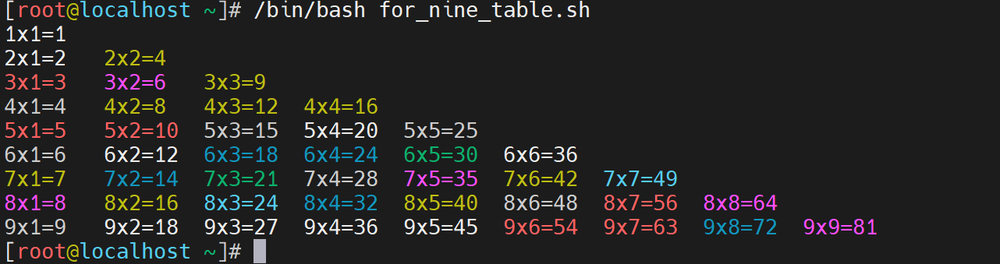

# 1 流程控制

## 1.1 for循环

### 1.1.1 嵌套循环

学习目标

这一节，我们从 基础知识、简单实践、小结 三个方面来学习。

**基础知识**

简介

```powershell
这里的嵌套实践，与选择语句的嵌套实践基本一致，只不过组合的方式发生了一些变化。常见的组合样式如下：
```

```powershell
for嵌套for语句
    for 循环列表1
    do
      	for 循环列表2
      	do
        	...
      	done
    done
```

```powershell
for嵌套if|case语句
    for 循环列表
    do
      	if 条件判断语句
      	或
      	case 条件判断语句
    done
```

```powershell
if语句嵌套for语句
	if 条件判断
	then
		for 循环列表语句
	fi
	
case语句嵌套for语句	
	case 条件判断
		for 循环列表语句
		;;
	esac
```


**简单实践**

for嵌套for语句实践1-输出99乘法表

```powershell
查看脚本内容
[root@localhost ~]# cat for_nine_table.sh
#!/bin/bash
# 功能：for打印99乘法表

# 定制打印99乘法表的业务逻辑
# 对第一个位置的数字进行循环
for num1 in {1..9}
do
    # 对第二个位置的数字进行循环
    for num2 in $(seq $num1)
    do
        # 信息输出,\t\c 的目的是删除后续信息，生成的内容是固定长度
        echo -e "\e[$[RANDOM%9+31]m${num1} x ${num2} = $[num1*num2]\e[0m\t\c"
    done
    echo # 一个子循环一行内容
done

脚本执行效果
```



for嵌套if语句实践2-判断目录中的文件类型

```powershell
准备工作
mkdir dir/{server,soft,scripts,logs} -p
touch dir/{{a..c}.sh,{1..3}.txt}
```

```powershell
查看脚本内容
[root@localhost ~]# cat file_type_for_if.sh
#!/bin/bash
# 功能：for嵌套if查看目录下的文件类型

# 定制普通变量
dir_name='dir'

# 获取所有文件列表
for file in $(ls dir)
do
    # 判断文件类型
    if [ -d ${dir_name}/${file} ]
    then
        echo -e "\e[31m${dir_name}/${file} 是一个目录文件\e[0m"
    elif [ -f ${dir_name}/${file} ]
    then
        echo -e "\e[31m${dir_name}/${file} 是一个普通文件\e[0m"
    fi
done
```

```powershell
脚本执行效果
[root@localhost ~]# /bin/bash file_type_for_if.sh
dir/1.txt 是一个普通文件
dir/2.txt 是一个普通文件
dir/3.txt 是一个普通文件
dir/a.sh 是一个普通文件
dir/b.sh 是一个普通文件
dir/c.sh 是一个普通文件
dir/logs 是一个目录文件
dir/scripts 是一个目录文件
dir/server 是一个目录文件
dir/soft 是一个目录文件
```

```powershell
收尾动作
[root@localhost ~]# rm -rf dir
```

if嵌套for语句实践3-获取系统支持的shell类型

```powershell
查看脚本内容
[root@localhost ~]# cat os_shell_if_for.sh
#!/bin/bash
# 功能：if嵌套for查看系统支持的shell类型

# 定制普通变量
shell_file='/etc/shells'

# 获取所有文件列表
if [ -f ${shell_file} ]
then
    for shell in $(grep sh /etc/shells)
    do
        echo -e "\e[31m当前系统支持的shell类型有: ${shell}\e[0m"
    done
else
    echo -e "\e[31m没有 ${shell_file} 文件\e[0m"
fi
```

```powershell
脚本执行效果
[root@localhost ~]# /bin/bash os_shell_if_for.sh
当前系统支持的shell类型有: /bin/sh
当前系统支持的shell类型有: /bin/bash
当前系统支持的shell类型有: /usr/bin/sh
当前系统支持的shell类型有: /usr/bin/bash
```


**小结**

```

```

### 1.1.2 综合案例

学习目标

这一节，我们从 信息收集、其他实践、小结 三个方面来学习。

**信息收集**

案例需求

```powershell
	根据提示信息，选择输出 cpu 或者 内存信息。
```

脚本实践-采集系统负载信息

```powershell
查看脚本内容
[root@localhost ~]# cat systemctl_load.sh
#!/bin/bash
# 功能：采集系统负载信息
# 版本：v0.2
# 作者：书记
# 联系：www.superopsmsb.com

# 定制资源类型
resource_type=(CPU MEM)
cpu_attribute=(1 5 15)
free_attribute=(总量 使用 空闲)

# 获取相关的属性信息
cpu_load=($(uptime | tr -s " " | cut -d " " -f 11-13 | tr "," " "))
free_info=($(free -m | grep Mem | tr -s " " | cut -d " " -f 2-4))
# 服务的操作提示
echo -e "\e[31m---------------查看资源操作动作---------------
 1: CPU  2: MEM
-------------------------------------------"'\033[0m'
# 选择服务操作类型
read -p "> 请输入要查看的资源信息类型: " resource_id
echo
if [ ${resource_type[$resource_id-1]} == "CPU" ]
then
    echo -e "\e[31m\t系统CPU负载信息\e[0m"
    echo -e "\e[32m================================"
    for index in ${!cpu_attribute[@]}
    do
        echo "CPU ${cpu_attribute[$index]} min平均负载为: ${cpu_load[$index]}" 
    done
    echo -e "================================\e[0m"
elif [ ${resource_type[$resource_id-1]} == "MEM" ]
then
    echo -e "\e[31m\t系统内存负载信息\e[0m"
    echo -e "\e[32m================================"
    for index in ${!free_attribute[@]}
    do
        echo "内存 ${free_attribute[$index]} 信息为: ${free_info[$index]} M" 
    done
    echo -e "================================\e[0m"
fi
```

```powershell
脚本使用效果
[root@localhost ~]# /bin/bash systemctl_load.sh
---------------查看资源操作动作---------------
 1: CPU  2: MEM
-------------------------------------------
> 请输入要查看的资源信息类型: 1

        系统CPU负载信息
================================
CPU 1 min平均负载为: 0.00
CPU 5 min平均负载为: 0.01
CPU 15 min平均负载为: 0.05
================================
[root@localhost ~]# /bin/bash systemctl_load.sh
---------------查看资源操作动作---------------
 1: CPU  2: MEM
-------------------------------------------
> 请输入要查看的资源信息类型: 2

        系统内存负载信息
================================
内存 总量 信息为: 3770 M
内存 使用 信息为: 247 M
内存 空闲 信息为: 3302 M
================================
```

**其他实践**

需求

```powershell
	按照信息提示，分别打印 三角形 和 等腰梯形
        *                  *****
       * *                *******
      * * *              *********
     * * * *            ***********
    * * * * *          *************	
```

脚本内容

```powershell
[root@localhost ~]# cat drawn_graph.sh
#!/bin/bash
# 功能：打印相关图形
# 版本：v0.1
# 作者：书记
# 联系：www.superopsmsb.com

graph_type=(三角形 梯形)
# 服务的操作提示
echo -e "\e[31m---------------查看可以绘制的图形---------------
 1: 三角形  2: 梯形
-------------------------------------------"'\033[0m'
# 选择服务操作类型
read -p "> 请输入要查看的资源信息类型: " graph_id
case ${graph_type[$graph_id-1]} in
    "三角形")
        read -p "> 请输入三角形绘制的层数: " layer_num
        # 定制打印n层的三角形
        for i in $(seq 1 ${layer_num});do
            # 定制打印三角形左侧的空格效果
            for m in $(seq $[${layer_num}-$i]);do
                echo -n " "
            done
            # 定制打印三角形核心部分
            for j in $(seq $i);do
                echo -n "* "
            done
            # 打印完每行就换行
            echo
        done;;
    "梯形")
        read -p "> 请输入梯形绘制的层数: " layer_num
        # 定制打印n层的梯形
        print_num=${layer_num}
        for i in $(seq 1 ${layer_num});do
            # 定制打印梯形左侧的空格效果
            for m in $(seq $[${layer_num}-$i]);do
                echo -n " "
            done
            # 定制打印梯形核心部分
            for j in $(seq $[$print_num]);do
                echo -n "*"
            done
            let print_num+=2
            echo
        done;;
    *)
        echo -e "\e[31m\t请输入正确的绘图类型id\e[0m";;
esac
```

```powershell
脚本执行效果
[root@localhost ~]# /bin/bash drawn_graph.sh
---------------查看可以绘制的图形---------------
 1: 三角形  2: 梯形
-------------------------------------------
> 请输入要查看的资源信息类型: 1
> 请输入三角形绘制的层数: 5
    *
   * *
  * * *
 * * * *
* * * * *
[root@localhost ~]# /bin/bash drawn_graph.sh
---------------查看可以绘制的图形---------------
 1: 三角形  2: 梯形
-------------------------------------------
> 请输入要查看的资源信息类型: 2
> 请输入梯形绘制的层数: 5
    *****
   *******
  *********
 ***********
*************
```


**小结**

```

```

## 1.2 while循环

### 1.2.1 while基础

学习目标

这一节，我们从 基础知识、简单实践、小结 三个方面来学习。

**基础知识**

简介

```powershell
	while命令有点像 if/then 和 for循环之间的结合，while走循环之前会对输入的值进行条件判断，如果满足条件的话，才会进入到循环体中执行对应的语句，否则的话就退出循环。
```

while语法解析

```powershell
场景：只要条件满足，就一直循环下去
    while [ 条件判断 ]
    do
       执行语句
    done
```

```powershell
注意：
    条件支持的样式 命令、[[ 字符串表达式 ]]、(( 数字表达式 ))
    true是一个特殊的条件，代表条件永远成立
```

**简单实践**

实践1-输出制定的范围数字

```powershell
[root@localhost ~]# cat while_num_list.sh
#!/bin/bash
# 功能：while的输出5范围以内的数字

# 定制初始变量值
a=1

# 定制内容输出逻辑
while [ "${a}" -le 5 ]
do
   echo -n "${a} "
   # 每输出一次数据，数据值+1
   a=$((a+1))
done
echo
```

```powershell
脚本执行后效果
[root@localhost ~]# /bin/bash while_num_list.sh
1 2 3 4 5
```


**小结**

```

```

### 1.2.2 while案例

学习目标

这一节，我们从 案例实践、read实践、小结 三个方面来学习。

**案例实践**

统计实践1- 计算1+2+...+100 的结果

```powershell
查看脚本内容
[root@localhost ~]# cat while_odd_num.sh
#!/bin/bash
# 功能：while统计数据之和

# 定制普通变量
all_sum=0
odd_sum=0

# 定制所有数据求和逻辑
i=1
while ((i<=100))
do
  let all_sum+=i
  let i++
done

# 定制所有奇数求和逻辑
i=1
while ((i<=100))
do
  let odd_sum+=i
  let i+=2
done

# 信息输出
echo -e "\e[31m所有数据之和: ${all_sum}\e[0m"
echo -e "\e[31m所有奇数之和: ${odd_sum}\e[0m"

脚本执行后效果
[root@localhost ~]# /bin/bash while_odd_num.sh
所有数据之和: 5050
所有奇数之和: 2500
```

实践2-持续检测网站存活

```powershell
查看文件内容
[root@localhost ~]# cat while_site_healthcheck.sh
#!/bin/bash
# 功能：定制站点的检测功能
# 版本：v0.1
# 作者：书记
# 联系：www.superopsmsb.com

# 定制普通变量
read -p "> 请输入待测试站点域名: " site_addr

# 持久检测站点状态
while true
do
  wget --spider -T5 -q -t2 ${site_addr} && echo "${site_addr} 站点正常" || echo "${site_addr} 站点异常"
  sleep 1
done
```

```powershell
脚本执行效果
[root@localhost ~]# /bin/bash while_site_healthcheck.sh
> 请输入待测试站点域名: www.baidu.com
www.baidu.com 站点正常
www.baidu.com 站点正常
...
```


**read实践**

功能简介

```powershell
	while中有一种特殊的语法，while read line 它可以从文本中逐行读取相关的内容，然后存储到一个临时变量line中，然后我们后续就可以逐行对文本内容进行操作
```

语法解读

```powershell
样式1： cat提前读				
cat a.log | while read line
do                         
    echo "File: ${line}"     
done                       
```

```powershell
样式2： exec提前读    
exec 0< a.log    
while read line  
do               
    echo "${line}"
done
```

```powershell
样式3：结尾导入读
while read line
do
    echo "File: ${line}"
done < a.log

```

```powershell
注意：
	方法1和3可以直接在命令行来实验，但是方法2必须在脚本中才能实验
```

实践1-命令行实践

```powershell
方法1实践读取文件
[root@localhost ~]# cat /etc/hosts | while read line;do echo "File: ${line}";done
File: 127.0.0.1   localhost localhost.localdomain localhost4 localhost4.localdomain4
File: ::1         localhost localhost.localdomain localhost6 localhost6.localdomain6

方法3实践读取文件
[root@localhost ~]# while read line;do echo "File: ${line}";done < /etc/hosts
File: 127.0.0.1   localhost localhost.localdomain localhost4 localhost4.localdomain4
File: ::1         localhost localhost.localdomain localhost6 localhost6.localdomain6
```

实践2-脚本实践

```powershell
方法2实践读取文件
[root@localhost ~]# cat while_read_file.sh
#!/bin/bash
# 功能：while的exec读取文件内容

# 定制普通变量
read -p "> 请输入待读取的文件路径: " file_path

# 持久检测站点状态
exec < ${file_path}    
while read line  
do               
    echo "File: ${line}"
done
```

```powershell
脚本执行效果
[root@localhost ~]# /bin/bash while_read_file.sh
> 请输入待读取的文件路径: /etc/hosts
File: 127.0.0.1   localhost localhost.localdomain localhost4 localhost4.localdomain4
File: ::1         localhost localhost.localdomain localhost6 localhost6.localdomain6
```

**小结**

```

```

### 1.2.3 嵌套案例

学习目标

这一节，我们从 基础知识、简单实践、小结 三个方面来学习。

**基础知识**

简介

```powershell
这里的嵌套实践，与选择语句的嵌套实践基本一致，只不过组合的方式发生了一些变化。常见的组合样式如下：
```

```powershell
while嵌套while语句
    while 循环条件
    do
    	while 循环条件语句
    done
```

```powershell
while嵌套if语句
    while 循环条件
    do
    	if 条件控制语句
    done	
```

**简单实践**

while嵌套while语句实践1-输出99乘法表

```powershell
查看脚本内容
[root@localhost ~]# cat while_nine_table.sh
#!/bin/bash
# 功能：while打印99乘法表

# 定制打印99乘法表的业务逻辑
# 对第一个位置的数字进行循环
num1=1
while [ ${num1} -le 9 ]
do
    # 对第二个位置的数字进行循环
    num2=1
    while [ ${num2} -le ${num1} ]
    do
        # 信息输出,\t\c 的目的是删除后续信息，生成的内容是固定长度
        echo -e "\e[$[RANDOM%9+31]m${num1}x${num2}=$[num1*num2]\e[0m\t\c"
        num2=$[$num2+1]
    done
    echo # 一个子循环一行内容
    num1=$[$num1+1]
done	
```

```powershell
脚本文件执行效果
[root@localhost ~]# /bin/bash while_nine_table.sh
1x1=1
2x1=2   2x2=4
3x1=3   3x2=6   3x3=9
4x1=4   4x2=8   4x3=12  4x4=16
5x1=5   5x2=10  5x3=15  5x4=20  5x5=25
6x1=6   6x2=12  6x3=18  6x4=24  6x5=30  6x6=36
7x1=7   7x2=14  7x3=21  7x4=28  7x5=35  7x6=42  7x7=49
8x1=8   8x2=16  8x3=24  8x4=32  8x5=40  8x6=48  8x7=56  8x8=64
9x1=9   9x2=18  9x3=27  9x4=36  9x5=45  9x6=54  9x7=63  9x8=72  9x9=81
```

while嵌套if语句实践2-手机发送短信1次/1毛，余额低于1毛提示无法发送请充值

```powershell
[root@localhost ~]# cat while_mobile_bill.sh
#!/bin/bash
# 功能：while提示收集发短信

# 定制普通变量
read -p "> 请输入收集话费余额(元): " mobile_bill

# 定制普通变量
sms_num=0
bull_count=$[$mobile_bill * 10]
while [ $bull_count -ge 0 ]
do
    sms_num=$(($sms_num+1))
    if [ $bull_count -lt 1 ];then
        echo "剩余费用不足，请充话费!"
    else
        echo "截至目前，您已发送 ${sms_num} 条短信。"
    fi
    bull_count=$(($bull_count-1))
    sleep 0.1
done
```

```powershell
脚本执行效果
[root@localhost ~]# /bin/bash while_mobile_bill.sh
> 请输入收集话费余额(元): 1
截至目前，您已发送 1 条短信。
截至目前，您已发送 2 条短信。
截至目前，您已发送 3 条短信。
截至目前，您已发送 4 条短信。
截至目前，您已发送 5 条短信。
截至目前，您已发送 6 条短信。
截至目前，您已发送 7 条短信。
截至目前，您已发送 8 条短信。
截至目前，您已发送 9 条短信。
截至目前，您已发送 10 条短信。
剩余费用不足，请充话费!
```

**小结**

```

```

## 1.3 until循环

### 1.3.1 until基础

学习目标

这一节，我们从 基础知识、简单实践、小结 三个方面来学习。

**基础知识**

简介

```powershell
	until命令本质上与while循环一致，区别在于until走循环之前会对输入的值进行条件判断，如果不满足条件的话，才会进入到循环体中执行对应的语句，否则的话就退出循环。
```

until语法解析

```powershell
场景：只要条件不满足，就一直循环下去
    until [ 条件判断 ]
    do
       执行语句
    done
```

```powershell
注意：
    条件支持的样式 命令、[[ 字符串表达式 ]]、(( 数字表达式 ))
    true是一个特殊的条件，代表条件永远成立
```

**简单实践**

实践1-输出制定的范围数字

```powershell
[root@localhost ~]# cat until_num_list.sh
#!/bin/bash
# 功能：until的输出5范围以内的数字

# 定制初始变量值
a=1

# 定制内容输出逻辑
until [ "${a}" -gt 5 ]
do
   echo -n "${a} "
   # 每输出一次数据，数据值+1
   a=$((a+1))
done
echo
```

```powershell
脚本执行后效果
[root@localhost ~]# /bin/bash until_num_list.sh
1 2 3 4 5
```

实践2- 计算1+2+...+100 的结果

```powershell
查看脚本内容
[root@localhost ~]# cat until_odd_num.sh
#!/bin/bash
# 功能：until统计数据之和

# 定制普通变量
all_sum=0
odd_sum=0

# 定制所有数据求和逻辑
i=1
until ((i>100))
do
  let all_sum+=i
  let i++
done

# 定制所有奇数求和逻辑
i=1
until ((i>100))
do
  let odd_sum+=i
  let i+=2
done

# 信息输出
echo -e "\e[31m所有数据之和: ${all_sum}\e[0m"
echo -e "\e[31m所有奇数之和: ${odd_sum}\e[0m"

脚本执行后效果
[root@localhost ~]# /bin/bash until_odd_num.sh
所有数据之和: 5050
所有奇数之和: 2500
```

**小结**

```

```

### 1.3.2 嵌套案例

学习目标

这一节，我们从 基础知识、简单实践、小结 三个方面来学习。

**基础知识**

简介

```powershell
这里的嵌套实践，与while语句的嵌套实践基本一致，只不过组合的方式发生了一些变化。常见的组合样式如下：
```

```powershell
until嵌套until语句
    until 循环条件
    do
    	until 循环条件语句
    done
```

```powershell
until嵌套if语句
    until 循环条件
    do
    	if 条件控制语句
    done	
```

**简单实践**

until嵌套until语句实践1-输出99乘法表

```powershell
查看脚本内容
[root@localhost ~]# cat until_nine_table.sh
#!/bin/bash
# 功能：until打印倒序99乘法表

# 定制打印99乘法表的业务逻辑
# 对第一个位置的数字进行循环
num1=9
until [ ${num1} -eq 0 ]
do
    # 对第二个位置的数字进行循环
    num2=1
    until [ ${num2} -gt ${num1} ]
    do
        # 信息输出,\t\c 的目的是删除后续信息，生成的内容是固定长度
        echo -e "\e[$[RANDOM%9+31]m${num1}x${num2}=$[num1*num2]\e[0m\t\c"
        num2=$[$num2+1]
    done
    num1=$[$num1-1]
    echo # 一个子循环一行内容
done	
```

```powershell
脚本文件执行效果
[root@localhost ~]# /bin/bash until_nine_table.sh
9x1=9   9x2=18  9x3=27  9x4=36  9x5=45  9x6=54  9x7=63  9x8=72  9x9=81
8x1=8   8x2=16  8x3=24  8x4=32  8x5=40  8x6=48  8x7=56  8x8=64
7x1=7   7x2=14  7x3=21  7x4=28  7x5=35  7x6=42  7x7=49
6x1=6   6x2=12  6x3=18  6x4=24  6x5=30  6x6=36
5x1=5   5x2=10  5x3=15  5x4=20  5x5=25
4x1=4   4x2=8   4x3=12  4x4=16
3x1=3   3x2=6   3x3=9
2x1=2   2x2=4
1x1=1
```

until嵌套if语句实践2-手机发送短信1次/1毛，余额低于1毛提示无法发送请充值

```powershell
[root@localhost ~]# cat until_mobile_bill.sh
#!/bin/bash
# 功能：until提示收集发短信

# 定制普通变量
read -p "> 请输入收集话费余额(元): " mobile_bill

# 定制普通变量
sms_num=0
bull_count=$[$mobile_bill * 10]
until [ $bull_count -lt 0 ]
do
    sms_num=$(($sms_num+1))
    if [ $bull_count -lt 1 ];then
        echo "剩余费用不足，请充话费!"
    else
        echo "截至目前，您已发送 ${sms_num} 条短信。"
    fi
    bull_count=$(($bull_count-1))
    sleep 0.1
done
```

```powershell
脚本执行效果
[root@localhost ~]# /bin/bash until_mobile_bill.sh
> 请输入收集话费余额(元): 1
截至目前，您已发送 1 条短信。
截至目前，您已发送 2 条短信。
截至目前，您已发送 3 条短信。
截至目前，您已发送 4 条短信。
截至目前，您已发送 5 条短信。
截至目前，您已发送 6 条短信。
截至目前，您已发送 7 条短信。
截至目前，您已发送 8 条短信。
截至目前，您已发送 9 条短信。
截至目前，您已发送 10 条短信。
剩余费用不足，请充话费!
```

实践1-

```powershell

```

**小结**

```

```

## 1.4 循环控制

### 1.4.1 控制解析

学习目标

这一节，我们从 基础知识、简单实践、小结 三个方面来学习。

**基础知识**

简介

```powershell
	所谓的流程控制，主要针对的是，当我们处于流程步骤执行的过程中，因为某些特殊的原因，不得不停止既定的操作进行步骤的调整，常见的临时调整场景如下：
```

```powershell
continue控制
	- 满足条件的情况下，临时停止当前的循环，直接进入到下一循环
break控制
	- 满足条件的情况下，提前退出当前的循环
exit控制
	- 直接退出当前循环的程序
shift控制
	- 依次从循环列表中读取读取内容，并将读取的内容从列表中剔除
```


**简单实践**

exit简介

```powershell
	exit在shell中是一个特殊的程序退出信号，不仅仅可以直接退出当前程序，还可以设定退出后的状态返回值，使用方式如下：
		exit num
```

```powershell
注意：
	1 在脚本中遇到exit命令，脚本立即终止；终止退出状态取决于exit命令后面的数字
	2 如果exit后面无数字,终止退出状态取决于exit命令前面命令执行结果
```

实践1- 设定退出状态值

```powershell
网段内主机地址的存活性探测
[root@192 ~]# ping -c1 -W1 10.0.0.12 &> /dev/null && echo '10.0.0.12 is up' || (echo '10.0.0.12 is unreachable'; exit 1)
10.0.0.12 is up
[root@192 ~]# ping -c1 -W1 10.0.0.13 &> /dev/null && echo '10.0.0.13 is up' || (echo '10.0.0.13 is unreachable'; exit 6)
10.0.0.13 is unreachable
[root@192 ~]# echo $?
6

服务器网址探测
[root@192 ~]# curl -s -o /dev/null baidu.com &> /dev/null && echo 'baidu.com is up' || (echo 'baidu.com is unreachable'; exit 7)
baidu.com is up
[root@192 ~]# curl -s -o /dev/null baidu.com1 &> /dev/null && echo 'baidu.com1 is up' || (echo 'baidu.com1 is unreachable'; exit 7)
baidu.com1 is unreachable
[root@192 ~]# echo $?
7
```

实践2-嵌套循环中exit退出程序

```powershell
查看脚本内容
[root@localhost ~]# cat exit_multi_for.sh
#!/bin/bash
# 功能：exit退出脚本程序

# 外层循环遍历1-5
for var1 in {1..5}
do
   # 内层循环遍历a-d
   for var2 in {a..d}
   do
      # 判断退出条件，var1是2或者var2是c就退出内层循环
      if [ $var1 -eq 2 -o "$var2" == "c" ]
      then
         exit 111
      else
         echo "$var1 $var2"
      fi
   done
done
```

```powershell
脚本执行效果
[root@192 ~]# /bin/bash exit_multi_for.sh
1 a
1 b
[root@192 ~]# echo $?
111
结果显示：
	一旦匹配到任何一个信息，就直接退出程序，而且状态码还是我们定制的。
```

**小结**

```

```

### 1.4.2 break实践

学习目标

这一节，我们从 基础知识、简单实践、小结 三个方面来学习。

**基础知识**

简介

```powershell
	break命令是在处理过程中终止循环的一种简单方法。可以使用break命令退出任何类型的循环，包括for、while、until等。
```

```powershell
break主要有两种场景的表现样式：
	单循环场景下，break是终止循环
		- 仅有一层 while 、for、until等
	嵌套循环场景下，break是可以终止内层循环和外层循环。
		- 存在多层while、for、until嵌套等
```

语法格式

```powershell
break语法格式：
	for 循环列表
	do
	    ...
	    break num
	done
	注意：
		单循环下，break就代表退出循环
		多循环下，break的num大于嵌套的层数，就代表退出循环
```

**简单实践**

实践1-break终止单层循环

```powershell
查看脚本内容
[root@localhost ~]# cat break_single_while.sh
#!/bin/bash
# 功能：break退出单层循环
while true
do
    read -p "输入你的数字，最好在 1 ~ 5: " aNum
    case $aNum in
        1|2|3|4|5)
          echo "你的数字是 $aNum!"
        ;;
        *)
          echo "你选择的数字没在 1 ~ 5, 退出!"
          break
        ;;
    esac
done
```

```powershell
[root@localhost ~]# /bin/bash break_single_while.sh
输入你的数字，最好在 1 ~ 5: 2
你的数字是 2!
输入你的数字，最好在 1 ~ 5: 5
你的数字是 5!
输入你的数字，最好在 1 ~ 5: 6
你选择的数字没在 1 ~ 5, 退出!

结果显示：
	一旦出发break，当前循环就终止了
```

实践2-多层循环下break退出内层循环

```powershell
[root@localhost ~]# cat break_multi_in_while.sh
#!/bin/bash
# 功能：break退出内层循环

# 外层循环遍历1-5
for var1 in {1..5}
do
   # 内层循环遍历a-d
   for var2 in {a..d}
   do
      # 判断退出条件，var1是2或者var2是c就退出内层循环
      if [ $var1 -eq 2 -o "$var2" == "c" ]
      then
         break
      else
         echo "$var1 $var2"
      fi
   done
done
```

```powershell
脚本执行效果
[root@localhost ~]# /bin/bash break_multi_in_while.sh
1 a
1 b
3 a
3 b
4 a
4 b
5 a
5 b
结果显示：
	一旦出发break，则匹配内容及其后面的信息就不再输出了
```

实践3-多层循环下break退出外层循环

```powershell
[root@localhost ~]# cat break_multi_out_while.sh
#!/bin/bash
# 功能：break退出外层循环

# 外层循环遍历1-5
for var1 in {1..5}
do
   # 内层循环遍历a-d
   for var2 in {a..d}
   do
      # 判断退出条件，var1是2或者var2是c就退出内层循环
      if [ $var1 -eq 2 -o "$var2" == "c" ]
      then
         break 2
      else
         echo "$var1 $var2"
      fi
   done
done
```

```powershell
脚本执行效果
[root@localhost ~]# /bin/bash break_multi_out_while.sh
1 a
1 b
结果显示：
	一旦匹配内层，则直接终止外层的循环
```


**小结**

```

```

### 1.4.3 continue实践

学习目标

这一节，我们从 基础知识、简单实践、小结 三个方面来学习。

**基础知识**

简介

```powershell
	continue命令是在处理过程中跳出循环的一种简单方法。可以使用continue命令跳出当前的循环直接进入到下一个循环，包括for、while、until等。
```

```powershell
continue主要有两种场景的表现样式：
	单循环场景下，continue是跳出当前循环
		- 仅有一层 while 、for、until等
	嵌套循环场景下，continue是可以跳出内层循环和外层循环。
		- 存在多层while、for、until嵌套等
```

语法格式

```powershell
continue语法格式：
	for 循环列表
	do
	    ...
	    continue num
	done
	注意：
		单循环下，continue就代表跳出当前循环
		多循环下，continue的num就代表要继续的循环级别
```

**简单实践**

实践1-continue跳出当前单层循环

```powershell
查看脚本内容
[root@localhost ~]# cat continue_single_while.sh
#!/bin/bash
# 功能：continue退出单层循环
while true
do
    read -p "输入你的数字，最好在 1 ~ 5: " aNum
    case $aNum in
        1|2|3|4|5)
          echo "你的数字是 $aNum!"
        ;;
        *)
          echo "你选择的数字没在 1 ~ 5, 退出!"
          continue
        ;;
    esac
done
```

```powershell
[root@localhost ~]# /bin/bash continue_single_while.sh
输入你的数字，最好在 1 ~ 5: 2
你的数字是 2!
输入你的数字，最好在 1 ~ 5: 6
你选择的数字没在 1 ~ 5, 退出!
输入你的数字，最好在 1 ~ 5: 1
你的数字是 1!
输入你的数字，最好在 1 ~ 5: ^C

结果显示：
	即使输出的数据不是我们想要的，也不会退出循环逻辑
```

实践2-多层循环下continue退出内层循环

```powershell
[root@localhost ~]# cat continue_multi_in_while.sh
#!/bin/bash
# 功能：continue退出内层循环

# 外层循环遍历1-5
for var1 in {1..5}
do
   # 内层循环遍历a-d
   for var2 in {a..d}
   do
      # 判断退出条件，var1是2或者var2是c就退出内层循环
      if [ $var1 -eq 2 -o "$var2" == "c" ]
      then
         continue
      else
         echo "$var1 $var2"
      fi
   done
done
```

```powershell
脚本执行效果
[root@localhost ~]# /bin/bash break_multi_in_while.sh
1 a
1 b
1 d
3 a
3 b
3 d
4 a
4 b
4 d
5 a
5 b
5 d

结果显示：
	满足条件的信息，都直接跳到下一循环，继续执行，可以看到内层的d信息输出了
```

实践3-多层循环下break退出外层循环

```powershell
[root@localhost ~]# cat continue_multi_out_while.sh
#!/bin/bash
# 功能：continue退出外层循环

# 外层循环遍历1-5
for var1 in {1..5}
do
   # 内层循环遍历a-d
   for var2 in {a..d}
   do
      # 判断退出条件，var1是2或者var2是c就退出内层循环
      if [ $var1 -eq 2 -o "$var2" == "c" ]
      then
         continue 2
      else
         echo "$var1 $var2"
      fi
   done
done
```

```powershell
脚本执行效果
[root@localhost ~]# /bin/bash continue_multi_out_while.sh
1 a
1 b
3 a
3 b
4 a
4 b
5 a
5 b
结果显示：
	满足条件的信息，直接将外层循环跳到下一循环，继续执行，可以看到外层的3-5信息输出了
```

**小结**

```

```

### 1.4.4 shift实践

学习目标

这一节，我们从 基础知识、简单实践、小结 三个方面来学习。

**基础知识**

简介

```powershell
	shift是一个特殊的循环控制命令，它的特点主要是依次从输入信息列表中获取相关的参数数据值，然后走循环。
```

语法解读

```powershell
continue语法格式：
	for 循环列表
	do
	    ...
	    shift
	done
	注意：
		shift 从用户输入的信息中提取第一个位置的数据内容，每走一个循环，从下一个位置获取输入参数
```

**简单实践**

实践1-依次获取所有参数的内容

```powershell
查看脚本效果
[root@localhost ~]# cat shift_get_args.sh
#!/bin/bash
#功能：shift依次从输入的参数列表中获取内容

# 定制一套循环逻辑，直到参数位置内容为空
until [ -z "$1" ] 
do
   echo "脚本的第1个位置参数内容是: $1, 当前脚本参数数量: $#"
   # 接收完第一个参数后，直接将起始值移至下一个位置
   shift
done
```

```powershell
脚本执行效果
[root@localhost ~]# /bin/bash shift_get_args.sh aa bb cc dd ee
脚本的第1个位置参数内容是: aa, 当前脚本参数数量: 5
脚本的第1个位置参数内容是: bb, 当前脚本参数数量: 4
脚本的第1个位置参数内容是: cc, 当前脚本参数数量: 3
脚本的第1个位置参数内容是: dd, 当前脚本参数数量: 2
脚本的第1个位置参数内容是: ee, 当前脚本参数数量: 1
结果显示：
	每次从脚本的第一个位置获取的内容在逐渐变化中。
```

实践2-创建指定的系统用户

```powershell
查看脚本效果
[root@localhost ~]# cat shift_add_user.sh
#!/bin/bash
# 功能：shift批量创建指定的用户
# 提示：
# /dev/random和/dev/urandom设备文件会生成随机数，第一个依赖系统中断

# 定制普通变量
user_file='/tmp/user.txt'

# 保证文件可用
[ -f ${user_file} ] && > ${user_file}

# 定制批量创建用户的业务逻辑
if [ $# -ne 0 ]
then
    # 注意: 这里用的是 -n，后面的$1两侧要有"",如果用until语句的话使用 -z表达式
    while [ -n "$1" ]
    do
        # 创建用户
        useradd $1
        # 生成密码
        password=$(head /dev/urandom | tr -dc '[:alnum:]' | head -c 8)
        # 为用户添加密码
        echo ${password} | passwd --stdin $1 > /dev/null 2>&1
        # 信息输出
        echo "用户: $1, 密码: ${password}" >> ${user_file}
        echo -e "\e[31m用户 $1 创建成功\e[0m"
        # 移动输入参数
        shift
    done
else
    echo -e "\e[31mUsage: /bin/bash $0 arg_list\e[0m"
fi
```

```powershell
查看脚本执行效果
[root@localhost ~]# /bin/bash shift_add_user.sh
Usage: /bin/bash shift_add_user.sh arg_list
[root@localhost ~]# /bin/bash shift_add_user.sh zhangsan lisi wangwu zhaoliu
用户 zhangsan 创建成功
用户 lisi 创建成功
用户 wangwu 创建成功
用户 zhaoliu 创建成功
[root@localhost ~]# cat /tmp/user.txt
用户: zhangsan, 密码: 4m4njspn
用户: lisi, 密码: sFEFcecC
用户: wangwu, 密码: rsDmtkcQ
用户: zhaoliu, 密码: Ehsj2fZo
```


**小结**

```

```

## 1.5 select条件控制

### 1.5.1 基础实践

学习目标

这一节，我们从 基础知识、简单实践、小结 三个方面来学习。

**基础知识**

简介

```powershell
	select和其他循环控制不一样，它一般用来增强交互性，它可以显示出带编号的菜单，用户输入不同的编号就可以选择不同的菜单，并执行不同的功能。
	虽然select本身就是循环，但是select的循环仅限于接收列表中的输入信息，所以在生产中，我们一般将Select 搭配 case来使用，从而实现更为复杂的菜单控制选项。


select 表达式是一种bash的扩展应用，动作包括：
    自动用1,2,3,4列出菜单 （ 没有echo指令，自动显示菜单）
    自动read输入选择 （ 没有 read指令，自动输入）
    赋值给变量  （ 没有赋值指令，自动输入数字后，赋值字符串给变量）
```

语法解读

```powershell
select 变量名 in  input_list 
do 
    循环语句 
done
```

```powershell
语法解读：
	1 select 从 input_list 获取相关的值，然后输出到一个菜单列表，元素格式如下：
		序号) 菜单条目
	2 用户输入信息的标识使用PS3 的值，默认值是#?。
		我们可以定制PS3环境变量
	3 如果用户输入菜单序号，则输出菜单内容
	4 select的退出方式有很多种
		强制退出：Ctrl+D 组合键
		普通退出：结合break方式
```

**简单实践**

实践1-语法实践

```powershell
[root@localhost ~]# cat simple_select.sh
#!/bin/bash
# select语句的使用

# 定制select循环逻辑
echo "您喜欢的操作系统是?"
select osname in "HarmonyOS" "Linux" "Windows" "Ubuntu"
do   
    echo "您选择的操作系统是: $osname."
done
```

```powershell
脚本执行效果
[root@localhost ~]# /bin/bash simple_select.sh
您喜欢的操作系统是?
1) HarmonyOS
2) Linux
3) Windows
4) Ubuntu
#? 5
您选择的操作系统是: .
#? 2
您选择的操作系统是: Linux.
#?						# 使用Ctrl + D 方式退出循环
```

实践2-定制信息+优雅退出

```powershell
[root@localhost ~]# cat simple_select.sh
#!/bin/bash
# select语句的使用

# 定制普通环境变量
PS3='请选择菜单序号: '

# 定制select循环逻辑
echo "您喜欢的操作系统是?"
select osname in "HarmonyOS" "Linux" "Windows" "Ubuntu"
do   
    echo "您选择的操作系统是: $osname."
    break  
done
```

```powershell
脚本执行效果
[root@localhost ~]# /bin/bash simple_select.sh
您喜欢的操作系统是?
1) HarmonyOS
2) Linux
3) Windows
4) Ubuntu
请选择菜单序号: 1
您选择的操作系统是: HarmonyOS.
[root@localhost ~]# 
```

**小结**

```

```

### 1.5.2 案例实践

学习目标

这一节，我们从 case实践、软件部署、小结 三个方面来学习。

**case实践**

实践3-整合case实践

```powershell
查看脚本内容
[root@localhost ~]# cat simple_select_case.sh
#!/bin/bash
# select语句的使用

# 定制普通环境变量
PS3='请选择菜单序号: '

# 定制select循环逻辑
echo "您喜欢的操作系统是?"
select osname in "HarmonyOS" "Linux" "Windows" "Ubuntu"
do
    echo "-----------------------------"
    case $osname in
        "HarmonyOS")
            echo -e "\e[31m$osname 是华为推出的操作系统。\e[0m"
            break;;
        "Linux")
            echo -e "\e[31m$osname 是比较常用的操作系统。\e[0m"
            break;;
        "Windows")
            echo -e "\e[31m$osname 是一个桌面的操作系统。\e[0m"
            break;;
        "Ubuntu")
            echo -e "\e[31m$osname 是一个很好的操作系统。\e[0m"
            break;;
        *)
            echo -e "\e[31m您输入的是无效信息，再来一次!!!\e[0m"
            break;;
    esac  
done
```

```powershell
[root@localhost ~]# /bin/bash simple_select_case.sh
您喜欢的操作系统是?
1) HarmonyOS
2) Linux
3) Windows
4) Ubuntu
请选择菜单序号: 1
-----------------------------
HarmonyOS 是华为推出的一款面向万物互联的全场景分布式操作系统。
[root@localhost ~]# /bin/bash simple_select_case.sh
您喜欢的操作系统是?
1) HarmonyOS
2) Linux
3) Windows
4) Ubuntu
请选择菜单序号: 5
-----------------------------
您输入的是无效信息，再来一次!!!
```

**软件部署**

select定制安装软件的界面功能

```powershell
[root@localhost ~]# cat soft_install_select.sh
#!/bin/bash
# 功能：定制软件应用的部署功能
# 版本：v0.1
# 作者：书记
# 联系：www.superopsmsb.com

# 定制普通环境变量
PS3='请选择软件序号: '

# 定制数组变量
soft_name=(Nginx Apache Tomcat)
# 定制select循环逻辑
echo "您需要安装的Web软件是?"
select soft in ${soft_name[@]}
do
    echo "-----------------------------"
    case $soft in
        "Nginx")
            echo -e "\e[31m开始安装 $soft 软件环境...\e[0m"
            break;;
        "Apache")
            echo -e "\e[31m开始安装 $soft 软件环境...\e[0m"
            break;;
        "Tomcat")
            echo -e "\e[31m开始安装 $soft 软件环境...\e[0m"
            break;;
        *)
            echo -e "\e[31m您输入的是无效信息，再来一次!!!\e[0m"
            break;;
    esac  
done
```

```powershell
脚本执行效果
[root@localhost ~]# /bin/bash soft_install_select.sh
您需要安装的Web软件是?
1) Nginx
2) Apache
3) Tomcat
请选择软件序号: 1
-----------------------------
开始安装 Nginx 软件环境...
[root@localhost ~]# /bin/bash soft_install_select.sh
您需要安装的Web软件是?
1) Nginx
2) Apache
3) Tomcat
请选择软件序号: 4
-----------------------------
您输入的是无效信息，再来一次!!!
```

**小结**

```

```

# 2 流程控制

## 2.1 函数基础

### 2.1.1 基础知识

这一节，我们从 基础知识、简单实践、小结 三个方面来学习。

**基础知识**

场景需求

```powershell
	在shell脚本的编写过程中，我们经常会遇到一些功能代码场景：多条命令组合在一起，实现一个特定的功能场景逻辑、一些命令在脚本内部的多个位置频繁出现。在这些场景的代码量往往不多，但是频繁使用的话，会导致脚本的整体逻辑脉络比较松散和框架散乱。
	所以我们需要一种脚本逻辑，不仅仅能够满足松散代码的功能目的，还能精简重复的代码。函数就是来满足这种场景的解决方案 -- 而函数，也是所谓的面向对象编程的一种表现样式。
```

函数

```powershell
	所谓的函数，本质上就是一段能够满足特定功能的代码块。一旦定义好函数代码后，我们就可以在脚本的很多位置随意的使用。
	定义功能代码块的动作叫 函数定义，使用函数代码的动作叫 函数调用。
```

```powershell
函数的优势：
	1. 代码模块化，调用方便，节省内存
    2. 代码模块化，代码量少，排错简单
    3. 代码模块化，可以改变代码的执行顺序
```

基本语法

```powershell
定义函数：
	样式1：标准格式
    function 函数名{		
        函数体				
    }						
	样式2：简约格式
    函数名() {		
        函数体				
    }
注意：
	function 的作用和 () 的作用是一样的，都是定义一个函数。
	函数的名称是自定义的，而且在脚本范围内必须唯一。
	函数体内是普通的能够正常执行的命令，命令的执行流程符合顺序逻辑。
```

```powershell
调用函数：			
	函数名					
注意：
	函数名出现在任何位置，就代表在该位置调用函数内代码块的执行。
	函数名一般在函数定义后调用，否则的话会发生报错。
```


**简单实践**

实践1-标准函数的实践

```powershell
[root@localhost ~]# cat function_simple_test.sh
#!/bin/bash
# 功能：简单函数的定义和调用

# 定制一个函数,提示脚本的使用方式
function Usage {
    echo -e "\e[31m脚本的使用帮助信息: xxx\e[0m"
}

# 定制脚本使用逻辑
if [ $# -eq 1 ]
then
    echo "您输入的脚本参数是1个"
else
    Usage
fi
```

```powershell
脚本执行效果
[root@localhost ~]# /bin/bash function_simple_test.sh
脚本的使用帮助信息: xxx
[root@localhost ~]# /bin/bash function_simple_test.sh aa
您输入的脚本参数是1个
[root@localhost ~]# /bin/bash function_simple_test.sh aa bb
脚本的使用帮助信息: xxx
```

实践2-变种函数的实践

```powershell
[root@localhost ~]# cat function_simple_test2.sh
#!/bin/bash
# 功能：简单函数的定义和调用

# 定制一个函数,提示脚本的使用方式
Usage() {
    echo -e "\e[31m脚本的使用帮助信息: xxx\e[0m"
}

# 定制脚本使用逻辑
if [ $# -eq 1 ]
then
    echo "您输入的脚本参数是1个"
else
    Usage
fi
```

```powershell
脚本执行效果
[root@localhost ~]# /bin/bash function_simple_test2.sh
脚本的使用帮助信息: xxx
[root@localhost ~]# /bin/bash function_simple_test2.sh aa
您输入的脚本参数是1个
[root@localhost ~]# /bin/bash function_simple_test2.sh aa bb
脚本的使用帮助信息: xxx
```

实践3-函数的调用顺序和名称唯一 实践

```powershell
[root@localhost ~]# cat function_simple_test3.sh
#!/bin/bash
# 功能：简单函数的定义和调用

# 定制一个函数,提示脚本的使用方式
Usage() {
    echo -e "\e[31m脚本的使用帮助信息: xxx\e[0m"
}
echo "第一次调用效果: "
Usage

# 定制同名的函数,提示脚本的使用方式
Usage() {
    echo -e "\e[31m脚本的使用帮助信息-------: xxx\e[0m"
}
# 定制脚本使用逻辑
if [ $# -eq 1 ]
then
    # 调用一个后面才会生成的函数
    func
else
    Usage
fi

# 定制一个函数
func() {
    echo "您输入的脚本参数是1个"
}

```

```powershell
脚本执行效果
[root@localhost ~]# /bin/bash function_simple_test3.sh
第一次调用效果:
脚本的使用帮助信息: xxx
脚本的使用帮助信息-------: xxx
[root@localhost ~]# /bin/bash function_simple_test3.sh a
第一次调用效果:
脚本的使用帮助信息: xxx
function_simple_test3.sh:行18: func: 未找到命令

结果显示：
	函数名称重复的话，会导致同名函数被覆盖
	函数在没有定义前调用的话，会导致异常报错
```

**小结**

```

```


### 2.1.2 函数退出

这一节，我们从 基础知识、简单实践、小结 三个方面来学习。

**基础知识**

简介

```powershell
	我们可以将函数代码块，看成shell脚本内部的小型脚本，所以说函数代码块也会有执行状态返回值。对于函数来说，它通常支持两种种状态返回值的样式。
```

```powershell
样式1-默认的退出状态
	默认情况下，函数的退出状态是函数体内的最后一条命令的退出状态，可以通过 $? 来获取
样式2-return定制状态返回值
	在函数体内部，通过return定制状态返回值的内容
	注意：
		return的状态返回值必须尽快使用，否则会被其他return的值覆盖
		return的状态返回值必须在 0-255，否则失效
```

**简单实践**

实践1-默认退出状态

```powershell
[root@localhost ~]# cat function_exit_status1.sh
#!/bin/bash
# 功能：函数默认状态返回值

# 定制成功运行的函数
ok_func() {
    echo -e "\e[31m脚本的使用帮助信息: xxx\e[0m"
}
# 定制一个运行失败的函数
err_func() {
    666666
}
# 定制脚本使用逻辑
if [ $# -eq 1 ]
then
    err_func
    echo "错误函数的执行状态返回值: " $?
else
    ok_func
    echo "成功函数的执行状态返回值: " $?
fi
```

```powershell
脚本执行效果
[root@localhost ~]# /bin/bash function_exit_status1.sh
脚本的使用帮助信息: xxx
成功函数的执行状态返回值:  0
[root@localhost ~]# /bin/bash function_exit_status1.sh aa
function_exit_status1.sh:行10: 666666: 未找到命令
错误函数的执行状态返回值:  127
[root@localhost ~]# lll; echo $?
bash: lll: 未找到命令
127
结果显示：
	对于异常的函数来说，默认的状态返回值有安全隐患
```

实践2-return定制函数的返回值实践

```powershell
[root@localhost ~]# cat function_exit_status2.sh
#!/bin/bash
# 功能：return定制函数状态返回值

# 定制成功运行的函数
ok_func() {
    echo -e "\e[31m脚本的使用帮助信息: xxx\e[0m"
    # 定制超范围的状态返回值
    return 666
}
# 定制一个运行失败的函数
err_func() {
    666666
    # 定制状态返回值
    return 222
}
# 定制脚本使用逻辑
if [ $# -eq 1 ]
then
    err_func
    echo "错误函数的执行状态返回值: " $?
else
    ok_func
    echo "成功函数的执行状态返回值: " $?
fi
```

```powershell
脚本执行效果
[root@localhost ~]# /bin/bash function_exit_status2.sh
脚本的使用帮助信息: xxx
成功函数的执行状态返回值:  154
[root@localhost ~]# /bin/bash function_exit_status2.sh aa
function_exit_status2.sh:行12: 666666: 未找到命令
错误函数的执行状态返回值:  222
结果显示：
	return的状态返回值范围必须满足要求
```

**小结**

```

```


### 2.1.3 进阶实践

这一节，我们从 传参函数、脚本传参、小结 三个方面来学习。

**传参函数**

简介

```powershell
	简单的函数定义和调用的实践，我们只能实现固定内容的输出，不具有灵活性。其实函数作为shell脚本内部的小脚本也支持脚本传参的一系列能力。基本语法效果如下
```

```powershell
定义函数：
    函数名() {		
        函数体	${变量名}			
    }
注意：
	函数体内通过 ${变量名} 来实现函数体的功能通用性。
```

```powershell
调用函数：			
	函数名 参数			
注意：
	函数在调用的时候，接收一些参数并传输到函数体内部。
```

实践1-传参函数实践

```powershell
查看脚本内容
[root@localhost ~]# cat function_arg_input.sh
#!/bin/bash
# 功能：传参函数定义和调用

# 定制数据运算的函数
add_func() {
    echo $(( $1 + $2 ))
}
sub_func() {
    echo $(( $1 - $2 ))
}
mul_func() {
    echo $(( $1 * $2 ))
}
div_func() {
    echo $(( $1 / $2 ))
}

echo -n "4+3="; add_func 4 3
echo -n "4-3="; sub_func 4 3
echo -n "4*3="; mul_func 4 3
echo -n "4/3="; div_func 4 3
```

```powershell
脚本执行效果
[root@localhost ~]# /bin/bash function_arg_input.sh
4+3=7
4-3=1
4*3=12
4/3=1
```

**脚本传参**

简介

```powershell
	传参函数定义和调用的实践，实现了函数层面的灵活性，但是它受到函数调用本身的参数限制。往往这些参数我们需要在脚本执行的时候传递进去，从而实现脚本功能的灵活性。
	基本语法效果如下
```

```powershell
定义函数：
    函数名() {		
        函数体	${函数参数}			
    }
    
调用函数:
	函数名	${脚本参数}

脚本执行:
	/bin/bash /path/to/scripts.sh arg
	
注意：
	由于脚本内部调用脚本参数和函数体内调用函数参数都遵循位置变量的使用
	所以，一般情况下，我们会借助于临时变量的方式接收各自的参数，从而避免引起误会
```

实践1-脚本传参函数实践

```powershell
查看脚本内容
[root@localhost ~]# cat function_arg_scripts.sh
#!/bin/bash
# 功能：脚本传参函数调用

# 定制数据运算的函数
add_func() {
    echo $(( $1 + $2 ))
}
sub_func() {
    echo $(( $1 - $2 ))
}
mul_func() {
    echo $(( $1 * $2 ))
}
div_func() {
    echo $(( $1 / $2 ))
}

[ $# -ne 2  ] && echo "必须传递两个数字参数" && exit
echo -n "$1+$2="; add_func $1 $2
echo -n "$1-$2="; sub_func $1 $2
echo -n "$1*$2="; mul_func $1 $2
echo -n "$1/$2="; div_func $1 $2

注意：
	这种简单的脚本传参函数调用，导致大量的位置参数，容易引起混乱，需要改造
```

```powershell
脚本执行效果
[root@localhost ~]# /bin/bash function_arg_scripts.sh
必须传递两个数字参数
[root@localhost ~]# /bin/bash function_arg_scripts.sh 5 4
5+4=9
5-4=1
5*4=20
5/4=1
```

实践2-脚本传参函数进阶实践

```powershell
查看脚本内容
[root@localhost ~]# cat function_arg_scripts2.sh
#!/bin/bash
# 功能：传参函数定义和调用

# 接收脚本传参
arg1=$1
arg2=$2
# 定制数据运算的函数
add_func() {
    num1=$1
    num2=$2
    echo $(( ${num1} + ${num2} ))
}
sub_func() {
    num1=$1
    num2=$2
    echo $(( ${num1} - ${num2} ))
}
mul_func() {
    num1=$1
    num2=$2
    echo $(( ${num1} * ${num2} ))
}
div_func() {
    num1=$1
    num2=$2
    echo $(( ${num1} / ${num2} ))
}

[ $# -ne 2  ] && echo "必须传递两个数字参数" && exit
echo -n "${arg1}+${arg2}="; add_func ${arg1} ${arg2}
echo -n "${arg1}-${arg2}="; sub_func ${arg1} ${arg2}
echo -n "${arg1}*${arg2}="; mul_func ${arg1} ${arg2}
echo -n "${arg1}/${arg2}="; div_func ${arg1} ${arg2}
```

```powershell
脚本执行效果
[root@localhost ~]# /bin/bash function_arg_scripts2.sh
必须传递两个数字参数
[root@localhost ~]# /bin/bash function_arg_scripts2.sh 7 5
7+5=12
7-5=2
7*5=35
7/5=1
```

**小结**

```

```


### 2.1.4 综合案例

这一节，我们从 信息采集、环境部署、小结 三个方面来学习。

**信息采集**

脚本实践-采集系统负载信息

```powershell
查看脚本内容
[root@localhost ~]# cat function_systemctl_load.sh
#!/bin/bash
# 功能：采集系统负载信息
# 版本：v0.3
# 作者：书记
# 联系：www.superopsmsb.com

# 定制资源类型
resource_type=(CPU MEM)


# 定制cpu信息输出函数
cpu_info() {
	cpu_attribute=(1 5 15)
	cpu_load=($(uptime | tr -s " " | cut -d " " -f 11-13 | tr "," " "))
    echo -e "\e[31m\t系统CPU负载信息\e[0m"
    echo -e "\e[32m================================"
    for index in ${!cpu_attribute[@]}
    do
        echo "CPU ${cpu_attribute[$index]} min平均负载为: ${cpu_load[$index]}" 
    done
    echo -e "================================\e[0m"	
}
# 获取内存相关属性信息
mem_info() {
	free_attribute=(总量 使用 空闲)
	free_info=($(free -m | grep Mem | tr -s " " | cut -d " " -f 2-4))
    echo -e "\e[31m\t系统内存负载信息\e[0m"
    echo -e "\e[32m================================"
    for index in ${!free_attribute[@]}
    do
        echo "内存 ${free_attribute[$index]} 信息为: ${free_info[$index]} M" 
    done
    echo -e "================================\e[0m"
}

# 服务的操作提示
echo -e "\e[31m---------------查看资源操作动作---------------
 1: CPU  2: MEM
-------------------------------------------"'\033[0m'
# 选择服务操作类型
while true
do
    read -p "> 请输入要查看的资源信息类型: " resource_id
    echo
    case ${resource_type[$resource_id-1]} in
       "CPU")
            cpu_info;;
        "MEM")
            mem_info;;
        *)
            echo -e "\e[31m\t请输入有效的信息类型\e[0m";;
    esac
done
```

```powershell
脚本使用效果
[root@localhost ~]# /bin/bash function_systemctl_load.sh
---------------查看资源操作动作---------------
 1: CPU  2: MEM
-------------------------------------------
> 请输入要查看的资源信息类型: 1

        系统CPU负载信息
================================
CPU 1 min平均负载为: 0.00
CPU 5 min平均负载为: 0.01
CPU 15 min平均负载为: 0.05
================================
> 请输入要查看的资源信息类型: 2

        系统内存负载信息
================================
内存 总量 信息为: 3770 M
内存 使用 信息为: 237 M
内存 空闲 信息为: 3290 M
================================
> 请输入要查看的资源信息类型: 3

        请输入有效的信息类型
> 请输入要查看的资源信息类型: ^C
[root@localhost ~]#
```

**环境部署**

需求

```
定制kubernetes环境部署管理的功能脚本改造
	1 功能函数实现
	2 扩充while循环执行功能
	3 增加q退出环境功能
```

脚本内容

```powershell
查看脚本内容
[root@localhost ~]# cat function_kubernetes_manager.sh
#!/bin/bash
# 功能：定制kubernetes环境部署管理的功能
# 版本：v0.2
# 作者：书记
# 联系：www.superopsmsb.com

# 定制数组变量
env_array=(base ha k8s_base master slave)

# 监控平台的信息提示
menu(){
    echo -e "\e[31m     欢迎使用kubernetes部署平台"
    echo -e "\e[32m-----------请选择部署阶段-----------"
    echo -e " 1: 基础环境部署"
    echo -e " 2: 高可用环境部署"
    echo -e " 3: kubernetes基础环境部署"
    echo -e " 4: 主角色环境部署"
    echo -e " 5: 从角色环境部署"
    echo -e " q: 退出"
    echo -e "----------------------------------\033[0m"
}
# 定制基础环境
os_base_func(){
    echo -e "\e[31m开始基础环境部署..."
    echo "1 执行跨主机免密码操作"
    echo "2 执行时间同步操作"
    echo "3 执行内核配置操作"
    echo -e "4 执行容器私有仓库部署操作\e[0m"
}

# 定制高可用环境
ha_func(){
    echo -e "\e[31高可用环境部署..."
    echo "1 执行高可用环境部署操作"
    echo -e "2 执行负载均衡环境部署操作\e[0m"
}

# 定制k8s基础环境
k8s_base_func(){
    echo -e "\e[31mkubernetes基础环境部署..."
    echo "1 执行证书管理操作"
    echo "2 执行etcd环境部署操作"
    echo -e "3 执行集群证书配置操作\e[0m"
}

# 定制主角色环境
master_func(){
    echo -e "\e[31m主角色环境部署..."
    echo "1 执行apiserver环境部署操作"
    echo "2 执行scheduler环境部署操作"
    echo "3 执行controller环境部署操作"
    echo "4 执行认证配置操作"
    echo "5 执行容器环境部署操作"
    echo "6 执行kubelet环境部署操作"
    echo -e "7 执行kube-proxy环境部署\e[0m"
}
# 定制从角色环境
slave_func(){
    echo -e "\e[31m主角色环境部署..."
    echo "1 执行容器环境部署操作"
    echo "2 执行kubelet环境部署操作"
    echo -e "3 执行kube-proxy环境部署\e[0m"
}
# 定制错误提示信息
usage_func(){
    echo -e "\e[31m请输入有效的功能场景标识\e[0m"
}


# 脚本内容的判断
while true
do
    # 定制业务逻辑
    menu
    read -p "请输入功能标识: " env_id
    if [ ${env_id} == "q" ];then
        exit
    else
        # 执行配套业务逻辑
        case "${env_array[$env_id-1]}" in
            "base")
                os_base_func;;
            "ha")
                ha_func;;
            "k8s_base")
                k8s_base_func;;
            "master")
                master_func;;
            "slave")
                slave_func;;
            *)
                usage_func;;
        esac
    fi
done
```

```powershell
脚本执行效果
[root@localhost ~]# /bin/bash function_kubernetes_manager.sh
     欢迎使用kubernetes部署平台
-----------请选择部署阶段-----------
 1: 基础环境部署
 2: 高可用环境部署
 3: kubernetes基础环境部署
 4: 主角色环境部署
 5: 从角色环境部署
 q: 退出
----------------------------------
请输入功能标识: 6
请输入有效的功能场景标识
     欢迎使用kubernetes部署平台
-----------请选择部署阶段-----------
 1: 基础环境部署
 2: 高可用环境部署
 3: kubernetes基础环境部署
 4: 主角色环境部署
 5: 从角色环境部署
 q: 退出
----------------------------------
请输入功能标识: 5
主角色环境部署...
1 执行容器环境部署操作
2 执行kubelet环境部署操作
3 执行kube-proxy环境部署
     欢迎使用kubernetes部署平台
-----------请选择部署阶段-----------
 1: 基础环境部署
 2: 高可用环境部署
 3: kubernetes基础环境部署
 4: 主角色环境部署
 5: 从角色环境部署
 q: 退出
----------------------------------
请输入功能标识: q
```

**小结**

```

```


## 2.2 函数进阶

### 2.2.1 函数变量

这一节，我们从 基础知识、简单实践、小结 三个方面来学习。

**基础知识**

简介

```powershell
	在函数作用范围中，我们可以通过大量的变量来实现特定数据的临时存储，不仅仅可以实现脚本层面的变量可视化，还可以借助于变量本身的全局和本地的特点实现更加强大的功能场景。
```

变量类型

```
全局变量:
	默认情况下，脚本中的普通变量就是全局变量，作用范围是shell脚本的所有地方，在函数内部也可以正常使用
	而且函数内可以可以修改脚本级别的全局变量
局部变量:
	我们可以通过local语法，将变量的作用范围限制在一段代码块范围中。
	注意：脚本内无法使用local语法，仅限于函数体内
```


**简单实践**

实践1-全局变量实践

```powershell
查看脚本内容
[root@localhost ~]# cat function_env_test.sh
#!/bin/bash
# 功能：全局变量实践

# 定制普通的全局变量
message="helloworld"

# 定制一个函数,提示脚本的使用方式
function Usage {
    echo "直接调用脚本的message: ${message}"
    message="function-message"
    echo "函数体重置后的message: ${message}"
}

# 定制脚本使用逻辑
while true
do
    read -p "查看变量的方式[ 1-脚本内 | 2-函数内 ]：" type
    if [ ${type} == "1" ];then
        # 直接在脚本环境使用全局变量
        echo ${message}
    elif [ ${type} == "2" ];then
        # 函数内部使用全局变量
        Usage
    fi
done
```

```powershell
脚本执行效果
[root@localhost ~]# /bin/bash function_env_test.sh
查看变量的方式[ 1-脚本内 | 2-函数内 ]：1
helloworld
查看变量的方式[ 1-脚本内 | 2-函数内 ]：2
直接调用脚本的message: helloworld
函数体重置后的message: function-message
查看变量的方式[ 1-脚本内 | 2-函数内 ]：1
function-message						# 结果显示，函数体内的变量生效了
查看变量的方式[ 1-脚本内 | 2-函数内 ]：^C
[root@localhost ~]#
结果显示：
	对于脚本的普通变量，函数内外都可以正常使用，而且函数内可以直接修改脚本级别的普通变量
```

实践2-本地变量实践

```powershell
查看脚本内容
[root@localhost ~]# cat function_env_test2.sh
#!/bin/bash
# 功能：local定制函数级别的局部变量实践

# 定制普通变量
message="helloworld"
local local_env="local"

# 定制一个函数,提示脚本的使用方式
function Usage {
    echo "直接调用脚本的变量: ${message}-${local_env}"
    local message="function-message"
    echo "函数体重置后的变量: ${message}-${local_env}"
}

# 定制脚本使用逻辑
while true
do
    read -p "查看变量的方式[ 1-脚本内 | 2-函数内 ]：" type
    if [ ${type} == "1" ];then
        # 直接在脚本环境使用普通变量
        echo ${message}
    elif [ ${type} == "2" ];then
        # 函数内部使用普通变量
        Usage
    fi
done
```

```powershell
脚本执行效果
[root@localhost ~]# /bin/bash function_env_test2.sh
function_env_test2.sh: 第 6 行:local: 只能在函数中使用
查看变量的方式[ 1-脚本内 | 2-函数内 ]：1
helloworld
查看变量的方式[ 1-脚本内 | 2-函数内 ]：2
直接调用脚本的变量: helloworld-
函数体重置后的变量: function-message-
查看变量的方式[ 1-脚本内 | 2-函数内 ]：1
helloworld
查看变量的方式[ 1-脚本内 | 2-函数内 ]：^C
[root@localhost ~]#
结果显示：
	local仅限于函数中使用，函数外部无法使用
	经过local限制后的环境变量，无法被函数体外进行使用
```

**小结**

```

```

### 2.2.2 数组传递

这一节，我们从 基础知识、简单实践、小结 三个方面来学习。

**基础知识**

简介

```powershell
	我们知道在shell脚本中，数组可以帮助我们做很多灵活的事情，尤其是数据的归类存储。而数组在函数的使用过程中，还是受到了一定程度的限制。这些限制主要体现在以下几个方面；
```

```powershell
限制1：
	以变量的方式传递数组给函数，函数内部无法正常使用
限制2：
	我们只能先解析所有数组元素，然后再传递给函数，接着在函数体内部重新组合
限制3：
	函数内部以echo方式输出数组所有元素，然后再函数外部重新组合为数组
```

**简单实践**

实践1-函数无法正常接收数据元素

```powershell
查看脚本内容
[root@localhost ~]# cat function_array_input.sh
#!/bin/bash
# 功能: 函数接收数组元素

# 定制功能函数
func_array(){
    echo "函数内接收的参数: $@"
}

# 定制数组变量
myarray=(aa bb cc dd ee)
echo "myarray数组的所有元素有: ${myarray[@]}"

# 数组传递给函数
func_array $myarray

```

```powershell
脚本执行效果
[root@localhost ~]# /bin/bash function_array_input.sh
myarray数组的所有元素有: aa bb cc dd ee
函数内接收的参数: aa

结果显示：
	虽然我们传递数组给函数，但是函数无法正常接收数组
```

实践2-函数接收数组

```powershell
查看脚本内容
[root@localhost ~]# cat function_array_input2.sh
#!/bin/bash
# 功能: 函数接收数组元素

# 定制功能函数
func_array(){
    echo "函数内接收的参数: $@"
    func_arr=($(echo $@))
    echo "函数内func_arr的数组元素有: ${func_arr[@]}"
}

# 定制数组变量
myarray=(aa bb cc dd ee)
echo "myarray数组的所有元素有: ${myarray[@]}"

# 数组解析后，将所有元素传递给函数
func_array ${myarray[@]}
```

```powershell
脚本执行效果
[root@localhost ~]# /bin/bash function_array_input2.sh
myarray数组的所有元素有: aa bb cc dd ee
函数内接收的参数: aa bb cc dd ee
函数内func_arr的数组元素有: aa bb cc dd ee
```

实践3-脚本接收函数内数组

```powershell
查看脚本内容
[root@localhost ~]# cat function_array_output.sh
#!/bin/bash
# 功能: 脚本接收函数内数组元素

# 定制功能函数
func_array(){
    # 函数体内构造新数组
    func_arr=($(echo $@))
    # 生成新数组
    for (( i=0; i<${#func_arr[@]}; i++ ))
    do
        newarray[$i]=$[ ${func_arr[$i]} * 3 ]
    done
    # 逐个返回数组元素
    echo ${newarray[@]}
}

# 定制数组变量
myarray=(1 2 3 4 5)
echo "myarray数组的所有元素有: ${myarray[@]}"

# 接收函数体返回的数组内容
result=($(func_array ${myarray[@]}))
echo "函数返回的result数组元素：${result[@]}"
```

```powershell
脚本执行效果
[root@localhost ~]# /bin/bash function_array_output.sh
myarray数组的所有元素有: 1 2 3 4 5
函数返回的result数组元素：3 6 9 12 15
```

**小结**

```

```

