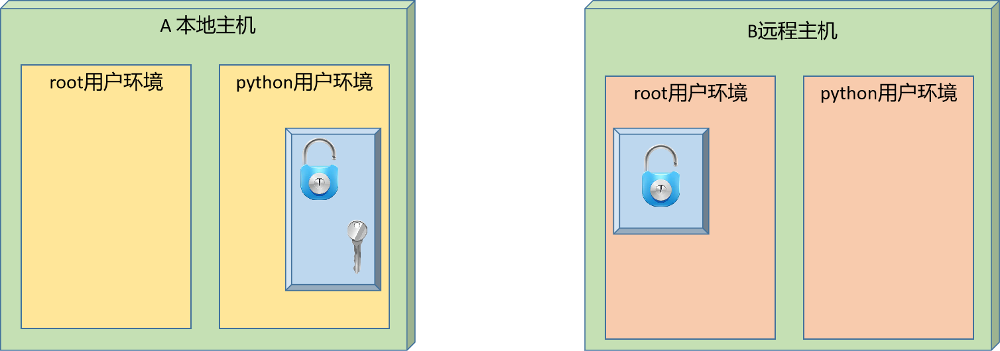

# 0 sed命令

## 0.1 进阶实践

### 0.1.1 脚本实践

学习目标

这一节，我们从 案例需求、简单实践、小结 三个方面来学习。

**案例需求**

需求

```powershell
案例描述：
	搭建一个ftp服务器
	
属性要求
    1 不支持本地用户登录		
        local_enable=NO
    2 匿名用户可以上传 新建 删除	 
        anon_upload_enable=YES  anon_mkdir_write_enable=YES	
    3 匿名用户限速500KBps  
        anon_max_rate=500000
```

准备工作

```powershell
使用sed获取ip地址
ipaddr=$(ifconfig eth0 | sed -n '2p' | sed -e 's/.*inet \(.*\) net.*/\1/g')
iptail=$(echo $ipaddr|cut -d'.' -f4)
ipremote=10.0.0.13
```

```powershell
修改主机名
hostname server$iptail.localhost.com
echo "HOSTNAME=server$iptail.localhost.com" >> /etc/sysconfig/network
echo "$ipaddr server$iptail.localhost.com" >> /etc/hosts
```

环境部署

```powershell
安装软件
yum -y install vsftpd lftp

备份配置
cp /etc/vsftpd/vsftpd.conf{,.default}

清理无效信息
sed -rn '/^(#|$)/!p' /etc/vsftpd/vsftpd.conf
sed -ri '/^#/d;/^$/d' /etc/vsftpd/vsftpd.conf

禁止本地登录
sed -i '/local_enable/c\local_enable=NO' /etc/vsftpd/vsftpd.conf

允许匿名操作
sed -i '$a anon_upload_enable=YES' /etc/vsftpd/vsftpd.conf
sed -i '$a anon_mkdir_write_enable=YES' /etc/vsftpd/vsftpd.conf
sed -i '$a anon_other_write_enable=YES' /etc/vsftpd/vsftpd.conf
sed -i '$a anon_max_rate=512000' /etc/vsftpd/vsftpd.conf

启动服务
service vsftpd restart
```

数据操作

```powershell
测试验证
chmod 777 /var/ftp/pub
cp /etc/hosts /var/ftp/pub

测试下载
cd /tmp
lftp $ipaddr <<end
cd pub
get hosts
exit
end

检查下载后的文件
ls /tmp/hosts
	注意：文件存在则匿名用户下载成功
	

测试上传、创建目录、删除目录等
cd /tmp
lftp $ipaddr << end
cd pub
mkdir test1
mkdir test2
put /etc/group
rmdir test2
exit
end

测试效果
tree /var/ftp/pub/ 
	注意：文件存在则匿名用户操作成功
```


**简单实践**

脚本实践

```powershell
查看脚本内容
[root@localhost ~]# cat vsftpd_install_manager.sh
#!/bin/bash
# 功能：定制vsftpd环境部署功能
# 版本：v0.1
# 作者：书记
# 联系：www.superopsmsb.com

# 定制普通变量
net_card="eth0"
vsftpd_conf='/etc/vsftpd/vsftpd.conf'

# 定制命令变量
ipaddr=$(ifconfig ${net_card} | sed -n '2p' | sed -e 's/.*inet \(.*\) net.*/\1/g')
iptail=$(echo $ipaddr|cut -d'.' -f4)

# 定制目标类型变量
target_type=(部署 下载 操作)

# 定制服务的操作提示功能函数
menu(){
    echo -e "\e[31m---------------管理平台登录界面---------------"
    echo -e " 1: 部署软件 2: 下载测试  3: 操作测试"
    echo -e "-------------------------------------------\033[0m"
}

# 设定主机名
hostname_set(){
    hostname server$iptail.localhost.com
    echo "HOSTNAME=server$iptail.localhost.com" >> /etc/sysconfig/network
    echo "$ipaddr server$iptail.localhost.com" >> /etc/hosts
}

# 软件安装
softs_install(){
    read -p "请输入需要安装的软件，多个用空格隔开：" soft
    yum -y install $soft &>/dev/null
}

# 修改配置
update_config(){
    cp ${vsftpd_conf}{,.default}
    sed -ri '/^#/d;/^$/d' ${vsftpd_conf}
    sed -i '/local_enable/c\local_enable=NO' ${vsftpd_conf}
    sed -i '$a anon_upload_enable=YES' ${vsftpd_conf}
    sed -i '$a anon_mkdir_write_enable=YES' ${vsftpd_conf}
    sed -i '$a anon_other_write_enable=YES' ${vsftpd_conf}
    sed -i '$a anon_max_rate=512000' ${vsftpd_conf}
    service vsftpd restart &>/dev/null && echo "vsftpd服务启动成功"
}

# 定制部署流程
soft_deploy(){
    hostname_set
    softs_install
    update_config
}

# 匿名用户测试下载动作
download_test(){
    # 准备数据目录及配套文件
    chmod 777 /var/ftp/pub
    cp /etc/hosts /var/ftp/pub

    # 测试演示
    cd /tmp
    lftp $ipaddr <<-end
    cd pub
    get hosts
    exit
        end
}

# 匿名用户测试操作权限
operator_test(){
    #测试上传、创建目录、删除目录等
    cd /tmp
    lftp $ipaddr <<-end
    cd pub
    mkdir test1 test2
    put /etc/group
    rmdir test2
    exit
        end
}

# 定制业务逻辑
while true
do
    menu
    read -p "> 请输入要操作的目标类型: " target_id
    if [ ${target_type[$target_id-1]} == "部署" ];then
        echo "开始登录管理平台..."
        soft_deploy

    elif [ ${target_type[$target_id-1]} == "下载" ];then
        download_test
        # 测试结果
        if [ -f /tmp/hosts ];then
            echo "匿名用户下载成功"
            rm -f /tmp/hosts
        else
            echo "匿名用户下载失败"
        fi
    elif [ ${target_type[$target_id-1]} == "操作" ];then
        operator_test
        if [ -d /var/ftp/pub/test1 ];then
            if [ ! -d /var/ftp/pub/test2 ];then
                if [ -f /var/ftp/pub/group ];then
                    echo "匿名操作权限正常"
                    rm -rf /var/ftp/pub
                fi
            fi
        fi
    else
        Usage
    fi
done
```

```powershell
脚本执行效果
[root@localhost ~]# /bin/bash vsftpd_install_manager.sh
---------------管理平台登录界面---------------
 1: 部署软件 2: 下载测试  3: 操作测试
-------------------------------------------
> 请输入要操作的目标类型: 1
开始登录管理平台...
请输入需要安装的软件，多个用空格隔开：vsftpd lftp
vsftpd服务启动成功
---------------管理平台登录界面---------------
 1: 部署软件 2: 下载测试  3: 操作测试
-------------------------------------------
> 请输入要操作的目标类型: 2
匿名用户下载成功
---------------管理平台登录界面---------------
 1: 部署软件 2: 下载测试  3: 操作测试
-------------------------------------------
> 请输入要操作的目标类型: 3
匿名操作权限正常
---------------管理平台登录界面---------------
 1: 部署软件 2: 下载测试  3: 操作测试
-------------------------------------------
> 请输入要操作的目标类型:
```

**小结**

```powershell

```


# 1 awk实践

## 1.1 基础实践

### 1.1.1 基础知识

学习目标

这一节，我们从 基础知识、语法解读、小结 三个方面来学习

**基础知识**

简介

```powershell
	在日常计算机管理中，总会有很多数据输出到屏幕或者文件，这些输出包含了标准输出、标准错误输出。默认情况下，这些信息全部输出到默认输出设备---屏幕。然而，大量的数据输出中，只有一小部分是我们需要重点关注的，我们需要把我们需要的或者关注的这些信息过滤或者提取以备后续需要时调用。早先的学习中，我们学过使用grep来过滤这些数据，使用cut、tr命令提出某些字段，但是他们都不具备提取并处理数据的能力，都必须先过滤，再提取转存到变量，然后在通过变量提取去处理，比如：
```

```powershell
内存使用率的统计步骤
	1) 通过free -m提取出内存总量，赋值给变量 memory_totle
	2）通过free -m提取出n内存使用量，赋值给变量memory_use
	3）通过数学运算计算内存使用率
	
	需要执行多步才能得到内存使用率，那么有没有一个命令能够集过滤、提取、运算为一体呢？当然，就是今天我要给大家介绍的命令：awk
```

awk简介

```powershell
	awk全称 Aho Weinberger Kernighan报告生成器，awk的三个字母是来自于三个作者的首字母。它是一个功能非常强大的文档编辑工具，它不仅能以行为单位还能以列为单位处理文件，并且还具有格式化文本输出功能。目前它受自由软件基金会（FSF）进行开发和维护，通常也称它为 GNU AWK，AWK有多种版本：
    AWK：原先来源于 AT & T 实验室的的AWK
    NAWK：New awk，AT & T 实验室的AWK的升级版
    GAWK：即GNU AWK。所有的GNU/Linux发布版都自带GAWK，它与AWK和NAWK完全兼容	
```

```powershell
原理解读
	awk 认为文件中的每一行是一条记录，记录与记录的分隔符为换行符,每一列是一个字段 字段与字段的分隔符默认是一个或多个空格或tab制表符.
	
	awk的工作方式是逐行读取文本数据，将每一行数据视为一条记录（record）每条记录以字段分隔符分成若干字段，然后输出各个字段的值.然后以查找匹配某个特定模式的文本行，并对这些文本执行制定动作。
```

**语法解读**

基本格式

```powershell
格式：
    awk [参数] '[动作]' [文件名]
    awk [参数] –f 动作文件 var=value [文件名]
    awk [参数] 'BEGIN段 [动作] END段' [文件名]
注意：
	动作的格式  '匹配条件{打印动作}'
```

```powershell
常见参数：
    -F				指定列的分隔符，默认一行数据的列分隔符是空格
    -f file 		指定读取程序的文件名
    -v var=value	自定义变量
```

```powershell
awk程序运行优先级是:
    1 BEGIN: 在开始处理数据流之前执行，可选项
    2 动作: 如何处理数据流，必选项
    3 END: 处理完数据流后执行，可选项
```

```powershell
常见动作
    print	显示内容
    $0		显示当前行所有内容
    $n		显示当前行的第n列内容，如果存在多个$n，它们之间使用逗号(,)隔开
注意:
	如果打印的内容是变量,则无需在变量两侧加上双引号,其他的都应该加双引号
```

其他功能

```powershell
printf 格式化显示内容
	printf [-v var] format [item1,item2,...]
	注意：
		printf输出需要指定换行符号，format的格式必须与后面item对应
		常见格式：
			%c		显示字符的ASCII码		%d|i 	显示十进制整数		%e|E	显示科学计数法数值
			%f		显示浮点数			 %s		 显示字符串			%u	  显示无符号整数
			%%		显示%本身				
		修饰符：
			%#[.#]	第一个#控制显示宽度，第二个#表示小数点后的精度，例如%3.1f
			%-		左对齐，%-15s
			%+		显示数值的正负符号，%+d
```

```powershell
常见内置变量
    FILENAME 	当前输入文件的文件名，该变量是只读的
    NR 			指定显示行的行号
    FNR			多文件时候，分别计数
    NF 			表示字段数量
    OFS 		输出格式的列分隔符，缺省是空格
    FS 			输入文件的列分隔符，缺省是连续的空格和Tab
    RS			输入记录分隔符,指定输入时的换行符,原换行符($)仍有效
    ORS			输出记录分隔符,输出时用指定符号代替换行符
    ARGC|ARGV[n] 获取命令的参数个数|参数内容
```

准备工作

```powershell
[root@localhost ~]# cat awk.txt
nihao awk1 awk2 awk3
nihao awk4 awk5 awk6
nihao awk7 awk8 awk9
```

**小结**

```

```


### 1.1.2 基础语法

学习目标

这一节，我们从 信息查看、定制查看、小结 三个方面来学习

**信息查看**

字段提取

```powershell
字段提取:提取一个文本中的一列数据并打印输出，它提供了相关的内置变量。
    $0 表示整行文本
    $1 表示文本行中的第一个数据字段
    $2 表示文本行中的第二个数据字段
    $N 表示文本行中的第N个数据字段
    $NF 表示文本行中的最后一个数据字段
    NR 代表行的行号，在动作外部表示特定行
注意：
   如果打印多列信息，需要使用逗号隔开，否则是内容合并
```

实践1-打印列信息

```powershell
打印第1列的内容
[root@localhost ~]# awk '{print $1}' awk.txt
nihao
nihao
nihao

打印第3列内容
[root@localhost ~]# awk '{print $3}' awk.txt
awk2
awk5
awk8

打印最后一列信息
[root@localhost ~]# awk '{print $NF}' awk.txt
awk3
awk6
awk9

打印所有内容
[root@localhost ~]# awk '{print $0}' awk.txt
nihao awk1 awk2 awk3
nihao awk4 awk5 awk6
nihao awk7 awk8 awk9
```

实践2-打印多列信息

```powershell
打印第3，8列内容
[root@localhost ~]# awk '{print $1,$3}' awk.txt
nihao awk2
nihao awk5
nihao awk8

打印信息时候，合并信息
[root@localhost ~]# awk '{print $1$3}' awk.txt
nihaoawk2
nihaoawk5
nihaoawk8

使用\t实现内容的分割，需要用""扩住
[root@localhost ~]# awk '{print $1"\t"$3}' awk.txt
nihao   awk2
nihao   awk5
nihao   awk8

打印列外普通信息
[root@localhost ~]# awk '{print "hello awk"}' awk.txt
hello awk
hello awk
hello awk
注意:
	如果没有$n的话,表示 print动作执行的次数与文件行数一致
	
打印fstab的关键信息
[root@localhost ~]# grep "^UUID" /etc/fstab |awk {'print $1,$3'}
UUID=5583bd7c-cc9f-4e19-b453-c224102f3ed5 xfs
UUID=cbd246cd-1df8-4fe7-9040-823cd0978837 xfs
```

实践3-行号信息输出

```powershell
打印每列的行号信息
[root@localhost ~]# awk '{print NR,$0}' awk.txt
1 nihao awk1 awk2 awk3
2 nihao awk4 awk5 awk6
3 nihao awk7 awk8 awk9

按照行号打印对应列的内容
[root@localhost ~]# awk '{print NR, $NR}' awk.txt
1 nihao
2 awk4
3 awk8
```

实践4-打印特定行内容

```powershell
制定行号打印信息
[root@localhost ~]# awk  'NR==1 {print NR,$1,$3}' awk.txt
1 nihao awk2
[root@localhost ~]# awk  'NR==2 {print NR,$1,$3}' awk.txt
2 nihao awk5
```


**定制查看**

简介

```powershell
	awk默认的信息查看是以空格作为列分隔符的，而对于非空格作为分隔符的内容，我们需要借助于专门的语法实现信息的分割，这里主要用到以下知识：
```

```powershell
常见参数：
    -F			指定列的分隔符，默认一行数据的列分隔符是空格
常见内置变量
    FS 			输入文件的列分隔符，缺省是连续的空格和Tab
    RS			输入记录分隔符,指定输入时的换行符,原换行符($)仍有效
    注意：
    	一般情况下，在输出信息之前进行格式的调整，需要在BEGIN{}部分设定
```

实践1-简单演示

```powershell
准备文件内容
[root@localhost ~]# head -n1 /etc/passwd > passwd.txt
[root@localhost ~]# cat passwd.txt
root:x:0:0:root:/root:/bin/bash

使用普通awk命令展示
[root@localhost ~]# awk '{print $1}' passwd.txt
root:x:0:0:root:/root:/bin/bash
[root@localhost ~]# awk '{print $2}' passwd.txt

[root@localhost ~]# awk '{print $0}' passwd.txt
root:x:0:0:root:/root:/bin/bash
结果显示：
	文件中只有一列，无法被awk默认分离
```

实践2-定制分隔符

```powershell
设定分隔符实现信息的分隔效果
[root@localhost ~]# awk -F ':' '{print $0}' passwd.txt
root:x:0:0:root:/root:/bin/bash
[root@localhost ~]# awk -F ':' '{print $1}' passwd.txt
root
[root@localhost ~]# awk -F ':' '{print $1,$2}' passwd.txt
root x
[root@localhost ~]# awk -F ':' '{print $1,$7}' passwd.txt
root /bin/bash

基于-v方式设定输入分隔符的环境变量FS
[root@localhost ~]# awk -v FS=":" '{print $1FS$7}' passwd.txt
root:/bin/bash
```

```powershell
虽然-v FS 和 -F 都可以设定入口数据的列分隔符，如果混用的话，-F的优先级高一点
[root@localhost ~]# awk -v FS=":" -F":" '{print $1FS$7}' passwd.txt
root:/bin/bash
[root@localhost ~]# awk -F":" -v FS=":"  '{print $1FS$7}' passwd.txt
root:/bin/bash

```

实践3-统计案例

```powershell
获取网址域名信息
[root@localhost ~]# cat domain.txt
http://www.example.org/index.html
http://www.example.org/1.html
http://api.example.org/index.html
http://upload.example.org/index.html
http://img.example.org/3.html
http://search.example.org/2.html

对相关信息进行统计
[root@localhost ~]# awk -F[/]+ '{print $2}' domain.txt  | uniq -c
      2 www.sswang.org
      1 api.sswang.org
      1 upload.sswang.org
      1 img.sswang.org
      1 search.sswang.org
[root@localhost ~]# awk -F[/]+ '{print $(NF-1)}' domain.txt  | uniq -c 
      2 www.sswang.org
      1 api.sswang.org
      1 upload.sswang.org
      1 img.sswang.org
      1 search.sswang.org
```


**小结**

```

```


### 1.1.3 显示语法

学习目标

这一节，我们从 基础知识、简单实践、小结 三个方面来学习

**基础知识**

简介

```powershell
	awk支持格式化输出相关信息。它主要依赖两种方法：
```

```powershell
属性方法
    OFS 		输出格式的列分隔符，缺省是空格
    ORS			输出记录分隔符,输出时用指定符号代替换行符
print方法
	printf [-v var] format [item1,item2,...]
	注意：
		printf输出需要指定换行符号，format的格式必须与后面item对应
		常见格式：
			%c		显示字符的ASCII码		%d|i 	显示十进制整数		
			%e|E	显示科学计数法数值	  %u	  显示无符号整数
			%f		显示浮点数			 %s		 显示字符串			
			%%		显示%本身				
		修饰符：
			%#[.#]	第一个#控制显示宽度，第二个#表示小数点后的精度，例如%3.1f
			%-		左对齐，%-15s
			%+		显示数值的正负符号，%+d
```

**简单实践**

实践1-列输出分隔符实践

```powershell
借助于-v方式为命令行输出相关信息
[root@localhost ~]# awk -F ':' -v OFS="~~~" '{print $1,$7}' passwd.txt
root~~~/bin/bash

借助于BEGIN语句设定环境变量
[root@localhost ~]# awk -F":" 'BEGIN{OFS="~"} {print NR,$1,$7}' passwd.txt
1~root~/bin/bash

在BEGIN内部同时实现多个环境变量
[root@localhost ~]# awk 'BEGIN{FS=":";OFS="-"}NR==1{print $1,$3,$NF}' passwd.txt
root-0-/bin/bash
```

实践2-行输入输出分隔符实践

```powershell
定制输入分隔符
[root@server12 ~]# seq 7 | awk 'BEGIN{RS=""}{print $1,$2,$3,$4,$5,$6,$7}'
1 2 3 4 5 6 7

借助于-v方式为行分隔符输出相关信息
[root@localhost ~]# awk -F ':' -v ORS="|" '{print $NR,$0}' awk.txt
nihao awk1 awk2 awk3 nihao awk1 awk2 awk3| nihao awk4 awk5 awk6| nihao awk7 awk8 awk9|[root@localhost ~]#

借助于BEGIN语句设定环境变量
[root@localhost ~]# awk -F":" 'BEGIN{ORS="|"} {print NR,$0}' awk.txt
nihao awk1 awk2 awk3 nihao awk1 awk2 awk3|2 nihao awk4 awk5 awk6|3 nihao awk7 awk8 awk9|[root@localhost ~]#
```

实践3-printf格式化输出实践

```powershell
使用print的格式信息
[root@localhost ~]# awk '{printf "%s\n",$1}' awk.txt
nihao
nihao
nihao
[root@localhost ~]# awk '{printf "%s",$1}' awk.txt; echo
nihaonihaonihao

多信息格式化嵌套
[root@localhost ~]# awk '{printf "%d--%s--%s\n", NR,$1,$NR}' awk.txt
1--nihao--nihao
2--nihao--awk4
3--nihao--awk8

数字的格式化输出
[root@localhost ~]# awk '{printf "%4.2f--%s\n", NR,$1}' awk.txt
1.00--nihao
2.00--nihao
3.00--nihao

字符的格式化输出
[root@localhost ~]# awk '{printf "%-8s%s\n", NR,$1}' awk.txt
1       nihao
2       nihao
3       nihao
```

**小结**

```

```


### 1.1.4 优先级实践

学习目标

这一节，我们从 基础知识、简单实践、小结 三个方面来学习

**基础知识**

简介

```powershell
	awk为了体现程序的逻辑顺序，划分了三个代码段，其结构如下：

```

```powershell
格式显示：
	BEGIN{}: 读入第一行文本之前执行的语句，一般用来初始化操作
    {}: 逐行处理的执行命令
    END{}: 处理完最后以行文本后执行，一般用来处理输出结果
```

**简单实践**

实践1-分结构实践

```powershell
BEGIN设定数据处理的前置准备
[root@localhost ~]# awk 'BEGIN{OFS=":"} {print NR,$0}' awk.txt
1:nihao awk1 awk2 awk3
2:nihao awk4 awk5 awk6
3:nihao awk7 awk8 awk9

{}定制输出的内容样式
[root@localhost ~]# awk '{ print "第一列:"$1,"第二列:"$2 }' awk.txt
第一列:nihao 第二列:awk1
第一列:nihao 第二列:awk4
第一列:nihao 第二列:awk7

END设定信息处理完毕后的收尾动作
[root@localhost ~]# awk 'END{printf "----------------\n行数总计: %2d\n", NF}' awk.txt
----------------
行数总计:  4
```

实践2-优先级演示

```powershell
[root@localhost ~]# awk -F: 'BEGIN{print "begin中的NR值:" NR}  NR==11 {print "命令中的NR值: " NR}END{print "END中的NR值: " NR}' /etc/passwd
begin中的NR值:0
命令中的NR值: 11
END中的NR值: 23
结果可知：
	begin的优先级 > 命令优先级 > END的优先级
```

实践3-组合演练

```powershell
BEGIN 和 {} 实现信息的头部格式化
[root@localhost ~]# awk 'BEGIN{print "第一列\t第二列\n----------------"}{print $1"\t"$2}' awk.txt
第一列  第二列
----------------
nihao   awk1
nihao   awk4
nihao   awk7
```

```powershell
完全组合实现信息的头部和尾部格式化操作
[root@localhost ~]# awk 'BEGIN{print "第一列\t第二列\n----------------";total=0;}{print $1"\t"$2;total = NR}END{printf "----------------\n行数总计: %2d\n", total}' awk.txt
第一列  第二列
----------------
nihao   awk1
nihao   awk4
nihao   awk7
----------------
行数总计:  3
```

```powershell
统计文件格式化
[root@localhost ~]# awk -F":" 'BEGIN{printf "---------------------------\n%-12s|%9s|\n---------------------------\n","用户名","shell类型"}{printf "%-15s|%10s|\n---------------------------\n",$1,$7}END{printf "用户总数总: %2d\n", NR}' passwd.txt
---------------------------
用户名         |  shell类型|
---------------------------
root           | /bin/bash|
---------------------------
用户总数总:  1
```

```powershell
定制配置考试成果表
[root@localhost ~]# cat course_scores.txt
张三 	100	 56	   99
李四 	90	 68	   89
王五 	50	 78	   67
赵六 	80	 99    89

格式化显示
[root@localhost ~]# awk 'BEGIN{printf "----------------------\n|%-3s|%2s|%2s|%2s|\n----------------------\n","姓名","语文","数学","历史";} NR>=2 {printf "|%-3s|%4d|%4d|%4d|\n",$1,$2,$3,$4} END{printf "----------------------\n学生 总数总: %2d\n", NR}' course_scores.txt
----------------------
|姓名 |语文|数学|历史|
----------------------
|张三 | 100|  56|  99|
|李四 |  90|  68|  89|
|王五 |  50|  78|  67|
|赵六 |  80|  99|  89|
----------------------
学生总数总:  5
```


**小结**

```

```

### 1.1.5 变量实践

学习目标

这一节，我们从 基础知识、数组实践、小结 三个方面来学习

**基础知识**

简介

```powershell
	在shell中，除了通用的字符串操作之外，还具有一些丰富灵活性的小功能，比如变量操作、数组操作类的。awk所支持的变量主要有两种类型：内置变量和自定义变量
```

变量类型

```powershell
内置变量
	所谓的内置变量主要就是awk内部已经定制好的变量，我们可以直接拿过来使用，这些常见的方法我们基本上都演示过了，比如：
	FILENAME 	当前输入文件的文件名，该变量是只读的
	FIELDWIDTHS	以空格分隔的数字列表，用空格定义每个数据字段的精确宽度
    NR 			指定显示行的行号
    FNR			多文件时候，分别计数
    NF 			表示字段数量
    OFS 		输出格式的列分隔符，缺省是空格
    FS 			输入文件的列分隔符，缺省是连续的空格和Tab
    RS			输入记录分隔符,指定输入时的换行符,原换行符($)仍有效
    ORS			输出记录分隔符,输出时用指定符号代替换行符
    ARGC|ARGV[n] 获取命令的参数个数|参数内容
自定义变量
	所谓的自定义变量，主要是根据实际情况，自己定义一些所谓的变量，然后再awk逻辑操作的过程中作为辅助性的措施。自定义变量的定制方法：
	-v var=value
	它可以在 命令行、BEGIN、{}、END 等位置进行使用
```


**简单实践**

实践1-内置变量的进阶使用

```powershell
NF 查看当前所在目录
[root@localhost ~]# echo $PWD | awk -F / '{print $NF}'
root
[root@localhost ~]# cd /etc/sysconfig/
[root@localhost /etc/sysconfig]# echo $PWD | awk -F / '{print $NF}'
sysconfig

查看文件名称
[root@localhost ~]# echo /etc/sysconfig/network-scripts/ifcfg-eth0 | awk -F / '{print $NF}'
ifcfg-eth0

查看文件所在路径
[root@localhost ~]# echo /etc/sysconfig/network-scripts/ifcfg-eth0 | awk -F / '{print $(NF-1)}'
network-scripts
```

实践2-NR行号的作用

```powershell
快速获取ip地址
[root@localhost ~]# ifconfig eth0 | awk 'NR==2{print $2}'
10.0.0.12
[root@localhost ~]# ifconfig eth0 | awk '/netmask/{print $2}'
10.0.0.12

快速获取文件行数
[root@localhost ~]# awk -F: 'END{print NR}' /etc/passwd
23
[root@localhost ~]# awk -F: 'END{print NR}' /etc/sysconfig/network-scripts/ifcfg-eth0
20
```

实践3-FNR 和 FILENAME 获取文件基本信息

```powershell
获取文件基本信息
[root@localhost ~]# awk '{print FNR,FILENAME,$0}' /etc/issue /etc/redhat-release
1 /etc/issue \S
2 /etc/issue Kernel \r on an \m
3 /etc/issue
1 /etc/redhat-release CentOS Linux release 7.9.2009 (Core)
解析：
	FNR 获取文件内容，同时在前面增加行号
	FILENAME 获取文件名称
	
FIELDWIDTHS:重定义列宽并打印，注意不可以使用$0打印所有，因为$0是打印本行全内容，不会打印你定义的字段
[root@localhost ~]# awk 'BEGIN{FIELDWIDTHS="5 2 8"}NR==1{print $1,$2,$3}' passwd.txt
root: x: 0:0:root
```

实践4-命令参数

```powershell
ARGC 获取命令行参数的个数，包括awk命令
[root@localhost ~]# awk  'NR==1 {print ARGC }' awk.txt
2

ARGV：将命令行所有参数放到一个数组中，ARGV[下标] 获取所有参数
[root@localhost ~]# awk  'NR==1 {print ARGV[0] }' awk.txt
awk
[root@localhost ~]# awk  'NR==1 {print ARGV[1] }' awk.txt
awk.txt
```

实践5-自定义变量

```powershell
变量实践
[root@localhost ~]# awk -v name='shuji' 'BEGIN{print name}'
shuji
[root@localhost ~]# awk 'BEGIN{name="shuji";print name}'
shuji

定制格式化输出
[root@localhost ~]# awk -F: '{age=36; address="beijing";print $1,age,address}' passwd.txt
root 36 beijing
```


**小结**

```

```


## 1.2 进阶知识

### 1.2.1 赋值运算

学习目标

这一节，我们从 基础知识、简单实践、小结 三个方面来学习

**基础知识**

简介

```powershell
	awk本质上属于一种编程语言，所以它具有编程语言的一般功能，表达式、流程控制等基本上都在awk中具有想当程度的使用。这一节我们学习awk进阶到流程控制的一个基础知识点 -- 表达式。
```

表达式分类

```powershell
	awk的表达式包括很多种类，常见的表达式有：
	算术操作符：+ - * / ^ %
	赋值操作符：= += -= /= ++ -- %= ^=
	比较操作符：== != > >= < <= 
	模式匹配符：~ 左边是否与右边匹配包含，!~ 是否不匹配
	逻辑操作符：与&&、或||、非！
```

**简单实践**

实践1-字符串赋值

```powershell
[root@localhost ~]# awk -v name='shuji' 'BEGIN{print name}'
shuji

[root@localhost ~]# awk 'BEGIN{school="xigongda";print school}'
xigongda
```

实践2-数据赋值

```powershell
命令区域段内进行数据赋值操作
[root@localhost ~]# echo | awk '{i=10;print i+=1}'     
11
[root@localhost ~]# echo | awk '{i=10;print i++,i}'
10 11
[root@localhost ~]# echo | awk '{i=10;print ++i,i}'
11 11
[root@localhost ~]# echo | awk '{i=10;print --i,i}'
9 9
[root@localhost ~]# echo | awk '{i=10;print i--,i}'
10 9

在BEGIN段是可以的，由于END段主要是收尾的信息显示，所以基本不做计算层次的功能
[root@localhost ~]# awk 'BEGIN{i=0;print i++,i}'
0 1
[root@localhost ~]# awk 'BEGIN{i=0;print ++i,i}'
1 1
```

实践3-变量赋值

```powershell
-v 设定变量进行赋值操作
[root@localhost ~]# awk -v n=0 'n++' awk.txt
nihao awk4 awk5 awk6
nihao awk7 awk8 awk9
[root@localhost ~]# awk -v n=0 '!n++' awk.txt
nihao awk1 awk2 awk3
结果显示：
	当递增与!同时存在的时候，！优先生效
```

实践4-数组赋值

```powershell
在awk中可以设定数组
[root@localhost ~]# awk 'BEGIN{array[0]=100;print array[0]}'
100
```

**小结**

```

```


### 1.2.2 数学运算

学习目标

这一节，我们从 基础知识、简单实践、小结 三个方面来学习

**基础知识**

简介

```powershell
	所谓的数学运算，其实就是我们平常所说的二元运算，常见的运算符号有：
		+ - * / ^ %
```


**简单实践**

实践1-普通数学运算

```powershell
[root@localhost ~]# awk 'BEGIN{print 100+3 }'
103
[root@localhost ~]# awk 'BEGIN{print 100-3 }'
97
[root@localhost ~]# awk 'BEGIN{print 100*3 }'
300
[root@localhost ~]# awk 'BEGIN{print 100/3 }'
33.3333
[root@localhost ~]# awk 'BEGIN{print 100**3 }'
1000000
[root@localhost ~]# awk 'BEGIN{print 100%3 }'
1
```

实践2-BEGIN和变量运算

```powershell
[root@localhost ~]# awk -v 'count=0' 'BEGIN{count++;print count}'
1
[root@localhost ~]# awk -v 'count=0' 'BEGIN{count--;print count}'
-1
```

实践3-案例解读

```powershell
在之前的案例基础上，进行统计运算每个学生的总分，每个班级的课程总分
[root@localhost ~]# awk 'BEGIN{printf "---------------------------\n|%-3s|%2s|%2s|%2s|%2s|\n---------------------------\n","姓名","语文","数学","历史","总分";yu=0;shu=0;li=0;total} NR>=2 {yu=$2+yu;shu=$3+shu;li=$4+li;total=$2+$3+$4; printf "|%-3s|%4d|%4d|%4d|%4d|\n",$1,$2,$3,$4,$2+$3+$4} END{printf "---------------------------\n|%-3s|%4d|%4d|%4d|%4d|\n学生总数总: %2d\n","合计",yu,shu,li,total,NR}' course_scores.txt
---------------------------
|姓名 |语文|数学|历史|总分|
---------------------------
|张三 | 100|  56|  99| 255|
|李四 |  90|  68|  89| 247|
|王五 |  50|  78|  67| 195|
|赵六 |  80|  99|  89| 268|
---------------------------
|合计 | 320| 301| 344| 268|
学生总数总:  4
```


**小结**

```

```

### 1.2.3 逻辑运算

学习目标

这一节，我们从 基础知识、简单实践、小结 三个方面来学习

**基础知识**

简介

```powershell
	所谓的逻辑运算，其实指的就是 与或非的操作。基本语法格式如下：
		与&& - 并且关系
        或|| - 或者关系
        非！ - 取反关系
```

**简单实践**

实践1-基本逻辑运算

```powershell
与运算:真真为真，真假为假，假假为假
[root@localhost ~]# awk 'BEGIN{print 100>=2 && 100>=3 }'
1
[root@localhost ~]# awk 'BEGIN{print 100>=2 && 1>=100 }'
0

或运算:真真为真，真假为真，假假为假
[root@localhost ~]# awk 'BEGIN{print 100>=2 || 1>=100 }'
1
[root@localhost ~]# awk 'BEGIN{print 100>=200 || 1>=100 }'
0
```

实践2-文件逻辑运算

```powershell
[root@localhost ~]# awk -F: '$3==0 || $3>=1000 {print $1}' /etc/passwd
root
python
[root@localhost ~]# awk -F: '$3==0 || $3>=1000 {print $1,$3}' /etc/passwd 
root 0
python 1000
[root@localhost ~]# awk -F: '$3==0 && $3>=1000 {print $1,$3}' /etc/passwd   
[root@localhost ~]# awk -F: '!($3<1000) {print $1,$3}' /etc/passwd           
python 1000
[root@localhost ~]# awk -F: 'NR>=1&&NR<=2{print NR,$0}' /etc/passwd 
1 root:x:0:0:root:/root:/bin/bash
2 bin:x:1:1:bin:/bin:/sbin/nologin
```

实践3-非关系

```powershell
[root@localhost ~]# awk 'BEGIN{print i}'

[root@localhost ~]# awk 'BEGIN{print !i}'
1
[root@localhost ~]# awk -v i=10 'BEGIN{print !i}'
0
[root@localhost ~]# awk -v i=-3 'BEGIN{print !i}'
0
[root@localhost ~]# awk -v i=0 'BEGIN{print !i}'
1
[root@localhost ~]# awk -v i=abc 'BEGIN{print !i}'
0
[root@localhost ~]# awk -v i='' 'BEGIN{print !i}'
1
```

**小结**

```

```

### 1.2.4 匹配运算

学习目标

这一节，我们从 基础知识、简单实践、小结 三个方面来学习

**基础知识**

简介

```powershell
	所谓的匹配运算，主要指的是关键字无法精确性的匹配相关信息了，但是我们可以结合一些关键字信息进行模糊的匹配。对于匹配运算来说，它有一些需要注意的事情，具体内容如下：
```

```powershell
注意事项：
	如果没有指定，为空模式，匹配每一行
	如果指定”/匹配条件/”,则表示仅处理能够匹配到的内容
	如果指定关系表达式，只有结果为真的情况下，才会被处理
		真：结果为非0值，非空字符串，空格也是真
		假：结果为空字符串或0值，数值不用加””
```

**简单实践**

实践1-真假值匹配

```powershell
假值匹配
[root@localhost ~]# awk '"" {print $1,$3}' awk.txt
[root@localhost ~]# awk '0 {print $1,$3}' awk.txt

非零真值匹配
[root@localhost ~]# awk '"aaa" {print $1,$3}' awk.txt
nihao awk2
nihao awk5
nihao awk8
[root@localhost ~]# awk '9 {print $1,$3}' awk.txt
nihao awk2
nihao awk5
nihao awk8
[root@localhost ~]# awk -v n=8 'n{print $1,$3}' awk.txt
nihao awk2
nihao awk5
nihao awk8
```

实践2-内容匹配

```powershell
内容匹配
[root@localhost ~]# awk -F ':' '$1 ~ "^ro" {print $0}' /etc/passwd
root:x:0:0:root:/root:/bin/bash
[root@localhost ~]# awk -F ':' '$1 ~ "ftp" {print $0}' /etc/passwd
ftp:x:14:50:FTP User:/var/ftp:/sbin/nologin
[root@localhost ~]# awk -F ':' '$1 ~ "^[a-d].*" {print $0}' /etc/passwd
bin:x:1:1:bin:/bin:/sbin/nologin
daemon:x:2:2:daemon:/sbin:/sbin/nologin
adm:x:3:4:adm:/var/adm:/sbin/nologin
dbus:x:81:81:System message bus:/:/sbin/nologin
chrony:x:998:996::/var/lib/chrony:/sbin/nologin

内容不匹配
[root@localhost ~]# awk -F ':' '$1 !~ "^ro" {print $0}' /etc/passwd
[root@localhost ~]# awk -F ':' '$1 !~ "^[a-r].*" {print $0}' /etc/passwd
sync:x:5:0:sync:/sbin:/bin/sync
shutdown:x:6:0:shutdown:/sbin:/sbin/shutdown
systemd-network:x:192:192:systemd Network Management:/:/sbin/nologin
sshd:x:74:74:Privilege-separated SSH:/var/empty/sshd:/sbin/nologin
tss:x:59:59:Account used by the trousers package to sandbox the tcsd daemon:/dev/null:/sbin/nologin
tcpdump:x:72:72::/:/sbin/nologin

```

实践3-简单案例

```powershell
准备不规则格式文件
[root@localhost ~]# cat zhengli.txt
  http://www.sswang.org/index.html
      http://www.sswang.org/1.html
    http://api.sswang.org/index.html
asdfasdfsd
  adfsdf

文件的规整
[root@localhost ~]# awk '/^[ \t]*/{print NR"--->"$1}' zhengli.txt
1--->http://www.sswang.org/index.html
2--->http://www.sswang.org/1.html
3--->http://api.sswang.org/index.html
4--->asdfasdfsd
5--->adfsdf
```

实践4-扩展实践

```powershell
多值匹配打印
[root@localhost ~]# awk 'i=1;j=1{print $1,$3}' awk.txt
nihao awk1 awk2 awk3
nihao awk2
nihao awk4 awk5 awk6
nihao awk5
nihao awk7 awk8 awk9
nihao awk8
[root@localhost ~]# awk 'i=1{print $0};j=1{print $1,$3}' awk.txt
nihao awk1 awk2 awk3
nihao awk2
nihao awk4 awk5 awk6
nihao awk5
nihao awk7 awk8 awk9
nihao awk8

假值匹配
[root@localhost ~]# awk '0' awk.txt
真值匹配
[root@localhost ~]# awk '!0' awk.txt
nihao awk1 awk2 awk3
nihao awk4 awk5 awk6
nihao awk7 awk8 awk9

非零真值匹配
[root@localhost ~]# awk '0-2' awk.txt
nihao awk1 awk2 awk3
nihao awk4 awk5 awk6
nihao awk7 awk8 awk9
零值匹配
[root@localhost ~]# awk '0-0' awk.txt

非零真值匹配
[root@localhost ~]# awk -v n=0 '++n' awk.txt
nihao awk1 awk2 awk3
nihao awk4 awk5 awk6
nihao awk7 awk8 awk9
```


**小结**

```

```

### 1.2.5 内置函数1

学习目标

这一节，我们从 基础知识、简单实践、小结 三个方面来学习。

**基础知识**

简介

```powershell
	在awk内部预制了一些函数，借助于这些函数，我们可以实现相关场景的快速操作。这些内置函数的常见类型有：
```

```powershell
数值类内置函数
	int(expr)     截断为整数：int(123.45)和int("123abc")都返回123，int("a123")返回0
    sqrt(expr)    返回平方根
    rand()        返回[0,1)之间的随机数，默认使用srand(1)作为种子值
    srand([expr]) 设置rand()种子值，省略参数时将取当前时间的epoch值(精确到秒的epoch)作为种子值
```

```powershell
字符串类内置函数
	sprintf(format, expression1, ...)：返回格式化后的字符串
	length()：返回字符串字符数量、数组元素数量、或数值转换为字符串后的字符数量
	strtonum(str)：将字符串转换为十进制数值
        如果str以0开头，则将其识别为8进制
        如果str以0x或0X开头，则将其识别为16进制
	tolower(str)：转换为小写
	toupper(str)：转换为大写
	index(str,substr)：从str中搜索substr(子串)，返回搜索到的索引位置，搜索不到则返回0
```

```powershell
数据操作内置函数
	substr(string,start[,length])：从string中截取子串
	split(string, array [, fieldsep [, seps ] ])：将字符串分割后保存到数组array中
	match(string,reg[,arr])：使用reg正则规则匹配string信息,默认返回匹配的索引，可以将内容存到数组
```


**简单实践**

实践1-数据值函数实践

```powershell
int数据取整
[root@localhost ~]# awk 'BEGIN{print int(123.45)}'
123
[root@localhost ~]# awk 'BEGIN{print int(123.565)}'
123

sqrt数据求平方根
[root@localhost ~]# awk 'BEGIN{print sqrt(9)}'
3

rand()求0-1的随机数
[root@localhost ~]# awk 'BEGIN{print rand()}'
0.237788
```

```powershell
srand() 设定rand()的随机权重，权重固定，rand()值固定
[root@localhost ~]# awk 'BEGIN{srand();print rand()}'
0.858697
[root@localhost ~]# awk 'BEGIN{srand();print rand()}'
0.587366
[root@localhost ~]# awk 'BEGIN{srand(2);print rand()}'
0.610198
[root@localhost ~]# awk 'BEGIN{srand(2);print rand()}'
0.610198

结合srand()获取随机整数
[root@localhost ~]# awk 'BEGIN{srand();print int(22*rand())}'
10
[root@localhost ~]# awk 'BEGIN{srand();print int(22*rand())}'
7
```

实践2-字符串实践

```powershell
sprintf设定数据基本样式
[root@localhost ~]# awk 'BEGIN{a=sprintf("%s-%d-%s","abc",23,"ert"); print a}'
abc-23-ert

length获取字符串长度
[root@localhost ~]# awk 'BEGIN{v="nsfadsafdsaf";print length(v)}'
12

tolower转换为小写
[root@localhost ~]# awk 'BEGIN{v="ADMIN";print tolower(v)}'
admin

toupper转换为大写
[root@localhost ~]# awk 'BEGIN{v="nsfad";print toupper(v)}'
NSFAD

index查找子字符串的位置
[root@localhost ~]# awk 'BEGIN{str="nsfad";print index(str, "fa")}'
3
[root@localhost ~]# awk 'BEGIN{str="nsfad";print index(str, "ns")}'
1
[root@localhost ~]# awk 'BEGIN{str="nsfad";print index(str, "ad")}'
4	
```

实践3-其他操作

```powershell
substr字符串截取
[root@localhost ~]# awk 'BEGIN{v="abcdefgh";print substr(v,3)}'
cdefgh
[root@localhost ~]# awk 'BEGIN{v="abcdefgh";print substr(v,3,3)}'
cde

split切割字符串
[root@localhost ~]# awk 'BEGIN{split("abc-def-gho-pq",arr,"-",seps); print length(arr), arr[3], seps[1]}'
4 gho -
[root@localhost ~]# awk 'BEGIN{split("abcde",arr,"-");print arr[1]}'
abcde
[root@localhost ~]# echo "12:34:56" | awk '{split($0,a,":");print a[1],a[2],a[3]}'
12 34 56

match字符串匹配
[root@localhost ~]# awk 'BEGIN{str="safdsajfkdsajlfjdsl";print match(str,"j.*s")}'
7
[root@localhost ~]# awk 'BEGIN{str="safdsajfkdsajlfjdsl";match(str,"j.*s",arry);print arry[0]}'
jfkdsajlfjds
```

**小结**


### 1.2.6 内置函数2

学习目标

这一节，我们从 基础知识、简单实践、小结 三个方面来学习

**基础知识**

简介

```powershell
	awk还内置了一些关于时间和数据类型的内置函数，具体信息如下
```

```powershell
时间类内置函数
	mktime("YYYY MM DD HH mm SS [DST]")：构建一个时间，构建失败则返回-1
	systime()：返回当前系统时间点，返回的是秒级epoch值
	strftime([format [, timestamp [, utc-flag] ] ])：将时间格式转换为字符串
```

```powershell
数据类型相关内置函数：
    isarray(var)：测试var是否是数组，返回1(是数组)或0(不是数组)
    typeof(var)：返回var的数据类型，有以下可能的值：
        “array”：是一个数组
        “regexp”：是一个真正表达式类型，强正则字面量才算是正则类型，如@/a.*ef/
        “number”：是一个number
        “string”：是一个string
        “strnum”：是一个strnum，参考strnum类型
        “unassigned”：曾引用过，但未赋值，例如”print f;print typeof(f)”
        “untyped”：从未引用过，也从未赋值过
```

**简单实践**

实践1-时间函数实践

```powershell
systime返回当前系统时间点
[root@localhost ~]# awk 'BEGIN{print systime()}'
1655618798

mktime设置一个时间
[root@localhost ~]# awk 'BEGIN{print mktime("2032 4 29 11 32 19")}'
1966822339

strftime获取格式日期
[root@localhost ~]# awk 'BEGIN{print strftime()}'
日 6月 19 14:11:35 CST 2022
```

```powershell
结合xargs设定时间格式
[root@localhost ~]# awk 'BEGIN{print mktime("2032 4 29 11 32 19") | "xargs -i date -d@{} +\"%F %T\""}'
2032-04-29 11:32:19

# 设定2032-04-29 11:00:19基础上减1分钟
[root@localhost ~]# awk 'BEGIN{print mktime("2032 4 29 11 -1 19") | "xargs -i date -d@{} +\"%F %T\""}'
2032-04-29 10:59:19

# 设定2032-04-29 00:23:19基础上加1小时
[root@localhost ~]# awk 'BEGIN{print mktime("2032 4 29 +1 23 19") | "xargs -i date -d@{} +\"%F %T\""}'
2032-04-29 01:23:19

# 设定时间格式
[root@localhost ~]# awk 'BEGIN{print strftime("%F %T %z", mktime("2032 4 29 11 32 19"))}'
2032-04-29 11:32:19 +0800
```

实践2-格式判断实践

```powershell

isarray判断是否是一个数组
awk 'BEGIN{v="abcdefgh";print isarray(v)}'
awk 'BEGIN{v=("aa" "bb" 11);print isarray(v)}'

awk '
  BEGIN{
    for(idx in PROCINFO){
      if(typeof(PROCINFO[idx]) == "array"){
        continue
      }
      print idx " -> "PROCINFO[idx]
    }
  }'
```


**小结**

```

```


## 1.3 逻辑控制

### 1.3.1 if条件

学习目标

这一节，我们从 基础知识、简单实践、小结 三个方面来学习

**基础知识**

简介

```powershell
	所谓的条件判断，与我们之前学习的shell条件表达式基本效果一致，所以awk里面仍然会有if条件控制语句，只不过表现样式是shell的if语句的单命令格式而已。在shell中，条件控制主要有两类表现样式：
```

```powershell
样式1：普通的非语句
	if(条件){执行语句;...}else {执行语句;...}
	if(条件1){执行语句1}else if(条件2){执行语句2}else{执行语句3}
样式2：三元表达式
	条件表达式?真值表达式:假值表达式
	可以类比为：
        if(条件){
            执行语句
        } else {
            执行语句
        }
```

**简单实践**

实践1-单if表达式

```powershell
[root@localhost ~]# awk -F: '{if($0 ~ "/bin/bash")print$1}' /etc/passwd
root
python
[root@localhost ~]# awk -F: '{if($NF=="/bin/bash")print$1}' /etc/passwd
root
python
[root@localhost ~]# awk  -F' ' '{if(NR>9)print $1}' /etc/fstab
UUID=0f398cc3-6e97-4b25-9666-d848f4dd302b
```

```powershell
统计只有四个字母的用户
[root@localhost ~]# awk -F":" 'length($1)==4{i++;print $1} END{print "count is "i}' /etc/passwdroot
sync
halt
mail
dbus
sshd
lisi
count is 7
[root@localhost ~]# awk -F":" '{if(length($1)==4){i++;print $1}} END{print "count is "i}' /etc/passwd
root
sync
halt
mail
dbus
sshd
lisi
count is 7

统计磁盘的使用量
[root@localhost ~]# df -h | awk '{if($(NF-1)>10){print $NF":"$(NF-1)}}'
挂载点:已用%
/:17%
/boot:15%
```

实践2-双分支if实践

```powershell
判断内存使用量
[root@localhost ~]# free -m | awk '/^Mem/{if($3 / $2 *100 >= 10){print "内存使用量过高"} else{print "内存使用量正常"}}'
内存使用量正常

[root@localhost ~]# free -m | awk '/^Mem/{if($3 / $2 *100 >= 2){print "内存使用量过高"} else{print "内存使用量正常"}}'
内存使用量过高
```


实践3-多if表达式

```powershell
标准格式：
[root@localhost ~]# awk '
  BEGIN{
    score = 999
    if (score >=0 && score < 60) {
      print "不及格"
    } else if (score >= 60 && score < 90) {
      print "优秀"
    } else if (score >= 90 && score <= 100) {
      print "你还是人么"
    } else {
      print "你觉得我信么？"
    }
  }
'
你觉得我信么？

简单格式：
[root@localhost ~]# awk -F: 'BEGIN{i=0;j=0}{if($3<=500){i++}else{j++}}END{print "uid小于500:"i,"uid大于500:"j}' /etc/passwd          
uid小于500:20 uid大于500:3
[root@localhost ~]# echo "nan" | awk '{if ($1=="nan") print "你是男性"; else if ($1=="nv") print "你是男性"; else print "你的性别未知"}'
你是男性
```

实践4-三元表达式

```powershell
判断用户类型
[root@localhost ~]# awk -F":" '{$3>=1000?usertype="普通用户":usertype="系统用户";printf "%-6s:%6s\n",$1,usertype}' /etc/passwd | head -n 4
root  :  系统用户
bin   :  系统用户
daemon:  系统用户
adm   :  系统用户

判断磁盘的容量
[root@localhost ~]# df -h | awk '/^\/dev\/sd/{$(NF-1)>10?disk="full":disk="OK";print $1,$(NF-1),disk}'
/dev/sda2 14% full
/dev/sda1 15% full
```

```powershell
定制配置考试成果表
[root@localhost ~]# cat course_scores.txt
姓名  语文	数据  历史
张三 	100	 56	   99
李四 	90	 68	   89
王五 	50	 78	   67
赵六 	80	 99    89

学生基本信息统计
[root@localhost ~]# awk -v total=0 'NR>=2, $2+$3+$4>=240?type="优秀":type="良好" {total=$2+$3+$4; printf "姓名: %s, 总分: %4d, 状态: %s\n",$1,$2+$3+$4,type}' course_scores.txt
姓名: 张三, 总分:  255, 状态: 优秀
姓名: 李四, 总分:  247, 状态: 优秀
姓名: 王五, 总分:  195, 状态: 良好
姓名: 赵六, 总分:  268, 状态: 优秀

结合BEGIN和END对每个学生的总分进行统计判断后格式化输出
[root@localhost ~]# awk 'BEGIN{printf "--------------------------------\n|%-3s|%2s|%2s|%2s|%2s|%2s|\n--------------------------------\n","姓名","语文","数学","历史","总分","状态";yu=0;shu=0;li=0;total} NR>=2, $2+$3+$4>=240?type="优秀":type="良好" {yu=$2+yu;shu=$3+shu;li=$4+li;total=$2+$3+$4; printf "|%-3s|%4d|%4d|%4d|%4d|%-2s|\n",$1,$2,$3,$4,$2+$3+$4,type} END{printf "--------------------------------\n|%-3s|%4d|%4d|%4d|%4d|\n学生总数总: %2d\n","合计",yu,shu,li,total,NR}' course_scores.txt
--------------------------------
|姓名 |语文|数学|历史|总分|状态|
--------------------------------
|张三 | 100|  56|  99| 255|优秀|
|李四 |  90|  68|  89| 247|优秀|
|王五 |  50|  78|  67| 195|良好|
|赵六 |  80|  99|  89| 268|优秀|
--------------------------------
|合计 | 320| 301| 344| 268|
学生总数总:  4
```

**小结**

```

```

### 1.3.2 switch条件

学习目标

这一节，我们从 基础知识、简单实践、小结 三个方面来学习

**基础知识**

简介

```powershell
	在awk中有一种简单的条件控制语法switch，相较于if来说，switch分支语句功能较弱，只能进行等值比较或正则匹配，一般结合case方式来使用。
```

```powershell
语法格式
    switch (表达式) {
        case 值1|regex1 : 执行语句1;break
        case 值2|regex2 : 执行语句2;break
        case 值3|regex3 : 执行语句3;break
        ...
        [ default: 执行语句 ]
    }
注意：
	表达式的结果符合awk的逻辑运算，表达式成功返回0，表达式失败返回1
	因为switch本身外侧没有流程控制，所以，一般情况下，当外侧没有循环控制的时候，会结合break来使用
	一旦遇到break，代表退出当前循环
```

**简单实践**

实践1-简单实践

```powershell
无break效果
[root@localhost ~]# seq 2 | awk '{switch ($1 % 2) {
    case "1":
        print "奇数: ", $1
    case "0":
        print "偶数: ", $1
    default:
        print "嘿嘿"
}}'
奇数:  1
偶数:  1
嘿嘿
偶数:  2
嘿嘿
结果显示：
	没有break的时候，每一次都会走一个switch的完整循环
```

```powershell
结合break的基本语法实践
[root@localhost ~]# seq 5 | awk '{switch ($1 % 2) {
    case "1":
        print "奇数: ", $1
        break
    case "0":
        print "偶数: ", $1
        break
    default:
        print "嘿嘿"
        break
}}'
奇数:  1
偶数:  2
奇数:  3
偶数:  4
奇数:  5

结果显示：
	有了break效果好多了
```

实践2-结合文本来进行实践

```powershell
[root@localhost ~]# awk '{switch (NR % 2) {
    case "1":
        print "奇数行: ", $0
        break
    case "0":
        print "偶数行: ", $0
        break
}}' awk.txt
奇数行:  nihao awk1 awk2 awk3
偶数行:  nihao awk4 awk5 awk6
奇数行:  nihao awk7 awk8 awk9
```


```powershell
定制配置考试成果表
[root@localhost ~]# cat course_scores.txt
姓名  语文	数据  历史
张三 	100	 56	   99
李四 	90	 68	   89
王五 	50	 78	   67
赵六 	80	 99    89
```

```powershell
[root@localhost ~]# awk -v total=0 '
BEGIN{
    printf "\t学生成绩信息统计\n"
    printf "-----------------------------------\n"
}
NR>=2 {switch ($2+$3+$4 >= 240) {
    case 0:
        type="优秀";break
    case 1:
        type="良好";break
}
total=$2+$3+$4
printf "姓名: %-3s 总分: %4d,状态: %-2s\n",$1,$2+$3+$4,type
}' course_scores.txt
        学生成绩信息统计
-----------------------------------
姓名: 张三  总分:  255,状态: 良好
姓名: 李四  总分:  247,状态: 良好
姓名: 王五  总分:  195,状态: 优秀
姓名: 赵六  总分:  268,状态: 良好
```


**小结**

```

```


### 1.3.3 for循环

学习目标

这一节，我们从 基础知识、简单实践、小结 三个方面来学习

**基础知识**

简介

```powershell
	在awk中，支持一些逻辑循环的功能，比如 for、while等。实际的过程中，我们往往会结合数组元素进行信息的统计
```

```powershell
for语句标准格式
	for (三元表达式) {
        执行语句
    }

    for (变量 in 列表) {
        执行语句
    }
    
for语句简写格式
	for(表达式) {执行语句;...}
	
注意：
	for语句可以结合if语句进行操作
```

**简单实践**

实践1-for循环语法

```powershell
普通for循环实践
[root@localhost ~]# for((i=1,sum=0;i<=100;i++));do let sum+=i;done;echo $sum
5050

awk的for标准语法
[root@localhost ~]# awk 'BEGIN {
    sum=0
    for (i=1;i<=100;i++) {
        sum+=i
    }
    print sum
}'
5050

awk for循环单行实践
[root@localhost ~]# awk 'BEGIN{ sum=0; for(i=1;i<=100;i++) {sum+=i}; print sum}'
5050
```

实践2-文本实践

```powershell
文本信息的基本统计
[root@localhost ~]# seq 10 | paste -s | tr -s "\t" " " > num.txt
[root@localhost ~]# cat num.txt
1 2 3 4 5 6 7 8 9 10
[root@localhost ~]# awk '{for(i=1;i<=NF;i++){sum+=$i};print sum}' num.txt
55
```

```powershell
学生信息统计
[root@localhost ~]# awk 'NR>=2 {
    total=0
    for (i=2;i<=NF;i++) {
        total+=$i
    }
    print "学生姓名: "$1", 课程总分: "total
}' course_scores.txt
学生姓名: 张三, 课程总分: 255
学生姓名: 李四, 课程总分: 247
学生姓名: 王五, 课程总分: 195
学生姓名: 赵六, 课程总分: 268
```

**小结**

```

```


### 1.3.4 while循环

学习目标

这一节，我们从 基础知识、简单实践、小结 三个方面来学习

**基础知识**

简介

```powershell
	awk支持while相关的循环处理，它主要有两种表现样式
```

```powershell
样式1
    while(条件){
        执行语句
    }

样式2
    do {
        执行语句
    } while(条件)
    
简写样式
	while(condition){执行语句;...}
	do {条件;...} while(条件)
```


**简单实践**

实践1-while实践

```powershell
while标准格式
[root@localhost ~]# awk 'BEGIN {
    i=1;sum=0
    while(i<=100) {
        sum+=i
        i++
    }
    print sum
}'
5050

求和1~100
[root@localhost ~]# awk 'BEGIN{i=1;sum=0;while(i<=100){sum+=i;i++};print "sum="sum}'
sum=5050

指定数据进行求和
[root@localhost ~]# read -p "请输入一个数字 : " NUM;awk -v num=$NUM 'BEGIN{i=1;sum=0;while(i<=num){sum+=i;i++};print "1~$NUM的和为="sum}'
请输入一个数字 :34
1~$NUM的和为=595

最大值和最小值
[root@localhost ~]# echo '0 234 252 3246 2245 2345 4536 3754 32 345 323 234 3 1' > num.txt
[root@localhost ~]# awk '{min=$1;max=$1;while(i<=NF){if(max<$i)max=$i;if(min>$i)min=$i;i++};print "max:"max,"min:"min}' num.txt
max:4536 min:0

标准求和
[root@localhost ~]# awk '{
sum=0
i=1
while (i<=NF) {
   sum+=$i
   i++
}
print sum
}'  num.txt
17550
```

实践2-dowhile实践

```powershell
基本格式
[root@localhost ~]# awk 'BEGIN{i=0;do {print i;i++} while(i<5)}'
0
1
2
3
4

求和1~100
[root@localhost ~]# awk 'BEGIN{ total=0;i=1;do{ total+=i;i++;}while(i<=100);print total}'
5050
```


**小结**

```

```

### 1.3.5 流程控制

学习目标

这一节，我们从 基础知识、简单实践、小结 三个方面来学习

**基础知识**

简介

```powershell
	awk提供了很多的功能实践，尤其是与逻辑控制相关的，其实awk为了更好的进行这些流程的控制，它也提供了很多的控制语法，这些语法如下：
	continue 	中断本次循环
	break 		中断整个循环
	next 		可以提前结束对匹配行处理而直接进入下一行处理
	nextfile 	进阶版的next，可以提前结束对匹配行处理，直接读取下一个文件进行循环处理
	exit 		退出awk程序
		END代码段属于exit一部分，可以在BEGIN或main段中执行exit操作--执行END语句块。
```

**简单实践**

实践1-continue实践

```powershell
continue输出满足条件的数据
[root@localhost ~]# awk '
BEGIN{
  for(i=0;i<10;i++){
    if(i==5)continue
    print(i)
  }
}'
0
1
2
3
4
6
7
8
9
```

```powershell
continue 求奇|偶数和
[root@localhost ~]# awk 'BEGIN{sum=0;for(i=1;i<=100;i++){if(i%2==0)continue;sum+=i}print sum}'
2500
[root@localhost ~]# awk 'BEGIN{sum=0;for(i=1;i<=100;i++){if(i%2!=0)continue;sum+=i}print sum}'
2550
```

实践2-break实践

```powershell
continue输出满足条件的数据
[root@localhost ~]# awk '
BEGIN{
  for(i=0;i<10;i++){
    if(i==5){
      break
    }
    print(i)
  }
}'
0
1
2
3
4

循环求和，当加值为66的时候，停止运算
[root@localhost ~]# awk 'BEGIN{sum=0;for(i=1;i<=100;i++){if(i==66)break;sum+=i}print sum}'
2145
```

实践3-next实践

```powershell
查看文件内容
[root@localhost ~]# cat awk.txt -n
     1  nihao awk1 awk2 awk3
     2  nihao awk4 awk5 awk6
     3  nihao awk7 awk8 awk9
     
输出指定行外的其他行   
[root@localhost ~]# awk 'NR==3{next}{print}' awk.txt
nihao awk1 awk2 awk3
nihao awk4 awk5 awk6
[root@localhost ~]# awk 'NR==2{next}{print}' awk.txt
nihao awk1 awk2 awk3
nihao awk7 awk8 awk9

```

实践4-nextfile实践

```powershell
nextfile代表在
[root@localhost ~]# awk 'FNR==3{nextfile}{print}' awk.txt awk.txt
nihao awk1 awk2 awk3
nihao awk4 awk5 awk6
nihao awk1 awk2 awk3
nihao awk4 awk5 awk6
```

实践5-exit实践

```powershell
处理一个文件就退出awk程序
[root@localhost ~]# awk '{print $2}' awk.txt
awk1
awk4
awk7
[root@localhost ~]# awk '{print $2; exit}' awk.txt
awk1

只处理三行匹配的内容，后续结束
[root@localhost ~]# awk '/nologin/{i++;if(i<=3){print $0}else{exit;}}' /etc/passwd
bin:x:1:1:bin:/bin:/sbin/nologin
daemon:x:2:2:daemon:/sbin:/sbin/nologin
adm:x:3:4:adm:/var/adm:/sbin/nologin
```

```powershell
多个阶段实践exit
[root@localhost ~]# awk 'BEGIN{flag=1;exit 2}{}END{if(flag){exit 1}}'
[root@localhost ~]# echo $?
1
[root@localhost ~]# awk 'BEGIN{exit 2}{}END{if(flag){exit 1}}'
[root@localhost ~]# echo $?
2
[root@localhost ~]# echo | awk 'BEGIN{}{exit 111}END{if(flag){exit 1}}'
[root@localhost ~]# echo $?
111
[root@localhost ~]# echo | awk 'BEGIN{}{}END{if(flag){exit}}'
[root@localhost ~]# echo $?
0
```

**小结**

 ```powershell

 ```


### 1.3.6 数组实践

学习目标

这一节，我们从 基础知识、简单实践、小结 三个方面来学习

**基础知识**

简介

```powershell
	在使用awk的时候，其实在一些业务的数据分析场景下，使用频率最多的应该是数组，而且数据往往与前面学习的逻辑流程控制组合在一起使用，数组一般很少单独使用。
	其基本语法格式如下：
```

```powershell
定义数组：
	array[index表达式]
	index表达式:
        可使用任意字符串；字符串要使用双引号括起来
        如果某数组元素事先不存在，在引用时，awk会自动创建此元素，并将其值初始化为空串
        若要判断数组中是否存在某元素，要使用index in array格式进行遍历

遍历数组中的元素，要使用for循环
	for(var in array){for-body}
	注意：
		var会遍历array的每个索引，var不能用关键字index
```

**简单实践**

实践1-数组简单实践

```powershell
数组的简单定义和调用
[root@localhost ~]# awk 'BEGIN{array["yuwen"]=78;array["shuxue"]=89;array["lishi"]=99;print array["yuwen"],array["shuxue"],array["lishi"]}'
78 89 99

数组的遍历操作
[root@localhost ~]# awk 'BEGIN{array["yuwen"]=78;array["shuxue"]=89;array["lishi"]=99;for(i in array){print array[i]}}'
78
89
99

内容自动遍历
[root@localhost ~]# cat passwd.txt
root:x:0:0:root:/root:/bin/bash
[root@localhost ~]# awk -F: '{for(i=1;i<NF;i++){arrar[i]=i} print $7}' passwd.txt
/bin/bash
[root@localhost ~]# awk -F: '{for(i=1;i<NF;i++){array[i]=$i};for(j in array){print array[j]}}' passwd.txt
0
root
/root
root
x
0
```

实践2-数组数据去重

```powershell
文件内容准备
[root@localhost ~]# echo -e "a\nb\na\ncc" > array.txt
[root@localhost ~]# cat array.txt
a
b
a
cc

数组去重的逻辑
[root@localhost ~]# awk 'array[$0]++' array.txt
a
[root@localhost ~]# awk '!array[$0]++' array.txt
a
b
cc
语法解读
	array[$0]++  第一次执行array[$0]，由于是array[a]不为空，所以为真，然后array[a]"++"计数后变成1，并打印数组元素a
	!array[$0]++ 第一次效果与上面一样，执行到第三行的时候，因为存在array[a]已存在，为真,然后!array[a]为假，不再输出打印当前内容，从而达到去重的效果
```

实践3-统计计数

```powershell
统计计数
[root@localhost ~]# echo "a.b.c,c.d" |awk -F'[.,]' '{for(i=1;i<=NF;i++)a[$i]++}END{for(v in a)print v,a[v]}'
a 1
b 1
c 2
d 1
```

**小结**

```

```

### 1.3.7 自定义函数

学习目标

这一节，我们从 基础知识、简单实践、小结 三个方面来学习。

**基础知识**

需求

```powershell
	虽然awk提供了内置的函数来实现相应的内置函数，但是有些功能场景，还是需要我们自己来设定，这就用到了awk的自定义函数功能了。
	awk的函数目的，与shell的函数目的一致，都是提高代码的复用能力和功能灵活性
```

函数

```powershell
语法格式
    function 函数名(参数1, 参数2, ...)
    {
        函数体代码
    }
注意：
	函数名不能用awk的关键字信息
```

**简单实践**

实践1-简单函数实践

```powershell
[root@localhost ~]# awk '
function add_func(num1, num2)
{
  return num1 + num2
}
function sub_func(num1, num2)
{
  if (num1 > num2)
    return num1 - num2
  return num2 - num1
}
BEGIN {
  sum_result=add_func(10, 20)
  print "两值之和为: "sum_result
  sub_result=sub_func(10, 20)
  print "两值之差为: "sub_result
}'
两值之和为: 30
两值之差为: 10
```

实践2-数据统计计算

```powershell
在之前的案例基础上，进行统计运算每个学生的总分，每个班级的课程总分
[root@localhost ~]# awk '
function head_func() {
  printf "---------------------------\n|%-3s|%2s|%2s|%2s|%2s|\n---------------------------\n","姓名","语文","数学","历史","总分"
}
function body_func(arg1, arg2, arg3, arg4,arg5){
  printf "|%-3s|%4d|%4d|%4d|%4d|\n",arg1,arg2,arg3,arg4,arg5
}
function tail_func(arg1, arg2, arg3, arg4,arg5){
  printf "---------------------------\n|%-3s|%4d|%4d|%4d|%4d|\n---------------------------\n学生总数总: %2d\n","合计",arg1,arg2,arg3,arg4,arg5
}
BEGIN {
  head_func()
  yu=0;shu=0;li=0;total
}{
  yu=$2+yu;shu=$3+shu;li=$4+li;total=$2+$3+$4
  body_func($1,$2,$3,$4,$2+$3+$4)
}END{
  tail_func(yu,shu,li,total,NR)
}' course_scores.txt
---------------------------
|姓名 |语文|数学|历史|总分|
---------------------------
|张三 | 100|  56|  99| 255|
|李四 |  90|  68|  89| 247|
|王五 |  50|  78|  67| 195|
|赵六 |  80|  99|  89| 268|
---------------------------
|合计 | 320| 301| 344| 268|
---------------------------
学生总数总:  4
```

**小结**

```powershell

```


### 1.3.8 综合实践

学习目标

这一节，我们从 网络实践、文件实践、小结 三个方面来学习

**网络实践**

简介

```powershell
	所谓的网络实践，主要是借助于awk的数组功能，进行站点的信息统计操作。
```

准备网络环境

```powershell
安装软件
yum install nignx -y

重启nginx
[root@localhost ~]# systemctl restart nginx.service

重置网站首页
[root@localhost /etc/nginx]# echo 'hello nginx' > /usr/share/nginx/html/index.html
[root@localhost /etc/nginx]# curl localhost
hello nginx
[root@localhost /etc/nginx]# curl localhost/nihao -I -s | head -1
HTTP/1.1 404 Not Found

模拟外网访问
[root@localhost ~]# curl http://10.0.0.12/ -s -I -H "X-Forwarded-For: 2.2.2.2" | head -1
HTTP/1.1 200 OK
[root@localhost ~]# tail -n1 /var/log/nginx/access.log
10.0.0.12 - - [19/Jun/2022:18:04:20 +0800] "HEAD / HTTP/1.1" 200 0 "-" "curl/7.29.0" "2.2.2.2"

```

```powershell
准备ip地址文件
[root@localhost ~]# cat ip.txt
112.64.233.130
114.101.40.170
123.15.24.200
125.46.0.62
223.243.252.155
122.228.19.92
218.2.226.42
124.205.143.213
218.60.8.99
125.123.120.130
123.139.56.238
218.60.8.83
222.240.184.126
222.90.110.194
1.196.160.46
222.217.125.153
163.125.156.249
27.50.142.132
61.145.182.27
222.249.238.138
218.64.69.79
103.10.86.203
14.155.112.17
27.191.234.69
60.211.218.78
124.237.83.14
59.44.247.194
114.249.119.45
125.123.65.177
14.115.106.222
```

```powershell
准备站点访问测试脚本
[root@localhost /etc/nginx]# cat curl_web_site.sh
#!/bin/bash
# 功能：模拟外网访问网站
while true
do
  cat ip.txt | while read ip
  do
   NUM=$(echo $ip | cut -d"." -f 4)
   for i in $(seq $NUM)
   do
     curl http://10.0.0.12/ -s -I -H "X-Forwarded-For: $ip" >> /dev/null
     curl http://10.0.0.12/$NUM/ -s >> /dev/null
   done
   sleep 1
  done
done
```

```
脚本测试效果
[root@localhost ~]# /bin/bash curl_web_site.sh
...
```

实践1-基本信息统计

```powershell
查看当前系统的链接状态数量
[root@localhost ~]# ss  -ant
State       Recv-Q Send-Q  Local Address:Port   Peer Address:Port
LISTEN      0      128                 *:22                *:*
ESTAB       0      0           10.0.0.12:22         10.0.0.1:60856
ESTAB       0      0           10.0.0.12:22         10.0.0.1:60857
ESTAB       0      64          10.0.0.12:22         10.0.0.1:64059
ESTAB       0      0           10.0.0.12:22         10.0.0.1:64061
LISTEN      0      32               [::]:21             [::]:*
LISTEN      0      128              [::]:22             [::]:*
```

```powershell
统计当前主机的连接状态信息
[root@localhost ~]# ss -tan|awk '!/State/{state[$1]++}END{for(i in state){print i,state[i]}}'
LISTEN 5
ESTAB 4
TIME-WAIT 3960
```

```powershell
发现异常ip地址，进行杜绝恶意ip地址访问
[root@localhost ~]# ss -nt | awk -F'[ :]+' '!/State/{ip[$(NF-2)]++}END{for(i in ip){print i,ip[i]}}' | while read line; do ip=$(echo $line | awk '{if($2>1)print $1}');[ -z "$ip" ] || echo "iptables -A INPUT -s $ip -j REJECT"; done
iptables -A INPUT -s 10.0.0.1 -j REJECT
注意：
	这里为了演示成功，故意将恶意ip的频率降低了
	如果不小心真的添加了防火墙策略，则执行下面的命令实现功能恢复
	iptables -vnL INPUT
	iptables -D INPUT 1
```

实践2-web访问信息统计

```powershell
获取客户端ip地址信息
[root@localhost ~]# awk -F '"' 'NR==403 {print $(NF-1)}' /var/log/nginx/access.log
114.101.40.170
统计访问网站的地址信息
[root@localhost ~]# awk -F '"' '{ip[$(NF-1)]++}END{for(i in ip){print i,ip[i]}}' /var/log/nginx/access.log
60.211.218.78 624
222.217.125.153 1377
124.205.143.213 1917
14.115.106.222 1776
14.155.112.17 153
...
```

```powershell
统计站点的访问页面信息
[root@localhost ~]# awk '{a[$7]++}END{for(v in a)print v,a[v]|"sort -k1 -nr|head -n10"}' /var/log/nginx/access.log
/nihao 3
/img/html-background.png 1
/img/header-background.png 1
/img/centos-logo.png 1
/favicon.ico 1
/99/ 396
/92/ 368
/83/ 332
/79/ 316
/78/ 312
```

实践3-脚本信息统计

```powershell
查看脚本内容
[root@localhost ~]# cat net.sh
#!/bin/bash
# 功能: 脚本统计主机网络信息

# TCP连接数量
TCP_Total=$(ss -s | awk '$1=="TCP"{print $2}')
# UDP连接数量
UDP_Total=$(ss -s | awk '$1=="UDP"{print $2}')
# Listen监听状态的TCP端口数量
Listen_Total=$(ss -antlpH | awk 'BEGIN{count=0} {count++} END{print count}')
# ESTABLlSHED状态的TCP连接数量
Estab_Total=$(ss -antpH | awk 'BEGIN{count=0}/^ESTAB/{count++}END{print count}')
# TIME-WAIT状态的TCP连接数量
TIME_WAIT_Total=$(ss -antpH | awk 'BEGIN{count=0}/^TIME-WAIT/{count++}END{print count}')

#显示主机连接相关信息
echo "TCP连接总数：$TCP_Total"
echo "UDP连接总数：$UDP_Total"
echo "LISTEN状态的TCP端口数量：$Listen_Toatl"
echo "ESTAB状态的TCP连接数量：$Estab_Toatl"
echo "TIME-WAIT状态的TCP连接数量：$TIME_WAIT_Total"
```

**文件实践**

简介

```powershell
	所谓的文件实践，主要是借助于awk的数组功能，实现文件的合并格式化等工作.
```

查看日志的样式

```powershell
默认日志格式
	10.0.0.12 - - [19/Jun/2022:18:13:51 +0800] "HEAD / HTTP/1.1" 200 0 "-" "curl/7.29.0" "114.101.40.170"
	
期望统计信息
--------------------------------------------
|     ip地址     |访问次数|访问url|访问次数|
--------------------------------------------
|   60.211.218.78|    1248|      /|    1248|
| 222.217.125.153|    2448|      /|    2448|
```

准备工作

```powershell
获取ip地址
[root@localhost ~]# awk -F '("| )' 'NR==404 {print $(NF-1)}' /var/log/nginx/access.log
114.101.40.170

获取访问页面
[root@localhost ~]# awk -F '("| )' 'NR==404 {print $(NF-13)}' /var/log/nginx/access.log
/170/
```

输出统计信息

```powershell
[root@localhost ~]# awk -F '("| )' '
  BEGIN{
    printf "--------------------------------------------\n|%-14s|%-4s|%-4s|%-4s|\n--------------------------------------------\n","     ip地址","访问次数","访问url","访问次数"
  }
  {a[$(NF-1)][$(NF-13)]++}
  END{
    # 遍历数组，统计每个ip的访问总数
    for(ip in a){
      for(uri in a[ip]){
        b[ip] += a[ip][uri]
      }
    }
    # 再次遍历
    for(ip in a){
      for(uri in a[ip]){
        printf "|%16s|%8d|%7s|%8d|\n", ip, b[ip], uri, a[ip][uri]
      }
    }
    printf "--------------------------------------------\n"
  }
' /var/log/nginx/access.log

--------------------------------------------
|     ip地址     |访问次数|访问url|访问次数|
--------------------------------------------
|   60.211.218.78|    1248|      /|    1248|
| 222.217.125.153|    2448|      /|    2448|
| 124.205.143.213|    3408|      /|    3408|
|  14.115.106.222|    3330|      /|    3330|
|   14.155.112.17|     272|      /|     272|
--------------------------------------------
```


**小结**

```

```


# 2 变量进阶

## 2.1 变量实践

### 2.1.1 高级赋值

学习目标

这一节，我们从 基础知识、简单实践、小结 三个方面来学习

**基础知识**

简介

```powershell
	所谓的高级赋值，是另外的一种变量值获取方法，这里涉及到更多我们学习之外的一些shell内置变量格式,其实这部分的内容主要还是在字符串的基础上，如何更精细的获取特定的信息内容：主要涉及到的内容样式如下：
```

```powershell
字符串截取按分隔符截取: # 右  % 左
    ${file#/}	   	删除匹配结果，保留第一个/右边的字符串
    ${file##/}		删除匹配结果，保留最后一个/右边的字符串
    ${file%/}		删除匹配结果，保留第一个/左边的字符串
    ${file%%/}		删除匹配结果，保留最后一个/左边的字符串
    注意：
        匹配内容的正则表达式，尽量不要出现特殊边界字符
```

```powershell
字符串替换
    ${file/dir/path}	把第一个dir替换成path：/path1/dir2/dir3/n
    ${file//dir/path}	把所有dir替换成path：/path1/path2/path3/n
    ${file/#dir/path} 	将从左侧能匹配到的dir，则替换成 path 然后返回；否则直接返回 ${var}。
    ${file/%dir/path} 	将从右侧能匹配到的dir，则替换成 path 然后返回；否则直接返回 ${var}。
    注意：
		如果匹配内容使用的是正则符号，应该注意正则符号的写法
```

```powershell
字符串转换
    ${file^^}		把file中的所有小写字母转换为大写
    ${file,,}		把file中的所有大写字母转换为小写
```

**简单实践**

实践1-字符串截取

```powershell
字符串截取示例
[root@localhost ~]# string=abc12342341
[root@localhost ~]# echo ${string#a*3}
42341
[root@localhost ~]# echo ${string#c*3}
abc12342341
[root@localhost ~]# echo ${string#*c1*3}
42341
[root@localhost ~]# echo ${string##a*3}
41
[root@localhost ~]# echo ${string%3*1}
abc12342
[root@localhost ~]# echo ${string%%3*1}
abc12
```

```powershell
字符串截取赋值
[root@localhost ~]# file=/var/log/nginx/access.log
[root@localhost ~]# filename=${file##*/}
[root@localhost ~]# echo $filename
access.log
[root@localhost ~]# filedir=${file%/*}
[root@localhost ~]# echo $filedir
/var/log/nginx
```

实践2-字符串替换

```powershell
字符串替换示例
[root@localhost ~]# str="apple, tree, apple tree, apple"
[root@localhost ~]# echo ${str/apple/APPLE}
APPLE, tree, apple tree, apple
[root@localhost ~]# echo ${str//apple/APPLE}
APPLE, tree, APPLE tree, APPLE
[root@localhost ~]# echo ${str/#apple/APPLE}
APPLE, tree, apple tree, apple
[root@localhost ~]# echo ${str/%apple/APPLE}
apple, tree, apple tree, APPLE

使用正则的情况下，代表尽可能多的匹配
[root@localhost ~]# file=dir1@dir2@dir3@n.txt
[root@localhost ~]# echo ${file/#d*r/DIR}
DIR3@n.txt
[root@localhost ~]# echo ${file/%3*/DIR}
dir1@dir2@dirDIR
```

实践3-字符串转换

```powershell
[root@localhost ~]# str="apple, tree, apple tree, apple"
[root@localhost ~]# upper_str=${str^^}
[root@localhost ~]# echo ${upper_str}
APPLE, TREE, APPLE TREE, APPLE
[root@localhost ~]# lower_str=${upper_str,,}
[root@localhost ~]# echo ${lower_str}
apple, tree, apple tree, apple
```


**小结**

```

```


### 2.1.2 嵌套变量

学习目标

这一节，我们从 基础知识、简单实践、小结 三个方面来学习

**基础知识**

场景现象

```powershell
场景1：我们知道，命令变量的的表现样式：
	ver=$(命令)
	-- 执行原理是，当`` 或者 $() 范围中存在能够正常解析的命令的话，会先执行命令，然后将命令执行的结果交个一个变量名。
场景2：它还有另外一种样式 -- 普通变量的第三种样式双引号 
	ming=shuji; name="wang-$ming"
	-- 解析原理：双引号会首先查看变量值范围内是否有可以解析的变量名，如果有的话，将解析后的结果放到变量值范围内，组合成一个新的变量值，然后交给变量名。
```

```powershell
	上面的两种场景的特点就在于，一个命令行中，借助于$() 或者 "" 发起一次隐藏的命令执行，但是有些场景下，表面上的一个命令需要发起更深一层的命令执行才可以实现指定的功能。在这种场景下，无论是$() 还是 ""都无法满足要求了
```

场景示例

```powershell
循环遍历演示
[root@localhost ~]# for i in {1..10}; do  echo "$i "; done
1
2
3
4
5
6
7
8
9
10
示例解读：这里出现一层隐藏命令执行
	1 {1..10} 会自动进行命令解析
		[root@localhost ~]# echo {1..10}
  	  	1 2 3 4 5 6 7 8 9 10
  	然后执行for命令
  		for i in 1 2 3 4 5 6 7 8 9 10
```

```powershell
双层隐藏命令解读
[root@localhost ~]# n=10
[root@localhost ~]# for i in {1..$n}; do  echo "$i "; done
{1..10}

示例解读：
	在for语句中，其实我们的目的与上面的演示一样，但是区别在于这里有两层隐藏的命令执行
	1 $n 需要解析成 10
	2 {1..10} 需要解析成 1 2 3 4 5 6 7 8 9 10
	最后执行 for命令 for 1 2 3 4 5 6 7 8 9 10
```

```powershell
问题：
	linux命令行，默认情况下是无法执行两层隐藏命令的执行的，在有些场景中，我们可以通过$() 来实现多层命令的解读，示例如下：
	[root@localhost ~]# cmd=who
    [root@localhost ~]# echo $(${cmd}ami)
    root
	但是，这里我们无法实现，因为 {1..10} 不是命令。
	[root@localhost ~]# for i in $({1..$n}); do  echo "$i "; done
	-bash: {1..10}: 未找到命令
```

解决方法

```powershell
	在shell中，它提供了一个专属的命令，可以实现多层隐藏命令的解析，不仅仅能够解析，还能够将相关环境的属性重现，从而实现多层隐藏命令的顺利执行。这个命令就是 eval。
```

```powershell
eval原理
	1 eval命令将会首先扫描命令行整体
	2 发现解析则解析，发现执行则预先执行，实现所有隐藏命令的成功执行
	3 将隐藏命令执行的最终结果进行置换
	4 最后执行命令行表面的命令。
```


**简单实践**

实践1-eval简单实践

```powershell
for循环演示
[root@localhost ~]# n=10
[root@localhost ~]# for i in $(eval echo {1..$n}); do  echo "$i "; done
1
2
3
4
5
6
7
8
9
10
示例解读
	1 命令改造$(eval echo {1..$n})
		1-1 $n先解析为10，命令替换为 {1..10}
		1-2 通过 eval 带入 echo 命令环境
		1-3 $() 执行 echo {1..10} 输出为 1 2 3 4 5 6 7 8 9 10
	2 整体置换命令结果
		for i in 1 2 3 4 5 6 7 8 9 10
```

实践2-eval的命令扩展演示

```powershell
查看文件内容
[root@localhost ~]# echo 'hello-in-world' > infile.txt
[root@localhost ~]# cat infile.txt
hello-in-world

脚本内容演示
[root@localhost ~]# echo 'hello-in-world' > infile.txt
[root@localhost ~]# cat infile.txt
hello-in-world
[root@localhost ~]# cmd="cat infile.txt"
[root@localhost ~]# echo $(${cmd})
hello-in-world
[root@localhost ~]# echo ${cmd}				
cat infile.txt

不是我们想要的，我们可以借助于eval 和 $() 方式来实现隐藏命令的解读
[root@localhost ~]# eval ${cmd}
hello-in-world
[root@localhost ~]# echo $(${cmd})
hello-in-world
```

实践3-eval变量名的预制解析

```powershell
定制嵌套的环境变量
[root@localhost ~]# str=a
[root@localhost ~]# num=1
[root@localhost ~]# $str$num=hello
-bash: a1=hello: 未找到命令

借助于eval命令来实现
[root@localhost ~]# eval $str$num=hello
[root@localhost ~]# echo $a1
hello

借助于eval实现变量名的嵌套
[root@localhost ~]# eval $str=$a1
[root@localhost ~]# echo $a
hello
解读：
	$str 就是 a，$a1就是hello，
	eval执行的命令就是  a=hello
```

**小结**

```

```

### 2.1.3 综合案例

学习目标

这一节，我们从 免密认证、脚本实践、小结 三个方面来学习

**免密认证**

案例需求

```
	A 以主机免密码认证 连接到 远程主机B
```



```powershell
我们要做主机间免密码认证需要做三个动作
    1、本机生成密钥对
    2、对端机器使用公钥文件认证
    3、验证
```

手工演示

```powershell
本地主机生成秘钥对
[root@localhost ~]# ssh-keygen -t rsa -P "" -f ~/.ssh/id_rsa
Generating public/private rsa key pair.
Created directory '/root/.ssh'.
Your identification has been saved in /root/.ssh/id_rsa.
Your public key has been saved in /root/.ssh/id_rsa.pub.
The key fingerprint is:
SHA256:Ncra/fPpaVs+M18l9Kn7CQq33zmWQSoJ/ujuugCkNjM root@localhost
The key's randomart image is:
+---[RSA 2048]----+
|                 |
|                 |
|   .      o   .  |
|  o    . + . . o.|
| E .    S . . +.o|
|. + .  o o o ..o.|
|     .. ..+..o  =|
|      .  .oo+ =%+|
|       o*+ ooBO*O|
+----[SHA256]-----+
```

```powershell
将公钥信息传递给远程主机的指定用户
[root@localhost ~]# ssh-copy-id -i /root/.ssh/id_rsa.pub root@10.0.0.12
/usr/bin/ssh-copy-id: INFO: Source of key(s) to be installed: "/root/.ssh/id_rsa.pub"
The authenticity of host '10.0.0.12 (10.0.0.12)' can't be established.
ECDSA key fingerprint is SHA256:XUJsgk4cTORxdcswxIKBGFgrrqFQzpHmKnRRV6ABMk4.
ECDSA key fingerprint is MD5:71:74:46:50:3f:40:4e:af:ad:d3:0c:de:2c:fc:30:c0.
Are you sure you want to continue connecting (yes/no)? yes
/usr/bin/ssh-copy-id: INFO: attempting to log in with the new key(s), to filter out any that are already installed
/usr/bin/ssh-copy-id: INFO: 1 key(s) remain to be installed -- if you are prompted now it is to install the new keys
root@10.0.0.12's password:

Number of key(s) added: 1

Now try logging into the machine, with:   "ssh 'root@10.0.0.12'"
and check to make sure that only the key(s) you wanted were added.
```

```powershell
本地主机测试验证效果
[root@localhost ~]# ssh root@10.0.0.12 "ifconfig eth0 | grep netmas"
        inet 10.0.0.12  netmask 255.255.255.0  broadcast 10.0.0.255
```

**简单实践**

```powershell
remotehost_sshkey_auth.sh
#!/bin/bash
# 功能：设置ssh跨主机免密码认证
# 版本：v0.1
# 作者：书记
# 联系：www.superopsmsb.com

# 定制普通变量
user_dir="/root"
login_uesr='root'
login_pass='123456'

# 定制数组变量
target_type=(部署 免密 退出)

# 定制安装软件的函数
expect_install(){
    yum install expect -y >> /dev/null
    echo "软件安装完毕"
}

# 定制ssh秘钥对的生成
sshkey_create(){
    # 清理历史秘钥
    [ -d ${user_dir}/.ssh ] && rm -rf ${user_dir}/.ssh
    # 生成新的秘钥
    ssh-keygen -t rsa -P "" -f ${user_dir}/.ssh/id_rsa >> /dev/null
    echo "秘钥生成完毕"
}

# 定制expect的认证逻辑
expect_process(){
    # 注意：这里不要乱用$1,可以参考函数和脚本间的数组传参
    command="$@"
    expect -c "
        spawn ${command}
        expect {
            \"*yes/no*\" {send \"yes\r\"; exp_continue}
            \"*password*\" {send \"${login_pass}\r\"; exp_continue}
            \"*Password*\" {send \"${login_pass}\r\";}
        }"
}

# 跨主机密码认证
sshkey_auth(){
    local host_list="$1"
    for i in ${host_list}
    do
        command="/usr/bin/ssh-copy-id -i /root/.ssh/id_rsa.pub"
        remote="${login_uesr}@$i"
        expect_process ${command} ${remote}
    done
}

# 定制服务的操作提示功能函数
menu(){
    echo -e "\e[31m---------------管理平台操作界面---------------"
    echo -e " 1: 秘钥准备  2: 免密认证  3: 退出操作"
    echo -e "-------------------------------------------\033[0m"
}

# 定制脚本帮助信息
Usage(){
    echo "请输入有效的操作标识!!!"
}

# 定制业务逻辑
while true
do
    menu
    read -p "> 请输入要操作的目标类型: " target_id
    if [ ${target_type[$target_id-1]} == "部署" ];then
        echo "开始部署秘钥环境..."
        expect_install
        sshkey_create
    elif [ ${target_type[$target_id-1]} == "免密" ];then
        read -p "> 请输入免密10.0.0网段主机的范围，示例{12..19}: " num_list
        # eval的隐藏命令解析
        ip_list=$(eval echo 10.0.0.${num_list})
        sshkey_auth ${ip_list}
    elif [ ${target_type[$target_id-1]} == "退出" ];then
        echo "准备退出管理操作界面..."
        exit
    else
        Usage
    fi
done
```

```powershell
脚本执行效果
[root@localhost ~]# /bin/bash remotehost_sshkey_auth.sh
---------------管理平台操作界面---------------
 1: 秘钥准备  2: 免密认证  3: 退出操作
-------------------------------------------
> 请输入要操作的目标类型: 1
开始部署秘钥环境...
软件安装完毕
秘钥生成完毕
---------------管理平台操作界面---------------
 1: 秘钥准备  2: 免密认证  3: 退出操作
-------------------------------------------
> 请输入要操作的目标类型: 2
> 请输入免密10.0.0网段主机的范围，示例{12..19}: {12..13}
spawn /usr/bin/ssh-copy-id -i /root/.ssh/id_rsa.pub root@10.0.0.12
/usr/bin/ssh-copy-id: INFO: Source of key(s) to be installed: "/root/.ssh/id_rsa.pub"
/usr/bin/ssh-copy-id: INFO: attempting to log in with the new key(s), to filter out any that are already installed
/usr/bin/ssh-copy-id: INFO: 1 key(s) remain to be installed -- if you are prompted now it is to install the new keys
root@10.0.0.12's password:

Number of key(s) added: 1

Now try logging into the machine, with:   "ssh 'root@10.0.0.12'"
and check to make sure that only the key(s) you wanted were added.

---------------管理平台操作界面---------------
 1: 秘钥准备  2: 免密认证  3: 退出操作
-------------------------------------------
> 请输入要操作的目标类型: 3
准备退出管理操作界面...
```

**小结**

```powershell

```

