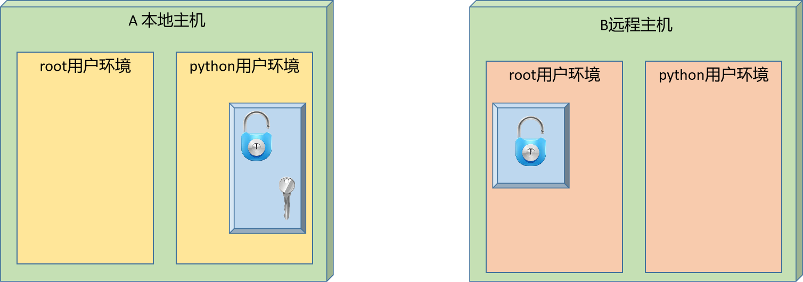

# 1 awk实践

## 1.1 逻辑控制

### 1.1.1 switch条件

学习目标

这一节，我们从 基础知识、简单实践、小结 三个方面来学习

**基础知识**

简介

```powershell
	在awk中有一种简单的条件控制语法switch，相较于if来说，switch分支语句功能较弱，只能进行等值比较或正则匹配，一般结合case方式来使用。
```

```powershell
语法格式
    switch (表达式) {
        case 值1|regex1 : 执行语句1;break
        case 值2|regex2 : 执行语句2;break
        case 值3|regex3 : 执行语句3;break
        ...
        [ default: 执行语句 ]
    }
注意：
	表达式的结果符合awk的逻辑运算，表达式成功返回0，表达式失败返回1
	因为switch本身外侧没有流程控制，所以，一般情况下，当外侧没有循环控制的时候，会结合break来使用
	一旦遇到break，代表退出当前循环
```

**简单实践**

实践1-简单实践

```powershell
无break效果
[root@localhost ~]# seq 2 | awk '{switch ($1 % 2) {
    case "1":
        print "奇数: ", $1
    case "0":
        print "偶数: ", $1
    default:
        print "嘿嘿"
}}'
奇数:  1
偶数:  1
嘿嘿
偶数:  2
嘿嘿
结果显示：
	没有break的时候，每一次都会走一个switch的完整循环
```

```powershell
结合break的基本语法实践
[root@localhost ~]# seq 5 | awk '{switch ($1 % 2) {
    case "1":
        print "奇数: ", $1
        break
    case "0":
        print "偶数: ", $1
        break
    default:
        print "嘿嘿"
        break
}}'
奇数:  1
偶数:  2
奇数:  3
偶数:  4
奇数:  5

结果显示：
	有了break效果好多了
```

实践2-结合文本来进行实践

```powershell
[root@localhost ~]# awk '{switch (NR % 2) {
    case "1":
        print "奇数行: ", $0
        break
    case "0":
        print "偶数行: ", $0
        break
}}' awk.txt
奇数行:  nihao awk1 awk2 awk3
偶数行:  nihao awk4 awk5 awk6
奇数行:  nihao awk7 awk8 awk9
```


```powershell
定制配置考试成果表
[root@localhost ~]# cat course_scores.txt
姓名  语文	数据  历史
张三 	100	 56	   99
李四 	90	 68	   89
王五 	50	 78	   67
赵六 	80	 99    89
```

```powershell
[root@localhost ~]# awk -v total=0 '
BEGIN{
    printf "\t学生成绩信息统计\n"
    printf "-----------------------------------\n"
}
NR>=2 {switch ($2+$3+$4 >= 240) {
    case 0:
        type="优秀";break
    case 1:
        type="良好";break
}
total=$2+$3+$4
printf "姓名: %-3s 总分: %4d,状态: %-2s\n",$1,$2+$3+$4,type
}' course_scores.txt
        学生成绩信息统计
-----------------------------------
姓名: 张三  总分:  255,状态: 良好
姓名: 李四  总分:  247,状态: 良好
姓名: 王五  总分:  195,状态: 优秀
姓名: 赵六  总分:  268,状态: 良好
```


**小结**

```

```


### 1.1.2 for循环

学习目标

这一节，我们从 基础知识、简单实践、小结 三个方面来学习

**基础知识**

简介

```powershell
	在awk中，支持一些逻辑循环的功能，比如 for、while等。实际的过程中，我们往往会结合数组元素进行信息的统计
```

```powershell
for语句标准格式
	for (三元表达式) {
        执行语句
    }

    for (变量 in 列表) {
        执行语句
    }
    
for语句简写格式
	for(表达式) {执行语句;...}
	
注意：
	for语句可以结合if语句进行操作
```

**简单实践**

实践1-for循环语法

```powershell
普通for循环实践
[root@localhost ~]# for((i=1,sum=0;i<=100;i++));do let sum+=i;done;echo $sum
5050

awk的for标准语法
[root@localhost ~]# awk 'BEGIN {
    sum=0
    for (i=1;i<=100;i++) {
        sum+=i
    }
    print sum
}'
5050

awk for循环单行实践
[root@localhost ~]# awk 'BEGIN{ sum=0; for(i=1;i<=100;i++) {sum+=i}; print sum}'
5050
```

实践2-文本实践

```powershell
文本信息的基本统计
[root@localhost ~]# seq 10 | paste -s | tr -s "\t" " " > num.txt
[root@localhost ~]# cat num.txt
1 2 3 4 5 6 7 8 9 10
[root@localhost ~]# awk '{for(i=1;i<=NF;i++){sum+=$i};print sum}' num.txt
55
```

```powershell
学生信息统计
[root@localhost ~]# awk 'NR>=2 {
    total=0
    for (i=2;i<=NF;i++) {
        total+=$i
    }
    print "学生姓名: "$1", 课程总分: "total
}' course_scores.txt
学生姓名: 张三, 课程总分: 255
学生姓名: 李四, 课程总分: 247
学生姓名: 王五, 课程总分: 195
学生姓名: 赵六, 课程总分: 268
```

**小结**

```

```


### 1.1.3 while循环

学习目标

这一节，我们从 基础知识、简单实践、小结 三个方面来学习

**基础知识**

简介

```powershell
	awk支持while相关的循环处理，它主要有两种表现样式
```

```powershell
样式1
    while(条件){
        执行语句
    }

样式2
    do {
        执行语句
    } while(条件)
    
简写样式
	while(condition){执行语句;...}
	do {条件;...} while(条件)
```


**简单实践**

实践1-while实践

```powershell
while标准格式
[root@localhost ~]# awk 'BEGIN {
    i=1;sum=0
    while(i<=100) {
        sum+=i
        i++
    }
    print sum
}'
5050

求和1~100
[root@localhost ~]# awk 'BEGIN{i=1;sum=0;while(i<=100){sum+=i;i++};print "sum="sum}'
sum=5050

指定数据进行求和
[root@localhost ~]# read -p "请输入一个数字 : " NUM;awk -v num=$NUM 'BEGIN{i=1;sum=0;while(i<=num){sum+=i;i++};print "1~$NUM的和为="sum}'
请输入一个数字 :34
1~$NUM的和为=595

最大值和最小值
[root@localhost ~]# echo '0 234 252 3246 2245 2345 4536 3754 32 345 323 234 3 1' > num.txt
[root@localhost ~]# awk '{min=$1;max=$1;while(i<=NF){if(max<$i)max=$i;if(min>$i)min=$i;i++};print "max:"max,"min:"min}' num.txt
max:4536 min:0

标准求和
[root@localhost ~]# awk '{
sum=0
i=1
while (i<=NF) {
   sum+=$i
   i++
}
print sum
}'  num.txt
17550
```

实践2-dowhile实践

```powershell
基本格式
[root@localhost ~]# awk 'BEGIN{i=0;do {print i;i++} while(i<5)}'
0
1
2
3
4

求和1~100
[root@localhost ~]# awk 'BEGIN{ total=0;i=1;do{ total+=i;i++;}while(i<=100);print total}'
5050
```


**小结**

```

```

### 1.1.4 流程控制

学习目标

这一节，我们从 基础知识、简单实践、小结 三个方面来学习

**基础知识**

简介

```powershell
	awk提供了很多的功能实践，尤其是与逻辑控制相关的，其实awk为了更好的进行这些流程的控制，它也提供了很多的控制语法，这些语法如下：
	continue 	中断本次循环
	break 		中断整个循环
	next 		可以提前结束对匹配行处理而直接进入下一行处理
	nextfile 	进阶版的next，可以提前结束对匹配行处理，直接读取下一个文件进行循环处理
	exit 		退出awk程序
		END代码段属于exit一部分，可以在BEGIN或main段中执行exit操作--执行END语句块。
```

**简单实践**

实践1-continue实践

```powershell
continue输出满足条件的数据
[root@localhost ~]# awk '
BEGIN{
  for(i=0;i<10;i++){
    if(i==5)continue
    print(i)
  }
}'
0
1
2
3
4
6
7
8
9
```

```powershell
continue 求奇|偶数和
[root@localhost ~]# awk 'BEGIN{sum=0;for(i=1;i<=100;i++){if(i%2==0)continue;sum+=i}print sum}'
2500
[root@localhost ~]# awk 'BEGIN{sum=0;for(i=1;i<=100;i++){if(i%2!=0)continue;sum+=i}print sum}'
2550
```

实践2-break实践

```powershell
continue输出满足条件的数据
[root@localhost ~]# awk '
BEGIN{
  for(i=0;i<10;i++){
    if(i==5){
      break
    }
    print(i)
  }
}'
0
1
2
3
4

循环求和，当加值为66的时候，停止运算
[root@localhost ~]# awk 'BEGIN{sum=0;for(i=1;i<=100;i++){if(i==66)break;sum+=i}print sum}'
2145
```

实践3-next实践

```powershell
查看文件内容
[root@localhost ~]# cat awk.txt -n
     1  nihao awk1 awk2 awk3
     2  nihao awk4 awk5 awk6
     3  nihao awk7 awk8 awk9
     
输出指定行外的其他行   
[root@localhost ~]# awk 'NR==3{next}{print}' awk.txt
nihao awk1 awk2 awk3
nihao awk4 awk5 awk6
[root@localhost ~]# awk 'NR==2{next}{print}' awk.txt
nihao awk1 awk2 awk3
nihao awk7 awk8 awk9

```

实践4-nextfile实践

```powershell
nextfile代表在
[root@localhost ~]# awk 'FNR==3{nextfile}{print}' awk.txt awk.txt
nihao awk1 awk2 awk3
nihao awk4 awk5 awk6
nihao awk1 awk2 awk3
nihao awk4 awk5 awk6
```

实践5-exit实践

```powershell
处理一个文件就退出awk程序
[root@localhost ~]# awk '{print $2}' awk.txt
awk1
awk4
awk7
[root@localhost ~]# awk '{print $2; exit}' awk.txt
awk1

只处理三行匹配的内容，后续结束
[root@localhost ~]# awk '/nologin/{i++;if(i<=3){print $0}else{exit;}}' /etc/passwd
bin:x:1:1:bin:/bin:/sbin/nologin
daemon:x:2:2:daemon:/sbin:/sbin/nologin
adm:x:3:4:adm:/var/adm:/sbin/nologin
```

```powershell
多个阶段实践exit
[root@localhost ~]# awk 'BEGIN{flag=1;exit 2}{}END{if(flag){exit 1}}'
[root@localhost ~]# echo $?
1
[root@localhost ~]# awk 'BEGIN{exit 2}{}END{if(flag){exit 1}}'
[root@localhost ~]# echo $?
2
[root@localhost ~]# echo | awk 'BEGIN{}{exit 111}END{if(flag){exit 1}}'
[root@localhost ~]# echo $?
111
[root@localhost ~]# echo | awk 'BEGIN{}{}END{if(flag){exit}}'
[root@localhost ~]# echo $?
0
```

**小结**

 ```powershell

 ```


### 1.1.5 数组实践

学习目标

这一节，我们从 基础知识、简单实践、小结 三个方面来学习

**基础知识**

简介

```powershell
	在使用awk的时候，其实在一些业务的数据分析场景下，使用频率最多的应该是数组，而且数据往往与前面学习的逻辑流程控制组合在一起使用，数组一般很少单独使用。
	其基本语法格式如下：
```

```powershell
定义数组：
	array[index表达式]
	index表达式:
        可使用任意字符串；字符串要使用双引号括起来
        如果某数组元素事先不存在，在引用时，awk会自动创建此元素，并将其值初始化为空串
        若要判断数组中是否存在某元素，要使用index in array格式进行遍历

遍历数组中的元素，要使用for循环
	for(var in array){for-body}
	注意：
		var会遍历array的每个索引，var不能用关键字index
```

**简单实践**

实践1-数组简单实践

```powershell
数组的简单定义和调用
[root@localhost ~]# awk 'BEGIN{array["yuwen"]=78;array["shuxue"]=89;array["lishi"]=99;print array["yuwen"],array["shuxue"],array["lishi"]}'
78 89 99

数组的遍历操作
[root@localhost ~]# awk 'BEGIN{array["yuwen"]=78;array["shuxue"]=89;array["lishi"]=99;for(i in array){print array[i]}}'
78
89
99

内容自动遍历
[root@localhost ~]# cat passwd.txt
root:x:0:0:root:/root:/bin/bash
[root@localhost ~]# awk -F: '{for(i=1;i<NF;i++){arrar[i]=i} print $7}' passwd.txt
/bin/bash
[root@localhost ~]# awk -F: '{for(i=1;i<NF;i++){array[i]=$i};for(j in array){print array[j]}}' passwd.txt
0
root
/root
root
x
0
```

实践2-数组数据去重

```powershell
文件内容准备
[root@localhost ~]# echo -e "a\nb\na\ncc" > array.txt
[root@localhost ~]# cat array.txt
a
b
a
cc

数组去重的逻辑
[root@localhost ~]# awk 'array[$0]++' array.txt
a
[root@localhost ~]# awk '!array[$0]++' array.txt
a
b
cc
语法解读
	array[$0]++  第一次执行array[$0]，由于是array[a]不为空，所以为真，然后array[a]"++"计数后变成1，并打印数组元素a
	!array[$0]++ 第一次效果与上面一样，执行到第三行的时候，因为存在array[a]已存在，为真,然后!array[a]为假，不再输出打印当前内容，从而达到去重的效果
```

实践3-统计计数

```powershell
统计计数
[root@localhost ~]# echo "a.b.c,c.d" |awk -F'[.,]' '{for(i=1;i<=NF;i++)a[$i]++}END{for(v in a)print v,a[v]}'
a 1
b 1
c 2
d 1
```

**小结**

```

```

### 1.1.6 自定义函数

学习目标

这一节，我们从 基础知识、简单实践、小结 三个方面来学习。

**基础知识**

需求

```powershell
	虽然awk提供了内置的函数来实现相应的内置函数，但是有些功能场景，还是需要我们自己来设定，这就用到了awk的自定义函数功能了。
	awk的函数目的，与shell的函数目的一致，都是提高代码的复用能力和功能灵活性
```

函数

```powershell
语法格式
    function 函数名(参数1, 参数2, ...)
    {
        函数体代码
    }
注意：
	函数名不能用awk的关键字信息
```

**简单实践**

实践1-简单函数实践

```powershell
[root@localhost ~]# awk '
function add_func(num1, num2)
{
  return num1 + num2
}
function sub_func(num1, num2)
{
  if (num1 > num2)
    return num1 - num2
  return num2 - num1
}
BEGIN {
  sum_result=add_func(10, 20)
  print "两值之和为: "sum_result
  sub_result=sub_func(10, 20)
  print "两值之差为: "sub_result
}'
两值之和为: 30
两值之差为: 10
```

实践2-数据统计计算

```powershell
在之前的案例基础上，进行统计运算每个学生的总分，每个班级的课程总分
[root@localhost ~]# awk '
function head_func() {
  printf "---------------------------\n|%-3s|%2s|%2s|%2s|%2s|\n---------------------------\n","姓名","语文","数学","历史","总分"
}
function body_func(arg1, arg2, arg3, arg4,arg5){
  printf "|%-3s|%4d|%4d|%4d|%4d|\n",arg1,arg2,arg3,arg4,arg5
}
function tail_func(arg1, arg2, arg3, arg4,arg5){
  printf "---------------------------\n|%-3s|%4d|%4d|%4d|%4d|\n---------------------------\n学生总数总: %2d\n","合计",arg1,arg2,arg3,arg4,arg5
}
BEGIN {
  head_func()
  yu=0;shu=0;li=0;total
}{
  yu=$2+yu;shu=$3+shu;li=$4+li;total=$2+$3+$4
  body_func($1,$2,$3,$4,$2+$3+$4)
}END{
  tail_func(yu,shu,li,total,NR)
}' course_scores.txt
---------------------------
|姓名 |语文|数学|历史|总分|
---------------------------
|张三 | 100|  56|  99| 255|
|李四 |  90|  68|  89| 247|
|王五 |  50|  78|  67| 195|
|赵六 |  80|  99|  89| 268|
---------------------------
|合计 | 320| 301| 344| 268|
---------------------------
学生总数总:  4
```

**小结**

```powershell

```


### 1.1.7 综合实践

学习目标

这一节，我们从 网络实践、文件实践、小结 三个方面来学习

**网络实践**

简介

```powershell
	所谓的网络实践，主要是借助于awk的数组功能，进行站点的信息统计操作。
```

准备网络环境

```powershell
安装软件
yum install nignx -y

重启nginx
[root@localhost ~]# systemctl restart nginx.service

重置网站首页
[root@localhost /etc/nginx]# echo 'hello nginx' > /usr/share/nginx/html/index.html
[root@localhost /etc/nginx]# curl localhost
hello nginx
[root@localhost /etc/nginx]# curl localhost/nihao -I -s | head -1
HTTP/1.1 404 Not Found

模拟外网访问
[root@localhost ~]# curl http://10.0.0.12/ -s -I -H "X-Forwarded-For: 2.2.2.2" | head -1
HTTP/1.1 200 OK
[root@localhost ~]# tail -n1 /var/log/nginx/access.log
10.0.0.12 - - [19/Jun/2022:18:04:20 +0800] "HEAD / HTTP/1.1" 200 0 "-" "curl/7.29.0" "2.2.2.2"

```

```powershell
准备ip地址文件
[root@localhost ~]# cat ip.txt
112.64.233.130
114.101.40.170
123.15.24.200
125.46.0.62
223.243.252.155
122.228.19.92
218.2.226.42
124.205.143.213
218.60.8.99
125.123.120.130
123.139.56.238
218.60.8.83
222.240.184.126
222.90.110.194
1.196.160.46
222.217.125.153
163.125.156.249
27.50.142.132
61.145.182.27
222.249.238.138
218.64.69.79
103.10.86.203
14.155.112.17
27.191.234.69
60.211.218.78
124.237.83.14
59.44.247.194
114.249.119.45
125.123.65.177
14.115.106.222
```

```powershell
准备站点访问测试脚本
[root@localhost /etc/nginx]# cat curl_web_site.sh
#!/bin/bash
# 功能：模拟外网访问网站
while true
do
  cat ip.txt | while read ip
  do
   NUM=$(echo $ip | cut -d"." -f 4)
   for i in $(seq $NUM)
   do
     curl http://10.0.0.12/ -s -I -H "X-Forwarded-For: $ip" >> /dev/null
     curl http://10.0.0.12/$NUM/ -s >> /dev/null
   done
   sleep 1
  done
done
```

```
脚本测试效果
[root@localhost ~]# /bin/bash curl_web_site.sh
...
```

实践1-基本信息统计

```powershell
查看当前系统的链接状态数量
[root@localhost ~]# ss  -ant
State       Recv-Q Send-Q  Local Address:Port   Peer Address:Port
LISTEN      0      128                 *:22                *:*
ESTAB       0      0           10.0.0.12:22         10.0.0.1:60856
ESTAB       0      0           10.0.0.12:22         10.0.0.1:60857
ESTAB       0      64          10.0.0.12:22         10.0.0.1:64059
ESTAB       0      0           10.0.0.12:22         10.0.0.1:64061
LISTEN      0      32               [::]:21             [::]:*
LISTEN      0      128              [::]:22             [::]:*
```

```powershell
统计当前主机的连接状态信息
[root@localhost ~]# ss -tan|awk '!/State/{state[$1]++}END{for(i in state){print i,state[i]}}'
LISTEN 5
ESTAB 4
TIME-WAIT 3960
```

```powershell
发现异常ip地址，进行杜绝恶意ip地址访问
[root@localhost ~]# ss -nt | awk -F'[ :]+' '!/State/{ip[$(NF-2)]++}END{for(i in ip){print i,ip[i]}}' | while read line; do ip=$(echo $line | awk '{if($2>1)print $1}');[ -z "$ip" ] || echo "iptables -A INPUT -s $ip -j REJECT"; done
iptables -A INPUT -s 10.0.0.1 -j REJECT
注意：
	这里为了演示成功，故意将恶意ip的频率降低了
	如果不小心真的添加了防火墙策略，则执行下面的命令实现功能恢复
	iptables -vnL INPUT
	iptables -D INPUT 1
```

实践2-web访问信息统计

```powershell
获取客户端ip地址信息
[root@localhost ~]# awk -F '"' 'NR==403 {print $(NF-1)}' /var/log/nginx/access.log
114.101.40.170
统计访问网站的地址信息
[root@localhost ~]# awk -F '"' '{ip[$(NF-1)]++}END{for(i in ip){print i,ip[i]}}' /var/log/nginx/access.log
60.211.218.78 624
222.217.125.153 1377
124.205.143.213 1917
14.115.106.222 1776
14.155.112.17 153
...
```

```powershell
统计站点的访问页面信息
[root@localhost ~]# awk '{a[$7]++}END{for(v in a)print v,a[v]|"sort -k1 -nr|head -n10"}' /var/log/nginx/access.log
/nihao 3
/img/html-background.png 1
/img/header-background.png 1
/img/centos-logo.png 1
/favicon.ico 1
/99/ 396
/92/ 368
/83/ 332
/79/ 316
/78/ 312
```

实践3-脚本信息统计

```powershell
查看脚本内容
[root@localhost ~]# cat net.sh
#!/bin/bash
# 功能: 脚本统计主机网络信息

# TCP连接数量
TCP_Total=$(ss -s | awk '$1=="TCP"{print $2}')
# UDP连接数量
UDP_Total=$(ss -s | awk '$1=="UDP"{print $2}')
# Listen监听状态的TCP端口数量
Listen_Total=$(ss -antlpH | awk 'BEGIN{count=0} {count++} END{print count}')
# ESTABLlSHED状态的TCP连接数量
Estab_Total=$(ss -antpH | awk 'BEGIN{count=0}/^ESTAB/{count++}END{print count}')
# TIME-WAIT状态的TCP连接数量
TIME_WAIT_Total=$(ss -antpH | awk 'BEGIN{count=0}/^TIME-WAIT/{count++}END{print count}')

#显示主机连接相关信息
echo "TCP连接总数：$TCP_Total"
echo "UDP连接总数：$UDP_Total"
echo "LISTEN状态的TCP端口数量：$Listen_Toatl"
echo "ESTAB状态的TCP连接数量：$Estab_Toatl"
echo "TIME-WAIT状态的TCP连接数量：$TIME_WAIT_Total"
```

**文件实践**

简介

```powershell
	所谓的文件实践，主要是借助于awk的数组功能，实现文件的合并格式化等工作.
```

查看日志的样式

```powershell
默认日志格式
	10.0.0.12 - - [19/Jun/2022:18:13:51 +0800] "HEAD / HTTP/1.1" 200 0 "-" "curl/7.29.0" "114.101.40.170"
	
期望统计信息
--------------------------------------------
|     ip地址     |访问次数|访问url|访问次数|
--------------------------------------------
|   60.211.218.78|    1248|      /|    1248|
| 222.217.125.153|    2448|      /|    2448|
```

准备工作

```powershell
获取ip地址
[root@localhost ~]# awk -F '("| )' 'NR==404 {print $(NF-1)}' /var/log/nginx/access.log
114.101.40.170

获取访问页面
[root@localhost ~]# awk -F '("| )' 'NR==404 {print $(NF-13)}' /var/log/nginx/access.log
/170/
```

输出统计信息

```powershell
[root@localhost ~]# awk -F '("| )' '
  BEGIN{
    printf "--------------------------------------------\n|%-14s|%-4s|%-4s|%-4s|\n--------------------------------------------\n","     ip地址","访问次数","访问url","访问次数"
  }
  {a[$(NF-1)][$(NF-13)]++}
  END{
    # 遍历数组，统计每个ip的访问总数
    for(ip in a){
      for(uri in a[ip]){
        b[ip] += a[ip][uri]
      }
    }
    # 再次遍历
    for(ip in a){
      for(uri in a[ip]){
        printf "|%16s|%8d|%7s|%8d|\n", ip, b[ip], uri, a[ip][uri]
      }
    }
    printf "--------------------------------------------\n"
  }
' /var/log/nginx/access.log

--------------------------------------------
|     ip地址     |访问次数|访问url|访问次数|
--------------------------------------------
|   60.211.218.78|    1248|      /|    1248|
| 222.217.125.153|    2448|      /|    2448|
| 124.205.143.213|    3408|      /|    3408|
|  14.115.106.222|    3330|      /|    3330|
|   14.155.112.17|     272|      /|     272|
--------------------------------------------
```


**小结**

```

```


# 2 变量进阶

## 2.1 变量实践

### 2.1.1 高级赋值

学习目标

这一节，我们从 基础知识、简单实践、小结 三个方面来学习

**基础知识**

简介

```powershell
	所谓的高级赋值，是另外的一种变量值获取方法，这里涉及到更多我们学习之外的一些shell内置变量格式,其实这部分的内容主要还是在字符串的基础上，如何更精细的获取特定的信息内容：主要涉及到的内容样式如下：
```

```powershell
字符串截取按分隔符截取: # 右  % 左
    ${file#/}	   	删除匹配结果，保留第一个/右边的字符串
    ${file##/}		删除匹配结果，保留最后一个/右边的字符串
    ${file%/}		删除匹配结果，保留第一个/左边的字符串
    ${file%%/}		删除匹配结果，保留最后一个/左边的字符串
    注意：
        匹配内容的正则表达式，尽量不要出现特殊边界字符
```

```powershell
字符串替换
    ${file/dir/path}	把第一个dir替换成path：/path1/dir2/dir3/n
    ${file//dir/path}	把所有dir替换成path：/path1/path2/path3/n
    ${file/#dir/path} 	将从左侧能匹配到的dir，则替换成 path 然后返回；否则直接返回 ${var}。
    ${file/%dir/path} 	将从右侧能匹配到的dir，则替换成 path 然后返回；否则直接返回 ${var}。
    注意：
		如果匹配内容使用的是正则符号，应该注意正则符号的写法
```

```powershell
字符串转换
    ${file^^}		把file中的所有小写字母转换为大写
    ${file,,}		把file中的所有大写字母转换为小写
```

**简单实践**

实践1-字符串截取

```powershell
字符串截取示例
[root@localhost ~]# string=abc12342341
[root@localhost ~]# echo ${string#a*3}
42341
[root@localhost ~]# echo ${string#c*3}
abc12342341
[root@localhost ~]# echo ${string#*c1*3}
42341
[root@localhost ~]# echo ${string##a*3}
41
[root@localhost ~]# echo ${string%3*1}
abc12342
[root@localhost ~]# echo ${string%%3*1}
abc12
```

```powershell
字符串截取赋值
[root@localhost ~]# file=/var/log/nginx/access.log
[root@localhost ~]# filename=${file##*/}
[root@localhost ~]# echo $filename
access.log
[root@localhost ~]# filedir=${file%/*}
[root@localhost ~]# echo $filedir
/var/log/nginx
```

实践2-字符串替换

```powershell
字符串替换示例
[root@localhost ~]# str="apple, tree, apple tree, apple"
[root@localhost ~]# echo ${str/apple/APPLE}
APPLE, tree, apple tree, apple
[root@localhost ~]# echo ${str//apple/APPLE}
APPLE, tree, APPLE tree, APPLE
[root@localhost ~]# echo ${str/#apple/APPLE}
APPLE, tree, apple tree, apple
[root@localhost ~]# echo ${str/%apple/APPLE}
apple, tree, apple tree, APPLE

使用正则的情况下，代表尽可能多的匹配
[root@localhost ~]# file=dir1@dir2@dir3@n.txt
[root@localhost ~]# echo ${file/#d*r/DIR}
DIR3@n.txt
[root@localhost ~]# echo ${file/%3*/DIR}
dir1@dir2@dirDIR
```

实践3-字符串转换

```powershell
[root@localhost ~]# str="apple, tree, apple tree, apple"
[root@localhost ~]# upper_str=${str^^}
[root@localhost ~]# echo ${upper_str}
APPLE, TREE, APPLE TREE, APPLE
[root@localhost ~]# lower_str=${upper_str,,}
[root@localhost ~]# echo ${lower_str}
apple, tree, apple tree, apple
```


**小结**

```

```


### 2.1.2 嵌套变量

学习目标

这一节，我们从 基础知识、简单实践、小结 三个方面来学习

**基础知识**

场景现象

```powershell
场景1：我们知道，命令变量的的表现样式：
	ver=$(命令)
	-- 执行原理是，当`` 或者 $() 范围中存在能够正常解析的命令的话，会先执行命令，然后将命令执行的结果交个一个变量名。
场景2：它还有另外一种样式 -- 普通变量的第三种样式双引号 
	ming=shuji; name="wang-$ming"
	-- 解析原理：双引号会首先查看变量值范围内是否有可以解析的变量名，如果有的话，将解析后的结果放到变量值范围内，组合成一个新的变量值，然后交给变量名。
```

```powershell
	上面的两种场景的特点就在于，一个命令行中，借助于$() 或者 "" 发起一次隐藏的命令执行，但是有些场景下，表面上的一个命令需要发起更深一层的命令执行才可以实现指定的功能。在这种场景下，无论是$() 还是 ""都无法满足要求了
```

场景示例

```powershell
循环遍历演示
[root@localhost ~]# for i in {1..10}; do  echo "$i "; done
1
2
3
4
5
6
7
8
9
10
示例解读：这里出现一层隐藏命令执行
	1 {1..10} 会自动进行命令解析
		[root@localhost ~]# echo {1..10}
  	  	1 2 3 4 5 6 7 8 9 10
  	然后执行for命令
  		for i in 1 2 3 4 5 6 7 8 9 10
```

```powershell
双层隐藏命令解读
[root@localhost ~]# n=10
[root@localhost ~]# for i in {1..$n}; do  echo "$i "; done
{1..10}

示例解读：
	在for语句中，其实我们的目的与上面的演示一样，但是区别在于这里有两层隐藏的命令执行
	1 $n 需要解析成 10
	2 {1..10} 需要解析成 1 2 3 4 5 6 7 8 9 10
	最后执行 for命令 for 1 2 3 4 5 6 7 8 9 10
```

```powershell
问题：
	linux命令行，默认情况下是无法执行两层隐藏命令的执行的，在有些场景中，我们可以通过$() 来实现多层命令的解读，示例如下：
	[root@localhost ~]# cmd=who
    [root@localhost ~]# echo $(${cmd}ami)
    root
	但是，这里我们无法实现，因为 {1..10} 不是命令。
	[root@localhost ~]# for i in $({1..$n}); do  echo "$i "; done
	-bash: {1..10}: 未找到命令
```

解决方法

```powershell
	在shell中，它提供了一个专属的命令，可以实现多层隐藏命令的解析，不仅仅能够解析，还能够将相关环境的属性重现，从而实现多层隐藏命令的顺利执行。这个命令就是 eval。
```

```powershell
eval原理
	1 eval命令将会首先扫描命令行整体
	2 发现解析则解析，发现执行则预先执行，实现所有隐藏命令的成功执行
	3 将隐藏命令执行的最终结果进行置换
	4 最后执行命令行表面的命令。
```


**简单实践**

实践1-eval简单实践

```powershell
for循环演示
[root@localhost ~]# n=10
[root@localhost ~]# for i in $(eval echo {1..$n}); do  echo "$i "; done
1
2
3
4
5
6
7
8
9
10
示例解读
	1 命令改造$(eval echo {1..$n})
		1-1 $n先解析为10，命令替换为 {1..10}
		1-2 通过 eval 带入 echo 命令环境
		1-3 $() 执行 echo {1..10} 输出为 1 2 3 4 5 6 7 8 9 10
	2 整体置换命令结果
		for i in 1 2 3 4 5 6 7 8 9 10
```

实践2-eval的命令扩展演示

```powershell
查看文件内容
[root@localhost ~]# echo 'hello-in-world' > infile.txt
[root@localhost ~]# cat infile.txt
hello-in-world

脚本内容演示
[root@localhost ~]# echo 'hello-in-world' > infile.txt
[root@localhost ~]# cat infile.txt
hello-in-world
[root@localhost ~]# cmd="cat infile.txt"
[root@localhost ~]# echo $(${cmd})
hello-in-world
[root@localhost ~]# echo ${cmd}				
cat infile.txt

不是我们想要的，我们可以借助于eval 和 $() 方式来实现隐藏命令的解读
[root@localhost ~]# eval ${cmd}
hello-in-world
[root@localhost ~]# echo $(${cmd})
hello-in-world
```

实践3-eval变量名的预制解析

```powershell
定制嵌套的环境变量
[root@localhost ~]# str=a
[root@localhost ~]# num=1
[root@localhost ~]# $str$num=hello
-bash: a1=hello: 未找到命令

借助于eval命令来实现
[root@localhost ~]# eval $str$num=hello
[root@localhost ~]# echo $a1
hello

借助于eval实现变量名的嵌套
[root@localhost ~]# eval $str=$a1
[root@localhost ~]# echo $a
hello
解读：
	$str 就是 a，$a1就是hello，
	eval执行的命令就是  a=hello
```

**小结**

```

```

### 2.1.3 综合案例

学习目标

这一节，我们从 免密认证、脚本实践、小结 三个方面来学习

**免密认证**

案例需求

```
	A 以主机免密码认证 连接到 远程主机B
```



```powershell
我们要做主机间免密码认证需要做三个动作
    1、本机生成密钥对
    2、对端机器使用公钥文件认证
    3、验证
```

手工演示

```powershell
本地主机生成秘钥对
[root@localhost ~]# ssh-keygen -t rsa -P "" -f ~/.ssh/id_rsa
Generating public/private rsa key pair.
Created directory '/root/.ssh'.
Your identification has been saved in /root/.ssh/id_rsa.
Your public key has been saved in /root/.ssh/id_rsa.pub.
The key fingerprint is:
SHA256:Ncra/fPpaVs+M18l9Kn7CQq33zmWQSoJ/ujuugCkNjM root@localhost
The key's randomart image is:
+---[RSA 2048]----+
|                 |
|                 |
|   .      o   .  |
|  o    . + . . o.|
| E .    S . . +.o|
|. + .  o o o ..o.|
|     .. ..+..o  =|
|      .  .oo+ =%+|
|       o*+ ooBO*O|
+----[SHA256]-----+
```

```powershell
将公钥信息传递给远程主机的指定用户
[root@localhost ~]# ssh-copy-id -i /root/.ssh/id_rsa.pub root@10.0.0.12
/usr/bin/ssh-copy-id: INFO: Source of key(s) to be installed: "/root/.ssh/id_rsa.pub"
The authenticity of host '10.0.0.12 (10.0.0.12)' can't be established.
ECDSA key fingerprint is SHA256:XUJsgk4cTORxdcswxIKBGFgrrqFQzpHmKnRRV6ABMk4.
ECDSA key fingerprint is MD5:71:74:46:50:3f:40:4e:af:ad:d3:0c:de:2c:fc:30:c0.
Are you sure you want to continue connecting (yes/no)? yes
/usr/bin/ssh-copy-id: INFO: attempting to log in with the new key(s), to filter out any that are already installed
/usr/bin/ssh-copy-id: INFO: 1 key(s) remain to be installed -- if you are prompted now it is to install the new keys
root@10.0.0.12's password:

Number of key(s) added: 1

Now try logging into the machine, with:   "ssh 'root@10.0.0.12'"
and check to make sure that only the key(s) you wanted were added.
```

```powershell
本地主机测试验证效果
[root@localhost ~]# ssh root@10.0.0.12 "ifconfig eth0 | grep netmas"
        inet 10.0.0.12  netmask 255.255.255.0  broadcast 10.0.0.255
```

**简单实践**

```powershell
remotehost_sshkey_auth.sh
#!/bin/bash
# 功能：设置ssh跨主机免密码认证
# 版本：v0.1
# 作者：书记
# 联系：www.superopsmsb.com

# 定制普通变量
user_dir="/root"
login_uesr='root'
login_pass='123456'

# 定制数组变量
target_type=(部署 免密 退出)

# 定制安装软件的函数
expect_install(){
    yum install expect -y >> /dev/null
    echo "软件安装完毕"
}

# 定制ssh秘钥对的生成
sshkey_create(){
    # 清理历史秘钥
    [ -d ${user_dir}/.ssh ] && rm -rf ${user_dir}/.ssh
    # 生成新的秘钥
    ssh-keygen -t rsa -P "" -f ${user_dir}/.ssh/id_rsa >> /dev/null
    echo "秘钥生成完毕"
}

# 定制expect的认证逻辑
expect_process(){
    # 注意：这里不要乱用$1,可以参考函数和脚本间的数组传参
    command="$@"
    expect -c "
        spawn ${command}
        expect {
            \"*yes/no*\" {send \"yes\r\"; exp_continue}
            \"*password*\" {send \"${login_pass}\r\"; exp_continue}
            \"*Password*\" {send \"${login_pass}\r\";}
        }"
}

# 跨主机密码认证
sshkey_auth(){
    local host_list="$1"
    for i in ${host_list}
    do
        command="/usr/bin/ssh-copy-id -i /root/.ssh/id_rsa.pub"
        remote="${login_uesr}@$i"
        expect_process ${command} ${remote}
    done
}

# 定制服务的操作提示功能函数
menu(){
    echo -e "\e[31m---------------管理平台操作界面---------------"
    echo -e " 1: 秘钥准备  2: 免密认证  3: 退出操作"
    echo -e "-------------------------------------------\033[0m"
}

# 定制脚本帮助信息
Usage(){
    echo "请输入有效的操作标识!!!"
}

# 定制业务逻辑
while true
do
    menu
    read -p "> 请输入要操作的目标类型: " target_id
    if [ ${target_type[$target_id-1]} == "部署" ];then
        echo "开始部署秘钥环境..."
        expect_install
        sshkey_create
    elif [ ${target_type[$target_id-1]} == "免密" ];then
        read -p "> 请输入免密10.0.0网段主机的范围，示例{12..19}: " num_list
        # eval的隐藏命令解析
        ip_list=$(eval echo 10.0.0.${num_list})
        sshkey_auth ${ip_list}
    elif [ ${target_type[$target_id-1]} == "退出" ];then
        echo "准备退出管理操作界面..."
        exit
    else
        Usage
    fi
done
```

```powershell
脚本执行效果
[root@localhost ~]# /bin/bash remotehost_sshkey_auth.sh
---------------管理平台操作界面---------------
 1: 秘钥准备  2: 免密认证  3: 退出操作
-------------------------------------------
> 请输入要操作的目标类型: 1
开始部署秘钥环境...
软件安装完毕
秘钥生成完毕
---------------管理平台操作界面---------------
 1: 秘钥准备  2: 免密认证  3: 退出操作
-------------------------------------------
> 请输入要操作的目标类型: 2
> 请输入免密10.0.0网段主机的范围，示例{12..19}: {12..13}
spawn /usr/bin/ssh-copy-id -i /root/.ssh/id_rsa.pub root@10.0.0.12
/usr/bin/ssh-copy-id: INFO: Source of key(s) to be installed: "/root/.ssh/id_rsa.pub"
/usr/bin/ssh-copy-id: INFO: attempting to log in with the new key(s), to filter out any that are already installed
/usr/bin/ssh-copy-id: INFO: 1 key(s) remain to be installed -- if you are prompted now it is to install the new keys
root@10.0.0.12's password:

Number of key(s) added: 1

Now try logging into the machine, with:   "ssh 'root@10.0.0.12'"
and check to make sure that only the key(s) you wanted were added.

---------------管理平台操作界面---------------
 1: 秘钥准备  2: 免密认证  3: 退出操作
-------------------------------------------
> 请输入要操作的目标类型: 3
准备退出管理操作界面...
```

**小结**

```powershell

```

