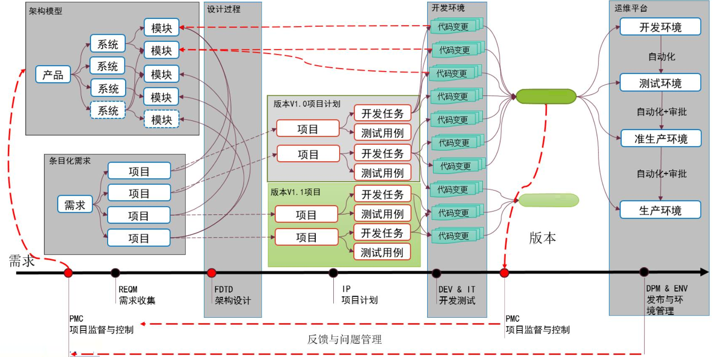
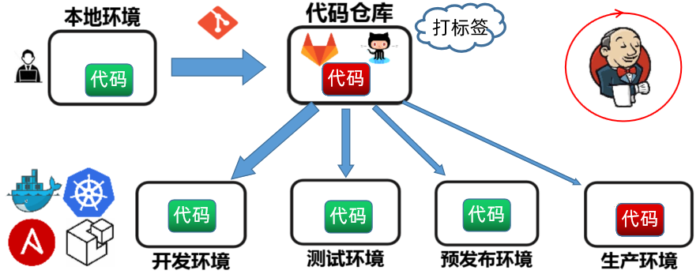
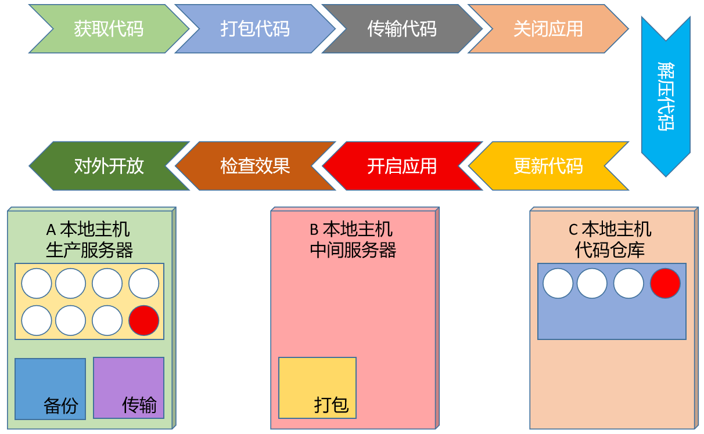
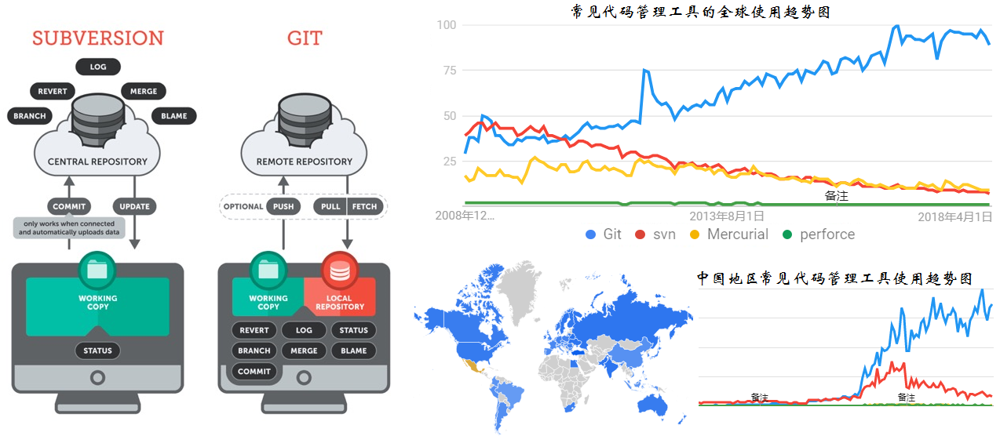
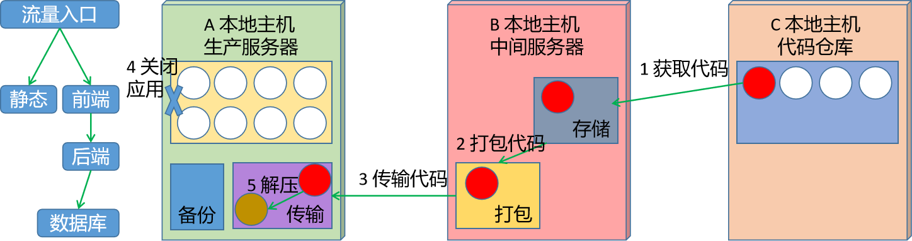
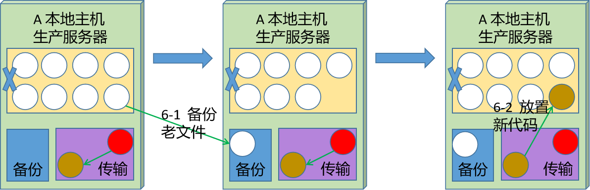
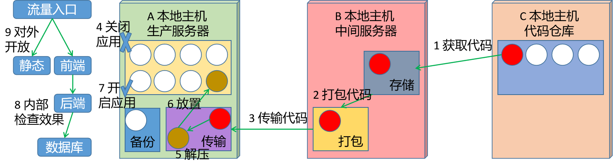
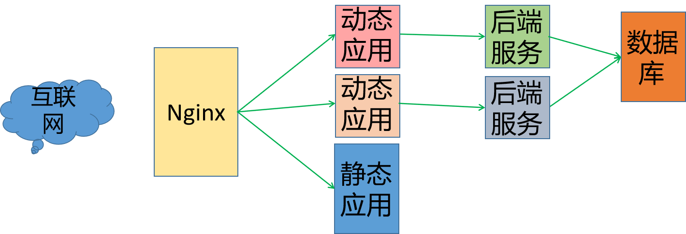
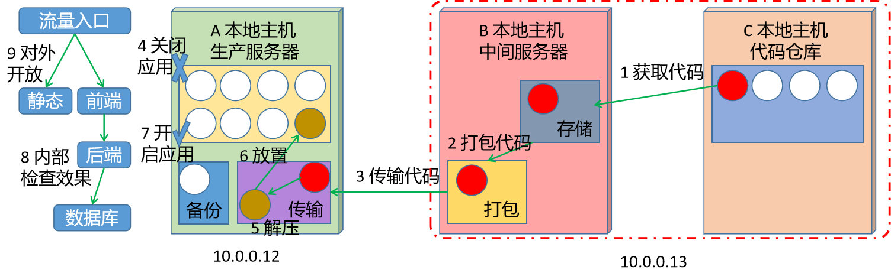

# 1 项目发布

## 1.1 基础知识

### 1.1.1 项目交付

学习目标

这一节，我们从 基础知识、代码发布、小结 三个方面来学习

**基础知识**

简介

```powershell
	项目交付是一个涉及到多团队共同协作的事情，它包括 产品团队设计产品、研发团队开发产品、测试团队测试代码、运维团队发布代码和维护站点等工作。
```


```powershell
项目交付的过程中，每个团队都有自己特有的一些工作特殊
```



```
一般情况下，项目交付在软件工程人员人员眼中的基本逻辑
```



**代码发布**

简介

```powershell
	所谓的代码发布，其实就是一句话：将我们的代码放到一台公司的互联网服务器上。那么我们应该怎么来理解这句话呢？我们从三个方面来理解他。
```

```powershell
发布什么？
	代码		经过测试，功能完善，没有问题的代码
发布到哪里？
	服务器		所有人都能访问的到的一台服务器(有公网IP)
				idc机房、阿里云、亚马逊、腾讯云、华为云、....
发布的效果？
	web网页	对外展示
```

发布方式

```powershell
常见的代码发布方式有两种：手工方式和脚本方式。
样式1：手工发布代码
	慢、干扰因素多、不安全
样式2：脚本发布代码
	快、干扰因素少、安全
```

**小结**

```

```


### 1.1.2 发布解读

学习目标

这一节，我们从 基本流程、流程解读、小结 三个方面来学习

**基本流程**

简介

```powershell
	这里面的代码发布过程是侧重于手工级别的代码发布流程，在其他的一些基础设施环境中，虽然有一些区别，但是整个的流程脉络是一样的。
```



```powershell
功能解读：
	获取代码 - 为什么？ - 代码在远端服务器上
	打包代码 - 为什么？ - 代码量太多，不好传输
	传输代码 - 为什么？ - 本地主机没有代码
	关闭应用 - 为什么？ - 防止用户访问出错
	解压代码 - 为什么？ - 拉过来的是压缩包
	更新代码 - 为什么？ - 要发布项目
	开启应用 - 为什么？ - 刚才关闭了
	检查效果 - 为什么？ - 万一失败了呢？
	对外开放 - 为什么？ - 发布过程，没有让网上用户看到
```


**流程详解**

获取代码

```powershell
	一般情况下，软件项目的网站代码都存放在一个稳定的代码服务器上，这个网站服务器叫代码仓库。
```



```powershell
仓库分类
	公有仓库 - 使用互联网的代码服务器
	私有仓库 - 内部服务器或者公网服务器
	
实现方式
	集中式：svn的几乎所有操作命令，受本地主机和代码仓库的网络连接状态。
	分布式：git的几乎所有操作命令，不受代码仓库的网络连接状态限制。
```

打包代码

```powershell
	所谓的打包代码，其实就是将获取的项目源代码进行打包操作
```


```powershell
目的：
	减少传输文件数量
	减小传输文件大小
	增强传输速率
		
常见打包方式：
	windows:	zip、rar...
	linux：	   tar、zip...
```

传输代码

```powershell
	在一个临时的服务器环境上，进行项目代码的部署测试，如果没有问题的话，可以将该代码传输到生产服务器上.
	常见的传输方式如下：
```

```powershell
有网情况下
	多种方式： git、ftp、scp、共享挂载 cp、rsync
没有网情况下
	物理方式： U盘或者硬盘
```



关闭应用

```powershell
	发布代码的时候，肯定会对生产服务器上运行的项目产生影响，为了避免对互联网用户产生不必要的干扰，我们会将应用关闭。	
```

```powershell
问题1：关闭什么应用
	代码所在的服务用到了什么应用，就关闭什么应用
问题2：应用相互依赖的情况下，如何确定关闭的顺序
	站在用户访问的角度，先关闭离客户近的，后关闭离客户远的。
```

解压代码

```powershell
	这一步不是必须的，有些场景下，需要代码压缩包解压，有些不用
```

更新代码

```powershell
	为了避免我们在放置代码过程中，对老文件造成影响，所以我们放置代码一般分为两步：备份老文件和放置新文件。
```

```powershell
备份老文件：防止更新失败，导致旧有的成功运行的代码被覆盖。
放置新文件：将新代码放置到旧代码的位置

注意：
	两个文件的名称是一样的，只是内容不同
	对整个应用项目来说，两个文件没有区别
```



开启应用

```powershell
	在代码放置完毕后，将刚才关闭了应用，开启就可以了
```

```powershell
开启的顺序：
	先开启离客户远的，后开启离客户近的
```



检查效果

```
	为了防止发布后的效果不成功，我们手工方式或者其他方式检测网站的功能是否可以正常的访问
```

对外开放

```powershell
	项目内部人员检查这次发布没有问题后，开放应用的流量入口，让用户使用新版本的服务
```

**小结**

```

```


### 1.1.3 技术要点

学习目标

这一节，我们从 解压缩、传输、备份、小结 三个方面来学习

**解压缩**

简介

```powershell
文件的压缩
	压缩格式：tar zcvf 压缩后的文件名  将要压缩的文件
文件的解压
	解压格式：tar xf 压缩后的文件名
查看压缩文件内容
	查看格式：zcat 压缩文件
```

```powershell
命令参数详解
    z	指定压缩文件的格式为 tar.gz
    c	表示压缩
    v	显示详细过程
    f	指定压缩文件
    x	解压
    C   制定解压位置
```

解压缩实践

```powershell
压缩实践
[root@localhost ~]# mkdir tar_dir
[root@localhost ~]# echo nihao > tar_dir/nihao.txt
[root@localhost ~]# tar -zcvf nihao.tar.gz tar_dir/
tar_dir/
tar_dir/nihao.txt

查看压缩文件
[root@localhost ~]# zcat nihao.tar.gz
tar_dir/0000...6011213 5ustar rootroottar_dir/nihao.txt 00...4253652266013046 0ustar  rootrootnihao

解压文件
[root@localhost ~]# tar xf nihao.tar.gz -C /tmp/
[root@localhost ~]# cat /tmp/tar_dir/nihao.txt
nihao
```


**传输**

简介

```powershell
scp传输工具：
	命令格式：scp  要传输的文件 要放置的位置
	
远程目标样式：
	远端主机文件放置位置的表示形式：
		远程连接的用户@远程主机:远程主机的目录路径
	远端主机文件位置的表示形式：
		远程连接的用户@远程主机:远程主机的文件路径
```

```powershell
传输示例：
	将本地文件推送到远程主机
		scp file.tar.gz root@10.0.0.12:/root/
	将远程主机的文件拉取到本地
		scp root@10.0.0.12:/root/file.tar.gz ./
```

传输文件实践

```powershell
本地文件传输远程
[root@localhost ~]# scp nihao.tar.gz root@10.0.0.13:/tmp/
Warning: Permanently added '10.0.0.13' (ECDSA) to the list of known hosts.
root@10.0.0.13's password:
nihao.tar.gz          100%  156   122.3KB/s   00:00

远程文件拉到本地
[root@localhost ~]# rm -f nihao.tar.gz
[root@localhost ~]# scp root@10.0.0.13:/tmp/nihao.tar.gz ./
root@10.0.0.13's password:
nihao.tar.gz        100%  156   112.3KB/s   00:00
[root@localhost ~]# zcat nihao.tar.gz
tar_dir/00007...213 5ustar  rootroottar_dir/nihao.txt0...046 0ustar  rootrootnihao
```

**备份**

实践

```powershell
	文件的备份要有一定的标志符号，我们就使用目前通用的时间戳的形式来表示,关于时间戳，我们可以借助于 date命令来进行获取

date命令详解：
    命令格式：date [option]
    常见参数：
        %F		显示当前日期格式，%Y-%m-%d
        %T		显示当前时间格式，%H:%M:%S
```

```powershell
备份命令效果格式：
    方式一：复制备份-源文件不动
    	cp nihao nihao-$(date +%Y%m%d%H%M%S)
    方式二：移动备份-源文件没了
   		mv nihao nihao-$(date +%Y%m%d%H%M%S)	
```

备份实践

```powershell
复制备份
[root@localhost ~]# cp nihao.tar.gz nihao.tar.gz-$(date +%Y%m%d%H%M%S)
[root@localhost ~]# cp nihao.tar.gz nihao.tar.gz-$(date +%Y%m%d%H%M%S)

移动备份
[root@localhost ~]# mv nihao.tar.gz nihao.tar.gz-$(date +%Y%m%d%H%M%S)
[root@localhost ~]# ls nihao.tar.gz-*
nihao.tar.gz-20420620010300  nihao.tar.gz-20420620010304  nihao.tar.gz-20420620010311
```


**小结**

```

```


## 1.2 手工发布

### 1.2.1 方案解读

学习目标

这一节，我们从 基础知识、简单实践、小结 三个方面来学习

**基础知识**

案例需求

```powershell
	实现一套业务环境的项目发布流程，基本的网站架构效果如下：
```



```
架构解读：
	负载均衡采用Nginx服务，基于请求内容进行后端跳转
	动态应用使用的nginx 或者 uwsgi服务
	后端服务应用有多套编程语言研发的web项目。
		有基于java语言的sprintCloud框架开发的
		有基于python语言的django框架开发的
	我们要发布的是django后端服务代码
```


**方案分析**

项目部署分析

```powershell
分析：
		2、python环境		--->  3、python虚拟环境
		1、django环境部署
			4、django软件安装
			5、项目基本操作
			6、应用基本操作
			7、view和url配置
				8、问题：只有本机能访问
					9、方案代理---- 10、nginx
		11、nginx实现代理
			12、nginx软件安装
			13、nginx基本操作
			14、nginx代理的配置
				15、目录结构
				16、查看配置文件
				17、找到对应的代理配置项
		18、启动django
		29、启动nginx
		20、整个项目调试
```

环境部署方案

```powershell
环境部署方案
一、django环境部署
	1.1 python虚拟环境
	1.2 django环境部署
		1.2.1 django软件安装
		1.2.2 项目基本操作
		1.2.3 应用基本操作
		1.2.4 view和url配置
二、nginx代理django
	2.1 nginx软件安装
		2.1.1 nginx软件安装
		2.1.2 nginx基本操作
	2.2 nginx代理配置
		2.2.1 目录结构查看
		2.2.2 配置文件查看
		2.2.3 编辑代理配置项
三、项目调试
	3.1 启动软件
		3.1.1 启动django
		3.1.2 启动nginx
		3.2 整个项目调试
```

```powershell
1、施工方案的分析原理：基于需求关键点-查依赖-查流程
2、施工方案编写的流程：基于需求分析的流程，按结点输出方案
```

**小结**

```

```


### 1.2.2 环境部署

学习目标

这一节，我们从 基础环境、代码环境、web环境、小结 三个方面来学习

**基础环境**

python软件部署

```powershell
python软件部署
[root@localhost ~]# yum install python3 -y
[root@localhost ~]# python --version
Python 2.7.5
```

```powershell
pip环境配置
(venv) [root@localhost ~]# mkdir ~/.pip
(venv) [root@localhost ~]#  cat ~/.pip/pip.conf
[global]
index-url = https://pypi.tuna.tsinghua.edu.cn/simple
[install]
trusted-host = pypi.tuna.tsinghua.edu.cn
(venv) [root@localhost ~]# python -m pip install --upgrade pip
```


python虚拟环境

```powershell
安装虚拟环境软件
[root@localhost ~]# yum install python-virtualenv -y
```

```powershell
准备虚拟环境目录
[root@localhost ~]# mkdir /data/virtual -p
[root@localhost ~]# cd /data/virtual
```

```powershell
创建虚拟环境
[root@localhost /data/virtual]# virtualenv -p /usr/bin/python3.6 venv
Running virtualenv with interpreter /usr/bin/python3.6
Using base prefix '/usr'
New python executable in /data/virtual/venv/bin/python3.6
Also creating executable in /data/virtual/venv/bin/python
Installing setuptools, pip, wheel...done.
[root@localhost /data/virtual]# ll
总用量 0
drwxr-xr-x 5 root root 56 7月   4 00:32 venv
[root@localhost /data/virtual]# ls -a
.  ..  venv
[root@localhost /data/virtual]# source venv/bin/activate
(venv) [root@localhost /data/virtual]#
(venv) [root@localhost /data/virtual]# python --version
Python 3.6.8
```

其他相关命令

```powershell
退出虚拟环境
(venv) [root@localhost /data/virtual]# deactivate
[root@localhost /data/virtual]#

删除虚拟环境
[root@localhost /data/virtual]# ls
venv
[root@localhost /data/virtual]# rm -rf venv/
[root@localhost /data/virtual]# ls
[root@localhost /data/virtual]#
```


**代码环境**

准备sqlite环境

```powershell
查看默认版本
(venv) [root@localhost /data/softs]# /usr/bin/sqlite3 -version
3.7.17 2013-05-20 00:56:22 118a3b35693b134d56ebd780123b7fd6f1497668
```

```powershell
更新sqlite版本为3.9+版本
(venv) [root@localhost ~]# cd /data/softs
(venv) [root@localhost /data/softs]# wget https://www.sqlite.org/2022/sqlite-autoconf-3390000.tar.gz
(venv) [root@localhost /data/softs]# tar xf sqlite-autoconf-3390000.tar.gz
(venv) [root@localhost /data/softs]# cd sqlite-autoconf-3390000
(venv) [root@localhost /data/softs]# ./configure
(venv) [root@localhost /data/softs]# make && make install
(venv) [root@localhost /data/softs/sqlite-autoconf-3390000]# sqlite3 --version
3.39.0 2022-06-25 14:57:57 14e166f40dbfa6e055543f8301525f2ca2e96a02a57269818b9e69e162e98918

echo 'export LD_LIBRARY_PATH="/usr/local/lib"' >> ~/.bashrc
source ~/.bashrc
```

```powershell
系统环境变量设置
(venv) [root@localhost ~]# echo 'export LD_LIBRARY_PATH="/usr/local/lib"' >> ~/.bashrc
(venv) [root@localhost ~]# source ~/.bashrc
```


django环境

```powershell
进入python虚拟环境部署django环境
[root@localhost ~]# source /data/virtual/venv/bin/activate
(venv) [root@localhost ~]# pip install Django==3.2.0

查看软件安装效果
(venv) [root@localhost ~]# pip list
Package           Version
----------------- -------
asgiref           3.4.1
Django            3.2.0
pip               21.3.1
pytz              2022.1
setuptools        28.8.0
sqlparse          0.4.2
typing_extensions 4.1.1
wheel             0.29.0
```

```powershell
创建项目
(venv) [root@localhost ~]# mkdir /data/server -p
(venv) [root@localhost ~]# cd /data/server/
(venv) [root@localhost /data/server]# django-admin startproject web_site
(venv) [root@localhost /data/server]# ls
web_site
(venv) [root@localhost /data/server]# tree web_site/
web_site/
├── manage.py
└── web_site
    ├── asgi.py
    ├── __init__.py
    ├── settings.py
    ├── urls.py
    └── wsgi.py

1 directory, 6 files
```

```powershell
创建应用
(venv) [root@localhost /data/server]# cd web_site/
(venv) [root@localhost /data/server/web_site]# python manage.py startapp app1
(venv) [root@localhost /data/server/web_site]# tree
.
├── app1
│   ├── admin.py
│   ├── apps.py
│   ├── __init__.py
│   ├── migrations
│   │   └── __init__.py
│   ├── models.py
│   ├── tests.py
│   └── views.py
├── manage.py
└── web_site
    ├── asgi.py
    ├── __init__.py
    ├── __pycache__
    │   ├── __init__.cpython-36.pyc
    │   └── settings.cpython-36.pyc
    ├── settings.py
    ├── urls.py
    └── wsgi.py

4 directories, 15 files

注册应用
(venv) [root@localhost /data/server/web_site]# sed -i "/staticfiles/a\    'app1'," web_site/settings.py
```

定制访问逻辑

```powershell
定制访问页面的逻辑
(venv) [root@localhost /data/server/web_site]# cat app1/views.py
from django.shortcuts import render
from django.http import HttpResponse

def hello(resquest):
   return HttpResponse("web_site V1.0\n")
   
定制访问页面的路由
(venv) [root@localhost /data/server/web_site]# sed -i '/t path/a\from app1.views import *' web_site/urls.py
(venv) [root@localhost /data/server/web_site]# sed -i "/admin.site/a\    path('hello/', hello)," web_site/urls.py
```

```powershell
启动djang应用
(venv) [root@localhost /data/server/web_site]# python  manage.py runserver>> /dev/null 2>&1 &
[1] 4585

检查效果
(venv) [root@localhost /data/server/web_site]# curl localhost:8000/hello/
web_site V1.0
```

**web环境**

ngix环境

```powershell
安装nginx
[root@localhost ~]# yum install nginx -y

启动nginx
[root@localhost ~]# systemctl start nginx

查看状态
[root@localhost ~]# netstat -tnulp | grep nginx
tcp        0      0 0.0.0.0:80    0.0.0.0:*      LISTEN  4725/nginx: master
tcp6       0      0 :::80         :::*           LISTEN 4725/nginx: master
```

nginx配置

```powershell
创建配置文件
[root@localhost ~]# cat /etc/nginx/default.d/django.conf
  location /hello/ {
    proxy_pass http://localhost:8000;
  }

测试配置文件
[root@localhost ~]# /usr/sbin/nginx -t
nginx: the configuration file /etc/nginx/nginx.conf syntax is ok
nginx: configuration file /etc/nginx/nginx.conf test is successful

重载nginx服务
[root@localhost ~]# systemctl reload nginx
```

```powershell
测试访问效果
[root@localhost ~]# echo 'hello nginx' > /usr/share/nginx/html/index.html
[root@localhost ~]# curl localhost
hello nginx
[root@localhost ~]# curl localhost/hello/
web_site V1.0

定制访问域名
[root@localhost ~]# echo '10.0.0.12 django.superopsmsb.com' >> /etc/hosts
[root@localhost ~]# curl django.superopsmsb.com
hello nginx
[root@localhost ~]# curl django.superopsmsb.com/hello/
web_site V1.0
```


```

```

### 1.2.3 手工发布

学习目标

这一节，我们从 基础知识、简单实践、小结 三个方面来学习

**基础知识**

简介

```powershell
	为了合理的演示生产环境的项目代码发布，同时又兼顾实际实验环境的资源，我们这里将 B主机和C主机 用一台VM主机来实现，A主机单独实现。这两台主机的ip地址相关内容如下：
	A主机：10.0.0.12   B主机: 10.0.0.13
```



```powershell
	为了体现整个实践操作的标准化，在这里进行所有目录的统一规划：
		代码存储目录: /data/codes/django
		打包文件目录: /data/codes
		脚本相关目录: /data/scripts
		备份文件目录: /data/backup/django
		项目代码目录: /data/server/web_site
```

**简单实践**

代码准备-10.0.0.13

```powershell
准备待发布代码
[root@localhost ~]# mkdir /data/codes
[root@localhost ~]# cd /data/codes/
[root@localhost /data/codes]# mkdir django
[root@localhost /data/codes]# scp root@10.0.0.12:/data/server/web_site/app1/views.py django/
[root@localhost /data/codes]# cat django/views.py
from django.shortcuts import render
from django.http import HttpResponse

# Create your views here.
# 定制后端业务逻辑处理函数
def hello(request):
    return HttpResponse("web_site v0.1\n")
```

代码获取-10.0.0.13

```powershell
我们借助于sed的方式模拟代码获取修改后的代码
[root@localhost /data/codes]# sed -i 's#0.1#0.2#' django/views.py
[root@localhost /data/codes]# grep web_site django/views.py
    return HttpResponse("web_site v0.2\n")
```

打包代码-10.0.0.13

```powershell
打包文件
[root@localhost /data/codes]# tar zcf django.tar.gz django/
[root@localhost /data/codes]# ls
django  django.tar.gz

确认文件信息
[root@localhost /data/codes]# zcat  django.tar.gz
django/0000...026 5ustar  rootrootdjango/views.py000...12531 0ustar  rootrootfrom django.shortcuts import render
from django.http import HttpResponse

# Create your views here.
# 定制后端业务逻辑处理函数
def hello(request):
    return HttpResponse("web_site v0.2\n")
```

传输代码-10.0.0.12

```powershell
在制定的目录下获取远程代码目录
[root@localhost ~]# mkdir /data/codes
[root@localhost ~]# cd /data/codes/
[root@localhost ~]# scp root@10.0.0.13:/data/codes/django.tar.gz ./
```

关闭应用-10.0.0.12

```powershell
前端准备数据迁移配置
[root@localhost ~]# mkdir /etc/nginx/conf.d
[root@localhost ~]# cat /etc/nginx/conf.d/update.conf
server {
  listen 6666;
  location / {
    index index.html;
    root /usr/share/nginx/update/;
  }
}

准备数据迁移文件
[root@localhost ~]# mkdir /usr/share/nginx/update -p
[root@localhost ~]# echo '数据迁移中，请耐心等待，抱歉!!!' >> /usr/share/nginx/update/index.html
```

```powershell
使用数据迁移配置
[root@localhost ~]# cat /etc/nginx/default.d/django.conf
location /hello/ {
  # proxy_pass http://localhost:8000;
  proxy_pass http://10.0.0.12:6666/;
}

重启nginx服务
[root@localhost ~]# /usr/sbin/nginx -t
nginx: the configuration file /etc/nginx/nginx.conf syntax is ok
nginx: configuration file /etc/nginx/nginx.conf test is successful
[root@localhost ~]# systemctl restart nginx
```

```powershell
检查效果
[root@localhost ~]# netstat -tnulp |grep nginx
tcp        0      0 0.0.0.0:6666   0.0.0.0:*   LISTEN      92562/nginx: master
tcp        0      0 0.0.0.0:80     0.0.0.0:*   LISTEN      92562/nginx: master
tcp6       0      0 :::80          :::*        LISTEN      92562/nginx: master
[root@localhost ~]# curl www.superopsmsb.com/hello/
数据迁移中，请耐心等待，抱歉!!!
```

```powershell
关闭后端的django服务
[root@localhost ~]# kill $(lsof -Pti :8000)
[root@localhost ~]# netstat -tnulp | grep 8000
[root@localhost ~]#
```

解压代码-10.0.0.12

```powershell
[root@localhost ~]# cd /data/codes
[root@localhost /data/codes]# tar xf django.tar.gz
```

备份文件-10.0.0.12

```powershell
备份老文件
[root@localhost /data/codes]# mkdir /data/backup/django -p
[root@localhost /data/codes]# mv /data/server/web_site/app1/views.py /data/backup/django/views.py-$(date +%Y%m%d%H%M%S)
[root@localhost /data/codes]# ls /data/server/web_site/app1/views.*
ls: 无法访问/data/server/web_site/app1/views.*: 没有那个文件或目录

放置新文件
[root@localhost /data/codes]# mv /data/codes/django/views.py /data/server/web_site/app1/
[root@localhost /data/codes]# ls /data/server/web_site/app1/views.*
/data/server/web_site/app1/views.py
[root@localhost /data/codes]# grep web_site /data/server/web_site/app1/views.py
    return HttpResponse("web_site v0.2\n")
```

开启应用-10.0.0.12

```powershell
开启后端django服务
[root@localhost /data/codes]# source /data/virtual/venv/bin/activate
(venv) [root@localhost /data/codes]# cd /data/server/web_site/
(venv) [root@localhost /data/server/web_site]# python manage.py runserver >> /dev/null 2>&1 &
[1] 92774
(venv) [root@localhost /data/server/web_site]# deactivate
[root@localhost /data/server/web_site]#

检查效果
[root@localhost ~]# netstat -tnulp | grep 8000
tcp        0      0 127.0.0.1:8000  0.0.0.0:*    LISTEN      92776/python
```

```powershell
修改前端nginx服务入口
[root@localhost ~]# cat /etc/nginx/default.d/django.conf
location /hello/ {
  proxy_pass http://localhost:8000;
  # proxy_pass http://10.0.0.12:6666/;
}

重启nginx服务
[root@localhost /data/server/web_site]# nginx -t
nginx: the configuration file /etc/nginx/nginx.conf syntax is ok
nginx: configuration file /etc/nginx/nginx.conf test is successful
[root@localhost /data/server/web_site]# systemctl restart nginx
```

内部检查-10.0.0.12

```powershell
检查效果
[root@localhost /data/server/web_site]# curl www.superopsmsb.com
hello nginx
[root@localhost /data/server/web_site]# curl www.superopsmsb.com/hello/
web_site v0.2
```

对外开放

```powershell
接收外部用户流量即可
```

```

```

# 2 脚本发布

## 2.1 简单脚本

### 2.1.1 命令罗列

学习目标

这一节，我们从 基础知识、简单实践、小结 三个方面来学习

**基础知识**

简介

```powershell
目的：
	实现代码仓库主机上的操作命令功能即可
```

**简单实践**

实践

```powershell
查看脚本内容
#!/bin/bash
# 功能：打包代码
# 版本: v0.1
# 作者: 书记
# 联系: superopsmsb.com

cd /data/codes
[ -f django.tar.gz ] && rm -f django.tar.gz
tar zcf django.tar.gz django	
```

脚本实践

```powershell
脚本编写完成后，进行测试：
sed -i 's#1.1#1.2#' /data/server/web_site/views.py
bash /data/scripts/tar_code.sh
```

```powershell
查看压缩文件内容
zcat django.tar.gz 
```

**小结**

```

```


### 2.1.2 变量转化

学习目标

这一节，我们从 基础知识、简单实践、小结 三个方面来学习

**基础知识**

简介

```powershell
问题：
	脚本里面的手写的固定的内容太多了，更改时候费劲
	所以通过变量的方式实现信息的固化
```

**简单实践**

实践

```powershell
查看脚本内容
#!/bin/bash
# 功能：打包代码
# 版本: v0.2
# 作者: 书记
# 联系: superopsmsb.com

FILE='django.tar.gz'
CODE_DIR='/data/codes'
CODE_PRO='django'

cd "${CODE_DIR}"
[ -f "${FILE}" ] && rm -f "${FILE}"
tar zcf "${FILE}" "${CODE_PRO}"	
```

脚本实践

```powershell
脚本编写完成后，进行测试：
sed -i 's#1.2#1.3#' /data/server/web_site/views.py
bash /data/scripts/tar_code.sh
```

```powershell
查看压缩文件内容
zcat django.tar.gz
```


**小结**

```

```


### 2.1.3 功能函数

学习目标

这一节，我们从 基础知识、简单实践、小结 三个方面来学习

**基础知识**

简介

```powershell
需求：
	三条命令其实是一个组合，实现的是一个功能
```

**简单实践**

实践

```powershell
查看脚本内容
#!/bin/bash
# 功能：打包代码
# 版本: v0.3
# 作者: 书记
# 联系: superopsmsb.com

FILE='django.tar.gz'
CODE_DIR='/data/codes'
CODE_PRO='django'

code_tar(){
	cd "${CODE_DIR}"
	[ -f "${FILE}" ] && rm -f "${FILE}"
	tar zcf "${FILE}" "${CODE_PRO}"	
}
code_tar
```

脚本实践

```powershell
脚本编写完成后，进行测试：
sed -i 's#1.3#1.4#' /data/server/web_site/views.py
bash /data/scripts/tar_code.sh
```

```powershell
查看压缩文件内容
zcat django.tar.gz
```


**小结**

```

```

### 2.1.3 远程执行

学习目标

这一节，我们从 基础知识、简单实践、小结 三个方面来学习

**基础知识**

简介

```powershell
有时候，我们需要通过远程方式到另外一台主机进行脚本的执行
格式：
	ssh 远程主机登录用户名@远程主机ip地址 "执行命令"
```

效果

```powershell
[root@localhost ~]# ssh root@10.0.0.13 "ifconfig eth0"
root@10.0.0.13's password:
eth0: flags=4163<UP,BROADCAST,RUNNING,MULTICAST>  mtu 1500
        inet 10.0.0.13  netmask 255.255.255.0  broadcast 10.0.0.255
        ...
```

**简单实践**

实践

```powershell
远程更新文件内容
ssh root@10.0.0.13 "sed -i /'s#1.4#1.5#' /data/server/web_site/views.py"
远程查看脚本
ssh root@10.0.0.13 "ls /data/scripts"
远程执行脚本
ssh root@10.0.0.13 "/bin/bash /data/scripts/tar_code.sh"
远程检查更新效果
ssh root@10.0.0.13 "zcat /data/server/web_site.tar.gz"
```


**小结**

```

```


## 2.2 大型脚本

### 2.2.1 功能框架

学习目标

这一节，我们从 基础知识、简单实践、小结 三个方面来学习

**基础知识**

问题：为什么不按照简单脚本的思路进行编写

```powershell
为什么？
    1、命令多
    2、功能多
    3、不好组合
解决方案：
    一句话：化整为零，各个击破
```

脚本框架

```powershell
编写大型脚本有一个流程：
    一、脚本框架
    二、命令填充
    三、完善功能
        增加日志功能
        增加锁文件功能
        增加主函数逻辑
        增加参数安全措施
```

需求

```powershell
完成代码发布流程框架，一个流程(步骤)即一个功能
	- 用函数来实现
```


**简单实践**

实践

```powershell
脚本内容
#!/bin/bash
# 功能：打包代码	
# 版本: v0.1
# 作者: 书记
# 联系: superopsmsb.com

# 获取代码
get_code(){
  echo "获取代码"
}

# 打包代码
tar_code(){
  echo "打包代码"
}

# 传输代码
scp_code(){
  echo "传输代码"
}

# 关闭应用
stop_serv(){
  echo "关闭应用"
  echo "关闭nginx应用"
  echo "关闭django应用"
}

# 解压代码
untar_code(){
  echo "解压代码"
}

# 放置代码
fangzhi_code(){
  echo "放置代码"
  echo "备份老文件"
  echo "放置新文件"
}

# 开启应用
start_serv(){
  echo "开启应用"
  echo "开启django应用"
  echo "开启nginx应用"
}

# 检查
check(){
  echo "检查项目"
}

# 部署函数
deploy_pro(){
  get_code
  tar_code
  scp_code
  stop_serv
  untar_code
  fangzhi_code
  start_serv
  check
}

# 主函数
main(){
  deploy_pro
}

# 执行主函数
main
```

```powershell

```

**小结**

```

```


### 2.2.2 命令填充

学习目标

这一节，我们从 基础知识、简单实践、小结 三个方面来学习

**基础知识**

简介

```powershell
需求：
	在流程跑通的情况下，执行完整的代码部署过程
方案：
	在脚本框架中，填写执行成功的命令
```


**简单实践**

实践

```powershell
#!/bin/bash
# 功能：打包代码	
# 版本: v0.2
# 作者: 书记
# 联系: superopsmsb.com

# 获取代码
get_code(){
  echo "获取代码"
}

# 打包代码
tar_code(){
  echo "打包代码"
  ssh root@10.0.0.13 "/bin/bash /data/scripts/tar_code.sh"
}

# 传输代码
scp_code(){
  echo "传输代码"
  cd /data/codes
  [ -f django.tar.gz ] && rm -f django.tar.gz
  scp root@10.0.0.13:/data/server/web_site.tar.gz ./
}

# 关闭应用
stop_serv(){
  echo "关闭应用"
  echo "关闭nginx应用"
  /data/server/nginx/sbin/nginx -s stop
  echo "关闭django应用"
  kill $(lsof -Pti :8000)
}

# 解压代码
untar_code(){
  echo "解压代码"
  cd /data/codes
  tar xf django.tar.gz
}

# 放置代码
fangzhi_code(){
  echo "放置代码"
  echo "备份老文件"
  mv /data/server/web_site/app1/views.py /data/backup/views.py-$(date +%Y%m%d%H%M%S)
  echo "放置新文件"
  mv /data/server/web_site/views.py /data/server/web_site/app1/
}

# 开启应用
start_serv(){
  echo "开启应用"
  echo "开启django应用"
  source /data/virtual/venv/bin/activate
  cd /data/server/web_site/
  python manage.py runserver >> /dev/null 2>&1 &
  deactivate
  echo "开启nginx应用"
  /data/server/nginx/sbin/nginx
}
# 检查
check(){
  echo "检查项目"
  netstat -tnulp | grep ':80'
}

...
```


**小结**

```

```

### 2.2.3 日志功能

学习目标

这一节，我们从 基础知识、简单实践、小结 三个方面来学习

**基础知识**

简介

```powershell
需求：
	1、追踪记录
	2、数据说话
```

```powershell
方案：
	增加日志功能
	1、日志文件
		/data/logs/deploy.log
	2、日志格式
		日期	时间	脚本名称	步骤
```

```powershell
知识点：
	文件内容追加: >>
	日期：date +%F
	时间：date +%T
	脚本：$0
```


**简单实践**

实践

```powershell
#!/bin/bash
...
LOG_FILE='/data/logs/deploy.log'
# 增加日志功能
write_log(){
  DATE=$(date +%F)
  TIME=$(date +%T)
  buzhou="$1"
  echo "${DATE} ${TIME} $0 : ${buzhou}" >> "${LOG_FILE}"
}

# 获取代码
get_code(){
  ...
  write_log "获取代码"
}

# 打包代码
tar_code(){
  ...
  write_log "打包代码"
}

# 传输代码
scp_code(){
  ...
  write_log "传输代码"
}

# 关闭应用
stop_serv(){
  ...
  write_log "关闭应用"
  ...
  write_log "关闭nginx应用"
  ...
  write_log "关闭django应用"
}

# 解压代码
untar_code(){
  ...
  write_log "解压代码"
}

# 放置代码
fangzhi_code(){
  ...
  write_log "放置代码"
  ...
  write_log "备份老文件"
  ...
  write_log "放置新文件"
}

# 开启应用
start_serv(){
  ...
  write_log "开启应用"
  ...
  write_log "开启django应用"
  ...
  write_log "开启nginx应用"
}
# 检查
check(){
  ...
  write_log "检查项目"
}

...
```


**小结**

```

```

### 2.2.4 锁文件

学习目标

这一节，我们从 基础知识、简单实践、小结 三个方面来学习

**基础知识**

简介

```powershell
需求：
	同一时间段内，只允许有一个用户来执行这个脚本
	如果脚本执行的时候，有人在执行，那么输出报错：
	脚本 deploy.sh 正在运行，请稍候...
```

```powershell
设计：
	1、锁文件	/tmp/deploy.pid
	2、存在锁文件时候，输出报错信息
	3、脚本执行的时候，需要创建锁文件
	4、脚本执行结束的时候，需要删除锁文件
```

```powershell
知识点:
    条件和结果: 双分支if语句
    文件表达式: -f  file_name
    验证表达式: [ 表达式 ]
    创建和删除命令：touch、rm -f
```


**简单实践**

实践

```powershell
#!/bin/bash
...
PID_FILE='/tmp/deploy.pid'
...
# 增加锁文件功能
add_lock(){
  echo "增加锁文件"
  touch "${PID_FILE}"
  write_log "增加锁文件"
}

# 删除锁文件功能
del_lock(){
  echo "删除锁文件"
  rm -f "${PID_FILE}"
  write_log "删除锁文件"
}

# 部署函数
deploy_pro(){
  add_lock
  ...
  del_lock
}

# 脚本报错信息
err_msg(){
  echo "脚本 $0 正在运行，请稍候..."
}

# 主函数
main(){
if [ -f "${PID_FILE}" ]
then
      err_msg
else
      deploy_pro
fi
}

# 执行主函数
main
```


**小结**

```

```

### 2.2.5 流程控制

学习目标

这一节，我们从 基础知识、简单实践、小结 三个方面来学习

**基础知识**

简介

```powershell
需求：
	如果我给脚本输入的参数是deploy，那么脚本才执行，否则的话，提示该脚本的使用帮助信息，然后退出
提示信息：脚本 deploy.sh 的使用方式： deploy.sh [ deploy ]
```

```powershell
分析：
    1、脚本传参，就需要在脚本内部进行调用参数
    2、脚本的帮助信息
    3、脚本内容就需要对传参的内容进行判断
```

```powershell
知识点:
    1、shell内置变量：$n
    2、帮助信息: 简单函数定义和调用
    3、内容判断: 多if语句或者case语句
```

```powershell
方案：
	1、脚本的传参
        脚本执行：bash deploy.sh deploy
        位置参数的调用： $1
	2、脚本的帮助信息
        定义一个usage函数，然后调用。
        提示信息格式：
        脚本 deploy.sh 的使用方式： deploy.sh [ deploy ]
	3、内容判断
        main函数体调用函数传参: $1
        在main函数中，结合case语句，对传入的参数进行匹配
            如果传入参数内容是"deploy"，那么就执行代码部署流程
            如果传入参数内容不是"deploy"，那么输出脚本的帮助信息
        if语句和case语句的结合
        	case语句在外，if语句在内
```


**简单实践**

实践

```powershell
#!/bin/bash
...

# 脚本帮助信息
usage(){
  echo "脚本 $0 的使用方式: $0 [deploy]"
  exit
}

# 主函数
main(){
  case "$1" in 
    "deploy")
      if [ -f "${PID_FILE}" ]
      then
         err_msg
      else
        deploy_pro
      fi
    ;;
    *)
      usage
    ;;
  esac
}

# 执行主函数
main $1
```


**小结**

```

```

### 2.2.6 参数安全

学习目标

这一节，我们从 基础知识、简单实践、小结 三个方面来学习

**基础知识**

简介

```powershell
需求：
	对脚本传入的参数的数量进行判断，如果参数数量不对，提示脚本的使用方式，然后退出
```

```powershell
分析：
    1、脚本参数数量判断
    2、条件判断
        数量对，那么执行主函数
        数量不对，那么调用脚本帮助信息
```
```powershell
知识点:
    1、脚本参数数量判断
        shell内置变量: 	$#
        条件表达式：	   [ $# -eq 1 ]
    2、条件判断：
    	双分支if语句    
```
```powershell
方案：
	1、双分支if语句 + main函数调用
```
**简单实践**

实践

```powershell
#!/bin/bash
...

# 执行主函数
if [ $# -eq 1 ] 
then
  main $1
else
  usage
fi
```


**小结**

```

```

### 2.2.7 脚本调试

学习目标

这一节，我们从 基础知识、简单实践、小结 三个方面来学习

**基础知识**

简介

```powershell
我们介绍脚本调试的时候呢，主要分三种方式来介绍：

    -n	检查脚本中的语法错误
    -v	先显示脚本所有内容，然后执行脚本，结果输出，如果执行遇到错误，将错误输出。
    -x	将执行的每一条命令和执行结果都打印出来
```


**简单实践**

实践

```powershell

```


**小结**

```

```

## 2.3 脚本技巧

### 2.3.1 技巧解读

学习目标

这一节，我们从 简单脚本、复杂脚本、注意事项、小结 四个方面来学习

**简单脚本**

简介

```powershell
	1、手工执行的命令一定要可执行
	2、命令简单罗列
	3、固定的内容变量化
	4、功能函数化
```


**复杂脚本**

实践

```powershell
	1、手工执行的命令一定要可执行
	2、根据发布流程编写脚本的框架
	3、将手工执行的命令填充到对应的框架函数内部
	4、增加日志功能，方便跟踪脚本历史执行记录
	5、主函数中逻辑流程控制好
	6、设计安全的方面：
		增加锁文件，保证代码发布的过程中不受干扰，
		输入参数数量
		输入参数匹配
		脚本帮助信息
	7、调试脚本
```

**注意事项**

```powershell
	1、命令一定要保证能正常执行
	2、成对的符号，要成对写，避免丢失
	3、函数调用，
		写好函数后，一定要在主函数中进行调用
	4、避免符号出现中文
	5、命令变量的写法一定要规范
	6、固定的内容一定要变量实现，方便以后更改
	7、日志的输出
	8、脚本的传参和函数的传参要区别对待
```


**小结**

```

```

