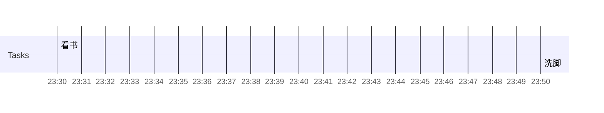

## Day Planner

```mermaid
gantt
    dateFormat  HH-mm
    axisFormat %H:%M
    %% Current Time: 23:18:56
    section Tasks
    看书     :23-30, 20mm
    洗脚     :23-50, 0mm
    section Breaks

```

- [ ] 23:30 看书
- [ ] 23:50 洗脚

