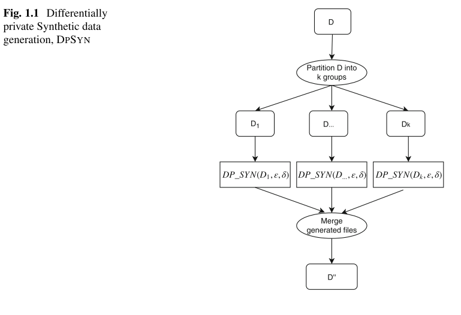
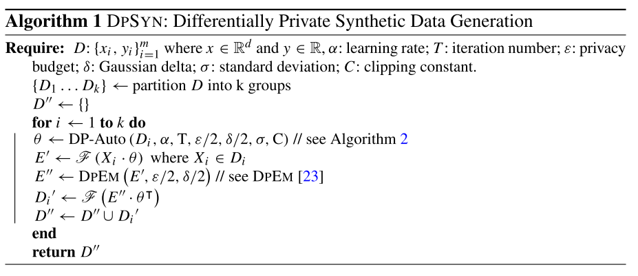
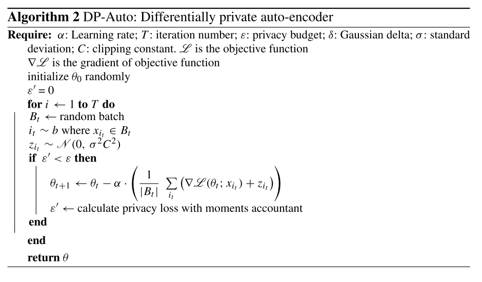

## 蜜罐方向论文

- [蜜罐方向论文](#蜜罐方向论文)
  - [Using Deep Learning to Generate Relational HoneyData](#using-deep-learning-to-generate-relational-honeydata)
    - [moment accountant](#moment-accountant)
    - [翻译](#翻译)
      - [Background](#background)
        - [深度学习](#深度学习)
        - [差分隐私](#差分隐私)
        - [Differentially Private Composition Theorem](#differentially-private-composition-theorem)
      - [Methodology](#methodology)
        - [Differentially Private Synthetic Data Generation Model](#differentially-private-synthetic-data-generation-model)
    - [References](#references)

### [Using Deep Learning to Generate Relational HoneyData](https://link.springer.com/chapter/10.1007/978-3-030-02110-8_1)

- honeyfiles
- honeydata
- [differential privacy](https://zh.wikipedia.org/wiki/%E5%B7%AE%E5%88%86%E9%9A%90%E7%A7%81)

#### Moment Accountant

#### 翻译

##### Background

本节简要介绍了深度学习和差分隐私原则，所使用的方法采用了深度学习，并将差分隐私应用于深度学习模型，以构建私有生成模型，从而在生成蜜罐数据时防止敏感数据的泄露。

###### 深度学习

深度学习是一种基于表示学习的机器学习技术，已经在图像识别和自然语言处理等领域得到了广泛的应用，并取得了显著的进展。深度学习的强大之处在于其学习分层概念的能力，可以从简单的概念中构建出复杂的概念。深度学习可用于处理有监督、半监督或无监督任务。DPSYN 采用无监督深度学习方法来构建生成型神经网络，从而生成蜜罐敏感文件。

大多数深度学习模型采用多层架构来构建复杂网络，这些网络实际上是带参数的函数，旨在适应任何给定的输入。为了得到最优的参数以推广输入结构，我们的目标是最小化损失函数，即 $\mathscr{L(\theta)}$，其中 $\theta$ 是网络参数的集合。在优化过程的每个步骤中，我们通过计算梯度来更新 $\theta$。

$$
\begin{align}
  \theta_{t+1}=\theta_{t}-\alpha\left(\frac{1}{|n|} \sum_{x_{i} \in D} \nabla_{\theta} \mathscr{L}\left(\theta ; x_{i}\right)\right)
\end{align}
$$

给定数据集 $\text {D}$，其中包含 $\text {n}$ 个记录 $x_i \in \mathbb{R}^d$。深度学习模型通常由多层结构组成，这些层次结构会妨碍优化过程。为了克服这个障碍，本方法采用随机梯度下降（SGD）进行优化。在每次迭代中，我们从数据集 $\text {D}$ 中随机抽取一个小批量（mini-batch）样本，并计算该样本对应的损失函数梯度。然后使用这个梯度来更新模型的参数。通过迭代这个过程，我们逐渐优化模型参数以最小化损失函数。

###### 差分隐私

差分隐私是一种数学框架，即使对手掌握一定的背景知识，其也可以保证数据隐私性，。差分隐私通过在聚合统计信息中添加随机噪声的方式来来实现防御冒充攻击。

定理 1.1：假设对于任意相邻数据集 $d$ 和 $d'$，以及任意输出子集 $S \subseteq {Range}(\mathscr{M})$ ，满足以下条件的随机实值函数 $\mathscr{M}$ 是 $(\varepsilon, \delta)$- 差分隐私的：

$$
\Pr[\mathscr{M}(d) \in S] \leq \exp(\varepsilon) \cdot \Pr[\mathscr{M}(d') \in S] + \delta
$$

相邻数据集 $d$ 和 $d'$ 仅在一个元组上有所不同，而其他的元组都相同。${Pr}[\mathscr{M}(d) \in S]$ 表示在数据集 $d$ 上使用机制 $\mathscr{M}$ 生成输出值在 $S$ 中的概率， ${Pr}\left[\mathscr{M}\left(d^{\prime}\right) \in S\right]$ 表示在相邻的数据集 $d'$ 上使用机制 $\mathscr{M}$ 生成输出值在 $S$ 中的概率。参数 $\varepsilon \geq 0$ 和 $\delta \geq 0$ 分别表示机制 $\mathscr{M}$ 的隐私保护程度和随机噪声的量，其中 $\varepsilon$ 越小表示隐私保护程度越高， $\delta$ 越小表示随机噪声越少，也就是机制 $\mathscr{M}$ 越接近于没有添加随机噪声。

机制 $\mathscr{M}$ 通过用以下方式定义的随机噪声扰动确定性实值函数 $f$ 来实现 $(\varepsilon, \delta)$ - 差分隐私：

$$
\begin{align}
\mathscr{M}(d)=f(d)+z
\end{align}
$$

在这里，使用的是高斯机制，其中添加的随机噪声 $z$ 是从均值为零、方差为 $\sigma^{2}$ 的高斯分布中随机生成的。高斯机制的标准差 $\sigma$ 和函数 $f$ 的灵敏度 $s_f$ 进行校准，灵敏度是由相邻数据集 $d$ 和 $d'$ 的 $f$ 值之间的最大差异（即 $||f(d) - f(d')||$）定义的。高斯机制的 $(\varepsilon, \delta)$、$\sigma$ 和 $s_f$ 之间的关系可以表示为：$\sigma^{2} \varepsilon^{2} \geqslant 2 \ln 1.25 / \delta s_{f}^{2}$。

###### Differentially Private Composition Theorem

为了实现我们的预期目标，我们采用序列组合和高级组合定理。在我们的方法中，在每个批次迭代结束时，我们会跟踪隐私损失的值，以用于训练自编码器。在优化阶段，我们计算给定迭代 $t \in T$ 中在私有自编码器上消耗的当前隐私损失 $\varepsilon'$ 的值。当 $\varepsilon'$ 达到最终隐私预算 $\varepsilon$ 时，训练停止。

根据“moment accountant”方法 [1]，如果隐私损失满足以下条件，即对于任意的 $\varepsilon^{\prime} < k_{1}(|B| / n)^{2}T$ ，深度学习网络就是 $(\varepsilon, \delta)$ - 差分隐私的，其中 $k_1$ 和 $k_2$ 是常数：

$$
\begin{align}
  \varepsilon^{\prime} \geq k_{2} \frac{|B| / n \sqrt{T \log 1 / \delta}}{\sigma}
\end{align}
$$

其中， $T$ 是训练步骤的数量， $|B|$ 是具有给定隐私预算 $\varepsilon$ 、 $\delta$ 和零均值高斯分布标准差 $\sigma$ 的小批量中的样本数量。

##### Methodology

本节介绍了我们的差分隐私合成数据生成模型（DPSYN）的详细信息。我们用到了 DPSYN 的主要算法和组件。

###### Differentially Private Synthetic Data Generation Model

DPSYN 的主要目的是生成与真实数据在攻击者背景知识下难以区分的合成数据。DPSYN 通过差分隐私控制隐私损失，从而保护数据隐私。Abadi 等人在差分隐私深度学习上应用了矩账户（moment accountant）[1]。在此基础上，我们对其进行了多项修改，并将其扩展为数据生成模型。

图 1.1 展示了 DPSYN 的基本步骤。数据集 D 包含一系列 n 个训练样例 $(x_{1}, y_{1}), \ldots,(x_{m}, y_{m})$ ，其中 $x \in \mathbb{R}^{d}$ ， $y \in \mathbb{R}$ 。我们的学习方法将数据集 $\text { D }$ 分成 $\text { k }$ 组，记为 $\{D_{1}, \ldots, D_{k}\}$ 。训练样例的分组是基于与训练样例 $x \in \mathbb{R}^{d}$ 相关联的标签 $y \in \mathbb{R}$ 进行的。组号 $\text { k }$ 由唯一的标签号识别。将数据集分成 $\text {k}$ 组 $\{D_{1}, \ldots, D_{k}\}$ 后，为每个组构建私有的生成自编码器来生成合成数据。

算法 1 展示了提出方法的详细步骤。具有敏感信息的数据集 D 被划分为 k 组（第 1 行），并使用这些划分好的组来构建私有生成自编码器（第 4 行）。该过程在算法 2 中详细说明。接下来，我们使用激活函数 F 获取组的私有潜在表示（第 5 行），并将其注入差分隐私期望最大化（DPEM）函数中。 DPEM 函数在中详细说明。 DPEM 的主要任务是检测编码数据中的不同潜在模式，并生成具有相似模式的输出数据。这些模式在第 7 行解码，并附加到合成数据 D''（第 8 行）。

<!-- $$
\begin{align}
  \begin{array}{l}
    \hline \text { Algorithm } 1 \text { DPSYN: Differentially Private Synthetic Data Generation } \\
    \hline \text { Require: } D:\left\{x_{i}, y_{i}\right\}_{i=1}^{m} \text { where } x \in \mathbb{R}^{d} \text { and } y \in \mathbb{R}, \alpha: \text { learning rate } T: \text { iteration number; } \varepsilon \text { : privacy } \\
    \qquad \text { budget; } \delta: \text { Gaussian delta; } \sigma: \text { standard deviation; } C \text { : clipping constant. } \\
    \qquad \left\{D_{1} \ldots D_{k}\right\} \leftarrow \text { partition } D \text { into k groups } \\
    \qquad D^{\prime \prime} \leftarrow\{\} \\
    \qquad \text { for } i \leftarrow 1 \text { to } k \text { do } \\
    \qquad \theta \leftarrow \text { DP-Auto }\left(D_{i}, \alpha, \mathrm{T}, \varepsilon / 2, \delta / 2, \sigma, \mathrm{C}\right) / / \text { see Algorithm } 2 \\
    \qquad E^{\prime} \leftarrow \mathscr{F}\left(X_{i} \cdot \theta\right) \text { where } X_{i} \in D_{i} \\
    \qquad E^{\prime \prime} \leftarrow \text { DPEM }\left(E^{\prime}, \varepsilon / 2, \delta / 2\right) / / \text { see DPEM }[23] \\
    \qquad D_{i}^{\prime} \leftarrow \mathscr{F}\left(E^{\prime \prime} \cdot \theta^{\top}\right) \\
    \qquad D^{\prime \prime} \leftarrow D^{\prime \prime} \cup D_{i}{ }^{\prime} \\
    \qquad \text { end } \\
    \qquad \text { return } D^{\prime \prime} \\
    \hline
  \end{array}
\end{align}
$$ -->

算法 2 详细展示了 DP-Auto 模型的细节。我们的私有自编码器采用梯度计算和剪裁等步骤来改善优化过程。在标准的随机训练技术中，梯度是针对批次计算的，而我们则是针对每个训练实例计算梯度。这种方法改善了优化过程，因为它降低了每个实例中存在的梯度的敏感性。梯度的范数定义了优化网络参数的方向。然而，在一些深度网络中，梯度可能不稳定并且波动幅度很大。这种波动可能会抑制学习过程，因为网络的易受攻击性增加。为了避免这种不良情况，我们通过剪裁常数 $C$ 来限制先前计算的梯度的范数。

剪裁梯度后，从均值为零、标准差为 $\sigma C$ 的高斯分布中抽取噪声，并将其添加到之前剪裁的梯度上（算法 2 的第 8 行）。在训练自编码器时，我们在每个批次迭代结束时跟踪隐私损失。如第 2-2 行所示，我们计算在给定迭代 $t \in T$ 中在私有自编码器上花费的当前隐私损失 $\varepsilon'$ 的值。当 $\varepsilon'$ 达到最终隐私预算 $\varepsilon$ 时，训练结束。如果当前隐私预算 $\varepsilon'$ 小于最终隐私预算 $\varepsilon$ ，则网络的模型参数将通过学习率 $\eta$ 的负方向乘以平均噪声梯度进行更新（算法 2 的第 2 行）。当前隐私预算 $\varepsilon'$ 通过瞬时会计技术在算法 2 的第 2 行进行更新。在此步骤结束时，私有自编码器基于最终隐私预算 $\varepsilon$ 输出模型参数 $\theta$ 。

#### References

- Abay, N.C., Zhou, Y., Kantarcioglu, M., Thuraisingham, B., Sweeney, L.: Privacy preserving synthetic data release using deep learning. The European Conference on Machine Learning and Principles and Practice of Knowledge Discovery in Databases (PKDD 2018) (2018)
- Dwork, C.: Differential privacy. In: Proceedings of the 33rd International Conference on Automata, Languages and Programming - Volume Part II, ICALP’06, pp. 1–12. SpringerVerlag, Berlin, Heidelberg (2006). DOI 10.1007/11787006_1. URL <http://dx.doi.org/10.1007/> 11787006_1
- **Abadi, M., Chu, A., Goodfellow, I., McMahan, H.B., Mironov, I., Talwar, K., Zhang, L.: Deep learning with differential privacy. In: Proceedings of the 2016 ACM SIGSAC Conference on Computer and Communications Security, pp. 308–318. ACM (2016)**
- [[../../../AI/深度学习/理论/auto-encoder|auto-encoder]]
