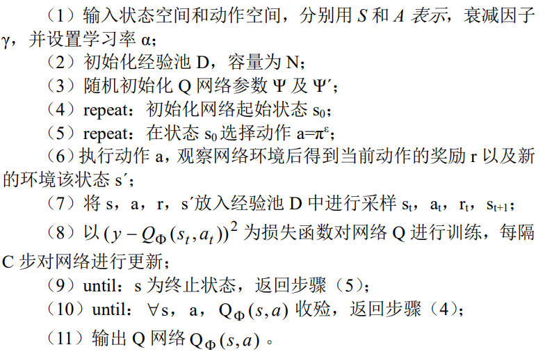
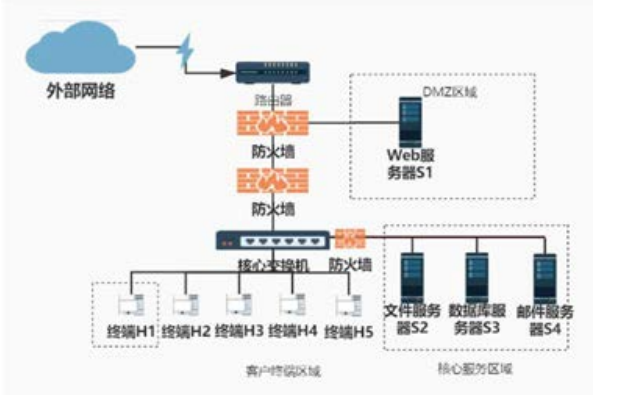
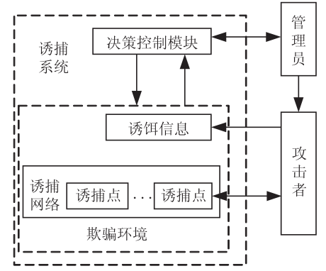
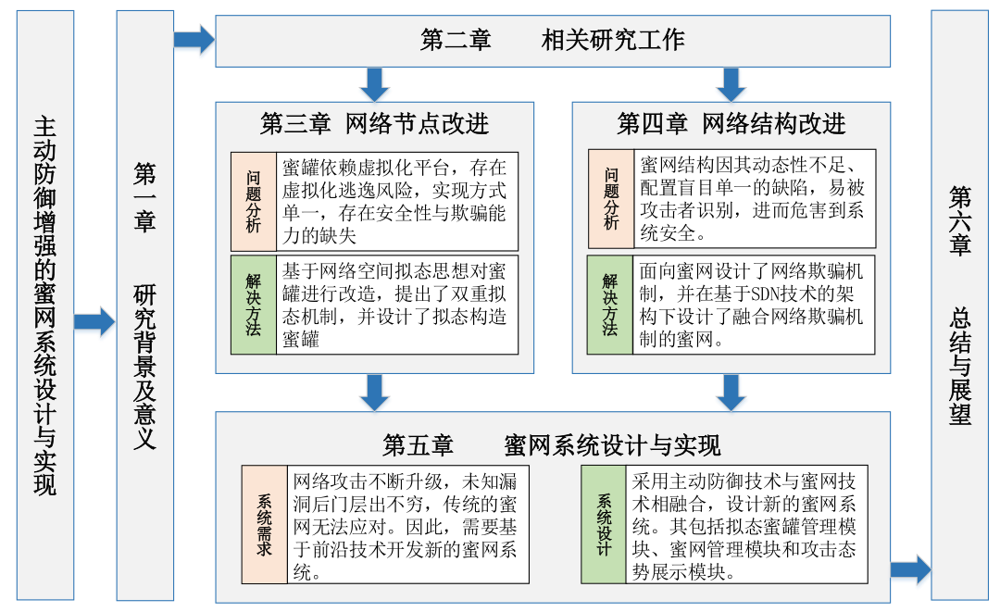
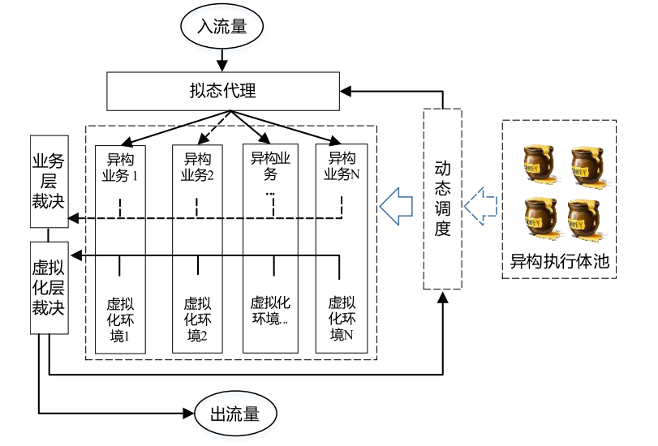
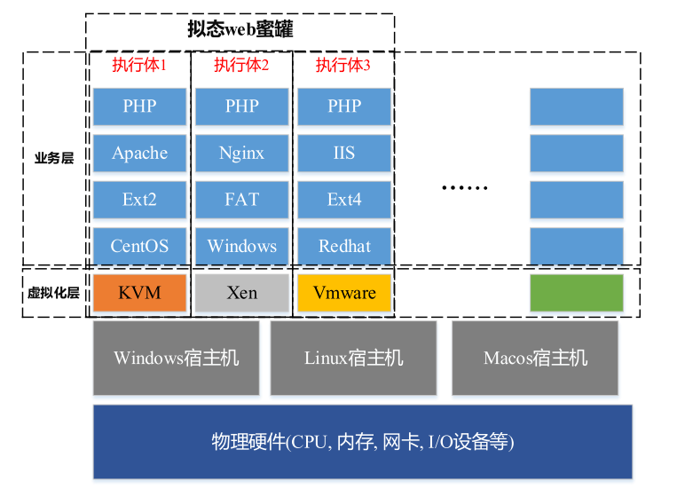

# 欺骗防御技术

- [欺骗防御技术](#欺骗防御技术)
  - [基于强化学习的网络欺骗防御动态部署研究](#基于强化学习的网络欺骗防御动态部署研究)
  - [面向网络欺骗防御的攻击诱捕技术研究](#面向网络欺骗防御的攻击诱捕技术研究)
    - [基于欺骗的主动防御](#基于欺骗的主动防御)
    - [面向攻击诱捕的网络欺骗防御思想](#面向攻击诱捕的网络欺骗防御思想)
    - [攻击诱捕概念及典型架构分析](#攻击诱捕概念及典型架构分析)
    - [虚拟化网络攻击诱捕机制](#虚拟化网络攻击诱捕机制)
      - [基于虚拟机技术](#基于虚拟机技术)
      - [攻击状态迁移(攻击流量重定向)](#攻击状态迁移攻击流量重定向)
      - [智能诱捕决策机制](#智能诱捕决策机制)
        - [博弈论方法](#博弈论方法)
        - [智能优化模型](#智能优化模型)
  - [面向智能渗透攻击的欺骗防御方法](#面向智能渗透攻击的欺骗防御方法)
  - [主动防御增强的蜜网系统设计与实现](#主动防御增强的蜜网系统设计与实现)
    - [Note](#note)
      - [基于拟态思想的蜜罐设计](#基于拟态思想的蜜罐设计)
      - [面向蜜网的网络欺骗机制](#面向蜜网的网络欺骗机制)
  - [Reference](#reference)

基本概念：

- SDN
- 博弈论
- 强化学习
- 蜜网技术：第一代、第二代和第三代蜜网技术

## [基于强化学习的网络欺骗防御动态部署研究](https://kns.cnki.net/kcms2/article/abstract?v=3uoqIhG8C44YLTlOAiTRKibYlV5Vjs7iy_Rpms2pqwbFRRUtoUImHUUlnL4ZPGNIB_MN73jTX-lA232ZM06HjK4IlemHlgTV&uniplatform=NZKPT)

- 作者：邵晓 刘曼琳
- 单位：海军士官学校 安徽 233012
- 期刊：《网络安全技术与应用》2021年第12期
- 摘要：网络欺骗通过在系统内部署虚假的安全弱点，将入侵者引入错误资源达到让其产生错误感知，减少网络安全风险的目的。但传
统的网络欺骗防御资源为静态部署，存在着数据收集面较窄、难以适应攻击者的变化等缺陷。本文通过研究基于强化学习的网络欺骗
防御动态部署，使用 DQN 算法找寻网络欺骗防御动态部署的最优策略，实现针对网络渗透攻击者的最佳防御效果。
关键词：强化学习；欺骗防御；动态部署

蜜罐技术和蜜网技术是不同的

创建、分发和管理欺骗资源

> 因此网络防御需要有一个集中管理控制的策略，来创建、分发和管理欺骗资源，如服务器、网络设备、网络应用、网络服务、协议、数据、用户等元素，通过这些元素来诱导吸引攻击者。新的 AI 技术，特别是基于深度学习的强化学习技术，可以让网络欺骗防御产生与生产环境相匹配的诱饵和欺骗凭证，并能实时自动生成、部署和维持欺骗的进行以及真实性维持，是未来主动防御技术的一个重要的发展方向。

加强学习算法

网络拓扑参考

## [面向网络欺骗防御的攻击诱捕技术研究](https://kns.cnki.net/kcms2/article/abstract?v=3uoqIhG8C44YLTlOAiTRKibYlV5Vjs7iJTKGjg9uTdeTsOI_ra5_XWtPO6KuPDQ5qOFqKpAUk6TZHd3T203lr0zm6dGE5-YU&uniplatform=NZKPT)

- 作者：高雅卓，刘亚群，邢长友，张国敏，王秀磊
- 单位：陆军工程大学 指挥控制工程学院，江苏 南京 210007
- 期刊：计算机技术与发展 2022年3月 第32卷 第3期
- 摘要：作为一种主动对抗攻击者的手段，网络欺骗防御技术得到了学术界和产业界的广泛关注，其中攻击诱捕技术是网络欺骗防御的核心所在。 其基本理念是通过建立虚假的网络和业务系统环境，引诱攻击者对诱捕系统发起攻击而达到监控分析攻击行为的目的。 着眼于面向攻击诱捕的网络欺骗防御技术研究，讨论了攻击诱捕技术的基本概念及典型架构，并从决策控制和欺骗环境构建两个方面对攻击诱捕机制的实现机理进行了探讨。 总结了攻击诱捕技术在欺骗防御场景中的作用，在此基础上从传统诱捕机制、虚拟化诱捕机制以及智能诱捕决策等方面分析了攻击诱捕技术的研究现状及关键技术，为欺骗诱捕系统的设计提供了一定的思路，总结分析了现有研究存在的问题，并展望了未来的发展方向和面临的挑战。
- 关键词：欺骗防御；攻击诱捕；蜜罐；虚拟化；博弈论
- 类型：综述

三个重点：

1. 面向攻击诱捕的网络欺骗防御基本架构
2. 虚拟化的新型诱捕模型，虚拟化技术、攻击状态迁移
3. 智能诱捕阶段的决策机制，博弈对抗、智能优化模型

### 基于欺骗的主动防御

- [1]欺骗防御：通过干扰攻击者的认知以促使攻击者采取有利于防御方的行动贾召鹏
  - 贾召鹏,方滨兴,刘潮歌,等.网络欺骗技术综述[J].通信学报,2017,38(12)128-143
- [2]典型的欺骗防御技术(Deception Techniques in Computer Security)：
  - 特征混淆技术(产生虚假的网络特征)
  - 指纹隐藏技术
  - 攻击诱捕技术
  - HAN X,KHEIR N,BALZAROTTI D.Deception techniquesin computer security[J].ACM Computing Surveys ,2018,51(4):1-36.
- [3]产生虚假网络拓扑结构
  - MEIER R.TSANKOV PLENDERS V,et al.Nethide:secure3and practical network topology obfuscation [C]//Proceed-ings of the 27th USENIX security symposium. BaltimoreMDUSA:USENIX Association,2018:693-709.
- [4]虚假通信关系
  - MEIER R,GUGELMANN D,VANBEVER L.Itap;in-net-work traffic analysis prevention using software -defined net-works[C]//Proceedings of the symposium on SDN re-search. Santa Clara, CA, USA: Association for ComputingMachinery,2017:102-114.
- [5]指纹隐藏技术
  - 主要是避免暴露网络实体的真实指纹信息，包括协议指纹、操作系统指纹、应用指纹等.
  - ALBANESE M,BATTISTA E,JAJODIA S,et alA deception based approach for defeating os and service fingerprinting[C]//2015 IEEE conference on communications and net-work security.Florence ,Italy:IEEE2015:317-325.
- [6]攻击诱捕
  - 主要通过构建虚假的网络实体，诱使攻击者对这些虚假网络实体进行攻击，从而达到暴露攻击行为、消耗攻击资源的目的。
  - STOUT W,URIAS V,LOVERRO C,et al.Now you see me now you don't:advancing network defense through network deception[R]. Albuquerque,NM(United States):Sandia National Lab (SNL-NM),2017.

### 面向攻击诱捕的网络欺骗防御思想

- [7]面向攻击诱捕的网络欺骗防御思想最早可以追溯到1989年
  - STOLL C.The cuckoo's egg:tracking a spy through the maze of computer espionage[M].London; The Bodley Head Ltd.1989:1-3.

一些新的攻击诱捕机制在设计思路上通常与**博弈论、机器学习**等思想相结合以提供更加逼真的诱捕链，在实现上则利用**容器、SDN**等技术以平衡成本与性能的冲突，从而建立智能灵活的攻击诱捕场景。

### 攻击诱捕概念及典型架构分析

- [9]在引诱攻击方面主要有间接引诱和直接引诱
  - [10]间接引诱是指攻击者由于非法使用诱饵信息或出现其他攻击行为被管理员发现后迁移至诱捕系统中。
    - ARAUJO F,HAMLEN K W,BIEDERMANN S,et al.From patches to honey-patches : lightweight attacker misdirection deception ,and disinformation[C]//Proceedings of the 2014ACM SIGSAC conference on computer and communications security.Scottsdale,Arizona,USA:ACM,2014:942-953
  - RASHIDI BFUNG CHAMLEN K W,et al.Honeyv;a virtualized honeynet system based on network softwarization[C]/MS 2018 IEEE/IFIP network operations and man-agement symposium.Budapest, Hungary :IEEE,2018:1-5.

关键要素：

1. 诱饵信息：诱饵信息生成技术
2. 诱捕点：诱捕机制设计技术
3. 诱捕网络：诱捕场景构建技术

### 虚拟化网络攻击诱捕机制

三个技术：SDN、轻量级虚拟化技术 LXC以及Docker容器技术，k8s 不放在眼里？为什么反应这么慢？

<!-- 诱饵信息生成的论文在后面，不要着急捏。 -->

#### 基于虚拟机技术

- [21]Argos对 Qemu 进行扩展，使用动态污点分析跟踪整个运行过程中收到的网络数据；为了更好地提升蜜罐的真实性.
  - PORTOKALIDIS G，SLOWINSKA A，BOS H. Argos :anemulator for fingerprinting zero-day attacks for advertisedhoneypots with automatic signature generation [J].ACMSIGOPS Operating Systems Review,2006,40( 4):15-27.
- [22]Blederman等人提出了一种部分克隆生产系统内部虚拟机快照的诱捕系统框架，由于基本镜像仍然是源虚拟机的快照，所以蜜罐环境与生产环境基本一致，隐蔽性更好。
  - BIEDERMANN SMINK M,KATZENBEISSER SFast dynamic extracted honeypots in cloud computing[C]//Proceedings of the 2012 ACM workshop on cloud computing se-curity workshop.Raleigh North Carolina, USA:ACM,2012:13-18.

**虚拟机自省**主要是一种从虚拟机外部监控虚拟机内部运行状态的方法

- [23]Stewart等人对多种诱捕机制的实现方法进行比对，发现**VMI**技术在应用上通用性更强，安全性更高，并且不会受到攻击者的影响。
  - SENTANOE S,TAUBMANN B，REISER H P.Virtual machine introspection based SSH honeypot[ C]//Workshop onsecurity in highly connected it systems. Munich, Germany Bavarian State Ministry for Education,2017:13-18.

一些虚拟机监控技术

- VMI技术在诱捕机制中应用的重点在于对虚拟机内部行为的监控功能，
- [24]SPEMS系统集成并改进了多个开源软件工具，利用 VMI 技术在外部监视虚拟机内部程序的执行情况；
  - SHI J,YANG Y,LI C,et al.Spems :a stealthy and practicalexecution monitoring system based on VMI[ C]//Cloudcomputing and security.Nanjing , China; Springer,2015 ;380389.
- [6]Urias等设计了一个能够配置并控制虚拟机的自省程序 KVMi，用于承担虚拟机监视器的角色，能够在不添加任何构件的情况下实时监测虚拟机状态。
  - STOUT W,URIAS V,LOVERRO C,et al.Now you see me now you don't:advancing network defense through network deception[R]. Albuquerque,NM(United States):Sandia National Lab (SNL-NM),2017.

其实可以考虑开源的虚拟机管理工具，Github上有很多，可以作为基础进行二次开发。但问题是成本比较高，轻量级的容器技术是否更好呢？

- [20]AHEAD提出可以将主动防御工具封装在 Docker内部直接安装到真实系
  - GASPARI F DJAJODIA S,MANCINI L V,et al.Ahead:anew architecture for active defense[ C]//ACM workshop onautomated decision making for active cyber defense.NY United States ; Association for Computing Machinery , 2016:11-16.

#### 攻击状态迁移(攻击流量重定向)

- [26]HEADS提出当攻击者的流量在生产网络中被发现时，就通过一系列操作将攻击流量引至一个高逼真的诱捕环境中。
  - STOUT W,URIAS V.Hades: high-fidelity adaptive deception & emulation system [ R ].Albuquerque, NM ( UnitedStates) :Sandia National Lab ,2018.

为了实现流量透明迁移，同时保证源主机的正常会话状态，攻击迁移通常会与SDN技术相结合

- [19]INTERCEPT+通过更改虚拟机迁移代码，使得迁移以后源虚拟机仍保持运行，这样可以保证与源虚拟机通信的正常用户可以继续交互，同时使用 SDN 交换机隔离诱捕网络和真实系统
  - HIRATA A,MIYAMOTO D,NAKAYAMA M,et al.Intercept+: Sdn support for live migration - based honeypots[C]//2015 4th international workshop on building analysisdatasets and gathering experience returns for security ( BADGERS).Kyoto ,Japan;IEEE,2015;16-24.
- [27]Sandent还将攻击迁移的思想应用于微服务背景，使用容器代替了虚拟机，并且考虑了迁移之前生产网络内部容器之间的通信问题，将与被怀疑容器交互的相关容器同时进行迁移，同样用 SDN 技术进行流量控制。

诱捕系统内部的攻击状态迁移主要发生在不同类型的诱捕点之间，一般是在决策控制器发现攻击的状态发生变化后，将攻击会话从原来的诱捕点迁移至另一类诱捕点中。

这种状态迁移最常发生在混合蜜网中高交互蜜罐与低交互蜜罐之间，对大量的低交互蜜罐捕获的流量进行分析，然后把需要重点分析的流量导入高交互蜜罐中，这种混合蜜网的主要目的是结合高交互蜜罐和低交互蜜罐的优点。

- [28-29]为了进一步降低被攻击者发现的几率，HoneyDoc提出了一种与 SDN 技术结合的 TCP重放机制，可以将攻击者流量进行无缝迁移，迁移之后无需重新建立连接。
  - FAN W,DU Z,SMITH-CREASEY M,et al.Honeydoc;anefficient honeypot architecture enabling all-round design[J]IEEE Journal on Selected Areas in Communications ,2019,37(3) :683-697
  - FAN W,FERNANDEZ D.A novel SDN based stealthy TCPconnection handover mechanism for hybrid honeypot systemsC]//2017 IEEE conference on network softwarization( NetSoft).Italy:IEEE,2017:1-9.

除了诱捕点交互程度的不同，诱捕系统还会根据攻击者的可信性和攻击阶段为其提供不同级别的诱捕点进行交互

- [9]HoneyV通过 IDS 判断所有入站流量的可信级别，并根据结果将不同级别的攻击者放入四个不同监视级别的蜜罐中进行分析
  - RASHIDI BFUNG CHAMLEN K W,et al.Honeyv;a virtualized honeynet system based on network softwarization[C]/MS 2018 IEEE/IFIP network operations and man-agement symposium.Budapest, Hungary :IEEE,2018:1-5.
- [30]Honeyproxy根据攻击的阶段不同设置了三种代理模式，有效地防止了蜜罐追踪，但是一个代理仅能管理一个攻击者，所以需要为每个监控的端口都部署一个代理。
  - KYUNG S,HAN W,TIWARI N,et al.Honeyproxy: designand implementation of next - generation honeynet via SDN[C]//2017 IEEE conference on communications and net-work security (CNS).NV,USA:IEEE,2017:1-9.

#### 智能诱捕决策机制

目前两个思路(仅限于本篇综述)：

- [31]攻击诱捕+强化学习
  - PAUNA A,BICA I.Rassh - reinforced adaptive SSH honeypot[ C]//2014 10th international conference on communica-tions.Bucharest,Romania;IEEE,2014:1-6.
- [32]攻击诱捕+博弈论
  - BOUMKHELD N,PANDA S,RASS S,et al.Honeypot typeselection games for smart grid networks[ C]//Conference ondecision & game theory for security.Vienna, Austria; SpringerInternational Publishing,2019:85-96.

##### 博弈论方法

- [33]Walter 等人在诱捕机制中引入了**超博弈的思想**，防御方通过改变参数，欺骗攻击者的视图，使得攻击者误认为自己拥有完全信息，以此最大化防御方优势；
  - FERGUSON-WALTER K，FUGATE S,MAUGER Jet al. Game theory for adaptive defensive cyber deception[ C ]//Proceedings of the 6th annual symposium on hot topics in thescience of security. Nashville, Tennessee, USA: Associationfor Computing Machinery ,2019.
- [34]王娟等人提出了一种基于**多阶段攻击**的 SDN 动态蜜罐SDHG，使用不完全信息动态博弈对不同阶段的攻防策略进行建模，并证明了模型的可行性，最后使用Docker容器对原型系统进行了实现，并在与其他策略的对比中体现了该方法的优越性
  - 王 鹃,杨泓远,樊成阳.一种基于多阶段攻击响应的 SDN动态蜜罐[J].信息网络安全,2021,21(1):27-40.
- [35]姜伟等人对攻防博弈模型和马尔可夫决策进行了扩展，提出了一种**随机博弈**的模型，更加贴合攻防博弈的现实情况。
  - 姜 伟,方滨兴,田志宏,等.基于攻防随机博弈模型的防御策略选取研究[J1.计算机研究与发展2010,47(10):1714-1723.

博弈论除了可以针对单个诱捕点内部的诱捕机制进行建模，在诱捕点的分配决策中也可以起到较大的作用。

- [36]Aliou利用博弈论对蜜罐的分配进行决策，减少攻击者发现蜜罐的概率；
  - SARR A B,ANWAR A H,KAMHOUA C,et al.Software di-versity for cyber deception[ C ]//IEEE global communica-tions conference.Taiwan;IEEE2020:1-6
- [37]Attiah将攻防双方进行了多层次的策略建模，双方都根据策略的成本、潜在的攻击收益或损害以及预测对手策略的有效性来调整自己的策略，并最终得到了混合策略纳什均衡。
  - ATTIAH A,CHATTERJEE M,ZOU C CA game theoreticapproach to model cyber attack and defense strategies[ C]//2018 IEEE international conference on communications(ICC).Kansas City,MO:IEEE,2018:1-7.
- [38]Ahmed 等人还将博弈论与攻击图相结合，判断在已知当前攻击者位置的情况下接下来多跳诱捕点的分配策略。
  - ANWAR A H,KAMHOUA C ALESLIE N.Honeypot allocation over attack graphs in cyber deception games[ C ]//2020 international conference on computing,networking andcommunications (ICNC)USA:IEEE2020:502-506

##### 智能优化模型

传统生成诱饵信息的方法大多是根据真实数据集特征生成的，这类诱饵信息中保留了部分源数据的信息，仍存在被攻击者窃取隐私的风险。

- [39]DPSYN提出一种将深度学习与差分隐私相结合自动生成诱饵数据库的方法，这种方法不仅可以根据原有数据集的特征生成相似度较高的数据，也能有效防止在诱饵数据中
暴露源数据的隐私信息，更加安全。
  - ABAY N C，AKCORA C G,ZHOU Y,et al.Using deeplearning to generate relational honeydata[ M ]//Autonomouscyber deception.Shanghai,China; Springer,2019:3-19.

除了生成诱饵信息，机器学习还可以与诱捕机制设计相结合，用于进行攻击识别和智能诱捕。

- [40]Nadia提出了一种基于机器学习聚类思想的算法，用于在诱捕点中辨认攻击者，并将结果用于后期的防御策略的配置
  - EL KAMEL N,EDDABBAH M,LMOUMEN Y,et al.Asmart agent design for cyber security based on honeypot andmachine learning[J].Security and Communication Net-works,2020( 8):9.
- [42]使用类似的建模方法针对该思想进行了改进，之后又将Cowrie蜜罐与DQN思想相结合，实现了一种自适应的智能SSH蜜罐。
  - PAUNA A,IACOB A C,BICA I.Qrassh - a self-adaptivessh honeypot driven by q-learning[ C]//2018 internationalconference on communications ( COMM).Bucharest:IEEE2018:441-446.
- [43]除了Heliza的建模方法之外，SMDP提出将马尔可夫决策过程的方法应用于攻击诱捕中，把连续时间过程转化为等效的离散决策模型，并使用强化学习对该模型进行了训练，最后得到了规避风险、成本效益和时间效益的最优策略。
  - HUANG L,ZHU Q.Adaptive honeypot engagement throughreinforcement learning of semi - markov decision processes[C]//International conference on decision and game theoryfor security.USA:Springer ,2019 :196-216
- [44]Takabi提出了一种将欺骗防御与MTD相结合的防御思想，可以用于缓解内部攻击。
  - TAKABI H,JAFARIAN J H.Insider threat mitigation usingmoving target defense and deception[ C ]//Proceedings ofthe 2017 international workshop on managing insider securitythreats.Texas,USA: Association for Computing Machinery2017:93-96

## [面向智能渗透攻击的欺骗防御方法](https://kns.cnki.net/kcms2/article/abstract?v=3uoqIhG8C44YLTlOAiTRKibYlV5Vjs7iJTKGjg9uTdeTsOI_ra5_XYgKb8AODfDgUY9FqNFoxU_vuq11dVlyNapdjKhHUlXq&uniplatform=NZKPT)

- 作者：陈晋音，胡书隆，邢长友，张国敏
- 单位：1. 浙江工业大学信息工程学院，浙江 杭州 310023；2. 浙江工业大学网络空间安全研究院，浙江 杭州 310023；陆军工程大学指挥控制工程学院，江苏 南京 210007
- 期刊：通信学报
- 摘要：基于强化学习的智能渗透攻击旨在将渗透过程建模为马尔可夫决策过程，以不断试错的方式训练攻击者进行渗透路径寻优，从而使攻击者具有较强的攻击能力。为了防止智能渗透攻击被恶意利用，提出一种面向基于强化学习的智能渗透攻击的欺骗防御方法。首先，获取攻击者在构建渗透攻击模型时的必要信息（状态、动作、奖励）；其次，分别通过状态维度置反扰乱动作生成，通过奖励值符号翻转进行混淆欺骗，实现对应于渗透攻击的前期、中期及末期的欺骗防御；最后，在同一网络环境中展开 3 个阶段的防御对比实验。实验结果表明，所提方法可以有效降低基于强化学习的智能渗透攻击成功率，其中，扰乱攻击者动作生成的欺骗方法在干扰比例为20%时，渗透攻击成功率降低为 0。
- 关键词：强化学习；智能渗透攻击；攻击路径；欺骗防御
- 总结：通过状态维度置反的欺骗防御方法去反基于强化学习的智能渗透攻击

## [主动防御增强的蜜网系统设计与实现](https://kns.cnki.net/kcms2/article/abstract?v=3uoqIhG8C475KOm_zrgu4lQARvep2SAke-wuWrktdE-tSIT2YIbQ2EMZfxHLXy7QNlZ5y7kAEd2Qcruhs7SGuk0LmDNIUjfO&uniplatform=NZKPT)

- 关键词：蜜网，主动防御技术，拟态防御，网络欺骗

### Note

几个研究重点

1. 动态异构冗余(DHR)
   1. 双重裁决机制
   2. 调度与裁决算法
2. 双频率IP地址跳变机制实现对不同节点设置不同的IP跳变频率
   1. 软件定义网络(SDN)
3. 虚拟化技术和功能界面
   1. 态势展示
   2. 节点管理
   3. 蜜罐网络管理

>Honeyd是一个小型守护进程，可以在网络上创建虚拟主机。 可以将主机配置为运行任意服务，并且可以调整它们的个性以使它们看起来运行某些操作系统。Honeyd可以使一台主机在局域网中模拟出多个地址以满足网络实验环境的要求。

主动防御手段：

- 入侵容忍
- 网络欺骗
- 拟态防御

网络欺骗防御技术：

- 网络地址转换
- OS 混淆
- 拓扑仿真
- 蜜标技术

#### 基于拟态思想的蜜罐设计

- 代理模块
- 异构执行体
- 裁决模块
  - 执行体资源池，什么样的异构才是真实有效的？
  - 反向裁决
  - 不一致的选项？
  - 多模裁决？
- 调度模块
  - 保存相关数据以还原攻击者的攻击手段，获取攻击者利用的漏洞，同时对虚拟化
平台进行更新升级，修补漏洞。

这里面有解释为什么会异构吗？
> 防止虚拟机逃逸

- 三模冗余在实际中的可用性更
- KVM、VMware、Virtualbox、XEN
- 攻击者不会感受到多个拟态蜜罐执行体的存在

#### 面向蜜网的网络欺骗机制

## Reference

- [SDN](https://github.com/feiskyer/sdn-handbook)
